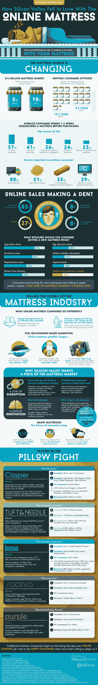

# 为什么硅谷痴迷于在线床垫

> 原文：<https://medium.com/hackernoon/why-silicon-valley-is-obsessed-with-the-online-mattress-ca3ec997cee1>

尽管我们每年要睡将近 3000 个小时，但思考床垫的状态通常并不在优先考虑之列。毕竟，大多数人每十年才更换一次床垫，那么床垫有什么特别之处呢？除了成为硅谷投资者的“下一件大事”之外，我们现在所知的床垫已经获得了高科技升级。

随着许多千禧一代现在独自一人，搬出去买房子，他们想以自己的方式做事也就不足为奇了。在很大程度上，这意味着数字化。

许多人选择在自己舒适的家中购物，而不是去实体店。随着在线床垫公司了解潜在客户犹豫不决的本质，猜测已经完全消除。许多公司提供 100 天退款保证，并将床垫压缩成易于操作的盒子。

也许网上床垫销售最知名的品牌之一是卡斯帕。Casper 成立于不久前的 2014 年，引领了我们购买床的革命。他们的收入在 2016 年达到 2 亿美元，其风险投资得到了亚当·莱文和莱昂纳多·迪卡普里奥等名人的支持。

请看这张信息图，了解更多关于在线床垫公司对该行业的颠覆，以及它如何为更加沉浸式的在线购物铺平道路。

