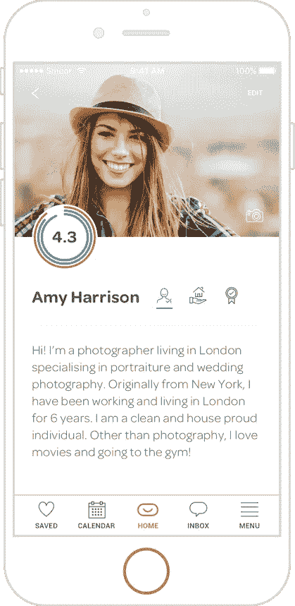
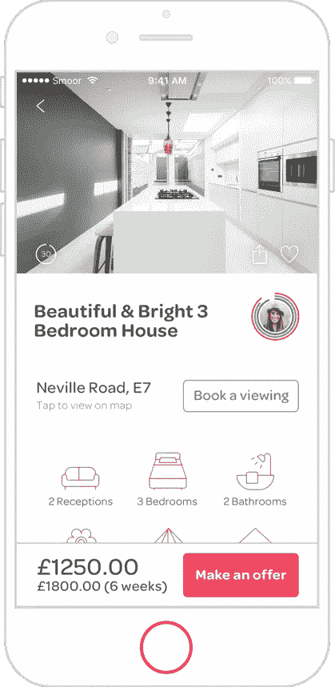

# 为什么中间人对房客和房东都是无效的

> 原文：<https://medium.com/hackernoon/why-smoor-replacing-the-status-quo-6b5d0db76020>

© Antony Micallef

“拉赫曼尼主义”听说过吗？它是剥削和恐吓房客的同义词。彼得·拉赫曼是一家房地产中介公司的业主，该公司在 1950 年和 1960 年代早期因剥削房客而臭名昭著。

©Golborne Forum

拉赫曼将受保护的租户转移到一个更小的物业集中区或买断他们，以便在法定租金控制下最大限度地减少租赁数量。为了增加不受租金控制的租赁数量，住房还被分成若干单元。

从 1957 年起，他买下了帕丁顿和北肯辛顿的许多破旧的老房子。为了实现利润最大化，拉赫曼通过臭名昭著的策略剥削和恐吓租户。

© Alamy

传统拉赫曼业务的最近状态正在改善，但价值链仍然由像拉赫曼这样的抢钱小丑组成，现在被称为出租机构。最近的一项调查显示，三分之一的房客不信任他们的出租代理机构。私人租赁部门缺乏监管，导致许多租户被敲诈性收费、隐性收费和缺乏与房东的调解所利用。

你必须记住，房地产经纪人是"[中间人](http://www.propertyinvestmentproject.co.uk/blog/15-reasons-why-estate-agents-are-idiots/)"有一个中间人，尤其是一个穿着特大号涤纶 Burtons 西装的人，问题是信息经常从他们的脑海中消失，这意味着信息并不总是像它应该的那样无缝传递。很奇怪，不是吗？

© Wikipedia

房地产仍然是一个家庭手工业，因为管理它的人往往保守，不愿意改变。[科技](https://hackernoon.com/tagged/technology)开始颠覆传统房地产行业的运作方式。

我在旧金山、哥本哈根和伦敦都租过房子，房地产中介的悲惨故事确实是一种可悲的状况！我的联合创始人已经坐在桌子的另一边好几年了，我们都想:

*   如果有全球租赁历史会怎样？
*   谁是我的房东？谁是我的房客？
*   为什么我要去中介公司租我的房子？
*   如果有一个系统可以提醒我的房客按时支付租金，会怎么样？
*   什么时候我可以不通过中介来看我自己？
*   为什么租一处房产需要几周时间？
*   为什么我的合同和货币兑换不能立即完成？
*   如果我每年能在租房上节省 1030- 1710 英镑会怎么样？
*   为什么我必须向中介机构支付租赁费或介绍费？
*   如果我能免费租一处房产呢？
*   还有那么多为什么，为什么不，如果 etc 成为了[未来](https://hackernoon.com/tagged/future)——Smoor！

Smoor 是一个范式转变——一个人对人的平台，利用技术创造一种安全、可靠和简单的出租和租赁方式。它通过使用一个评级、评论和世界上第一个租赁历史的系统——每个用户的“Smoor 分数”,在租赁行业创造了透明度、问责制和可靠性。

Smoor 通过取消现在不必要的租赁代理，极大地降低了成本，提高了租户和房东的简单性。

未来几年是我们创造更好的消费者体验和自动化消耗消费者和供应商的流程的理想时机。

我们正在打造世界上第一个租赁历史，非常贴近我们的内心。一个 Smoor 分数，将使你的生活变得轻松，无论你是房东、房客还是任何一个公众。你的分数就是你现实生活中的声誉。

点击此处提前获取【www.smoor.com 

声明:Smoor 应用程序—2017 年 6 月至 12 月(产品、人才获取、种子介绍)

‘Smoor Score on Mars.’ ©SpaceX

***这些新技术将改善或取代房地产市场中长期以来的大多数价值主张。*** *—威廉·布莱尔 2015*

在 [twitter](http://www.twitter.com/helloumar) 或 [linkedin](https://www.linkedin.com/in/umarakram/) 上打招呼。