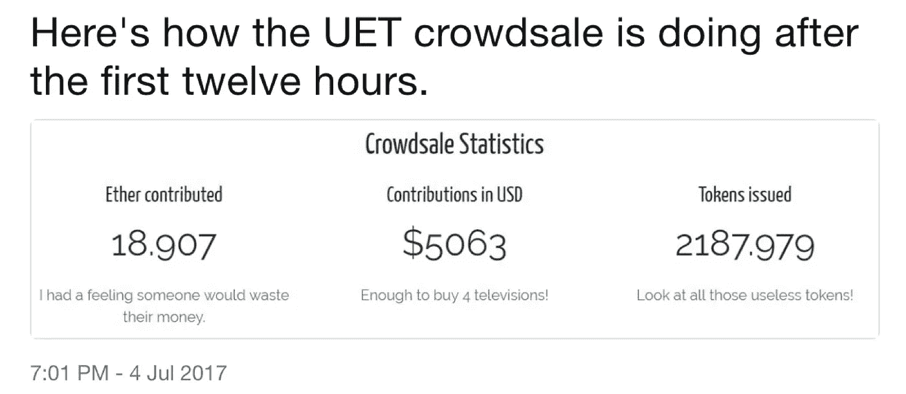
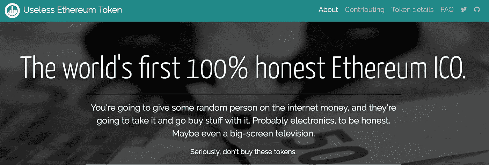
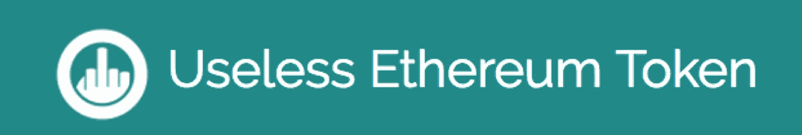
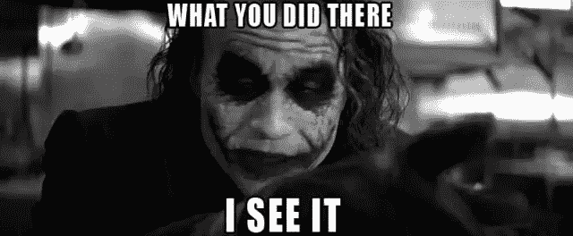
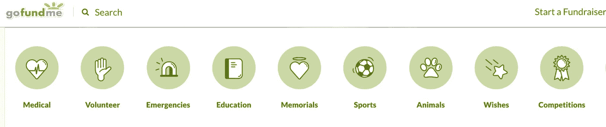
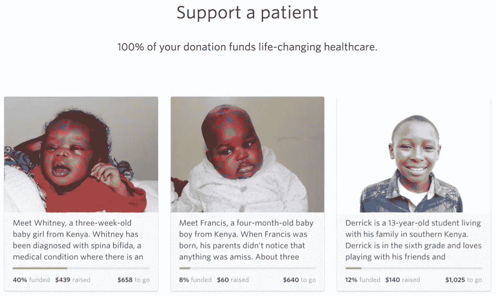
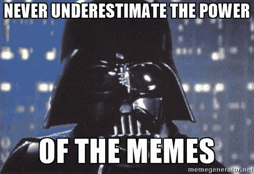

# 为什么这么严肃？新的令牌类别&无用以太坊令牌 ICO

> 原文：<https://medium.com/hackernoon/why-so-serious-new-token-category-useless-ethereum-tokens-ico-72312d071627>

我在考虑是否应该再写一篇关于 ICO/代币销售如何“颠覆性”的专业文章，但决定写这篇更新更有趣的代币趋势。

> **更新时间:2017 年 7 月。没用的以太坊令牌 12 个小时得到 5K，一天得到 13K+。对于一个直接声明如下的代币来说还不错:“你要给网上的某个随机的人钱，他们会拿着它&用它买东西。”

**让我们从:**开始

无用以太坊令牌(UET)项目在上周引起了我的注意，它的众卖在 2017 年 7 月 4 日今天刚刚开始。

这是第一个声称其令牌“完全无用”的 ICO 类型& UET 创造者可能会把钱花在购买电子产品/平板电视上。有趣的是，很多人喜欢它。(更有甚者，已经有模仿 UET 的人出来了)。

**什么是无用的以太币(UET)？**

以下是创作者的语录，以最好地捕捉其 ICO/tokens 及其信息:

[*“全球首款 100%诚实以太坊 ICO。没有价值，没有安全，也没有产品。只有我，花你的钱。*](https://uetoken.com/)

*“UET ICO 明显没有给投资者提供任何价值，因此也就没有收益预期。没有收益意味着投资者少，投资者少意味着交易少，交易少意味着没有以太坊* [*网络*](https://hackernoon.com/tagged/network) *滞后——更不用说/r/ethtrader 上没有关于人们失去所有积蓄的令人沮丧的帖子了！”*

*“这既不是玩笑，也不是骗局。这是真的。你实际上是把你的钱给了网上的某个人，而得到的回报却是完全无用的代币。没有“白皮书”，没有“产品”，也没有“专家”。“只有你，我，你辛苦赚来的乙醚，还有我的购物清单。”*

*“问:我如何获得我购买的代币的退款？你在开玩笑吧？”*

还有他们的 logo:)

* *为你娱乐&‘学习’:[https://uetoken.com/](https://uetoken.com/)

等等……什么？

这个 ICO 看起来像一个巨大的笑话。(当我看到这个项目时，我在公共场合大笑)#不过说真的——你应该更认真地对待这个小丑(双关语)。

随着越来越多的 ICO 和众筹获得荒谬的资金(很容易数百万),非常可疑的愿景+没有演示+不到令人钦佩的白皮书，越来越多的代币买家厌倦了这些骗局般的 ICO。

然而，这个 UET 所谓的第一个 100%诚实的代币对代币购买者来说变得非常新鲜。

人们已经表示有兴趣资助 UET，只是因为它“有趣”和“诚实”，有些人甚至认为它甚至可以超越现有的 ico。

下一步是什么？

让我们看看 UET 如何表现——它可能会取得巨大成功，也可能会惨败，但它已经在其方向上激发了新的标志。

Bc 令牌创建者已经可以通过 ICO 用一个“好”的白皮书+营销有效地筹集数百万——是什么阻止人们推出新的 ICO 项目是“有趣和诚实”的？

我预测我们会看到越来越多的人利用 ICOs，并在免责声明中说(像 UET)，这是有:“ [*没有价值，没有安全，没有产品。就我，花你的钱*](https://uetoken.com/)

*人们可能会用它来筹集资金购买新的电子产品/珠宝，或者用它来做其他类似的事情。*

**

*#它甚至可以用于为有需要的患者提供医疗服务的非营利基金。eg Watsi*

**

*“透明”、“娱乐”、“病毒”、“类似 Go-fund-me”、“非盈利”*

*尽管这是一个更“有趣”的帖子，但最终会有一些精彩的东西，(#毕竟是 7 月 4 日):*

*我暂且把这个‘新’的潜在增长的令牌类别称为**“模因令牌”**。**(我想到的其他名称:小丑代币/go-fun-me 代币/慈善代币)。*

*我对这种潜在的新令牌类别(当更多项目出现时)将如何影响 ICOs &它将如何“改变世界”非常感兴趣。*

*未完待续。*

********

> *[黑客中午](http://bit.ly/Hackernoon)是黑客如何开始他们的下午。我们是阿妹家庭的一员。我们现在[接受投稿](http://bit.ly/hackernoonsubmission)并乐意[讨论广告&赞助](mailto:partners@amipublications.com)机会。*
> 
> *如果你喜欢这个故事，我们推荐你阅读我们的[最新科技故事](http://bit.ly/hackernoonlatestt)和[趋势科技故事](https://hackernoon.com/trending)。直到下一次，不要把世界的现实想当然！*

**