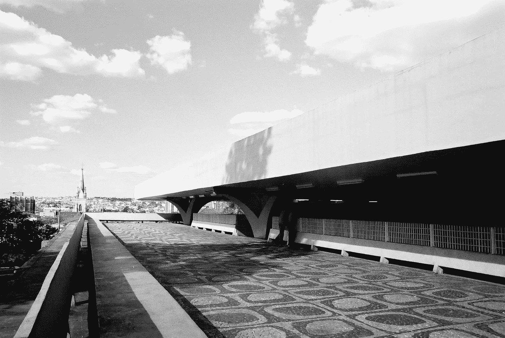

# 为什么学习工程学是一个伟大的想法，尽管讨厌它的大部分领域。

> 原文：<https://medium.com/hackernoon/why-studying-engineering-was-a-great-idea-despite-hating-most-of-its-fields-44b2c571886b>

> 在被混凝土和钢铁包围的世界里保持坚强。

Rodoviária de Jaú / Vilanova Artigas

不管你对上面的标题有什么想法，我认为[工程](https://hackernoon.com/tagged/engineering)是最必要和最有前途的职业之一。它是科学和技术之间的私生子。因此，我发现工程师对社会的发展以及后来的社会革命至关重要。我们被定义为用科学发现创造实用解决方案的能力；我们解码高度复杂的数学和物理方程，并将它们转化为促进经济发展和生活质量的有形产品。换句话说，我们是科学的密码破译者。

在我学习工程学的 6 年时间里(我从一种类型的工程转向另一种类型)，我发现自己处于“解密”我们需要学习的基础知识的位置，并提出了一些粗略的答案。我明白了你在做什么，对谁做，或者用什么样的资源都不重要:你必须有效率，而且*总有改进的空间*。对于简单的问题可能会有简单的解决方案，但是通过在解决问题时考虑更多的变量，你会获得更完整的结果。因此，作为一名工程师，你的神圣职责是让你的问题变得更困难，以便让其他人的生活更轻松。

在我上学的第三年，我经历了一场生存危机，因为我看到工程公司的工人们在建筑工地的巨大混乱中非常开心，当我提出不仅涉及数学研究，还涉及艺术和社会科学的解决方案时，我的同事/老师/工程师同事都投来了不赞同的目光。我过去常常想:“我和那些‘目光短浅’的人在一起做什么，他们不能接受我们需要比数字和可测量的变量更多的东西来理解人类需求的本质？”嗯*，他们不是目光短浅，我是不合适的，这不是适当的问题。*

Reconsidering possibilities led me through a new path

正确的问题是:如果我不想解决数学、物理和化学研究中的问题，为什么我要学习如此困难的学位？为什么我喜欢室内、家具[设计](https://hackernoon.com/tagged/design)和经济学却选择做土木工程师？我要告诉你，尽管如此，为什么成为一名土木工程师是个好主意:

## **克服艰难的障碍让你为更大的挑战做好准备:**

追求一个要求很高的学位，不管你喜不喜欢，都会让你对挫折有很大的承受力，加强纪律性，最重要的是，让你对大局有更好的看法。我的意思是，如果你设法学会了如何解方程和处理需要精确答案的问题，而不是真正喜欢数学和物理(我很擅长它们，但它们让我厌烦透了)，当你学习工业设计或建筑时，你可能会明白你需要什么的基础。现在，我不是说这很容易或者你不需要帮助。相反，当你掌握了一些设计的基本概念(家具或装饰)时，你不只是要寻找满足这些标准的解决方案，而是要寻找根据工程概念有效的解决方案。

## **关于“正确”解决方案定义的延展性。**

听一个工程师和一个设计师关于桌子设计的辩论，基本上就像听两个固执的人都认为自己是对的，因为一个效率极高，另一个懂美学。虽然很烦，但在某种程度上可以有启发。作为对这两个领域都感兴趣的第三个人，你正在寻找效率和审美之间的快乐的中间点。工程师的解决方法在于对材料行为的理解，并且总是寻求产品最大使用寿命的设计，而设计师认识到研究市场变化和外观的重要性，这有助于创造满足用户需求的产品*多一点*。

For multiple solutions are different results, it is on you make improvement and seek for the best of them.

## **在创造产品的同时了解趋势和环境影响。**

人们通常会在七年内重新装修他们的房子，更换他们的家具，主要是因为他们发现时尚在变化，我们需要接受才能在这个强调外表重要性的世界中生存。话虽如此，我们接受消费主义是我们日常生活的一部分。作为一名工程师，我不能说这种说法完全正确。在我的工作中，我们被教导要少花钱多办事，因为理解建筑对社会和环境的危害是我们的“十诫”之一。我没见过的戒律出现在我有机会看到的许多设计中。我想说的是，如果我们不是创造每隔几年就扔掉的产品，而是有意识地设计持久的、令人满意的设施，为那些展示自我的人制造，随着我们多年来的变化，这些设施可以很容易地适应我们，会怎么样？

当然，预测时尚和理解营销是我们作为工程师所缺乏的技能，但我主要关心的是有足够的能力去理解它们并提出合适的想法。我花了很多年相信这些都不重要，它们是现代世界的结果，不是生存所必需的。工程学和精密科学是我们周围一切的引擎，但时尚、营销和设计也是我们现代人日常生活的一部分。这些更深层次地促进了我们对被接纳的需求——我们不能孤立地生活，我们需要成为某些事物的一部分(你可以去问问汉娜·贝克)。

我意识到，作为一名工程师，“你不应该有其他的上帝，而是精确的科学”是我打算通过成为(在未来，获得我需要的知识)家具设计师和室内设计师来重新评估的第一条狗屁戒律(因为我为什么需要选择？)致力于创造满足艺术、社会和现代空间需求的工程解决方案。

> [黑客中午](http://bit.ly/Hackernoon)是黑客如何开始他们的下午。我们是 [@AMI](http://bit.ly/atAMIatAMI) 家庭的一员。我们现在[接受投稿](http://bit.ly/hackernoonsubmission)，并乐意[讨论广告&赞助](mailto:partners@amipublications.com)机会。
> 
> 如果你喜欢这个故事，我们推荐你阅读我们的[最新科技故事](http://bit.ly/hackernoonlatestt)和[趋势科技故事](https://hackernoon.com/trending)。直到下一次，不要把世界的现实想当然！

