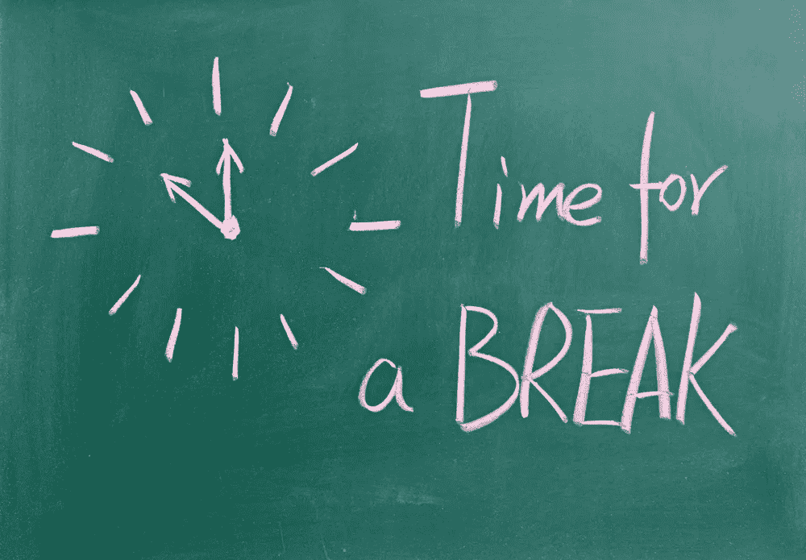

# 为什么经常休息是生产力的关键

> 原文：<https://medium.com/hackernoon/why-taking-frequent-breaks-is-the-key-to-productivity-fd215b176ec0>

还记得过去的美好时光吗？人类认为世界是平的。当我们认为智力是完全固定的特征时。当我们认为我们的大脑不能被物理改变的时候。当我们认为饱和脂肪是公众健康的头号敌人时。当我们认为休息是浪费时间的时候。

等等，最后一个是什么来着？！你没听错。我相信几年后，我们将会一致认为频繁的恢复性休息不是浪费时间，而是提高生产力的关键。

怀疑？继续读。

# 我们对休息的生理需求

我们生活在一个以有节奏的波状运动为特征的世界里。

想想每天太阳的升起和落下，潮汐的涨落，季节之间的运动。同样，这个星球上的所有生物，包括人类，都遵循着节奏。

你和我，以及这个星球上的每一个人，我们不断地在活动期(消耗能量)和休息期(更新能量)之间移动。这是因为我们坚持节奏，尤其是昼夜节律。

**昼夜节律**决定了我们以 24 小时为周期生活。我们“开着”，醒着，消耗能量大约 16 个小时。然后我们就‘出发’了，睡着了，大约 8 个小时都在补充能量。

如果你曾经开夜车(谁没有？)或者像孩子一样试图尽可能长时间保持清醒，那么你就会知道，改变你的生理节奏是一个糟糕的想法，也是一个不可行的方法。

昼夜节律绝不是影响我们生活的唯一节律。例如，在我们醒着的 16 个小时里，我们的能量也会剧烈波动——任何经历过臭名昭著的“下午低迷”的人都可以肯定地证明这一点。

其中一种节奏是**超狄安节奏。Tony Schwartz 和 Jim Loehr 在他们的[书](https://hackernoon.com/tagged/book) *全身心投入的力量*中解释了它是如何工作的**

> 这些超日节奏有助于解释我们一天中能量的消长。在周期的第一阶段，心率、荷尔蒙水平、肌肉紧张度和脑电波活动等生理指标都会增加——警觉性也是如此。大约一小时后，这些指标开始下降。在 90 到 120 分钟之间，身体开始渴望一段时间的休息和恢复。信号包括打哈欠和伸懒腰的欲望，饥饿感，紧张感增加，注意力难以集中，拖延或幻想的倾向，以及更高的出错率。

所以超日节律是一个在一天中重复多次的循环。大约 90 分钟内，您处于高性能模式。你的警觉性、专注力、创造力、情绪恢复力和精神耐力都在他们的游戏中名列前茅。

然后，在大约 20 分钟的时间里，你的身体需要时间休息和更新能量储备。

我想说的是:我们不是超级计算机。我们不是为了长时间持续高速奔跑而生的。

相反，当我们坚持我们的自然节奏时，我们工作得最好，这决定了激烈活动的时期(消耗能量)，然后是休息的时期(更新能量)。

# 科学也同意:更多的休息=更高的生产率

时间追踪应用 Desktime 发现，效率最高的人工作 52 分钟，然后休息 17 分钟。

他们还指出，大多数生产率最高的员工甚至不会每天工作 8 小时。在一个工作日内保持最高生产率的秘密不是工作时间更长，而是工作效率更高，并有频繁的休息。

他们解释说:

> 10%最有效率的员工之所以能够在相对较短的工作时间内完成最多的工作，是因为他们被视为短跑运动员，休息得很好。他们充分利用了 52 分钟的工作时间，换句话说，他们带着目的工作。

根据他们的研究，最大化你的生产力的关键在于短时间内努力工作，然后频繁休息给枪重新装弹(可以这么说)。听起来他们在遵循一定的节奏，是吧？

研究人员 k .安德斯·埃里克森(K. Anders Ericsson)研究了包括音乐家、运动员、演员和棋手在内的精英演员，发现了类似的模式。

事实证明，这些领域中表现最好的人通常会不间断地练习，时间不超过 90 分钟。他们从早上开始，在会议之间休息，并且很少在任何一天工作超过四个半小时。他们没有花更多的时间来练习他们的技艺，但是他们进行了更多的所谓的刻意练习——有意的、高强度的、高浓度的练习，超出了一个人的舒适区。

高绩效不是指工作时间更长，而是更聪明。

# 如何像专家一样工作并最大限度地提高生产力

如果我们想像专家一样工作，并最大限度地提高我们的生产力，我们需要向精英学习。食谱如下:

1.  **短跑训练:**在短时间内全力以赴。在这段时间里尽可能多的完成工作。用力推。
2.  **经常休息恢复:**在工作间隙的冲刺阶段，你需要恢复和补充一些能量。

就是这样。你要么超努力地工作——深度专注、全力投入、高度集中、全速前进——要么你正在休息恢复。

再也没有中间地带了。再也没有“做点工作”了。当你工作的时候，就没有能量可以储存了。再也不会因为累了什么的而半途而废了。你要么工作(你超级有效率)，要么不工作(你在休息)。你要么消耗能量(工作冲刺)，要么补充能量(恢复休息)。

这是根据你的自然节奏工作，这正是世界上表现最好的人们是如何做到的。

现在，*理想情况下，这些工作冲刺和恢复休息应该持续多长时间？*

如果要抄最好的，那么理想的长度似乎是工作 90 分钟，恢复 15 分钟。(这样你也就坚持了 ultradian 节奏。)

然而，对大多数人来说，这不太实际。你可能会有一个会议，同事会打断你，或者其他什么。重要的是你要么工作，要么康复。不要做一些半途而废的事情。

有时候你可能会有一个只持续 30 分钟的工作冲刺。或者持续 80 分钟。或者见鬼，即使是持续两个小时的。同样，有些休息时间可能只有 10 分钟，或 5 分钟，或 40 分钟。

不要过度复杂化。关键是要兴风作浪，在剧烈运动的一段时间后进行剧烈的恢复。如果你工作，就努力工作。休息的话，适当恢复。

这样做，你的生产力*就会*飙升。

# 如何充分利用你的工作冲刺

有几个策略可以帮助你尽可能提高工作效率。

# 1)全力以赴

工作冲刺被称为“冲刺”是有原因的。

在这段相对短暂的时间里，你真的想全力以赴。像疯子一样工作。完全投入。深度聚焦。全身心地投入。不要试图调整自己的节奏和保存能量。

记住，你很快就会得到休息。以这种冲刺式的方式工作可以实现两件事:1)你可以在短时间内完成大量的工作。2)你这样工作的能力提高了。因为你在努力鞭策自己，你实际上会做得更好。随着时间的推移，你的能量水平、注意力和专注度都会提高(你的生产力也会提高)。这正是精英表演者在刻意练习训练时所做的。

# 2)排除一切干扰

这意味着:

*   没有电话
*   没有电子邮件
*   没有通知
*   没有电话
*   没有对话
*   没有脸书
*   没有消息

工作冲刺阶段的唯一目标就是尽可能多的完成工作。你可以稍后再处理其他事情，但是在工作冲刺阶段，无论如何你都不能分心。

如果你每隔 5 分钟就查看一次邮件，很有可能你什么也做不了，当然也不会提高你的注意力、集中力和持续努力工作的能力。

# 3)单一任务，长时间不间断地完成一项任务

还没听到消息？

多任务处理让你的工作效率降低 40%。(还会让你的大脑萎缩，暂时降低智商，给大脑制造不必要的压力。这里有更多关于多任务处理的缺点。)

比不同时处理多项任务更好的是:长时间做同一个项目。虽然在项目间切换没有多任务那么糟糕，但它仍然不理想。每次你切换到一个新的项目，你的注意力不会立即跟上。相反，你注意力的残余仍然停留在思考和与之前的项目搏斗。

这被称为 [*注意力残留*](http://www.sciencedirect.com/science/article/pii/S0749597809000399)*这个术语最初是由索菲·勒罗伊提出的。她解释了为什么在项目之间切换不是一个明智的想法:*

> *“转换任务后经历注意力残留的人很可能在下一项任务中表现不佳”。*

# *4)每 20 分钟休息一下*

*事实证明，在没有任何干扰的情况下，我们的大脑无法专注于一件事情超过 15-20 分钟。*

*《认知》杂志上的一项研究表明，当大脑每 20 分钟思考一次其他事情时，人们可以更长时间地保持注意力或警觉。*

*神经科学家马克·沃尔德曼证实了这一点:*

> *我们的研究发现，每小时休息 2-3 次，有意识地放松、伸展、冥想或做一些令人愉快的事情——即使只有 10 秒钟——也会减轻压力，增强你的意识，并显著提高你的注意力和工作效率。*

*所以，每隔大约 20 分钟，休息 10-120 秒。以下是一些想法:*

*   *深呼吸几次*
*   *打哈欠和伸懒腰*
*   *看看大自然(窗外，甚至只是一张照片)*

*这三项活动都显示出对大脑的高度放松和恢复活力。*

# *如何充分利用工作冲刺之间的休息时间*

*你知道一些最好的网球运动员和普通网球运动员之间的区别吗？一个区别是顶级玩家在积分之间最大化他们的恢复。*

*《全力投入的力量》一书的作者托尼·施瓦茨和吉姆·罗尔发现，顶尖选手能够在两次得分之间将心率降低多达每分钟 20 次。一般球员的心率保持不变，是因为他没有优化自己的恢复/休息期。*

*如果一场比赛进入第四或第五回合，猜猜谁会有更多的精力？*

*这个故事的要点是，如果你想最大限度地提高工作效率，充分利用休息时间是至关重要的。是的，任何休息都比完全不休息要好。但是有更好和更坏的方式来度过你的休息时间。*

*看电视、看新闻或查看脸书新闻不会给你的恢复休息带来最高的回报。*

*相反，您可能希望选择以下活动之一:*

*   *锻炼*
*   *融入自然*
*   *提升你的情绪*
*   *沉思*

*这些活动有什么特别之处？它们都被证明可以提高你的工作效率。这就像一石二鸟:*

1.  *休息一下会让你受益并提高工作效率*
2.  *做一些本身非常有益的事情，你会从中受益并提高工作效率*

*如果你在休息时间看电视，你只会得到休息的好处。*

# *结束了*

*快速总结:*

*   *当我们坚持我们的自然节奏时，我们工作得最好，这决定了在消耗能量的时期和更新能量的时期之间转换*
*   *优秀的音乐家、演员和运动员非常清楚这一点，很少在一次训练中练习超过 90 分钟。他们在会议间隙休息，很少在任何一天工作/练习超过 4.5 小时。*
*   *为了最大化你的生产力，你需要复制他们的蓝图:努力工作大约 60-120 分钟，然后休息大约 10-30 分钟。*

*这就是为什么经常休息会让你更有效率的科学依据。*

**现在我很想收到你的来信。你在工作中有规律地休息的经验是什么？请在下面的评论中告诉我，谢谢你的阅读！**

# *附言:想要更多提高效率的建议吗？*

*如果你喜欢这些生产率技巧，你可能也会喜欢我的免费生产率指南。您可以点击下面的链接免费下载:*

*==>*

*[https://upscri.be/hackernoon/](https://upscri.be/hackernoon/)*