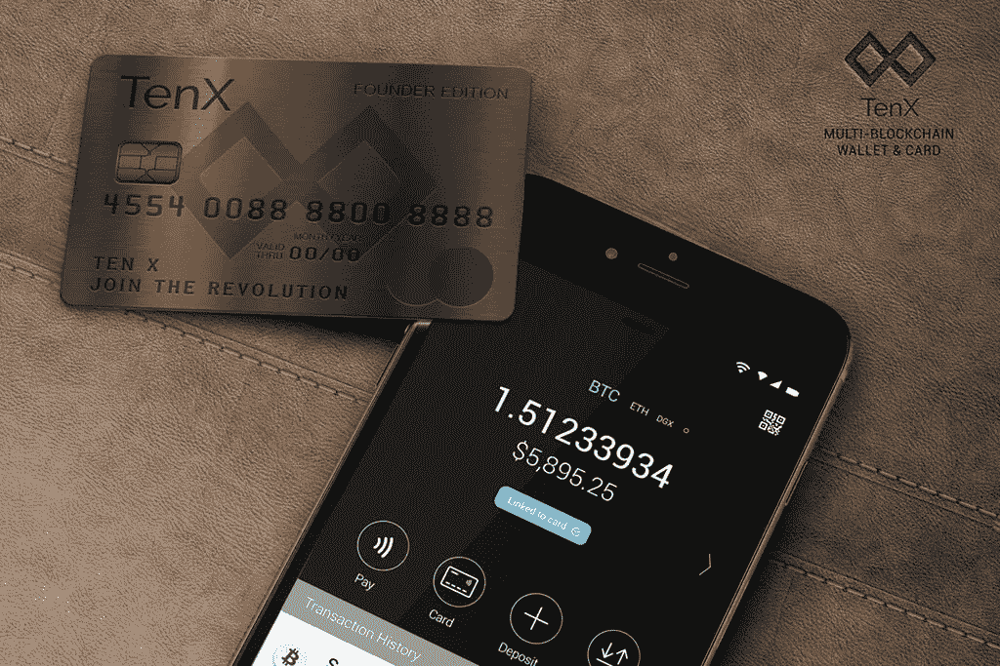
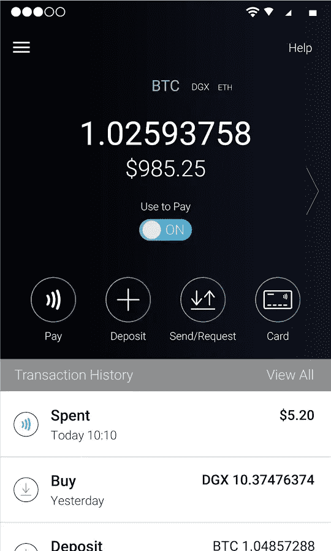

# 为什么 TenX 将改变您支付一切的方式

> 原文：<https://medium.com/hackernoon/why-tenx-will-change-the-way-you-pay-for-everything-30ae29add74b>

加密货币有一个现实世界的支出问题。

如果我想带我的比特币或者以太坊去星巴克，我做不到。

尽管越来越多的网上商店接受加密，从 Overstock 到 Newegg，现实世界中几乎没有人接受这种东西。升级在线电子商务解决方案比升级现实世界的解决方案要容易得多。

即使像沃尔玛这样有规模和财力在实体店接受它的大公司，目前也不这么做。接下来的五年可能会改变这一点，但现在，忘掉它吧。不可能。

如果大公司做不到这一点，你将等到世界末日，你当地的杂货店才会接受比特币，如果你甚至能找到一个知道它到底是什么的。

加速 T2 采用新技术是一个古老的问题。如果你还记得互联网的早期，ISP 想出了许多不同的方法来快速连接到你家，从租用线路到光纤电缆。所有这些都涉及到给你的房子或公司安装新电线。但是胜出的技术，拨号、DSL 和电缆，都有一个共同点:

他们利用已经存在的关系。

如果你能利用已经存在的东西，你就有巨大的优势。这意味着你可以越过曲线上的早期采用阶段，进入大规模采用阶段。

另一方面，如果你不得不等待公司铺设新的电线，你将永远等待。即使是像[谷歌这样的大公司，在尝试运行光纤](https://fiber.google.com/about/)时也会遇到令人讨厌的司法管辖和法规重叠和冲突的混乱局面。更不用说它的成本高得惊人。

我在一个大城市，我还在等待。我可能会在等待中变老。

[**TenX**](https://www.tenx.tech/) **采用“利用现有资源”的方法来解决现实世界的加密货币采用问题。**

他们利用销售点(POS)系统，该系统存在于世界上几乎每一个大型商店、购物中心和交易会。他们使用的是今天接受美元、欧元和日元的相同的 Visa 卡终端。这意味着零售商不需要知道任何关于加密的知识就可以拿走你的钱。

你可以去星巴克买一杯含糖的高价的四倍大的怪物咖啡，里面有你藏的比特币。

现实世界收养问题？

解决了。

那么它是如何工作的呢？

# 借方和贷方，天啊！

TenX 向您发放借记卡。你在手机上下载一个应用程序，加载一些你的加密资产，然后开始刷卡。就这么简单。让你在新旧世界之间架起一座桥梁。

最终，他们甚至会允许无接触结账，所以不需要塑料信用卡。

你的密码不会储存在他们的系统里。没必要信任 TenX 来保管你的钱。你是自己的银行。该系统利用[智能合约](https://blockgeeks.com/guides/smart-contracts/)的魔力，自动将加密硬币转移到你的卡上。从本质上讲，合同自行保管资金，并在需要时将其发放给网络。像美元和美分一样，旧世界货币的转换是在你付款时进行的。

看看左边的视频。这就是你两分钟内需要知道的全部内容。在一个由试图煮沸海洋的[大型雄心勃勃的解决方案所主导的空间](/@linda.xie/a-beginners-guide-to-tezos-c9618240183f)，TenX 是令人耳目一新的简单。他们使用“做一件事并把它做好”的 Unix 哲学

该应用程序甚至可以让你完全控制卡。

你可以锁定卡从手机上，所以它不能被使用，这提供了一些很好的欺诈保护。使用传统的借记卡，如果它被盗，我不得不打电话给银行毫无头绪的客户服务，听半个小时的音乐，偶尔穿插着“您的电话对我们很重要，请稍候。”

想象一下，如果你的电话对他们来说不重要，你会得到什么样的服务！

但有了 TenX 卡，我可以加载应用程序，禁用卡，现在它对偷它的人渣来说一文不值。

还有其他的优势。有多少父母给了他们的孩子一张借记卡，并说“现在只用这张卡买学习用品，然后马上带回来”？这时，孩子跑去给他的朋友买午餐，从应用商店买一些音乐，一些视频游戏，如果父母幸运的话，还可能买几本他上学需要的书。现在，妈妈或爸爸可以把孩子买书所需的确切金额写在卡片上，然后把钱交给孩子。

抱歉，孩子们。现在你只需要学习一些东西。

# 付钱给你的系统

该系统已经有了一些其他的主要优势。

如果你使用传统的借记卡，你要向给你这张卡的公司支付费用，以获得使用它的特权。在互联网时代(也称为黑暗时代)之前的旧时代，银行必须付钱给出纳员，让他们把钱给你，这样你才能在商店里消费。现在他们解雇了所有的出纳员，你付钱让他们使用他们的卡！不给力。

TenX 系统完全颠覆了这种动态。使用它是值得的。你每刷一次卡，他们就给你一点奖励。

他们怎么能这么做？很简单。颠覆性技术是颠覆性的，因为它削减了成本。如果你为一些公司节省了钱，你可以用这些钱做其他事情。

想想优步对出租车。

出租车没有 GPS，没有 app，没有自动匹配系统。取而代之的是，出租车必须雇佣一个人，这个人必须通过无线电向所有的出租车发出信号，才能在附近找到你。这是一个相当好的系统，但价格昂贵。大部分基础设施成本由企业承担，这限制了他们可以雇佣的司机数量，从而限制了他们的规模。

优步通过自动化汽车的订单匹配和路线安排，并使其点对点，改变了这一切。它更快，更便宜，提供更好的服务。

TenX 提议通过削减大银行和支付处理商的交易处理成本来做同样的事情。通过大幅降低 Visa 的成本，TenX 可以利用 Visa 在世界上几乎所有商店的巨大影响力，收取更少的费用或根本不收费，并提供更好的体验。Visa 仍然有可能从商家那里获得费用，他们在已经部署的解决方案的基础上添加了一个新的解决方案，实际上没有额外的成本，因为区块链为他们做了这项工作。

# 承诺

今天，Visa 和 Paypal 之所以如此之大，是因为它们必须清算和检查网络上的每一笔交易，阻止骗子和小偷，并雇佣大规模的客户服务团队来处理愤怒的客户。但加密货币消除了集中欺诈防范和交易处理的需要。

相比之下，区块链将[交易处理分配给网络上的矿工](https://en.bitcoin.it/wiki/Proof_of_work)或[股东](https://github.com/ethereum/wiki/wiki/Proof-of-Stake-FAQ)，他们遍布全球地球上的每一个国家。这消除了对大量后端基础设施的需求。如果一家公司不需要担心建立所有的系统来自己清理资金，他们可以在电力、数据中心、服务器场和反愤怒客户支持团队方面节省大量资金。

到目前为止一切顺利，但仍有一个问题。

今天，区块链相当慢。

[比特币每秒可以处理大约 3 笔交易](https://ethereum.stackexchange.com/questions/1034/how-many-transactions-can-the-network-handle) (TPS)，尽管现在 SegWit 激活后可能会多一点。以太坊和新密码每秒可以进行 25 次交易。这与 Visa 每天每分每秒都要达到的 2000 TPS 相差甚远。

还有第二个问题。

确认时间。

比特币至少需要十分钟才能确认你的交易。在网络出现故障的日子里，我会等上三四个小时等待硬币移动。这对销售点系统不起作用。他们需要即时确认。当你的比特币清算时，你不会在杂货店里等上半个小时，这样你就可以带着你的筹码和沙拉回去玩大游戏了。

这就是 **TenX COMIT** 网络发挥作用的地方。该公司将其称为[交易互联网](http://www.comit.network/doc/COMIT%20white%20paper%20v1.0.2.pdf)，这是一个统一不同区块链生态系统交易的通用协议。他们把它比作互联网的早期，那时一堆孤立的、不兼容的网络统治着世界。在万维网出现之前，他们不能互相交谈。

[TCP/IP 改变了这一切](http://www.internetsociety.org/internet/what-internet/history-internet/brief-history-internet)。它为任何网络与任何其他网络之间的对话创造了一种简单的方式，并开创了现代信息经济和它现在支持的巨大生态系统。

如今，我们在加密货币领域也遇到了类似的问题:许许多多不同的区块链，其中很少能相互对话。随着每隔一天就有一个新的 ICO 出现，这种趋势似乎只会继续下去。

但是，即使这些项目竞相成为为所有人做任何事情的终极平台，这种情况发生的可能性也非常小。十有八九，我们最终会有一群专业化的区块链。一些将处理 id，一些将分散 DNS，还有一些将处理投票或分布式存储。

要消费价值并与不同的网络交流，你需要一种标准的方法在不同的网络之间转换硬币，这样你就可以消费它们的价值。

COMIT 网络致力于标准化不同区块链之间的交易方式。COMIT 代表“密码安全的链外
多资产即时交易网络”你会注意到 TenX 有营销和命名惯例的天赋。他们在交易所的代号是**。**

**在幕后，他们融合了两个想法。首先是[闪电网](https://lightning.network/)(虽然他们不这么叫)。闪电网络提议在比特币等各种加密货币的主链之外结算大多数交易。它使用散列时间锁定合同(HTLC)来实现这一点。我不会在这里谈论所有的细节，[因为其他人已经做得更好了](/@ecurrencyhodler/a-primer-to-the-lightning-network-part-1-be909c403bde)，但基本上它通过“支付渠道”将用户点对点连接起来，并使用智能合同让他们发送 moolah。它可以通过每个通道发送成千上万笔交易。然后，它将所有事务捆绑在一起(作为单个事务)，并在一段时间后或在出现争议时将它们推送到主网络。**

**第二个想法是利用流动性提供者(LP)。闪电网络需要流动性才能正常工作。这意味着，如果出现问题，有人试图欺骗其他人，支付渠道需要足够的现金。**

**如果你在任何一个标准的证券交易所或加密交易所进行交易，你可能会知道在那些网络上有巨大的超级巨富鲸为那些系统提供流动性。这意味着他们有很多钱，可以在交易量较低时完成订单。当没有足够的买家或卖家时，有限合伙人可以介入，交易所奖励他或她折扣和小额费用，以保持财富流动。**

**TenX 利用银行和支付处理器为 COMIT 网络提供流动性。这让他们能够以一种全新的方式配置巨额现金。他们不会被锁在新的加密生态系统之外，而是可以利用他们已经拥有的资产，即他们巨大的战争资金，以更低的风险和更少的资本支出轻松参与进来。**

**这就是为什么像 Visa 这样的大网络也加入进来。这对他们来说是双赢的。降低成本，同时利用他们现有的基础架构并提供新的收入来源。**

# **密码纯粹主义与美丽新世界**

**如果你很早就相信加密货币有能力颠覆旧的金融体系，开创一个个性化货币的新时代，那么其中的一些内容可能会令人不安。SegWit 升级被拖延这么久的主要原因之一是社区中的许多人[认为它违反了最初的 Satoshi 愿景](https://blog.plan99.net/the-resolution-of-the-bitcoin-experiment-dabb30201f7)的分散原则。他们认为闪电网络不可避免地高度集中。**

**他们*可能*没有错。**

**但事实是，今天的强国总是不可避免地会想方设法利用区块链带来的新金融创新。我对新项目调查得越多，比如 Neo，我就越发现他们选择旧世界技术和新技术的融合。**

**优势是多方面的。它利用了过去集中式系统的可伸缩性和功能，以及当今分布式、分散式、节省成本的系统。**

**把它想象成混合技术。它融合了新旧制度。电动汽车将主宰未来的道路，但就效率和里程而言，目前气电跨界车主宰着道路。**

**在未来几年，我认为这是制胜的策略。**

**TenX 在 [TokenCard](https://tokencard.io/) 和[摩纳哥](https://mona.co/)有一些竞争对手，但看起来他们在市场上击败了竞争对手。**

**他们在 2017 年获得了 100 万美元的种子投资，Paypal 将他们纳入了他们的孵化器计划。以太坊的神奇小子创始人维塔利克·布特林和其他密码专家都是他们的顾问。**

**他们最近发布了一款[闭门测试版](https://blog.tenx.tech/dev-update-august-18-2017-9c1412acbee7)。现在他们看起来[准备发布公开测试版](https://www.reddit.com/r/CryptoCurrency/comments/6uzbyz/tenx_pay_software_beta_release_is_tomorrow/)。在一个缺乏实际工作代码的 ICO 时代，一个可下载的应用程序是一件大事。**

**如果这个软件有效的话，TenX 的未来如此光明，他们可能只需要一点颜色。**

**但是不要担心密码纯粹主义者。最终，一个革命性的系统将会出现，彻底颠覆旧的做事方式。**

**在那之前，我仍然需要从星巴克买咖啡。**

**############################################**

**如果你喜欢我的作品**，请考虑在** [**我的照片页面**](https://www.patreon.com/danjeffries) 上捐赠，因为这是我们改变未来的方式。帮助我从母体和**断开连接，我会百倍地回报你的慷慨，把我所有的时间和精力集中在写作、研究和为你**和世界提供惊人的内容上。**

**###########################################**

## **如果你和我一样热爱加密空间，那就来吧，加入 [DecStack，这是一个虚拟的加密货币和分散应用项目的合作场所](http://decstack.com/)，在这里你可以接触到多个项目。永远完全免费。只是进来和社交，一起工作，分享代码和想法。通过反馈让你的想法更好。寻找新朋友。见见你的新家人。**

**############################################**

****如果你喜欢这篇文章，我会很高兴你能把它推荐给其他人。之后，请随时将文章通过电子邮件发送给朋友！非常感谢。****

**###########################################**

****

**[Photo credit](https://extranewsfeed.com/the-winds-of-world-war-iii-8bc369584f67)**

***简单介绍一下我:我是一名作家、工程师和连续创业者。在过去的二十年中，我涉及了从 Linux 到虚拟化和容器的广泛技术。***

***你可以看看我的最新小说，* [***一部史诗般的中国科幻内战传奇***](http://amzn.to/2gAg249) *在这部小说中，中国挣脱了共产主义的枷锁，成为世界上第一个直接民主国家，运行着一个高度先进、人工智能的去中心化应用平台，没有领导人。***

## **加入我的读者群，你可以免费得到一本我的第一部小说《蝎子游戏》。读者称之为“神经癌的第一次严重竞争”和“黑色侦探会见约翰尼记忆术。”**

## **你也可以根据书中的想法查看一下[蝉开源项目](http://iamcicada.com/)，这本书概述了如何立即将该技术变为现实，你可以参与其中。**

## **最后，你可以[加入我的私人脸书小组，纳米朋克后人类刺客](https://www.facebook.com/groups/1736763229929363/)，在这里我们讨论一切科技、科幻、幻想等等。**