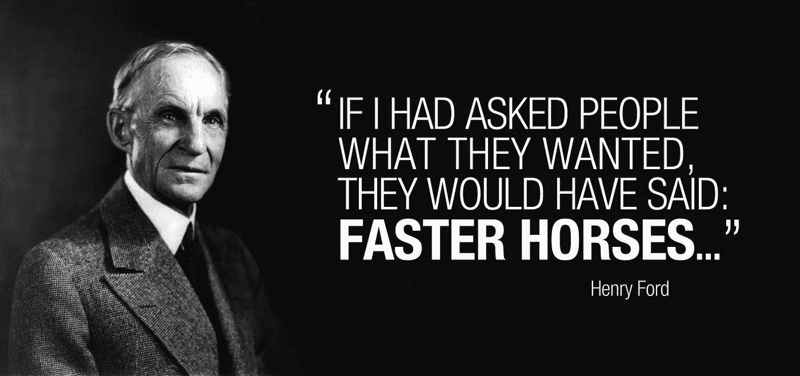

# 为什么最好的产品经理不开发用户要求的功能。

> 原文：<https://medium.com/hackernoon/why-the-best-product-managers-don-t-build-the-features-their-users-ask-for-beb75fcc540b>

Henry Ford, ex-AVP of product, Ford motors

从我记事起，人们就在乞求、尖叫、恳求一个脸书厌恶按钮。无论是因为不喜欢讨厌的政治帖子，对蹩脚的视频表示不赞成，还是对悲剧表示悲伤，每个人都想要一个不喜欢的按钮。

由于用户对“不喜欢”按钮极其强烈和明确的需求，脸书发布它只是时间问题。毕竟，对于这个星球上最重要的科技公司之一来说，仅仅将一个拇指向下的按钮放在 like 按钮旁边并发货会有多难呢？

奇怪的是，不喜欢按钮从未发货。脸书的[产品](https://hackernoon.com/tagged/product)团队很清楚，不应该表面上接受用户的功能请求，然后立刻实现(开发用户请求的功能是任何其他友好的邻里科技公司的标准做法)。

忽略功能需求，产品团队深入挖掘，以揭示*用户对不喜欢按钮的声音需求背后的真正痛点*。

他们发现困扰用户的真正问题不是缺少不喜欢按钮，而是一个简单的事实，即生活中并非所有东西都是令人喜欢的。

模仿现实生活，用户希望能够对不同的帖子做出不同的反应。

于是，脸书有了反应！

## **客户导向>产品导向**

现代营销之父之一、著名的哈佛大学教授西奥多·莱维特早在 1960 年就认为，“企业应该停止用产品来定义自己，而应该用顾客的需求、欲望和问题来定义自己。”

在他现在的经典论文《营销短视》中，他认为美国的铁路是一个行业的例子，这个行业的失败是由于有限的市场观点。那些铁路公司陷入困境并不是因为客运需求下降。

更确切地说，该行业之所以失败，是因为其背后的人认为他们从事的是铁路业务，而不是客运业务。

*他们失败是因为他们以产品为导向，而不是以客户为导向。*

> *公司不是一个创造产品和提升产品的机构，而是一个创造客户和留住客户的机构。*

同样，曾经是手机行业无可争议的领导者的诺基亚，最终作为一家手机公司消亡了，不是因为手机作为一种产品的需求下降了，而是因为他们不像竞争对手那样了解客户的需求。

## 忘记功能和产品增强，了解客户需求和痛点:

HBS 大学教授兼颠覆性创新专家 Clay Christensen 分享了一家快餐连锁店希望提高奶昔销量的故事。

该公司做了任何有自尊的产品公司都会做的事情:根据它认为理想的产品来构建更好的功能。在这种情况下，他们在询问了顾客的味蕾后，把奶昔做得更加美味。但是，唉，奶昔的销售并没有改善。

该公司随后寻求克里斯滕森的一位研究员的帮助，他试图推断顾客“雇用”奶昔做的“工作”；“痛点”用户试图通过购买奶昔来解决。

他亲自采访了所有的顾客，发现 40%的奶昔都是在早上被订购的通勤者购买的。

“事实证明，他们中的大多数人购买[奶昔]是为了做类似的工作，”他写道。“他们面临着漫长而无聊的通勤，需要一些东西让多余的手忙起来，让通勤变得更有趣。他们面临着种种限制:他们很匆忙，穿着工作服，而且(最多)有一只空闲的手。”

奶昔被用来代替百吉饼或甜甜圈，因为它相对整洁，令人食欲大减，还因为试图用细吸管吸浓稠的液体让顾客在无聊的通勤中有所作为。

了解了要做的工作/用户的具体需求，该公司可以做出回应，创造一种比它的前身更稠(可以在长途通勤中持续)和更有趣(有大块水果)的早晨奶昔。

不可避免地，这导致了销售额的快速增长。

> 网飞创始人兼首席执行官雷德·哈斯汀斯告诉他的产品团队，网飞实际上并没有与其他流媒体服务竞争，而是通过工作、葡萄酒、户外运动和人们尝试的其他解决方案，来度过一个无聊的夜晚。

这种超越你自己的产品，从客户的角度出发的思考，是伟大的产品领导者和仅仅是优秀的产品领导者的区别；难怪以客户为导向的网飞是这个星球上最具创新性的公司之一。

# 伟大的项目经理与优秀的项目经理:

唯一能长期成功的公司将是那些根据客户需求和愿望来定义自己的公司，而不是那些指望自己产品寿命长久的公司。

通常，项目经理会变得过于专注于持续按时发布功能和交付下一个伟大的产品，以至于他们可能会忽略花时间与实际用户交谈，并完全理解他们上一次产品发布的含义。

问题是，一个好的产品和一个伟大的产品经理之间的真正区别可能需要几年时间来反映对市场的影响。

通过发布大量的特性和增强功能，在短期内成为一个好的项目经理要比一个伟大的项目经理更容易，一个伟大的项目经理在匆忙构建它之前，花时间考虑“构建什么”实际上解决了真正的用户问题。好的项目经理会一直发货，而好的项目经理每次发货都会回到用户那里。

我个人知道很多人已经开发了自己的应用程序和网络产品，或者正在开发中。但很少有人真正成功的原因是，作为工程师、编码员和制作者，我们更容易冲过与用户交谈的无形障碍，真正理解他们，并开始做“真正的”、有形的编写代码的工作。

如今，每一家名副其实的科技公司都有优秀的工程人才，渴望打造你需要的任何东西。

建造是容易的部分。建造什么是真正的百万美元问题。

## 在 Tinder 之前有许多约会应用，但没有人真正“了解”用户的主要痛点是他们面临的拒绝(男性)和女性从他们不感兴趣的男性(女性)那里不断收到信息。**在调查中，男性表示他们希望约会应用上有更多女性，而女性则希望有更多男性。Tinder 通过双重选择来解决这两个用户问题，并在这个过程中创造了一个数十亿美元的市场。**

> **没有人真正关心你闪亮的新功能或产品！客户购买的是利益或预期结果！他们购买问题的解决方案。**

用户倾向于将他们的问题框定在预先存在的解决方案的形式中。作为产品经理，我们的工作是深入挖掘，不断问“为什么”,并在决定构建什么之前发现真正的问题。

花时间做这件事的项目经理将会成长，不仅仅知道*他们的顾客想要什么*，而且最终会理解*为什么*顾客想要他们要求的任何东西。这种区别的重要性怎么强调都不为过。通常，当客户提出要求时，他们的要求反映了一种潜在的需求，这种需求可以通过客户尚未想到的解决方案得到更好的解决。

# 因为从本质上讲，产品经理的基本职责不是成为公司在产品方面的领先专家，而是成为公司在客户方面的领先专家。

从根本上来说，产品管理处理的是人类经验中最困难的问题:如何从他人的角度看待事物。

制造产品供他人使用最终是一种移情行为。每一个关于一个东西如何被制造和如何被使用的决定都来自于制造者的世界观。他们通过用户的眼睛看事物的能力决定了他们工作的价值。没有人能通过另一个人的眼睛看世界。都是近似和猜测。

唯一的方法就是不断地和你的顾客交谈和询问。

> 两年前，Groove 首席执行官亚历克斯·特恩布尔(Alex Turnbull)注意到客户流失率飙升，并希望超越他看到的数据，试图找出原因。所以他开门见山:他给*的每一位顾客*发电子邮件，要求他们只给 10 分钟时间谈谈。结果，他花了 100 多个小时与 500 名 Groove 客户交谈，最终得到了帮助他扭转局面、拯救公司的反馈。

> [黑客中午](http://bit.ly/Hackernoon)是黑客如何开始他们的下午。我们是 [@AMI](http://bit.ly/atAMIatAMI) 家庭的一员。我们现在[接受投稿](http://bit.ly/hackernoonsubmission)并乐意[讨论广告&赞助](mailto:partners@amipublications.com)机会。
> 
> 如果你喜欢这个故事，我们推荐你阅读我们的[最新科技故事](http://bit.ly/hackernoonlatestt)和[趋势科技故事](https://hackernoon.com/trending)。直到下一次，不要把世界的现实想当然！

