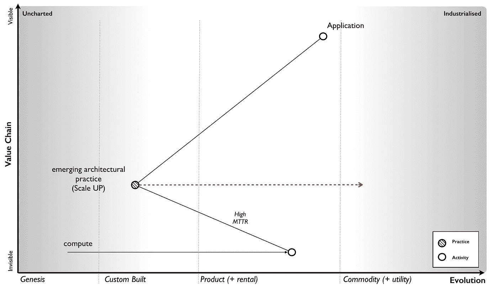
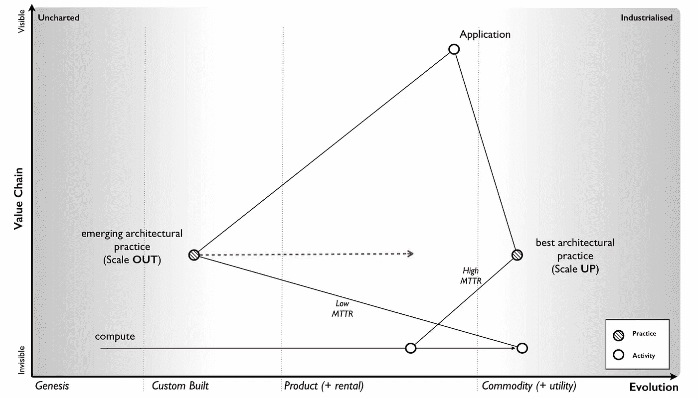
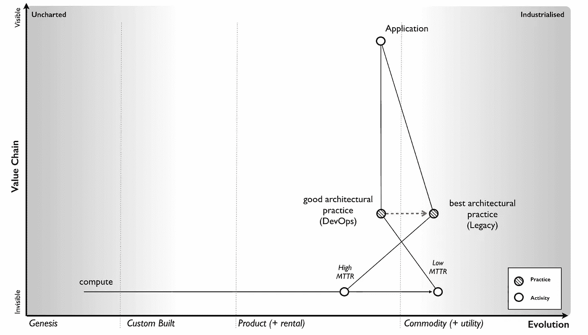
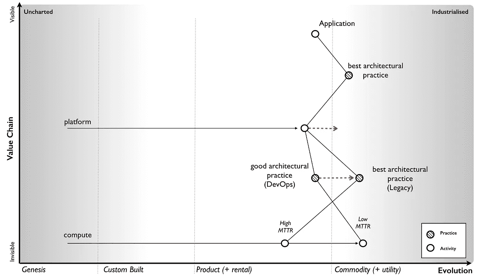
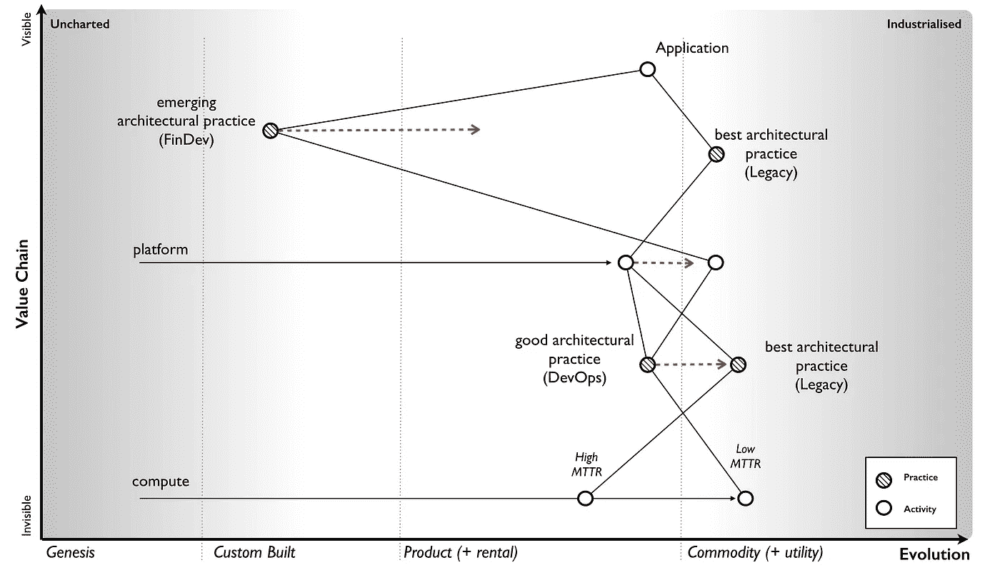
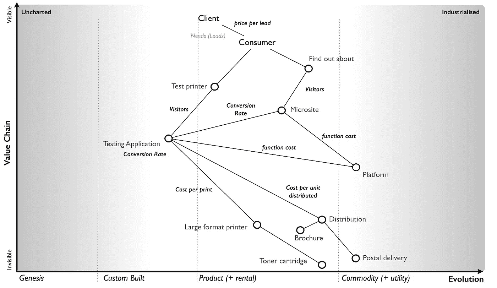
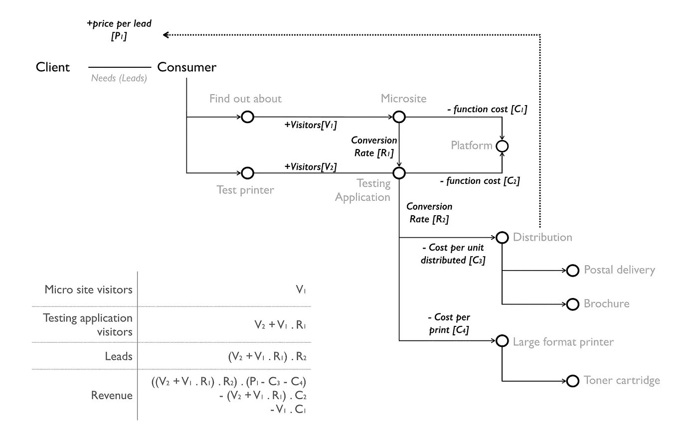
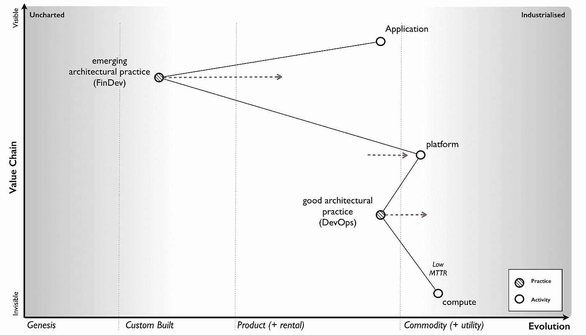
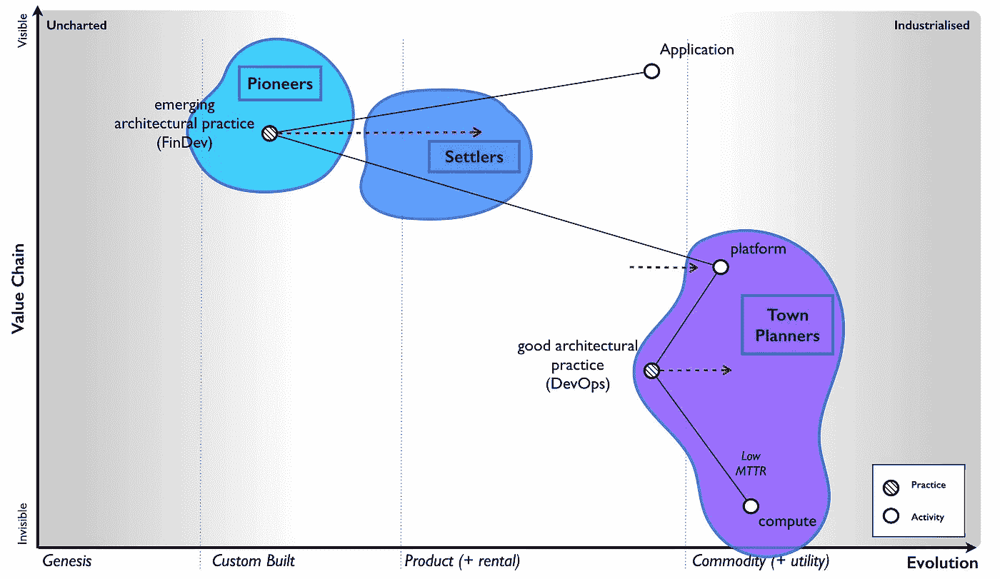

# 为什么对无服务器大惊小怪？

> 原文：<https://medium.com/hackernoon/why-the-fuss-about-serverless-4370b1596da0>

为了解释这一点，我将不得不回顾一些旧的工作，特别关注共同进化。

## **共同进化**

让我们穿越时间回到 80/90 年代。在那些日子里，计算机在很大程度上是一种产品，我们构建的应用程序使用基于产品特征的架构实践，特别是平均恢复时间(MTTR)

当计算机出现故障时，我们必须更换或修理它，这需要时间。MTTR 很高，建筑实践已经出现来解决这个问题。我们使用 N+1(即多个电源等冗余组件)构建机器。我们运行了灾难恢复测试，试图确保我们的弹性工作。我们非常关心单机的容量规划和扩展(纵向扩展)。我们非常关心可能引入错误的事情，我们有设计来防止这种情况的变更控制程序。在我们试图改变所有重要的生产环境之前，我们通常构建测试环境来进行尝试。

但是这些实践并不是一夜之间神奇地出现的，它们是通过反复试验发展而来的。它们开始是新颖的实践，然后出现了更占优势但不同的形式，直到我们最终开始达成某种形式的共识。这些技术融合在一起，并产生了良好的实践。最终，这些被提炼，并开发出最佳的架构实践。在如此自信的日子里，你会被嘲笑没有做适当的容量规划，因为这是一个预期的规范。

我们的应用程序需要基于作为产品提供的(所需)计算的架构实践。成为“最佳实践”的架构规范是 N+1、向上扩展、灾难恢复、变更控制和测试环境，而这些最终都来自于产品的高 MTTR。我已经在下面的地图中展示了这种实践的演变。通常对于地图，我只是用进化的描述来描述活动，这与实践完全相同，但使用了稍微不同的术语，例如新颖、新兴、良好和最佳，而不是起源、习俗、产品和商品。

*地图——建筑实践的演变*

事实是，计算机进化了。作为一种活动，计算机早在 20 世纪 40 年代就已经在那个未知的领域(法案的起源)开始了，在那里一切都是不确定的。然后，我们有定制的例子(不同的形式)，然后是产品(围绕某些特征的融合以及它们之间的一些区别)。然而，到 21 世纪初，计算已经开始转变，变得更像商品，差异化变得更加受限，活动本身变得更加明确。在这个世界上，服务器实际上是关于处理器速度、内存、硬盘大小、功耗以及一个机架能装多少个服务器。在这个世界中，我们建立了计算银行，并根据需要创建了虚拟机。然后，随着 2006 年 AWS EC2 的到来，我们得到了公共事业表格。

任何活动的更工业化的形式都有不同于早期进化版本的特征。有了计算基础设施，效用形式具有类似的处理、记忆和存储能力，但它们的 MTTR 非常低。当一个虚拟服务器出现故障时，我们没有尝试去修复它，我们没有订购另一个，我们只是调用一个 API，几分钟或几秒钟内我们就有了一个新的。我们亲切地给我们的服务器命名的日子已经一去不复返了，这些服务器是牛而不是宠物。

这种特征的改变使得基于低 MTTR 的一套新的建筑原则得以出现。我们不再关心单个机器的 N+1 和弹性，因为如果发现故障，我们可以快速重建它们。相反，我们为失败而设计。我们通过分配工作负载、在需要时调用更多机器来解决扩展问题，我们已经从纵向扩展转向横向扩展。我们甚至为那些在这个富足的世界中进行“容量规划”的人保留了那种会心的笑声。

*地图—新实践的出现*

我们开始通过不断引入错误来测试失败——我们创造了各种形式的混沌猴子或灾难大师，将随机失败引入我们的环境。一次性灾难恢复测试是为弱者准备的，我们不断适应失败。有了一个更加灵活的环境，我们学会了更快地回滚更改，我们对我们的方法更有信心，并开始使用持续部署。我们对那些坚持神圣的生产和不那么神圣的测试环境的人不以为然。我们开始嘲笑他们。

这些新颖的实践(横向扩展、针对故障的设计、混沌引擎和持续部署等)源自越来越低的 MTTR 环境，而这些实践只是被实用计算环境加速了。我们构建应用程序时就考虑到了这一点。新的实践传播开来，变得越来越突出(相同原则的不同形式),并慢慢地开始围绕良好实践达成共识。我们甚至给它起了个名字，德沃普斯。它仍在发展，并会反过来成为最佳的架构实践。

所发生的被称为共同进化，即实践与活动本身共同进化。这是完全正常的，历史上经常发生。尽管钢铁制造本身已经工业化，我们仍然可以制造剑(如果我们希望的话),但我们在很大程度上已经失去了早期铸造剑的实践。一套做法已被另一套所取代。

我已经在下面的地图中展示了计算中共同进化的当前状态。以前的最佳架构实践我们现在称之为“遗产”，而好的(并且仍在发展中的)架构实践被称为“devops”。

*地图——devo PS 的协同进化*

实践的这种转变也与惰性有关，即我们变得习惯于“旧的”和可信的最佳实践(基于一组特征)，而“新的”实践(基于一种更进化的潜在活动)不太确定，需要学习和投资。因此，由于治理，我们经常对潜在的变化有惰性。这是云计算停滞不前的主要原因之一。

此外，我们拥有的任何基于“旧的”最佳实践的应用程序都缺乏这个新的更先进的世界的好处。工业化的这些好处总是包括效率、敏捷的速度和建设新事物的发展速度。我们现有的应用程序成为我们过去做事方式的遗产。他们需要重新设计，但这涉及到成本，因此，我们试图创造新的世界，但就像过去一样。我们希望获得批量操作和商用组件的所有优势，但使用专为我们设计的定制硬件！不管用，红皇后最终迫使我们适应。但是我们经常与它抗争太久。

这种共同进化和更进化的实践不可避免的优势是高度可预测的。我们可以用它来预测新出现的组织形式，以及预测实践中的变化，以免它们打击我们。回到 2008 年的 Canonical，我们知道我们必须专注于新兴的 DevOps 世界，并确保在该领域进行开发的每个人(或尽可能多的人)都在使用 Ubuntu。我们利用这种变化为自己谋利。正如一位首席信息官最近告诉我的，前一天大家都在谈论 RedHat，第二天就全是云加 Ubuntu 了。那不是偶然发生的。

# **让情况变得更复杂一点**

当然，地图本身并没有向你展示全貌，因为我特意简化了它来解释共同进化。在应用程序和我们用于计算基础架构层的架构实践之间是另一层，即平台。

现在平台本身也在发展。在过去的某个时候，第一个平台诞生了。这些然后演变成各种不同的，但仍然不常见的定制形式。然后我们有了更多产品形式的融合。我们有 LAMP 栈之类的东西(Linux、Apache、MySql 和 Perl 或 Python——随你选)。

除了围绕计算基础设施的架构实践，还有围绕平台的架构实践。这些都是基于平台本身的特性。从编码标准(即术语)到测试套件，从性能测试到整体程序结构中的面向对象设计。该平台的关键特征是它如何提供一个公共环境来编码和抽象出许多基础。但这是有代价的，同样的共享平台。

一个程序只不过是一个经常调用许多其他函数的高级函数。然而，总的来说，我们将这些功能一起编码为一个整体结构。我们可能会在某种形式的 n 层设计中分离出几层——一个 web 层、一个后端、一个存储系统——但是这些层中的每一层往往都有相对较大的程序。为了应对负载，我们经常在几台物理机器上复制这些独石。

在这些大型程序中，为了便于管理，我们会将它们分解为较小的功能，但由于所有这些不同平台堆栈的开销，我们不会频繁地将这些功能分离到不同的平台堆栈上。你不会想让一台拥有整个平台堆栈的机器运行一个很少被调用的函数。简直是浪费！在下图中，我在平台层上添加了平台和最佳实践。

*地图——建筑实践的演变(平台)*

2005 年，我经营的公司已经在使用基础设施等公共设施。我们已经发展了早期的 DevOps 实践——分布式系统、持续部署、故障设计——这只是我们的标准。然而，我们也开发了一个实用的编码平台，它允许开发者用一种语言——JavaScript——编写整个应用程序，包括前端和后端。

作为开发人员，你只是写代码，你从平台本身抽象出来，你当然没有服务器的概念。您在程序中编写的每个函数都可以在不同的平台堆栈中运行，这是您不需要知道的。从开发者的角度来看，你只需编写并运行你的程序，然后它调用其他函数。然而，这个环境(称为 Zimki)支持一些引人注目的新功能，从功能分配到按功能计费。平台从产品到实用工具的变化创造了新的特征，使得新的架构实践在这一级出现。这就是共同进化。这很正常。

这些新的实践，我当时给它们起了个绰号叫 FinDev。“旧的”最佳架构实践，嗯，那是遗产。我画了一张地图来展示这种变化。

*地图——建筑实践的协同进化(平台)*

这些架构变化中更平凡的是它鼓励组件化，将复杂的系统分解成可重用的离散组件，作为服务提供给其他人。在 Zimki 中，每个函数都可以通过添加到函数中的简单的“publish”参数作为 web 服务公开。今天，我们使用术语微服务来描述这种作为 web 服务的功能和供应的分离。我们正在从包含所有功能的整体程序转移到一个分离和离散功能的世界。一个实用程序平台正好可以实现这一点，并从开发人员那里抽象出整个底层过程。

下一个平凡的点是，它鼓励更大程度的重用。旧的面向对象世界的问题之一是没有有效的通信机制来公开已经构建的内容。你经常会在一个公司内发现对象和功能的重复，更不用说在公司之间了。同样，公开为 web 服务会促使这种情况发生改变。这假设有人有意识建立一个发现机制，比如服务注册。

另一点，也是相当琐碎的一点是，它使开发人员进一步远离底层基础设施的问题。并不是真的“无服务器”，而是更多的“我不在乎什么是服务器”。正如任何工业化过程(从产品到商品和实用形式的转变)一样，好处不仅在于提高基础组件的效率，还在于加快我开发新事物的速度。与任何其他工业化一样，过去的实践会导致无休止的惯性循环。预计会有很多人对根据您的平台定制基础架构的好处嗤之以鼻……只要让时钟回到 2007 年的基础架构即服务，您就会在略有不同的环境中听到相同的争论。

总之，回到老街(公司所在地)和 2005 年的日子。使用 Zimki，我在一天左右的时间里构建了一个小型交易平台，因为我能够重用其他人创建的这么多功能。我不必担心构建平台，服务器的概念、容量规划以及所有这些“剃牦牛毛”都远离了我的脑海。效率，敏捷的速度和开发的速度只是一个给定的。然而，这些变化并不是真正令人兴奋的部分。杀手，抓到的是按功能计费。

按功能计费从根本上改变了您进行监控的方式。当我向世界提供服务时，我的程序的用户可以通过它遵循非常不同的路径。我们称之为流动。根据它们在我们系统中的流程，有些函数可以被更频繁地调用。按功能计费不仅能让我看到使用了什么，还能快速识别我的程序的高成本区域。我经常会发现，由于我编写代码的方式，一个函数导致了大部分的开销。我在程序中检索交易的方式简直是在用成本杀死我。我可以预见到，我可以迅速将投资导向改善这一项成本高昂的功能，并降低整体成本。按功能成本监控改变了我们的工作方式——它改变了我，我很确定这会影响到你们所有人。

然而，与下一个变化相比，这就相形见绌了。我们称之为基于价值的发展，为了解释它，我需要给你一个例子，我们需要回到过去。

# **基于价值的发展**

2003 年，我经营的公司为其他人建造和操作小型系统。没有大型系统，这些都是 10 万 2M 规模的系统，覆盖了几百万用户。我们的客户通常想要写一份详细的规格说明，确切地说明他们需要什么来确保我们交付。这听起来不算太糟糕，但即使在这种小规模下，这些项目中的一些组件也会处于未知的空间，需要探索和实验，因此没有人知道到底需要什么。不幸的是，在那个时候，我没有语言来解释这个。因此，我们构建并操作系统，不可避免地，我们在变更控制上有一些紧张，并在特定合同的内容上有一些争论。

在其中一次讨论中，我向客户指出，我们围坐在一张桌子旁，争论一张纸上有什么或没有什么，但我们中没有一个人谈论系统用户需要什么。合同在这里并不是真正的客户；客户的最终用户是。我们需要改变这种讨论，把重点放在最终用户上。我建议我们应该创建一个基于最终用户的价值衡量标准，这是我们双方都可以努力的方向。这个想法被置若罔闻，因为客户忙于合同，但至少种子已经播下。不久之后，另一个项目提供了一个机会来测试这个想法。客户给了我一份说明书，问我建立一个这样的系统要花多少钱？我回答——“免费听起来怎么样？”

他们有点震惊，但我接着补充道:“然而，我们将不得不支付运行系统的费用。我们可以确定一个衡量价值或价值的尺度，我会因此得到报酬”。有一点嗯和啊，但最终我们同意尝试一种基于价值的开发方法。

在这种情况下，该系统的目标是为一系列昂贵的大幅面打印机(LFP)提供线索。客户想要更多的线索。他们的潜在最终用户希望找到更多关于这些打印机的信息以及测试它们的方法。我会建造一些东西来满足这两种不同的需求。但是，与其让客户预先付费并承担所有风险，我会免费构建它，并对每一个新创建的线索收取费用。我们(与客户和我的公司一样)不再关注合同的内容，而是专注于创造更多潜在客户的单一任务。我们都有这样的动机。我对成本效益也有了新的激励，因为我制造的系统越高效，我保留的利润就越多。

采用基于价值的方法，我有强烈的动机:-

*   降低项目的运营成本，因为越便宜，我赚的利润就越多。
*   提供可靠性，因为如果系统崩溃，我就赚不到钱了。
*   确保系统最大化价值指标，因为它做得越多，我赚的钱就越多。

所以，让我们把它画出来

*地图—系统*

地图从我们的客户开始，他需要更多的销售线索，这有望导致其他公司购买他们的产品。从销售线索到实际购买打印机的转换超出了本项目的范围，因为这属于客户的销售组织。我们只专注于创造销售线索。该图中的另一类用户是希望购买这些昂贵打印机的消费者。他们有不同的需求，他们希望找到适合其商业运作的打印机，并在购买他们将使用的产品之前进行测试。在这个项目中，我们的目标是为消费者提供一个在线机制来了解打印机(一个微型站点)以及测试它的方法(测试应用程序)。

测试是潜在客户上传的高分辨率图像，然后使用他们选择的打印机打印出来。然后，他们的海报(这是大幅面的)将与标准图形海报(展示全部功能)、相关营销手册和安排的销售拜访一起分发给潜在消费者。如果我们愿意，地图上的每个组件都可以扩展到更详细的内容。

从地图上看，我们希望有访客访问我们的微型网站，这将颂扬拥有大幅面打印机的优点，并希望说服这些访客去测试它。将访问者转化为真正的潜在客户需要用户测试打印机。因此，我们有多种转换率，例如从微型网站到测试应用程序，从访问者到潜在客户。开始时，这些都是未知的，但我们可以猜测。

通常，运营一个微型网站需要很难计算出我使用了多少计算资源的成本。最初，平台空间是一个令人头疼的问题，因为我无法为应用程序的使用提供可变的运营成本。这是 2003 年，我不得不担心容量规划和所有其他“牦牛刮毛”。然而，让我们在现代背景下重新审视这一点。该平台已经朝着更实用的服务方向发展，尤其是像 AWS Lambda 这样的系统。在这样一个实用平台的世界里，你的应用程序只是运行在平台上的一个功能，我是收费使用的。我的微型网站的运营成本基本上就是访客数量 x 微型网站功能的平均成本。请记住，一个应用程序由许多功能组成，用户可以围绕它导航，这意味着一些“漫游”用户比其他人更昂贵。但是我们可以通过对我们的微型站点取平均值来解决这个问题。

这同样适用于我的“测试打印机”(测试)应用程序，但在这种情况下，用户将包括来自微型网站的转化访问者以及那些直接访问。测试应用程序(功能)的每次使用都会产生费用。但是和微型网站一样，这是一个变量。当然，测试应用程序的实际功能成本可能与微型网站有很大不同，这取决于应用程序做了什么以及代码写得有多好，但至少我们对每个调用都有一个精确的价格。

当你看地图的时候，可以有许多形式的流动，无论是金融的还是其他的。它可以是用户流、收入流或风险流。例如，如果实用程序平台由于某些灾难性事件而停止运行，那么它将影响我的微型站点和我的测试应用程序，这将影响消费者需求并停止任何销售线索的生成。这将导致我在收入损失方面的经济损失。同样，用户有许多路径可以走，例如，他们可以去微型站点，而不必去测试应用程序，从而产生成本但没有收入。然而，我可以利用这些流量并从中创建一个商业模型。

*从地图到商业模式*

对于想创业的人来说，这简直是天赐之物。当然，我在开发代码方面有投资，但随着应用程序成为可变的运营成本，我可以制造一台随着用户增长的印钞机。这也改变了我对投资的关注——我是想投资于为更多用户增加营销，还是转化率，或者可能测试应用程序(或其中的一个功能)写得太差，以至于投资于编码改进会给我带来更好的回报？突然间，我创业和投资的整个方式都变了。

让我在这里说清楚。十年前，当我看到一个基于 Zimki 构建的系统时，我可以获得一个函数，并知道它每次运行的成本。现在，您可以使用 AWS Lambda 做同样的事情。使用地图，我可以知道相同的功能(如果我想要那个粒度级别)在价值链中的位置，以及它如何影响我的收入。你也可以做同样的事情，映射都是知识共享。可以知道单个功能对收入和成本的影响。

当今的大多数公司，当他们看到一个函数时，看到的是一组字符，他们不知道运行这个函数的成本是多少，更不用说它如何影响底线了。残酷的说，大部分公司还在纠结用户需求。大多数人认为这些东西无关紧要，这种情况会持续下去，直到他们面对一家认为它重要的公司。

相比之下，早在 20 世纪 90 年代，我曾在快速消费品行业工作——想想 P&L 的 crisp packet。如今，每个人都在谈论“算法管理”(嗯，我所在的某些圈子里的每个人都是如此)，但如果你不知道某样东西的成本、它对收入的影响以及它是如何变化的，那么没有算法能帮你找到你需要做出的投资决策的答案。现在，无可否认的是，这些天我的大部分工作都是在行业甚至国家层面上，偶尔会和一些公司玩玩。但是，如果你愿意，你可以分析一个企业的职能。

随着我们进入这个无服务器的世界，围绕平台的实践从组件化到代码共享到财务监控再到灵活性和效率的提高，这是一件非常重要的事情。但是，围绕基于价值的发展和金融与发展的冲突的新商业模式将会让你大吃一惊。这就是为什么"芬德夫"这个绰号？除了在编码方面的初始投资，我还可以创建一个几乎可变成本的商业模式，并以你们大多数人从未体验过的方式重新定向投资，以实现回报最大化。我知道，我也经历过。

尽管有惯性，这些新兴的实践将会传播。采用的路径将是一个间断的均衡，就像工业化的所有点一样。这意味着增长是指数级的，你几乎不会注意到它，直到它占据了市场的几个百分点，然后在接下来的几年里，它将接管市场。这个过程的平均时间跨度为 10-15 年，所以预计到 2025 年，全世界都将被无服务器取代。是的，我们会经历[“不”→“哦不”→“哦 f # @ k”](/@drew.firment/serverless-and-the-enterprise-69aca8e552cb)收养阶段。尽量不要被这种高度可预测的变化扰乱，声称没有人看到这一点。我们早就知道了。唯一看似合理的借口是你太接近退休了，不想节外生枝，这可能对你有好处，但对后来者不利。

如果有帮助的话，无服务器大致相当于基础设施即服务(例如云)在 2007 年末的水平。看看你的周围，现在的一切都是“云、云、云”，雇佣有合适技能的人是多么困难。回想一下 2007 年，“这是一个玩具”，“没有一个真正的企业会使用它”，“我们的数据中心更好”。想想那些告诉你它不适合企业的知名战略顾问。如果你现在后悔当时行动不够快，要知道你会再次犯同样的错误。

这些“FinDev”架构实践将迅速成为好的，然后是最佳实践，但是它们的确切形式将是什么，我们还不知道。我们还没有接近达成共识的阶段，他们仍然需要发展和完善。但是确切的形式将在未来五年内变得清晰(到那时游戏即将结束，赢家将会出现等等)

无服务器将从根本上改变我们围绕技术构建业务的方式以及您的编码方式。你的未来看起来更像这样(简单拿*建筑实践协同进化(平台)*图，去掉遗留线)。

*地图——发展的未来*

你以为 devops 很大，但和这个比起来就是小钱。这将是行动的地方，它会比你意识到的更快，是的，你会有惯性。现在不是建立 DevOps 团队和走向 IaaS 的时候，你已经错过了那艘船。你应该尽快抓住这股浪潮。

# 最后说几句话。

**容器**——它们是重要但最终不可见的子系统，这不是你应该关注的地方。

云代工厂(Cloud Foundry)——这非常重要，他们应该在堆栈中向上移动，创造市场，否则 AWS Lambda 等人将会拥有这个空间。

**DevOps** —人们试图在这个领域建立的许多东西本身将变得不可见，如果你在内部建立，那么可能会成为遗产。它在你应该在的线以下。

最后一点，对于那些使用开拓者-定居者-城市规划师结构的人来说。如果你提供的是一个平台，那么你的城镇规划者应该从定居者手中接管这个空间(从平台到 devops 再到基础设施)。除非你已经有了规模，否则你至少应该计划将大部分业务推出组织之外，让公司专注于构建平台之上。我希望如果你是一个经常阅读的人，你将会在通往零数据中心的道路上前进。

你的先锋应该是围绕公用事业平台的所有新实践(FaaS，无服务器或你想叫他们什么)。他们应该围绕这个领域开发应用程序，研究如何将财务和开发结合到新的模式中，如何建立服务存储库、监控等。这个领域的实验应该是疯狂的。

您的定居者在帮助城镇规划者接管从 IaaS 到 PaaS 的任何现有工作的同时，现在需要开始搜寻围绕公用事业平台工作开发的所有内部和外部的新颖和新兴实践。他们需要为那些可能有用的东西寻找重复出现的模式。他们需要寻找那些有潜力的空间，为你的新产品线找到最有价值的产品。错过这条船，到 2025 年你会后悔的。

*地图—太平洋标准时间*

P.S .为了大家好，有人请想出一个比 serverless 更好的名字。最初的 Zimki 服务在 2006 年被称为 FaaS(框架即服务)。不幸的是，一群倒霉的顾问把这个术语变成了 PaaS(平台即服务),这在许多领域几乎毫无意义。这现在已经演变成了 FaaS(功能即服务)。这都是一回事，除非你是一名顾问或供应商，试图推销你的新术语有意义。这都是关于公用事业平台，在那里你只需编码，计费尽可能细化(例如，细化到功能)，你不会对“剃牦牛毛”(无意义的任务，如容量规划或机架服务器等)给予两个 hoots。

如果你想密切关注该领域的发展，请跟随[阿德里安·考克洛夫特](https://medium.com/u/eed29d74b3fb?source=post_page-----4370b1596da0--------------------------------)以及[阅读他的帖子](/@adrianco/cloud-trends-where-have-we-come-from-and-where-are-we-headed-3d7e5e756d16)以及[德鲁·弗曼特](https://medium.com/u/7d7993c5880e?source=post_page-----4370b1596da0--------------------------------)(此处为[帖子](/@drew.firment/serverless-and-the-enterprise-69aca8e552cb))和[保罗·约翰斯顿](https://medium.com/u/139b9858e816?source=post_page-----4370b1596da0--------------------------------) ( [此处为](/@PaulDJohnston/disruptive-serverless-ddb417ebdd15))等人。

被警告！上面的人很友好，而我倾向于对人咆哮，特别是如果他们没有他们的业务地图的话… grrr，grrr，大咬牙切齿。哦，在有人流口水“但麦肯锡说”之前，我仍然没有停止从[“澄清云计算的空气”](http://www.isaca.org/Groups/Professional-English/cloud-computing/GroupDocuments/McKinsey_Cloud%20matters.pdf)笑，那是 2009 年。

如果你不知道什么是地图——[从第一章](https://medium.com/wardleymaps)开始，可以[我建议读一些战略基础](/@swardley/how-to-master-strategy-as-simply-as-i-can-d15627f00326)。

— —

*本帖作为知识共享* [***提供，署名共享 4.0 国际***](http://creativecommons.org/licenses/by-sa/4.0/)**由原作者 Simon Wardley 为* [*前沿论坛*](https://leadingedgeforum.com/) *研究员。**

**最初发表于*[*blog.gardeviance.org*](http://blog.gardeviance.org/2016/11/why-fuss-about-serverless.html)*。**

******

> *[黑客中午](http://bit.ly/Hackernoon)是黑客如何开始他们的下午。我们是 [@AMI](http://bit.ly/atAMIatAMI) 家庭的一员。我们现在[接受投稿](http://bit.ly/hackernoonsubmission)并乐意[讨论广告&赞助](mailto:partners@amipublications.com)机会。*
> 
> *如果你喜欢这个故事，我们推荐你阅读我们的[最新科技故事](http://bit.ly/hackernoonlatestt)和[趋势科技故事](https://hackernoon.com/trending)。直到下一次，不要把世界的现实想当然！*

**