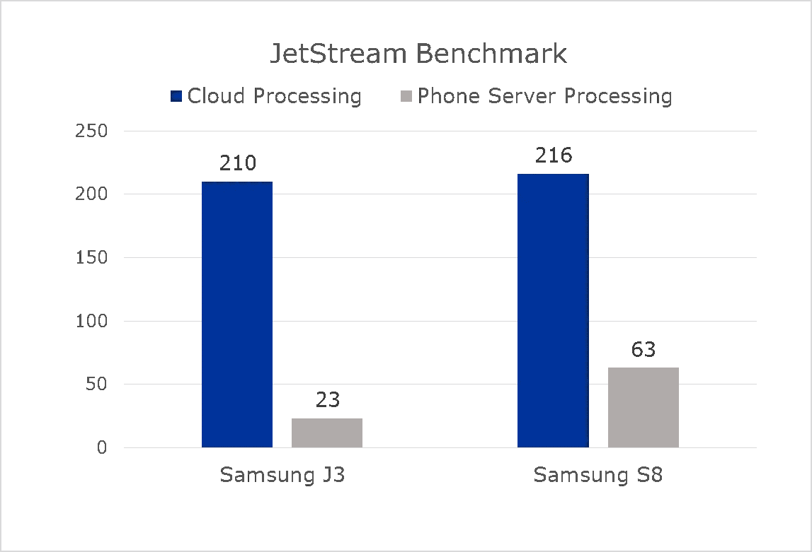

# 为什么移动技术的未来在于云

> 原文：<https://medium.com/hackernoon/why-the-future-of-mobile-technology-lies-in-the-cloud-b891bd00206b>

在今天的市场上，仅靠硬件不足以让智能手机脱颖而出。多年来，有无数智能手机型号没有起飞或没有在竞争中脱颖而出——如亚马逊的 Fire Phone 和 HTC First。

当然，对独特身份的争夺以及随之而来的销售不仅仅适用于智能手机市场——这就是为什么汽车、恒温器以及几乎所有其他设备的制造商都在他们的产品中添加“智能”，以使它们与众不同。

这一现象凸显了当今世界越来越清晰的现实。为了生存，智能手机将不得不变得不仅仅是人们手中握着的矩形设备——它将不得不摆脱其物理形态，成为云。

**更好的硬件、软件和服务的秘密**

在他的 F8 会议[主题演讲](https://www.youtube.com/watch?v=YtUye84PuFY#t=7m6s)中，他讨论了智能手机的新技术，脸书首席执行官马克·扎克伯格说，“我们不使用原始工具，因为我们更喜欢原始工具。我们使用原始工具，因为我们仍处于开发更好工具的早期阶段。”智能手机有着惊人的潜力，这是我们做梦都想不到的。目前，我们仍在应对技术限制——尤其是硬件限制。随着应用程序变得越来越强大，它们也将消耗智能手机更多的资源，如电池和数据；据杜克大学、加州大学洛杉矶分校和其他组织的研究人员称，[电池仍然是移动设备](https://www.researchgate.net/profile/Eduardo_Cuervo/publication/221234509_MAUI_Making_smartphones_last_longer_with_code_offload/links/0c96053278a9931c43000000.pdf)的主要瓶颈。

为了克服这些限制，我们需要对技术采取全面的方法。在等式中加入软件和服务——因为软件和硬件的结合每次都会击败单独的硬件。软件绕过了电池瓶颈，因为软件没有硬件的物理限制。

当硬件可以与软件和服务合作来更轻松、更好地完成工作时，为什么要让硬件单独完成任务呢？想想这些年来汽车是如何发展的——从柴油到无铅汽油再到电力，我们提炼了汽车使用的燃料，而不是汽车本身。汽车仍然有四个轮子，一个引擎和一个方向盘。智能手机的硬件就是汽车本身——你不能重新发明轮子，你也不能现实地扩展智能手机。软件是目的地——你想把车开到哪里。我们需要改变的是燃料——在这种情况下，是加工过程。手机本身的处理是柴油——云处理是硝基增压汽油。

**选择服务器机房而不是单处理器**

无论一部手机有多棒，它仍然是一个单处理器，并且受到一个处理器所能做的事情的限制。拥有一整个服务器机房供您随时调用要好得多。

移动计算面临的挑战一直是便携性和功耗之间的权衡。因为很难在口袋里装下一个服务器室，所以用户放弃了额外的处理能力来进行移动计算。但是有了云处理，这种权衡最终会成为智能手机历史的一部分。云处理充当了你的手机和服务器机房之间的直接链接。你的手机不再仅仅是你的智能手机:它也是服务器室和将它们绑定在一起的云连接。这是硬件加软件加服务的行动，有效地将智能手机转变为云。

这样做的主要好处之一就是速度。一屋子的服务器处理信息的速度将比单个处理器快得多。浏览速度基准一直是这些程序处理能力的常用对比，它们显示了云处理带来的差异。在被广泛引用的 JetStream 基准测试中，云处理得分为 210，而通过智能手机本身进行处理的得分最多为 63。这也说明了为什么更多的重点应该放在软件和服务上，而不是硬件上——手机本身没什么区别。

马来西亚[大学](https://arxiv.org/pdf/1205.0451.pdf)的研究人员得出结论，云计算通过在不损失质量的情况下加速应用和服务的执行，导致“明显的资源节省”——特别是节省本地 CPU 使用、电池和数据消耗。例如，云计算技术和 JavaScript 的结合可以用于预处理和压缩网页，实现更快的加载时间和浏览，可以节省高达 90%的智能手机数据带宽。用户智能手机上发生的唯一处理是有限的——大部分操作发生在单独的云服务器上，因此不会向用户的数据计划收费。

此外，云处理对智能手机的安全性有很大好处。通过云处理连接到互联网，用户可以有效地远离黑客和基于互联网的威胁。即使攻击者设法破坏连接(为了最大程度的安全，应该加密)，他们也将访问云服务器，而不是用户的个人设备。如果这些云服务器仅用于处理数据而不是存储数据，攻击者将会失望，因为他们只能访问没有数据可挖掘的服务器。

**在云端寻找解决方案**

将智能手机的处理功能转移到云端并不是一个激进的步骤，我们现在就可以实现。

我们已经开始了这一进程:脸书、Google Drive、Salesforce 和微软 Office 365 只是我们每天使用的云服务的一些例子。您有效地利用了推动软件即服务(SaaS)平台的理念和功能，并将它应用到手机功能的各个方面——浏览即服务、游戏即服务等等。现在是开始这些转变的时候了。看起来智能手机的继承人似乎还有很长的路要走，但如果智能手机不尽快开始超越云，那么当下一个硬件设备取代它时，无论是什么，它们都会被甩在后面。

历史上充满了来来去去的设备，被下一个小玩意取代。如果智能手机仍然是一个纯粹的硬件设备，这就是等待它们的。这就是为什么电脑有如此大的影响力——它变成了网络，并逐渐超越了 CPU、显示器、鼠标和键盘的影响。它代表了前所未有的联系和参与。智能手机现在必须通过成为云来实现更快的功能。通过连接日常产品，我们将进入一个设备时代，这些设备是由懂得将硬件、软件和服务融为一体的人制造的。智能手机也必须接受这一概念，而云将是实现这一目标的途径。

沈诗鹏
总裁& CEO

*本帖最初发布于物联网中心。*