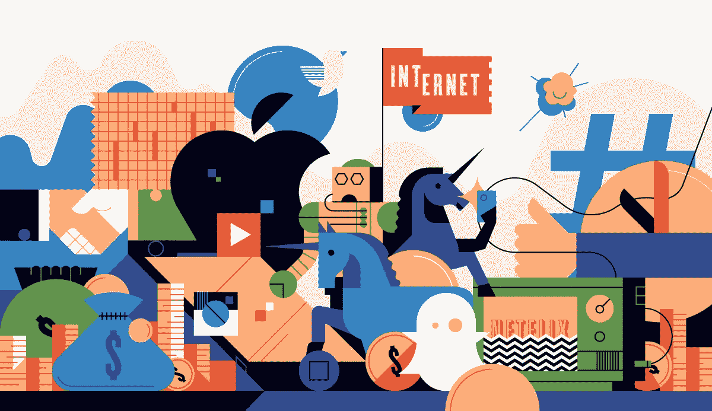

# 为什么风险投资的未来在于“网络即服务”,以及如何通过银行账户投资下一个优步

> 原文：<https://medium.com/hackernoon/why-the-future-of-venture-capital-is-in-network-as-a-service-and-how-you-could-invest-in-the-next-bdd44746e83a>

# 风险资本走过了一条通往成功的崎岖之路

人们普遍认为，它的发展与电影业是一致的。最初是个人投资制作电影，没有其他形式的帮助或专业知识，后来发展成制作公司，提供制作电影所需的所有专业知识。增值生产公司可以为你提供生产产品所需的投资，同时还可以给你专业知识，让你雇佣合适的人，使用合适的技术，营销渠道以及这之间的一切。

从那以后，它已经发展成更分散的东西。举几个例子，YouTube、网飞和脸书已经拓展了视频市场的典型路线。创作者的平台已经进化，协作是用来统治的工具。多样性是打开锁的钥匙，消费是瞬间发生的，这使得病毒式传播无需花费。

# 风险投资也是如此

从最早的投资者，到今天像 A16Z 这样的增值投资者，再到明天的创新者，这个新世界的领导者将更像 YouTube，而不是今天的投资基金。

现实情况是，投资基金缺乏必要的工具来鼓励合作伙伴的参与。互联网使合作达到了前所未有的规模，但这从未扩散到消费者的选择中。大多数人都有退休储蓄——几乎没有人知道这些资金用于投资。

难道我们不应该为了经济利益而改变自己的行为吗？如果我们投资于一家公司——即使是间接投资——难道我们不应该有办法帮助他们成长，从而使我们的财务未来受益吗？

## 下一波风险投资基金的力量将是来自专家网络的价值和专业知识，这些专家也是基金的合伙人。他们的超能力将是组织成千上万的用户来帮助整个投资组合的增长

# **基于代币的基金是风险投资的未来，因为它们对投资者的效用超过了现有的基金。它们在二级市场需要时提供流动性，可以自由设定投资价值**

## **未来是人群**

人们在运动中走到一起，向他们周围的世界传递美好。权力的分散承诺了一个合作伙伴的联合网络，这个网络能够比你一个人取得更多的成就。

# **传统模式取决于个人**

时间 x 努力 x 关系=他们能够追求的机会**大众支持的投资成倍增加等式的每一部分，带来更好的结果、机会&更高的利润**

# **区块链技术将允许部分代币支付给参与的个人**

在您的社交媒体个人资料上分享消息、发送电子邮件或下载应用程序可以支付 0.000 倍代币。基金中的数千名合作伙伴为分享营销信息做出了贡献。

# 随着基金价值的增加，代币的价格也在上涨，最早的参与者得到的回报最多

## **多元化——拥有来自各行各业的投资者——每个创始人都可以接触到一个巨大的知识平台**

## 取代小团队发现公司和寻找交易的是，整个网络可以推荐公司——激励发现

个人将会因为导致投资的推荐而获得可观的回报，获得使他们拥有更高%所有权的代币。

## **不再仅仅从投资基金的合伙人和员工那里获得专业知识，而是有一大群人可以帮助解决任何问题——分布式智能**

## **你不再依赖传统营销，而是拥有一群随时准备在众多市场上同时推动口碑增长的支持者——病毒式推荐**

想象一下，10，000 个人聚集在他们当地的超市，要求他们购买由他们投资的公司生产的特定产品。

# 这种模式是如何运作的

利率太可怕了。这意味着你在银行里的钱没有为你工作。你的账户会像标准的活期账户一样运作，使你能够每天消费。你的账户以及成千上万其他账户上累积的利息将被获取并用于投资全球各地的初创公司。您将获得与您每月账户中存储的金额相当的硬币奖励。这意味着当你的钱存在无政府账户时，没有任何风险。唯一投入的资本是所有账户中的钱的利息。将会有购买更多硬币的机制——以及更高的基金所有权——但这不是参与的必要条件。

同时，Anarch 分析你所有的财务交易，无论是每月的经常性支出还是消费者购买，将它们与平台上的其他人进行汇总，并告诉你你可以节省多少。最终，Anarch 将代表你免费协商降低这些成本，而无需你做任何事情。只需要有一个账户。

# 例如

10 个人的账户里有 1000 美元。每个人每个月都会收到相同份额的硬币，因为他们的账户上有相同数量的钱——这使他们有权获得投资基金未来利润的相同份额的所有权。

可选地，9 个人在他们的账户中有/$ 1000，而一个人有/$ 9000。拥有 9，000 美元的人将得到一半的硬币，而另外 9 个人将得到一半的硬币。

如果投资基金有一个出口，即一家公司被出售或收购，你将有权获得与你在基金中拥有的硬币的%相当的利润。如果你拥有 1%的硬币，而基金中的一家公司以 1 亿美元的价格被出售，你将有权获得这些利润中基金份额的 1%。如果它拥有 10% = 1000 万美元，你将获得 100 万美元

整整一代储户都熟悉溢价债券的概念，这种债券采用 than 模型，并有可能通过持有未来革命性公司的股票，给个人带来无限的上升空间。

# 但事实远不止如此，因为你有能力影响投资的结果

互联网使合作达到了前所未有的规模。该基金是世界上第一个允许投资者为了基金的共同利益集体行动的基金，这些行动直接影响他们未来可以看到的财务回报。该基金让每个人降低投资组合中每个初创公司的客户获取成本，让最具创新性和革命性的公司有理由选择 Anarch 作为他们的投资者。

## 这是这个新系统的承诺

# 已经有 8000 人加入了等候名单

 [## 无政府银行

### Anarch 给你在赚钱的同时改变世界的力量。利率很可怕；我们的模型奖励你…

mailchi.mp](https://mailchi.mp/9f92f5e60c64/anarch-bank)