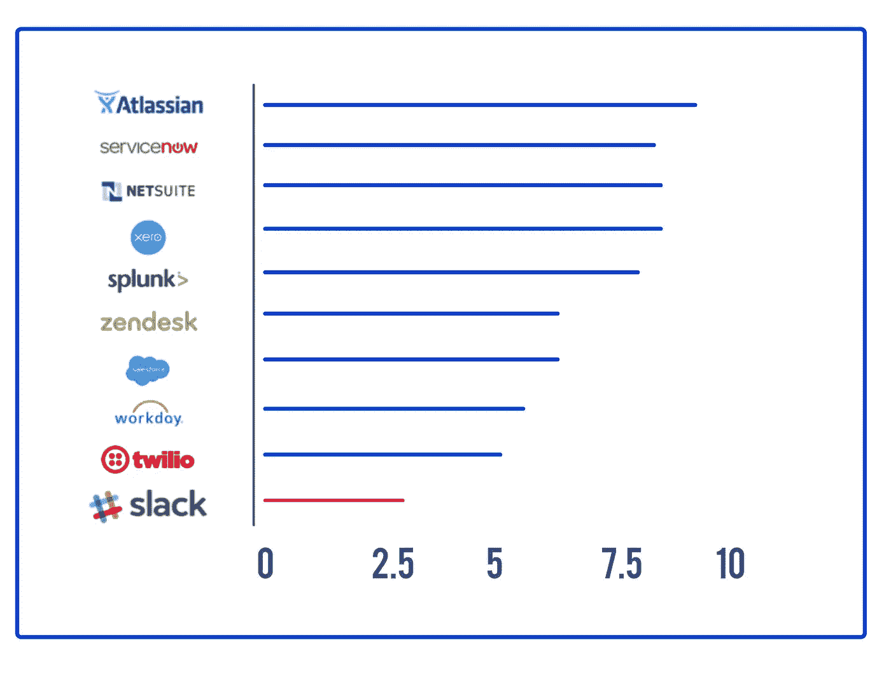
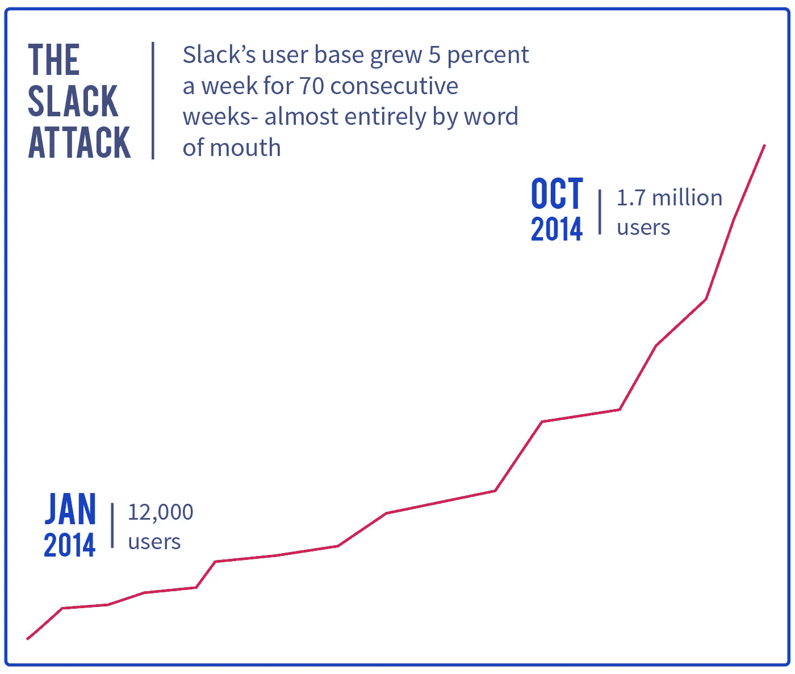
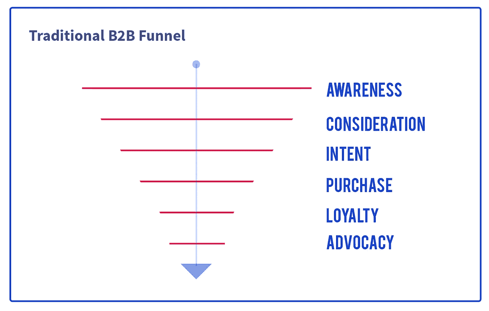
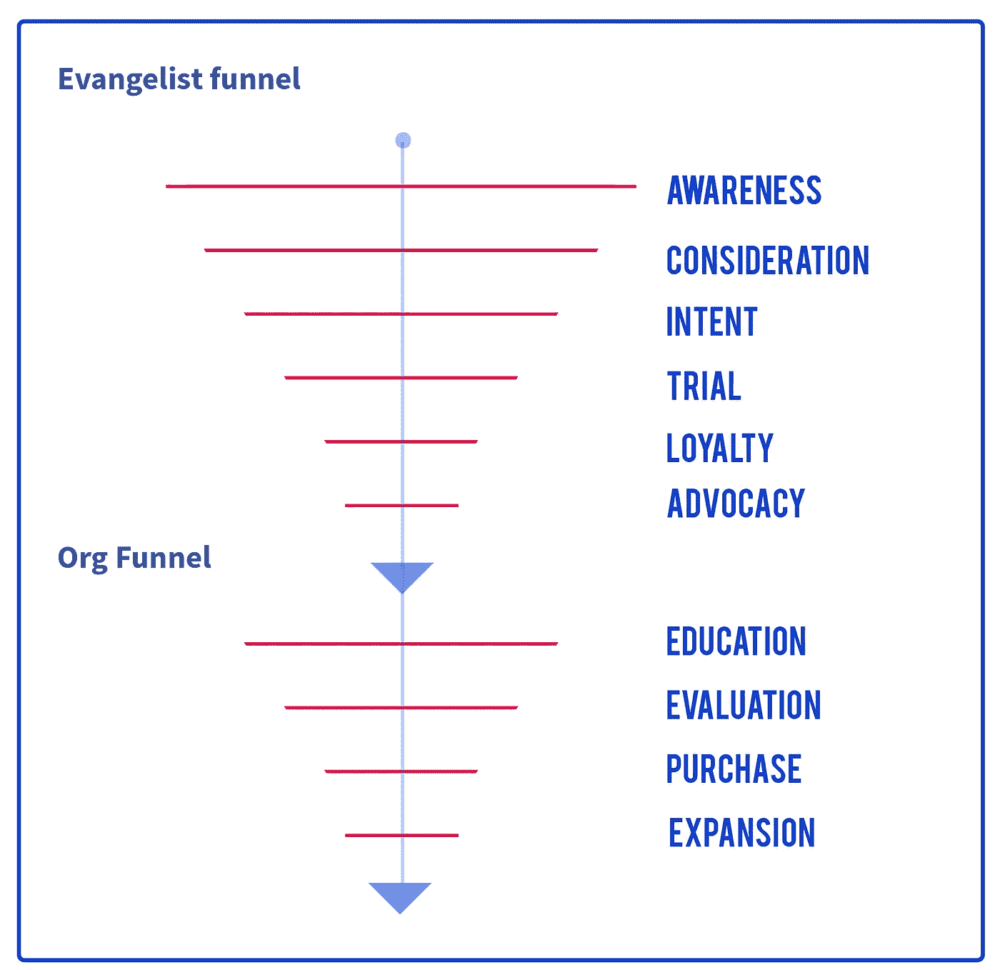

# 为什么下一个大型企业软件公司看起来一点也不像 Salesforce。

> 原文：<https://medium.com/hackernoon/why-the-next-big-enterprise-software-company-will-look-nothing-like-salesforce-872e306c144>

Slack 刚刚成为商业软件历史上年化收入达到 1 亿美元最快的公司，在不到 2.5 年的时间里完成了这一壮举。

Number of years taken to reach $100M in ARR

Slack 是独一无二的，因为它几乎模仿了脸书病毒式增长的方式，首先是在大学中，然后是在所有地方。懈怠也像病毒一样蔓延，首先是在一家公司的不同部门之间，或者当一名员工跳槽，甚至有人只是和他的同事聊天。

User-growth graph is similar to that of a consumer product!

这让我想到这是如何广泛地凸显了企业软件业务的一个全新趋势:

1.  B2B 产品需要提供接近当今最佳消费产品的最终用户体验
2.  在这种情况下，最佳分销战略也模仿消费产品的分销战略，采用由最终用户自己推动，而不是我们通常在企业销售中看到的传统的自上而下的模式。

虽然传统的 B2B 软件产品通常有丑陋的用户界面、臃肿的功能集和似乎直接来自[公司废话生成器](http://www.atrixnet.com/bs-generator.html)的副本，但我们今天看到的一些较新的商业软件实际上与任何消费级产品没有什么区别。

**展品一:** [**缓冲**](https://medium.com/u/245d5483fb27?source=post_page-----872e306c144--------------------------------)

我是一个很长时间的缓冲用户，用它作为我的个人账户(我在这里发推文；主要是科技、足球和初创公司，有大约 1.1 万名粉丝。因此，当我们需要采用一种产品来满足我们的业务需求时[热线](https://medium.com/u/278c29f62e5c?source=post_page-----872e306c144--------------------------------)，我确保在这里也采用 Buffer，即使有大量更便宜的替代产品。

为什么我坚持缓冲？

1.  它有一个干净和用户友好的界面，让我非常高兴，我只是不能让自己使用市场上大量廉价替代品的混乱界面。

[Buffer](https://medium.com/u/245d5483fb27?source=post_page-----872e306c144--------------------------------) 是拥有消费级体验的商务产品的最佳范例之一。他们体贴的用户界面和令人愉快的拷贝比你通常看到的大多数商业软件差不了多少。

2.它有一个非常强大的品牌，我热爱并信任它。我虔诚地关注着 Buffer 博客,并对 Buffer 公司怀有极大的敬意。

为社交媒体建立一个日程安排工具并不完全是火箭科学，这就是为什么今天市场上有上百个这样的工具。但他们中有多少人在 ARR a la Buffer 赚了 1000 万美元以上！

这突出了一个关键趋势:在过去，像 Oracle 这样的商业软件巨头更多的是一个隐藏的实体，被 IT 部门购买，然后被相关团队采用；今天，这个循环已经完全颠倒了。

您的产品在被业务购买者购买之前，必须首先被相关团队采用。虽然以前只有“产品”才是真正重要并影响用户生活的东西，但今天用户的第一次体验往往是你的品牌，而不是你的软件*。*

在早期的模式中，购买通常会导致采用，而今天，是采用推动了业务购买。

*Buffer 建立了一个强大的品牌，让用户认同，并以消费产品的方式开发商业软件，这是一条护城河，仅靠技术无法轻易跨越。*

# **传统的 B2B 漏斗不再适用。**

公司通常定义一个[营销](https://hackernoon.com/tagged/marketing)漏斗，然后根据漏斗的阶段调整他们的计划和活动，从而带来收入。它始于意识和一般教育，接着是考虑，最终导致购买和忠诚活动。

Traditional B2B funnel

而早期只有 b2b 营销人员的组织渠道；过去，销售代表会向大高管或 IT 部门推销某项产品，促使企业采用某个特定的软件，而现在，实际上有两种不同的渠道:

在你到达组织漏斗之前，你需要首先穿过一个全新的漏斗。我称这个漏斗为福音漏斗。

在更广泛的组织购买你的软件之前，你需要说服和转化早期采用者。这个人是你需要的内部布道者，他在组织内部支持你的软件事业。让这个人相信你的解决方案是最好的，和让一个组织购买是完全不同的挑战。

New funnel in B2B purchases

第一个漏斗适用于你的内部冠军，而第二个漏斗适用于整个组织——传统的 B2B 漏斗。

你需要通过跨越第一个漏斗来创建一个内部倡导者，在这个倡导者在团队和组织的其他人之前赞助你之前，只有到那时，真正的销售和金钱才会进来。

作为软件客户的内部企业 IT 部门的消失意味着试图向企业销售软件——模仿 Oracle 在数据库领域的巨大成功——不再是一种可行的策略。相反，技术必须被塑造成一个“解决方案”,与独特的业务部门客户(最终用户)相关并吸引他们，最终用户可能是公司在业务中的传播者。

布道者漏斗看起来很像消费者(B2C)营销。这就是消费级产品体验和伟大品牌变得至关重要的地方。

**展品 B:** [**对讲机**](https://medium.com/u/7ca8972daf76?source=post_page-----872e306c144--------------------------------)

*我们是如何在我之前担任产品经理的* [*初创公司*](https://hackernoon.com/tagged/startup) *采用对讲机的。*

我不是告诉过你运球根本不能反映设计社区吗？!'

事实证明，连续几周，在每次团队午餐时，我、设计师和产品团队的其他人都会情不自禁地讨论和辩论每个连续的内部博客帖子的含义。

这里有一群人，他们代表着和我们完全一样的东西，信仰着同样的东西。他们和我们一样看世界，说我们的语言。

他们基本上是我们渴望有一天成为的产品人。

我们是一群 20 多岁的年轻人，在孟买郊区为全球近 1600 万用户开发一款全球产品。这里有一群人，就像我们一样，正在向全世界教授产品管理是怎么一回事，就在都柏林之外，在爱尔兰的市中心。

天哪，我们被迷住了！

我们甚至不知道 Intercom 的人到底是干什么的！

我们后来查看了他们的网站，发现他们有一个信息产品可以帮助我们与用户交流。*一个月后，我们将对讲机集成到了我们的移动应用程序中。*

决定用哪种产品的会议可能是我们开过的最短的会议。对讲机是显而易见的方法。任何人心中都没有疑问。其他选择都没有机会。

在我们有机会看到他们的产品之前，我们就已经爱上了这个品牌！

**忘记产品-市场契合度，对讲机有问题-市场契合度。他们有这个伟大的故事，相信他们得到了我们，他们得到了我们的问题。我们知道，如果他们解决了问题，他们可以在以后修复产品。**

> “博客实际上帮助我们的最好方式实际上是作为一项长期的品牌建设活动。它对我们如此有价值的原因是，它建立了这个品牌，并在人们的心目中不可磨灭地标记和树立了你的品牌。
> 
> *这种流量的结果是，随着时间的推移，人们不仅会选择这些内容，还会回来购买更多高质量的内容，因此他们开始认可、了解并信任这个品牌。所以早期的很多人，他们只知道 Intercom 是一个博客。博客是他们第一次体验这个品牌的地方。后来，当他们开始得到关于这个产品到底是什么或者谁写这个博客的一点提示时，后来当他们遇到我们的产品解决的问题时，他们就会想到对讲机的名称和想法。"*
> 
> *— Eoghan McCabe，首席执行官，对讲机*

**品牌驱动利润**

消费者研究强调了品牌在消费者市场中的重要性和力量，但我们总是假设，尽管是错误的，同样的影响并不适用于商业品牌。

根据《哈佛商业评论》最近的一份报告，商业决策者考虑消费者知道并感到有联系的 B2B 品牌的可能性增加了 20%。除了增加购买的可能性，高消费者认知度和更强大的品牌也与更好的财务表现相关联:当 10 个最知名的 B2B 品牌与 10 个最不知名的品牌进行比较时，消费者认知度较高的品牌收入增长了 41%。

虽然我们一直认为 B2B 购买者是理性的决策者，不会受品牌等情感因素的影响，但现在很明显，这可能不再适用。

随着多年来构建软件的成本大幅下降，典型的 B2B 购买者被众多的选择、功能、优势、数据和指标所淹没——任何购买者都可以理性评估的更多信息——导致他们使用启发式方法来简化决策。

人类将会是人类。。。

麦肯锡(Mckinsey)最近的一项研究调查了全球 1000 多名高管，发现企业买家的购买决策往往没有他们想象的那么受价值驱动。事实上，调查发现，B2B 采购决策者认为品牌是供应商价值主张的核心要素，而不是边缘要素。品牌在购买决策中的份额高达 21%(而销售团队的努力份额为 15%)，我怀疑品牌的这一份额只会上升。

当调查显示，80%的决定甚至在企业买家联系你的销售代表之前就已经做出时，强大品牌的重要性就得到加强。当这种情况发生时，即使是潜意识的，购买过程的大部分最终都是为了证明最初的情感决定是正确的。

*人类不是理性的生物。相反，我们是理性的生物。*

通过在你的潜在客户心中建立正确的品牌联想，你甚至可以在销售开始之前帮助“完成交易”。一个伟大的品牌还会给销售者带来典型消费品牌所具有的所有优势:

*   更愿意尝试新产品
*   缩短完成产品销售所需的时间
*   产品或服务被购买的可能性更大
*   愿意支付价格溢价
*   尝试竞争产品的诱因减少

这里的教训很简单:你现在正在做消费者营销。你需要瞄准的传播者也是消费者。

**让你的 B2B 品牌发挥作用**

## 如今，SaaS 的工具和产品比以往任何时候都多。最终，你的品牌是你的公司和你的产品在客户心目中的区分。为了在当今拥挤的市场中竞争，品牌是你需要关注的。— [Hiten Shah](https://medium.com/u/479830773d90?source=post_page-----872e306c144--------------------------------) ，Kissmetrics 首席执行官

有一个漂亮的标志，出现在流行的行业活动中，并确保你有抵押品分发。这就是多年来品牌对 B2B 的基本意义。这基本上相当于带刀枪战。

不幸的是，B2B 营销人员不擅长情绪化的、有抱负的信息传递，或者根本不明白展示一个强大品牌的重要性。在匆忙制作展示其产品和服务价值的营销信息时，许多公司默认使用他们在模拟时代所依赖的大量文本、充满术语、注重规格的内容。

即使在较大的 B2B 公司，品牌预算与需求挖掘预算相比也相形见绌，因此品牌从来没有得到多少关注。

好吧，如果你使用的是经典的 B2B 剧本，它的战术没有差异化，现在看起来被夸大了——你基本上和你的竞争对手走在同一条路上:走向无关紧要。

> 当你为自己挖掘出一部分人的大脑时，你就建立了一个品牌。从长远来看，这意味着你的品牌传播开来。因为你在人们的头脑中有空间，人们在想你，这意味着他们会谈论你，告诉你的朋友。大多数 B2B 营销人员必须处理成千上万的小型企业以及企业客户。虽然销售团队不会无限扩大，但建立品牌会。— [Hiten Shah](https://medium.com/u/479830773d90?source=post_page-----872e306c144--------------------------------) ，Kissmetrics 首席执行官

这也意味着，着眼长远、打造强势品牌的公司正获得不成比例的收益。

这是一项困难的工作。赢得关注、赢得声誉的工作，主要是讲述一个故事，让你的产品脱离商品范畴，进入一个由联系、意义和可能性定义的空间。这种着眼于长期的工作很容易成为最好的竞争优势之一，因为几乎没有人真正做到这一点。

一些最好的企业知道这一点。

Buffer 明白了。对讲机明白了。大本营明白了。

我对 Basecamp 的第一次了解是通过由 Basecamp 创始人 [DHH](https://medium.com/u/54bcbf647830?source=post_page-----872e306c144--------------------------------) 和[杰森弗里德](https://medium.com/u/c030228809f2?source=post_page-----872e306c144--------------------------------)写的开创性的书《返工》。实际产品实际上是我在与公司和品牌的一系列互动中经历的最后一件事。

也许 Slack 比当今任何其他企业软件公司都做得更好。如果你还没有在发布前阅读斯图尔特·巴特菲尔德给他的团队的内部备忘录，你应该放下其他事情，现在就阅读。

“软件公司应该直接面向业务线人员，解决他们的情感痛点，而不是像过去那样向 CIO 看门人营销。

不幸的是，你会去一些 IT 公司的网站，不知道他们在做什么。你会浏览所有这些页面，最后你会看到，哦，这只是一个软件解决方案，或者非常逐字逐句。然后，你会看到许多其他品牌，如耐克，其雄心勃勃的信息*就这样做*将产品与体验联系起来。今天的 B2B 营销人员开始从这本书里拿出一页。“— Sameer Dholakia，SendGrid 首席执行官。

> 旧的营销是打断人们，告诉他们你的产品。寻找新的聪明的方法来打断别人不再管用了。营销的未来是领导力。——塞思·戈丁。

**附件 C:中型**

当我几年前发现 Medium 的时候，我主要是用它来发现和阅读业内一些最聪明的人的内容。后来，当我开始发表自己的想法和观点时，结果让我大吃一惊。我写的东西被阅读了 100000 多次，而我几乎没有分发。我在 Medium 的第一年就接触了比我之前所有年份加起来还多的志同道合的人。然后，当开始在这里发布我们自己的内容的时候，在我的脑海中毫无疑问我们应该去哪里。

**恢复萧条。。。**

Slack 没有任何销售人员。这在企业公司中几乎是闻所未闻的。其 97%的新客户都是推荐人。人们听说 Slack 有多棒——从办公室里有它的朋友那里，或者从上一份工作中使用它的同事那里，或者从他们在 Twitter 上关注的人那里——在他们的团队里尝试免费版本，然后被它深深吸引，企业 it 购买者不得不购买它。

Slack 用户对品牌产生情感依恋绝非偶然。Slack 一直都有一种风格和个性，这让它立刻从其他企业软件中脱颖而出。

从一开始，巴特菲尔德和他的联合创始人就努力确保，*除了有用，* Slack，这个产品和公司，将是有趣的，有思想的，人性化的。当你打开应用程序时，它会用一条欢迎信息来迎接你，比如“多么美好的一天！在如此美好的一天，有什么不能完成的？”或者“你今天看起来不错。”

事实上，巴特菲尔德自己着手创造了数百条这样的信息。当首席执行官自己如此强调一个强大的品牌和个性时，对公司其他人来说，这一要求是非常明确的。

> “任何与 Slack 互动的人都会非常、非常、非常迅速地认为 Slack 是他们的朋友。这太奇怪了。任何商业软件都不会出现这种情况。”—哈珀·里德首席执行官，谦虚。

> 品牌是客户对贵公司的每一次体验的总和，一个强大的品牌总是能产生长期的增长和收入。坚持不懈地改善客户与贵公司的每一次互动非常重要。
> 
> 营销通常是潜在客户与你的公司的第一次互动，你需要意识到你正在提供一个很好的体验。我们想利用最好的 B2C 营销。
> 
> 我经常认为潜在客户创造是短期的潜在客户创造，而品牌是长期的潜在客户创造。保持对长期前景的关注可以让你建立品牌资产——一个强大的差异化优势和竞争优势——以及口碑推荐的动力。
> 
> -斯莱克·CMO·比尔·马卡蒂斯。

**为什么这很重要？**

到 2020 年，千禧一代将拥有全球组织中 80%的购买力(相当于超过 1 万亿美元的购买力)。我们已经习惯于期待一种超越工作和娱乐的消费级体验。

这一点尤其重要，因为我们的工作和私人生活不再分离，这意味着消费行业的趋势正在向商业领域转移。我们对 B2B 产品的期望现在受到最佳 B2C 客户体验的强烈影响。

## “当你不在工作时，工作会渗入你的个人生活；因此，现在[潜在客户]设定了他们在 B2C 营销中与 B2B 营销中相同的期望。”Forrester Research 副总裁 Sheryl Pattek。

世界各地的公司都在接受扁平化的组织，这意味着不再有一个你可以联系来销售你的软件的 IT 部门主管。到 2025 年，solopreneur 和 SMB 市场将超过企业市场，在企业市场中，决策将由小型扁平团队做出，每个公司都需要一名宣传员来销售您的产品并推动采用。

给 B2B 公司的教训很清楚:

拥抱消费化。建立一个可识别的品牌。你在销售产品。很好，但你有什么故事？你到底代表什么？

虽然传统的 B2B 公司认为，一个优秀的产品= $$$，今天的产品本身已经不够了。*消费品公司一直都知道这一点:产品只是整个客户体验的一部分。*

您的客户体验涵盖了用户在与您的公司或品牌互动的每一点上的全部体验，无论是通过博客、播客、您的网站还是广告。专注于提升客户体验，而不仅仅是功能集。

*消费者市场已经认识到，获胜的并不是最好的产品。是能引起用户共鸣的产品。B2B 公司应该认识到，与用户产生共鸣的永远不是代码，而是故事。是的，专注于你的产品，但不要以分销和营销失败为代价。*

企业中的这一趋势不仅为最终用户和投资者带来了巨大的好处，也给 Saas 从业者带来了不容忽视的巨大影响。

这也是为什么今天消费产品公司更容易进入企业软件业务的原因。他们创造出色的端到端体验的核心优势在不断发展的 B2B 市场中表现出色。

顺便说一下，脸书也刚刚进入商业软件，我喜欢使用 Workplace。我们在 [Freshdesk](https://medium.com/u/bd06c0f0eb7b?source=post_page-----872e306c144--------------------------------) 采用了脸书的 [Workplace，只是在](https://workplace.fb.com/) [Shankar Ganesh](https://medium.com/u/12515e5f9dc5?source=post_page-----872e306c144--------------------------------) 在内部宣传并推动采用之后。由于我们都已经在脸书，我们从一开始就在工作场所如鱼得水。太棒了。

正如有人正确地说的那样，在未来，所有的公司都将是科技公司，不管他们现在是否知道。

同样，所有公司本质上都是消费品公司，不管它们现在是否意识到了这一点。

# 你认为其他人会从这篇文章中受益吗？点击心脏，帮助他们找到它❤

> [黑客中午](http://bit.ly/Hackernoon)是黑客如何开始他们的下午。我们是 [@AMI](http://bit.ly/atAMIatAMI) 家庭的一员。我们现在[接受投稿](http://bit.ly/hackernoonsubmission)并乐意[讨论广告&赞助](mailto:partners@amipublications.com)机会。
> 
> 如果你喜欢这个故事，我们推荐你阅读我们的[最新科技故事](http://bit.ly/hackernoonlatestt)和[趋势科技故事](https://hackernoon.com/trending)。直到下一次，不要把世界的现实想当然！

