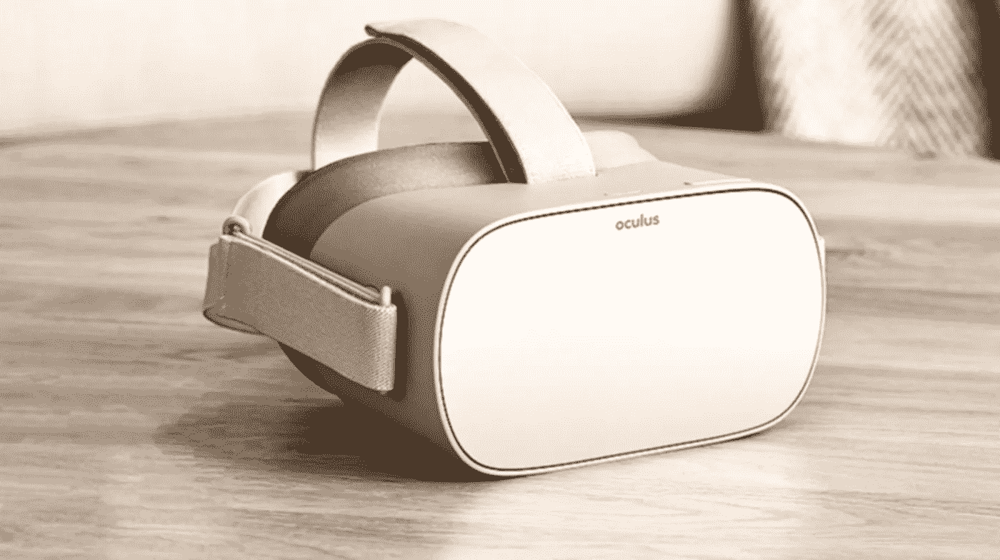

# 为什么 Oculus Go 如此重要

> 原文：<https://medium.com/hackernoon/why-the-oculus-go-matters-2dbae1297043>

A new standalone VR device.

今天，Oculus Go 在 Oculus Connect 4 上亮相。廉价耳机的计划之前就已经说过了，这没什么大不了的。

*Oculus Go* 想成为没有智能手机的 *Gear VR* 。

我当时的第一反应是有点失望，交互在虚拟现实中真的很重要，然而另一个类似 Gear VR 的设备并没有那么令人兴奋。谷歌的内外跟踪独立耳机计划是一件大事，然后是微软的混合现实耳机，LG 的 Lighthouse 许可证，以及许多令人兴奋的消息。

Quick poll during the entry level hmd reveal back then. Missed the word “list” in the question.

样本量非常小，但你明白了，VR 爱好者和开发者喜欢 6dof 跟踪。(意思是它除了可以跟踪你头部的旋转，还可以跟踪你的位置)

Oculus Go 没有做到这一点，发烧友对此并不满意，我也不满意。我的观点改变了，现在我对此非常兴奋，让我向你介绍一下我的想法。

它与 Gear VR 游戏兼容，支持眼镜、某种形式的集成音频和菲涅耳透镜。我们没有全部细节，但可以推断。

## 价格的含义

与目前的 *Gear VR* +控制器(129 美元)相比，该套件的价格为 199 美元，这使得集成计算机的价格为 70 美元，而三星 Galaxy S8 的价格为 600 美元或更高。不要误会，S8 是一款非常令人印象深刻的设备，但它显然比 VR 需要的功能和组件更多。

70 美元是一部手机击败 *Oculus Go* 的价值主张所需的价格。

*Daydream View* 起价 49 美元，但可搭配难以捉摸的 *Pixel* 手机和精选的几款手机。仅手机一项就要 550 多美元，而且只在某些市场有售。

不管是不是传言，349 美元的独立虚拟现实*白日梦*耳机似乎是一个连贯的价格范围，比 Go 高出约 150 美元。除了谣言，我还没有找到可靠的信息，但如果它们更便宜，我会留下深刻的印象。

Go 的价格很低，便宜这个词并不公平，因为它看起来像是该公司在补贴该设备或减少硬件利润。当然，其他公司可以制造低于 200 美元的设备，但 Oculus 知道良好的虚拟现实体验的最低要求，我希望他们能提供这种设备。

## 世界上大多数人都没有尝试过 VR，甚至没有听说过它

世界上大多数国家没有官方支持，甚至没有发射日期。我甚至没有谈论战区或岛屿，这种*白日梦视图*和*谷歌像素*是罕见的。最容易找到的设备似乎是 *Gear VR* ，甚至比 *Google Cardboard* 还要容易。

由于海关规定，在这些国家访问 VR 可能是不可能的，或者非常昂贵，例如在阿根廷，只有 *Gear VR* 正式推出。*谷歌 Cardboard* 和塑料版的同一概念并不是一个很好的替代品。手机价格相当高，即使这样，这些设备一般也没有陀螺仪。

很难解释一部 600 美元的手机对*谷歌 Cardboard* 来说不够好，或者一部闪亮的新 *iPhone* 对虚拟现实来说不够好。买了 *Moto Z Play* 吗？嗯，不幸的是你需要使用 *Moto Z* 来使用 *Daydream* 。复杂。

你不能指望人们抛弃手机去尝试 VR，也许在不久的将来但不是现在。新兴市场和税收为新技术创造了一个不利的环境。

一台 199 美元的设备，加上税金和加价，最差也要 400~500 美元，这还在可承受范围内。这样的价格有助于将虚拟现实推向消费者。竞争不是高端虚拟现实，而是对新手机或 5 英寸电视屏幕的边际升级。

最便宜的 *Macbook Pro* 15”是 2400 美元，也就是 12 个 *Oculus Go* 耳机。价格低到足以成为普通支出的一部分，不需要说服老板或其他重要的人。不需要承诺结果来证明费用，它可以像“样品拼盘”一样被购买，这就是 VR 的亮点。

使用虚拟现实的营销努力将能够以相同的预算获得 3~4 个以上的设备，对于希望用高质量设备展示作品的虚拟现实电影制作人来说也是如此。

家庭和朋友将能够在社交虚拟现实上一起玩，价格为 398 美元(至少两台设备)。对于许多人来说，它可以改变世界，即使是在访问虚拟现实设备复杂的国家。

我不需要谈论教育，做数学。用 6000 美元为一所学校配备 30 个耳机。

医疗保健也可以受益匪浅，对于一个卧床不起的人来说，199 美元可以是一个不同的世界。

这实际上不是 6 自由度对 3 自由度，而是 3 自由度对 0 自由度。

## 经历

对于一些用户来说，这个设备可能主要是一个网飞私人影院，这是一个非常简单的体验。独立耳机的散热能力的提高是这种情况下的一大优势。Hulu 为 GearVR 做了一个[社交观看体验，这是一个完美的契合。](https://www.hulu.com/labs/huluvr)

180 立体视频在这个价格范围内有很大的机会，它看起来令人难以置信，高端产品更容易证明。

360 视频可能会有很多用途，可能暂时不会在高预算制作中使用(因为它在 4K 以下的分辨率下看起来很模糊)，但可以用 *Gear360* 相机、*理光 Theta* 和其他相机自制视频。我很乐意看到家庭视频以这种形式复兴，360°视频是一种记忆事件的绝佳方式。

Daydream 和 now Gear VR 中的控制器极大地改变了事情，与世界交互不再是一个颈部训练环节，有些体验真的很好用，例如“[保持通话没有人爆炸](https://www.oculus.com/experiences/gear-vr/814885695293688/)”、“[电梯……到月球！](https://www.oculus.com/experiences/gear-vr/1679693852044653/)、 [Ultrawings](https://www.oculus.com/experiences/gear-vr/1341671792523028/) ，还有很多其他的。

它也有《我的世界》。售价 199 美元的虚拟现实版《《我的世界》》本身就很不错。

双 3dof 控制器是我最讨厌的。使用单个控制器，开发者必须处理移动和交互，这限制了许多类型体验的流动。众所周知，这可以通过两个控制器轻松解决。第二个控制器单独出售？我想蓝牙游戏手柄支持是必然的。对于浏览和其他非媒体用途，键盘和鼠标支持是一个必要的附加功能，而且可能已经内置了。

这让我想到:

## 网络虚拟现实

GearVR 现在在许多浏览器中都支持 WebVR，例如 *Carmel* 、 *Samsung Internet* 和 *Chrome* 浏览器。

199 美元的网络虚拟现实体验门票可能会带来变革。

正如我在之前的一篇帖子中谈到的[网络虚拟现实](/@alfredos/the-role-of-webvr-50345d4dc0f3)的作用，这款设备可以满足大多数使用情况，但由于 3dof 耳机和控制器，在内容创作方面受到限制。然而，并不是所有的都失去了。

它可能支持的内容创建类型:

*   异步 VR 通信:头像消息，涂鸦。
*   VR 内容中的亮点:导航数据可视化或架构可视化，并留下语音消息、绘图、导航区域的踪迹等。
*   用预制的片段组合场景。

设备存储可能会充满来自商店的优质应用程序，但总会有一些空间来查看虚拟现实网站，这就像一个 VIP 槽。

WebVR + $199 *Oculus Go* 是你可以获得的最低摩擦的新 VR 体验。如果该设备有摄像头扫描二维码，价格会更低。

现在，让 standalones 变得非常特别的是，它们是为接送和玩耍而设计的。戴上它，你就在虚拟现实中，不用摸索着用手机把它按到位，擦掉指纹，释放内存和通常的智能手机仪式。

如果你的智能手机电池电量不足 50%，你真的会冒险用它做虚拟现实吗？我认为大多数用户不会。单机没有这个问题，只是为了 VR。

## 开发商

世界各地的开发者和用户都急切地等待在虚拟现实开发和体验上投入时间和金钱。我们永远不知道下一个大事件会从哪里发生，这可能是发生的一种方式。WebVR 与休闲体验和单机的“可拾取性”密切相关。

多用户体验将会有更多的生存能力，期望 3 或 4 个人参加一场比赛，甚至更多，这并不荒谬！

更新:卡马克指出，与 *Gear VR* 不同，对他们来说将升级到 *Oculus Go* 会容易得多，因此更快的补丁和新技术可以尽快到达消费者手中。

## 赌博

高端 VR 和入门级 VR 的“不对称”多人是另一种有趣的可能性。智能手机+入门级 VR 多人太。现在这是一个孕育创意的沃土，我说的不仅仅是游戏，datavis 和 archvis 可以从这种方式中受益最多。

虚拟现实体验可以为共享同一空间的高端 PC 和独立虚拟现实提供多用户体验。只需 199 美元，Rift 所有者就可以和朋友一起玩。

*一个 Rift 玩家驾驶着一辆汽车，一个 Go 玩家疯狂地修路和清除障碍，以便司机可以到达一个检查站。*

作为哥斯拉的裂缝玩家和驾驶飞机保卫城市的围棋玩家。

*一名 Rift 玩家组装一条赛道，然后在一场梦幻卡丁车比赛中与其他围棋玩家比赛(卡丁车是一个合适的名字)*

可能性是无限的。

## 结束语

我对混合设备感兴趣(带视频输入的独立设备)这种设备不是一种，但它似乎是朝着正确方向迈出的一步，它不仅仅是一个价格，它有很多东西。可能是 VR 需要的 *Gameboy* 。

Oculus Go 想成为没有智能手机的 Gear VR，这很棒。

*关注我和我在空间计算(AR & VR)和区块链开发方面的冒险。*