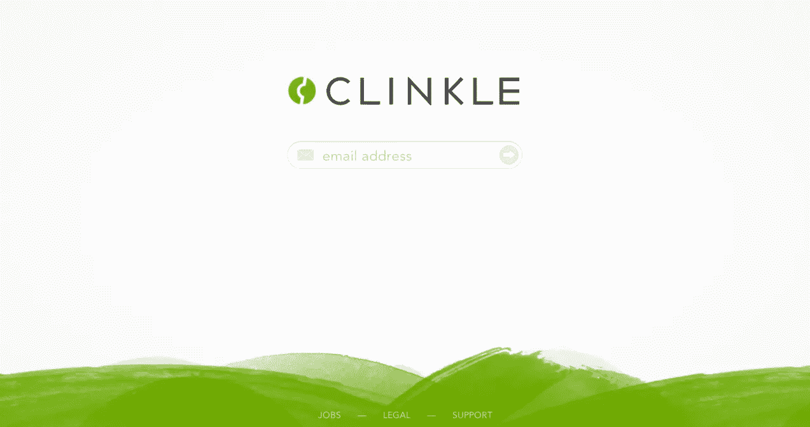
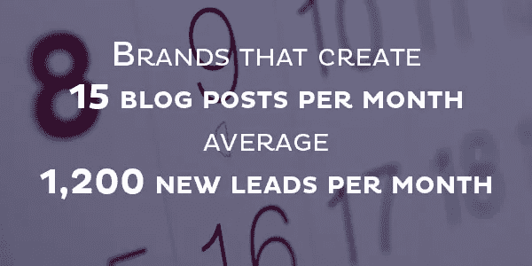
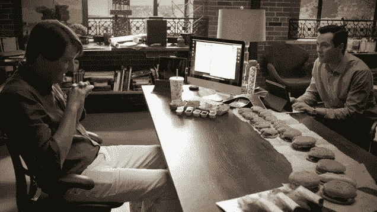
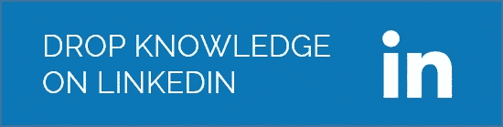
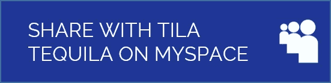

# 为什么没有顾客是没有借口的。

> 原文：<https://medium.com/hackernoon/why-there-s-no-excuse-for-not-having-customers-d7208b0f11c4>

*与疯狂鸡蛋和 KISSmetrics 联合创始人 Hiten Shah 的对话*

Hiten Shah co-founder Crazy Egg and KISSmetrics

我并不是每天都有机会和一个已经筹集了超过 1500 万美元风险资金的人聊天(而且推特粉丝比我多 2845 倍)。

Hiten Shah 是营销大师和连续企业家。他创办了三家成功的创业公司，包括刚毕业的咨询公司、自筹资金的 SaaS 创业公司 Crazy Egg 和风投支持的 KISSmetrics。他自称是专业的问题解决者。他告诉我，就这么简单。

您可以在 [**这里**](https://www.campuskudos.com/post/446) 收听我们的全程对话。无论如何，这是我从我们的谈话中学到的 5 件事。

# **#1。今天没有得到客户是没有合理的借口的。**

今天，Hiten 认为联系人们比以往任何时候都容易。他告诉我，“今天没有理由不让顾客(至少几个)来买某样东西。”

为什么？所有人和所有东西都在线。他经常目睹团队投入时间和精力来美化和构建“完美”的产品，却发现市场不需要它或不想要它。

Image Credit: Clinkle Homepage

我去过那里。我们为乔布斯做了一个 Tinder 应用。结果是，雇主不需要也不想要它。关于那次史诗般的失败的更多信息(我指的是学习经验)，这里有一篇我写的关于它的中型文章: [99 个问题，但一点都不是:为什么我的创业失败](/adventures-in-consumer-technology/99-problems-but-a-bit-aint-one-why-my-startup-failed-9367978a6bf3)。

# **#2。在我拥有产品之前，我会想出分销和营销的方法。**

你如何推销一个根本不存在的东西？疯狂的想法…只是和人们交谈。如果你知道你要为某个市场做点什么，就出去和朋友，朋友的朋友，甚至陌生人聊聊。

每个人都使用互联网。几乎在任何行业，你甚至可以开始写关于你的产品创意的博客。如果你写得非常好，非常及时，你只需要让一些人去阅读它，就会有更多的人去阅读。

在一个随机的国家，你可以是一个“无名小卒”，如果你把一篇写得很好的文章放在那里，你仍然可以得到关注。

Image credit [Business2Commnunit](http://www.business2community.com/blogging/10-stats-awesome-power-corporate-blogging-01074190)y

作为一个具体的例子，请阅读 Mint.com 创始人 Aaron Patzer 如何以 1 . 7 亿美元的价格卖掉他的公司。

# **#3。离开你的@$$去了解你的顾客。**

你如何真正了解一个潜在客户？这就像其他任何事情一样。你必须和他们在一起，和他们说话。

对于 B2B 业务，尽量影子客户或者参加会议。去参加他们的派对。在会议大厅闲逛，与与会者交谈(如果你买不起票，这尤其有用)。

Image Credit: Business Insider

对于 B2C 产品，在策略上有一个不太大的区别。Hiten 建议你需要做两件事之一:

1.  更深入地了解你的客户。
2.  建立一个贫民区版本。你不能总是相信消费者说他们会做什么。所以有时候，你只需要构建一个 janky 版本来亲自查看。

我们自己也在努力听从简单走出去的建议。下面是我们的故事[我们如何通过敢于离开办公桌](/@adamsaven/how-we-got-our-first-5-000-users-by-daring-to-leave-our-desks-293615948a7e)获得第一批 5000 名用户。

# **#4。你仍然需要一个伟大的产品。**

Hiten 承认，当然，你需要一个伟大的产品，因为今天有这么多的选择。然而，你需要先了解并思考如何获得客户。

这有双重目的。当你准备好发布时，你就已经做好了市场营销的准备，而且你会在第一时间制造出合适的产品。毕竟产品是给他们的。现在 Hiten 已经开始制造产品，他遵循一个简单的框架，他说这是任何好的企业都需要的。这很简单。

## 优秀的产品+优秀的分销=优秀的业务

1.  伟大的产品。你需要一个人们喜欢的产品，一些人们会告诉他们朋友的东西。
2.  伟大的发行。否则，什么都不管用，什么都长不出来。

曾经有一段时间，他相信自己可以打造出一款伟大的产品，然后想出营销之道。他今天拒绝这种心态，警告不要“制造产品，然后搞清楚市场。”

# **#5。在筹集资金时，你必须表现出来，而不是说出来。**

所以你想筹钱？要知道，一张漂亮的幻灯片就足够了的日子已经一去不复返了。在接触投资者之前，你需要获得一些吸引力。你必须表现出来，而不是说出来。

Image credit: Gawker

投资者希望产品和团队在投资前已经消除了风险。最终，随着越来越多的初创公司寻求融资，投资者会变得更加挑剔(而且开发一个原型的成本也越来越低)。哦，如果你听到一个故事，说有人仅凭一张宣传板和一个愿景就能筹集到资金，那很可能是因为他们以前已经这样做过了，这意味着他们有成功的记录。

你也可以学会用你实际投球的方式来展示而不是讲述。以下是 Brad Feld 的一些建议，他是 Foundry Group 和 Techstars 的投资者和联合创始人，在[秀《不要说——尤其是在视频推销中】。](http://www.feld.com/archives/2010/02/show-dont-tell-especially-in-video-pitches.html)

总的来说，这是我和 Hiten 聊天的最大收获:

> “你最大的竞争优势是你比任何人都更了解你的客户。”

如果这篇文章有帮助，请推荐或分享:)

***或……***

## 当然，看看 CampusKudos.com 的！帮助学生和 20 多岁的人通过认识专业人士(比如你)找到职业幸福！