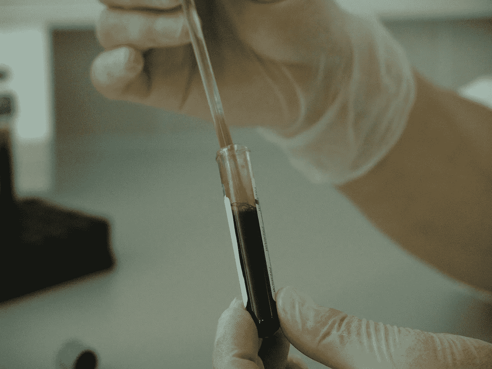
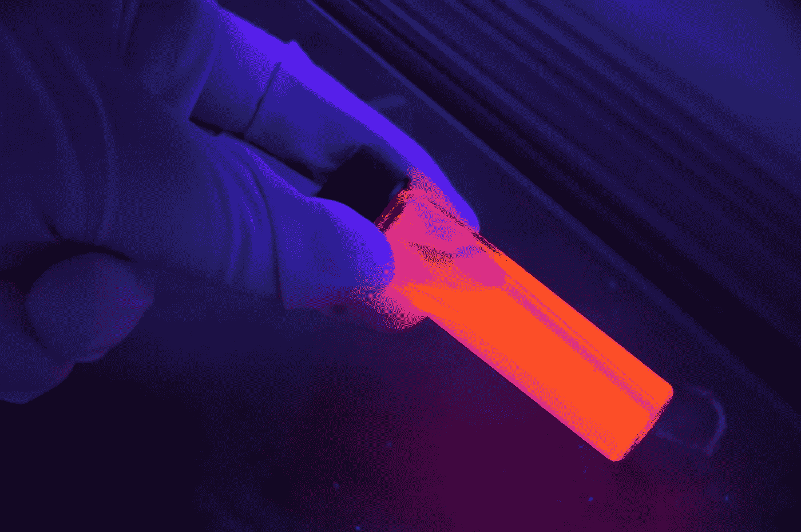

# 为什么这种新发现的血癌疗法处于生物技术的前沿

> 原文：<https://medium.com/hackernoon/why-this-newly-discovered-blood-cancer-treatment-is-at-the-cutting-edge-of-biotechnology-8fa98d4b3b70>

在未来的几十年里，生物技术部门一定会成为最赚钱和最进步的行业之一。一个不受欢迎的总统政府的波动性，加上与一个亚洲独裁政权的口头敌对情绪的释放，这实际上可以发动第三次世界大战，使全球市场的不确定性处于高位。

然而，生物技术产业继续吸引投资。虽然太空旅游和加密货币等风险较高的科技企业警告越保守的金融家要守住他们的宝贵财富，但生物技术的情况正好相反——技术或产品越激进、越具革命性，就越受欢迎。

提高每天与恶劣环境、疾病、衰老和死亡作斗争的人们的健康和生活方式的使命和愿景是推动生物技术超越其他产业的原因。正如 Bio 所描述的那样，技术创新继续利用自然元素，如人类和动物细胞、基因组、土壤、风和水，来配制药物和程序，以抑制使人虚弱或致命的疾病。

农民们已经使用生物技术来增加他们农作物的产量，并使他们收获的食物不含毒素和其他有害的过敏原。医学研究中心利用它来阻止疾病的爆发，并与癌症和细胞退化等致命疾病作斗争。以前被认为是“无法治疗”的疾病，现在可以通过 250 多种公众可以获得的生物技术产品和服务来治疗。

随着越来越多的玩家加入，这个市场还在继续增长。据 [Statista](https://www.statista.com/topics/1634/biotechnology-industry/) 报道，大约 670 家生物技术公司在美国蓬勃发展，市值 8900 亿美元，年收入超过 1300 亿美元。

[市场内幕](http://markets.businessinsider.com/news/stocks/Biotech-Sector-Looking-to-Outperform-in-2017-1002370082)进一步预测，生物技术将在 2017 年超过几乎所有其他行业，这是由政府和公众对似乎无法解决的健康问题的日益担忧推动的，比如继续对经济和公共健康造成严重影响的医疗状况。例如心血管疾病，包括中风和心脏病。

The biotech industry continues to grow.

所有这些都将生物技术公司**Hemogenyx LLC(LON:HEMO)**针对白血病和其他严重血液疾病的突破性产品置于生物技术领域的前沿。对于想要拯救数百万人生命的投资者来说，这是一部必看的电影。

时机及其独特的销售主张使 [Hemogenyx](https://www.hemogenyx.com/) 进入了投资者、风险资本家和生物技术行业领导者的视线。这家生物技术初创公司旨在彻底改变血液疾病的治疗。在这样做的过程中，它磨练了其大量的资源和医学研究人员和科学家团队，为白血病患者和其他患有其他癌症血液疾病的人提供了突破性的治疗方法。

当癌性白细胞不受限制地增加，并抵抗所有阻力，阻碍血液向身体其他部分的健康分布时，就会发生白血病。患者的免疫系统受到了可怕的打击，因为他们患有各种疾病，如盗汗、恶心、发冷发烧、贫血和持续疲劳。

Hemogenyx 治疗的独特之处在于它的目标是再生患者的血流。首先，它可以通过 CDX 抗体来实现。根据 Hemogenyx 首席执行官兼创始人 Vladislav Sandler 博士的说法，“独特的抗体可以重定向患者的免疫细胞，以消除和攻击同一患者的血液干细胞。这种类型的抗体将有望消除化疗和放疗，并解决这些治疗的非特异性毒性问题。”

对于需要骨髓或血液干细胞移植的患者，第二种治疗方法是使用 Hu-PHEC 或出生后的造血内皮细胞。这些细胞取自患者自身的肝脏或脐带和胎盘。然后，Hemogenyx 可以对它们进行分离、纯化和重新编程，使其成为血液干细胞，并将其移植回患者体内。这一过程的风险很小，因为细胞可以立即与患者相容——毕竟，患者是捐献者。

捐赠的器官和接受它的患者之间的不相容性是骨髓移植失败的原因之一，骨髓移植是白血病患者的常用治疗方法。大约 50%在这一领域进行了成功手术的患者在几周或几个月后报告了衰竭或器官功能障碍。骨髓移植的另一个障碍是首先要找到合适的捐赠者；医院名单上只有 60%的病人有很好的机会获得一个。

Hemogenyx 今年被投资者 Silver Falcon 收购，这给它自己打了一针强心剂。根据[的数字看，](https://www.digitallook.com/news/aim-bulletin/silver-falcon-finally-swoops-for-biotech-hemogenyx-after-long-hunt--2852365.html)这笔“反向收购”达到了 800 万的价值。Silver Falcon 以每股 3.5 便士的价格发行了超过 2.28 亿股股票。Silver Falcon 在去年 10 月 4 日的年度股东大会上将其名称和控制权变更为 Hemogenyx，并于 10 月 5 日开始交易，新代码为 LON:HEMO。

Hemogenyx 可以缓解全球 100 多万白血病患者的痛苦，这是从标准医学反应到手术的 180 度转变。如果你想对它的含义有一个清晰的概念，想象一下病人的血液，曾经虚弱和垂死，突然被恢复活力，几乎是被魔法，给他力量和新的生命。