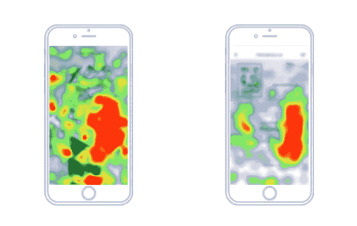

# 为什么传统分析不足以了解您的应用性能

> 原文：<https://medium.com/hackernoon/why-traditional-analytics-is-not-enough-to-understand-your-apps-performance-7b71e63b48a3>

Credits: [Picjumbo](https://picjumbo.com)

移动分析对于了解您的应用程序的性能至关重要。无法获得质量分析将导致无法做出改进。你的应用可能会面临很多竞争，获胜的方法之一是在你面前有定性的移动分析。如今，传统的分析工具根本不够用。

# 传统分析(定量分析)的衰落

这些分析会告诉你你的应用是什么。你会看到显示参与度的图表和数字。你还会看到销售漏斗，并找出你的应用程序中可能会流失的人。

所有传统的分析都会告诉你需要知道什么，以获得关于你的应用程序如何运行的基本洞察力。它会告诉你哪里出了问题，这样你就可以确定某个地方需要修复。

问题是，传统的分析方法只涉及到表面现象。它仍然需要你做大量的工作来找出问题所在，为什么人们没有按照你设计的方式与应用程序进行交互。这可能是一个耗时的过程。

当你在测试和修复你的应用程序时，消费者正在寻找更好的应用程序。当你完成时，他们已经向前看了，这意味着你不能依赖传统分析作为跟踪你的应用性能的唯一来源。

# 定性分析提供了什么？

定性移动分析将向您展示传统分析将向您展示的一切，甚至更多。应用内用户行为分析将帮助您了解更多关于用户参与度的信息。如果用户不喜欢你的应用程序，这可能与你的应用程序的布局或目标受众的浏览习惯有关。

定量分析告诉你在你的应用中发生了什么。定性移动分析将告诉你为什么会发生这种情况。

通过使用[移动应用热图](https://inapptics.com/)，你将看到用户在你应用的每个屏幕上点击的位置。这将让你了解更多关于用户如何浏览应用程序的信息——这种信息将使你更容易提高转化率。如果你看到每个人都在点击某个特定的区域，而这正是你失去他们的时候，你知道在哪里进行修复。如果你在使用传统的分析方法，你会知道你正在失去用户，但是却不知道具体的位置和原因。

现在想象一下，你的应用程序崩溃了，你不知道用户在崩溃前做了什么。传统的分析工具会向你报告崩溃并给出一些细节，但你需要花几个小时来弄清楚发生了什么以及如何重现崩溃。这是定性分析工具(如应用程序中的)可以帮助你的时刻。它为您提供崩溃回放，向您显示崩溃会话中执行的所有步骤。你会看到用户到底做了什么导致应用崩溃。

崩溃往往会导致用户离开你的应用。当你可以重放它们来亲自查看问题时，它将允许你修复它并为你的用户构建一个更好的应用。

# 改进您的应用

最后，你的目标是改进你的应用程序，让它做你承诺的事情。有很多企业会定期发布应用程序。如果你希望你的应用程序被有效地使用，那么你需要使用分析来帮助你不断改进。

传统的分析工具在可用的情况下还不错。定性分析解决方案已经可用，它们可以更容易地了解用户行为和参与度，这将有助于您改进您的应用。

***发现这个帖子有用吗？请点击下面的❤按钮！:)***

跟随 Inapptics: [媒体](/@inapptics) | [推特](https://twitter.com/inapptics) | [脸书](https://www.facebook.com/inapptics/)

最初发表于[blog.inapptics.com](http://blog.inapptics.com/why-traditional-analytics-is-not-enough-to-understand-your-apps-performance/)

**阅读下一篇:** [提高移动商务应用转化率的 5 种有效方法](https://uxplanet.org/5-proven-ways-to-increase-conversion-in-mobile-commerce-apps-38d27da90d72)