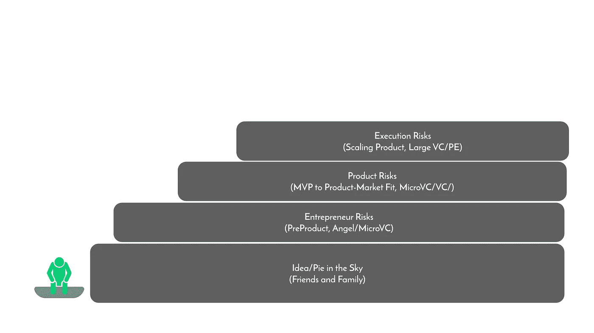
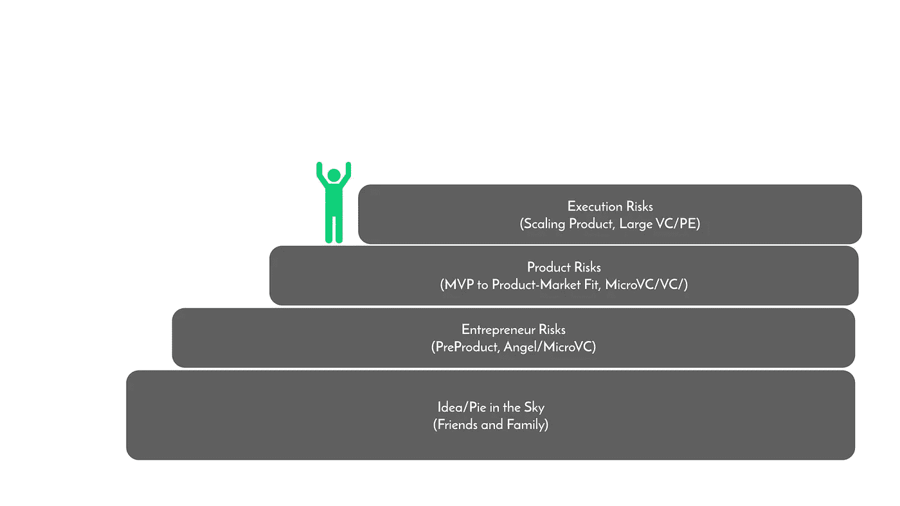
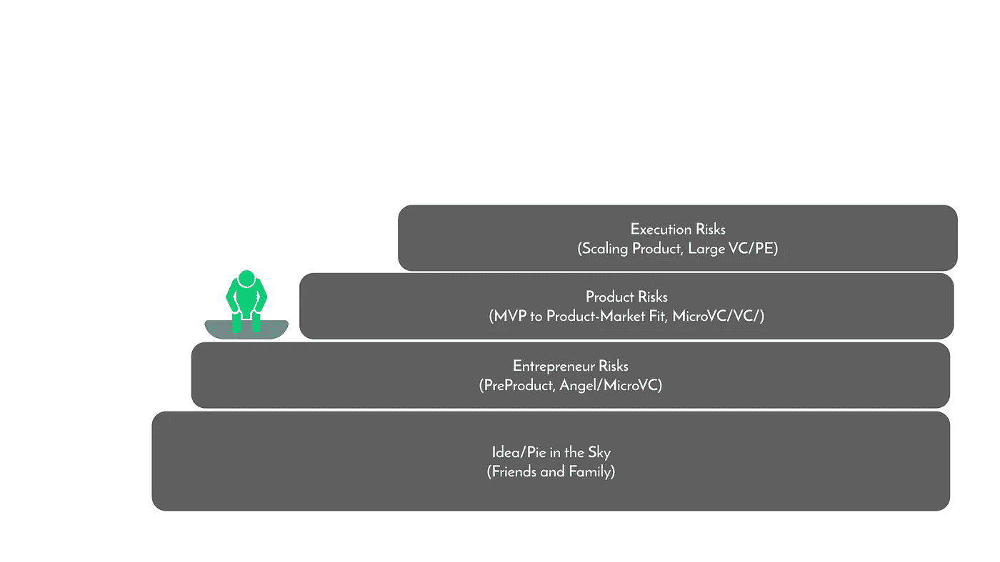
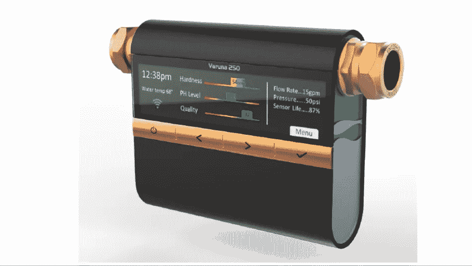

# 为什么 VC 会失败(大部分)硬件公司。

> 原文：<https://medium.com/hackernoon/why-vc-fails-most-hardware-companies-da75eecfdb7e>

在过去的几周和几个月里，我们目睹了许多硬件创业公司的死亡。我们看到一些成功的公司(Fitbit 和 GoPro)和那些正在建造硬件的公司(我正在看着你 [Magic Leap](http://mashable.com/2017/02/15/magic-leap-stop-the-hype-show-the-product/) )需要筹集数十亿美元作为安全网，即使他们坠入我称之为风险楼梯的地方。我们已经读到了[颚骨](https://www.macrumors.com/2017/02/04/jawbone-wearables-pullout-clinical-health/)、[百合无人机](https://www.google.com/url?sa=t&rct=j&q=&esrc=s&source=web&cd=2&cad=rja&uact=8&ved=0ahUKEwi7k7qG6vfRAhXLTSYKHe48AHUQFgglMAE&url=http%3A%2F%2Fwww.businessinsider.com%2Flily-robotics-drone-criminal-investigation-2017-1&usg=AFQjCNFxIUG3BA36lBlhOT6uwHytkbYwGQ&sig2=7GVLNAop91tRSg5WjntqEA&bvm=bv.146094739,d.eWE)、 [Vinaya](http://nordic.businessinsider.com/vinaya-administration-indiegogo-backers-wont-get-products-refund-2017-1/) 和 [Skully](https://techcrunch.com/2016/07/26/once-promising-ar-motorcycle-helmet-startup-skully-has-crashed-and-burned/) 的悲哀。所有这些都让一般的创始人想知道这是怎么回事，他们是否能从风投那里获得资金。在考虑你的硬件产品是否应该由风险资本家(VC)投资时，理解风险是有意义的，尤其是风险资本家眼中的风险。

Trying to figure it all out…

## 风险评估

在一个想法的早期，当创始人出去寻求资金时，所有的风险投资都是基于企业家/创始人的风险。这就是为什么推荐人往往是产生潜在客户的首选来源，根据推荐人与风投的关系，会有一些“谁”的分配。投资者为确定是否值得投资而提出的一些问题是

*   '这位创始人疯了吗？'，
*   *‘这位创始人值得信任吗，或者我在这里会有法律问题吗？’，*
*   “我能和这个人长期共事吗？她会接受反馈吗？”，
*   “我认为这位创始人了解他/她的业务或者具备这里所需要的专业知识吗？”

还有一大堆其他问题，夹杂着已知和未知的偏见。另一方面，企业家需要对自己真实可信，这样当创始人做了一些看起来“与性格不符”的事情时，双方都不会感到惊讶。

一旦企业家风险问题得到回答，这可能需要一段时间，甚至是在第一次会议上，如果创始人已经有了产品，投资者评估的下一组风险是**产品风险**。这里的问题往往是

*   *这里真的有什么东西吗？还是只是烟幕和镜子*
*   *“这个产品能解决顾客的痛苦或改善他们的生活吗？”，*
*   “将该产品推向市场的技术要求是什么？”

以及为投资者提供一些安慰投资的一系列问题。

当产品进入不断变化的技术市场时，产品风险问题继续存在。在这一点上，下一轮投资，可能包括原始投资者，开始通过**执行风险**镜头做出投资决策。根据公司所处的阶段，这里的问题会更加微妙。在早期，执行风险问题是

*   *这位创始人和她的团队能拿到 MVP 上市吗？*
*   *团队合作得如何？*
*   *这个团队进行迭代和部署产品的速度有多快？*

一旦公司超越了产品与市场的契合度，问题就变成了

*   *这个团队能扩展这项业务吗？*
*   这位创始人能经营一家 10 倍于几年前的企业吗？
*   对于这位创始人的野心来说，这个市场还够大吗？

以及其他问题，重点理解为' ***什么东西在这里得到了这个公司，就不会在那里得到它'*** 。上述框架是对风险评估的总结，强调了传统风险投资的一个怪癖；当公司在阶梯上一步步发展，直到规模扩大时，风险投资就发挥作用了。

Mama I made it!

随着技术变革的步伐，硬件公司在推出每一个新版本的产品时，都会不断退回到阶梯的*产品/技术风险*阶段。对于产品的每一个版本和迭代，都要后退一步。这伤害了风险投资的回报预期模型。即使技术可行，公司也可能因缺乏现金而死亡，因为风险投资实际上是在每一轮融资中投资一家新公司。如果技术完全不起作用，公司无论如何都会死。

With hardware you are always firmly back in the product risk phase, as technology advances.

话虽如此，一次性硬件命中并无不妥。我读过这样的企业家，他们把一个产品卖给了成千上万的人，然后这个企业家就消失了。虽然这对企业家和他们的家庭有效，但对风险投资却无效。这没关系。

[这也是我们选择与 Varuna](/@seyi_fab/doing-work-that-matters-why-6345ddd3a90b) 采取不同方式的部分原因。**这种很高的失败可能性，却需要奖励工作，完全违背了风险投资的期望**。这不是在嘲笑风投，它服务于自己的目的，并期待着自己的回报，这是我的一种认可

1.  要将这种产品推向市场，还有许多工作要做。**硬件很硬。**
2.  这将更多的是关于建立一个品牌。品牌是一种无形资产，在产品生命的早期阶段，风险投资模式并没有考虑到这一点。当你是像华比帕克(Warby Parker)或苹果(Apple)这样的大公司时，更容易评估“品牌”的价值。
3.  这里有更多的利他主义，而不是创造财富。[团队都有创收业务，但我们走到一起是因为这个产品需要存在](/@seyi_fab/doing-the-work-that-matters-customer-team-and-product-9353f3f89eee)。没有风投愿意听到这些。

尽管我们知道这将是多么艰难，但我们坚信，任何人都不应该在不知不觉中饮用或使用对他们有害的水，我们现在有智能技术来防止这种情况发生。优化产品的第一步是智能水质测量仪 Varuna。[在这里捐款来帮助我们的工作](http://www.asha-labs.com/varuna-donation/)或[在这里报名来贡献你的专长](https://goo.gl/forms/tiadwcSfuQ6DKNVB3)。谢谢！

# [捐赠此处](http://www.asha-labs.com/varuna-donation/)

## 如果你喜欢这篇文章，请点击下面的心。这有助于其他人看到这个故事，也有助于我知道你想看到我写更多(我们都需要一些验证:)。

> [黑客中午](http://bit.ly/Hackernoon)是黑客如何开始他们的下午。我们是阿妹家庭的一员。我们现在[接受投稿](http://bit.ly/hackernoonsubmission)并乐意[讨论广告&赞助](mailto:partners@amipublications.com)的机会。
> 
> 如果你喜欢这个故事，我们推荐你阅读我们的[最新科技故事](http://bit.ly/hackernoonlatestt)和[趋势科技故事](https://hackernoon.com/trending)。直到下一次，不要把世界的现实想当然！

