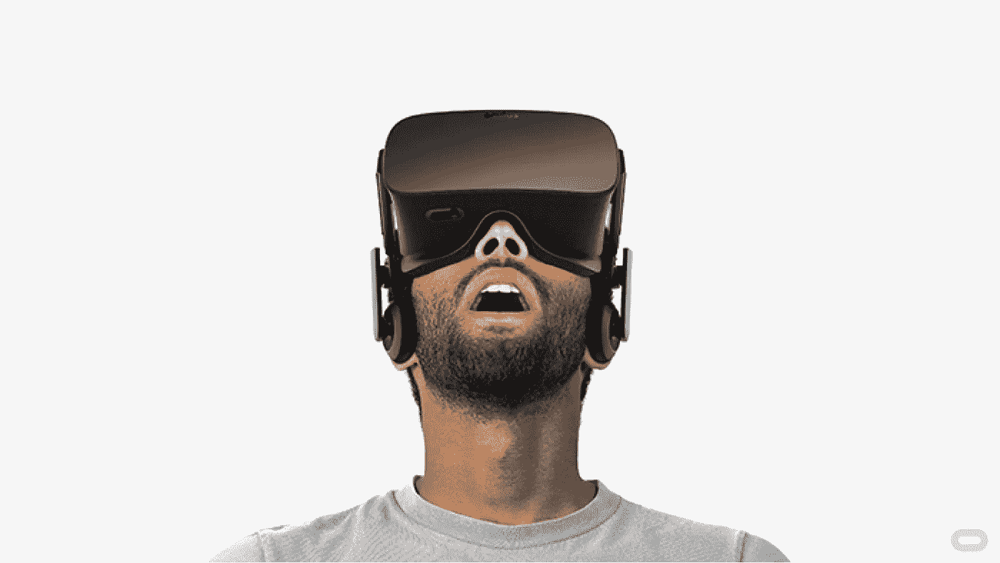

# 为什么 VR 赢不了(还不行)

> 原文：<https://medium.com/hackernoon/why-vr-can-t-win-yet-3cbb48d8d812>

VR 正在迅速成为高端游戏市场的基石。脸书在 F8 发布的新 360 度相机在产品搜索的无数虚拟现实相关列表中证明了它对设计师和开发者来说是多么梦幻的工具。但是有一个根本问题还没有真正解决。

没有一项新技术能够真正解决虚拟现实的社会问题。[视频](http://youtu.be/A0OYmYGsrnY)中，一个孩子开着 Oculus Rift 坐在过山车上，当一个朋友推他一点点时，他完全崩溃了，这个视频既好笑又讲述了这个问题。不管多逼真的 VR，还是有真实的现实，有真实的人以一种不可能忽视的方式围绕着你。

VR 已经走过了很长的路。没有人真正谈论三星昂贵的“3D”电视。红+蓝眼镜至少十年没用过了。[谷歌](https://hackernoon.com/tagged/google) Cardboard 通常便宜或者免费。

但是在我订阅的《纽约时报》的邮件中收到一个免费的纸板并看了一些他们的视频后，我就不再使用它了。《纽约时报》制作的电影是非凡的，但它们的格式和不利之处在于，它们排除了我周围的一切，使它们的内容脱离了上下文。

如果 Oculus 和其他开发者能够找出如何让他们的产品在更多方面具有社交和合作性，而不仅仅是在线游戏，他们最终将能够解决 VR 的问题。

> [黑客中午](http://bit.ly/Hackernoon)是黑客如何开始他们的下午。我们是 [@AMI](http://bit.ly/atAMIatAMI) 家庭的一员。我们现在[接受投稿](http://bit.ly/hackernoonsubmission)并乐意[讨论广告&赞助](mailto:partners@amipublications.com)机会。
> 
> 如果你喜欢这个故事，我们推荐你阅读我们的[最新科技故事](http://bit.ly/hackernoonlatestt)和[趋势科技故事](https://hackernoon.com/trending)。直到下一次，不要把世界的现实想当然！

