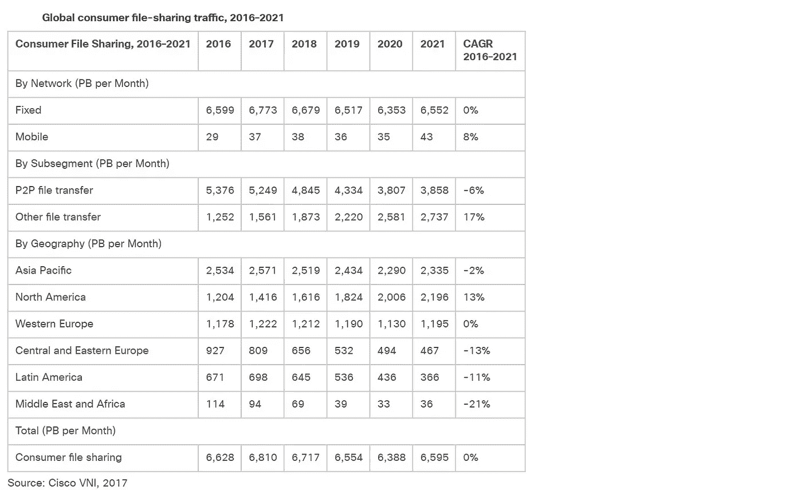
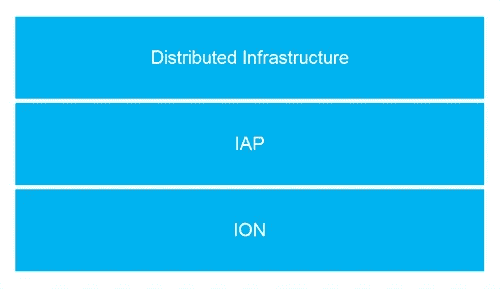

# 为什么我们建立自己的数据格式

> 原文：<https://medium.com/hackernoon/why-we-built-our-own-data-format-faa51c713676>

今天，我们生活在一个 24/7 数据驱动的世界中，据估计，我们平均每天生成约 2.5 万亿字节的数据，其中许多数据是由谷歌、脸书、亚马逊、LinkedIn、网飞等家喻户晓的热门服务的用户生成的。思科最近的一份[报告预测如下:](http://www.cisco.com/c/en/us/solutions/collateral/service-provider/visual-networking-index-vni/vni-hyperconnectivity-wp.html)

●到 2020 年，每两分钟就会有相当于所有电影的千兆字节(GB)通过全球互联网。

●在全球范围内，IP 流量将在 2020 年达到 511 万亿比特每秒(Tbps)，相当于 1.42 亿人每天全天同时传输互联网高清(HD)视频。

●到 2020 年全球 IP 流量将相当于每年 5040 亿张 DVD，每月 420 亿张 DVD，或每小时 5800 万张 DVD。

思科最近还更新了他们对[2016–2021](https://www.cisco.com/c/en/us/solutions/collateral/service-provider/visual-networking-index-vni/complete-white-paper-c11-481360.html)的全球消费者网络、电子邮件、数据流量预测。

思科与本文相关的另一个有趣的预测是关于 2016-2021 年[的文件共享。](https://www.cisco.com/c/en/us/solutions/collateral/service-provider/visual-networking-index-vni/complete-white-paper-c11-481360.html)

构建更智能、可扩展和容错的应用程序来处理如此大的数据量是一个巨大的挑战，但对初创公司和消费者来说也是一个巨大的机遇。对于涉足金融服务等大市场的颠覆性初创公司(例如 Blochchain 初创公司)，这使它们在挑战大型现有金融机构方面处于有利地位，这些机构主要依赖集中式遗留技术，而这些技术并不是为当前消费者产生的全天候连接和大数据爆炸而设计的。对消费者来说，它提供了更多的选择和更好的服务质量，价格比现有的大公司更具竞争力。

**为什么我们需要一种新的数据格式？**

最近，我们见证了分布式系统回归主流软件行业的轰动效应。微服务无疑是软件行业中最热门的宣传和流行词汇之一，对吧，微服务在所谓的 [Gartner 宣传周期](http://www.gartner.com/technology/research/methodologies/hype-cycle.jsp)中的出现就是一个证明！在[这篇文章](https://hackernoon.com/should-early-stage-startups-adopt-microservices-50280c77603a)中，我们问早期创业公司是否应该采用微服务。

几年前，分布式计算的好处似乎只集中在学术研究的用例上。经常引用的一个常见用例是，科学家能够通过跨学科/跨机构的协作，使用网格计算轻松执行原本需要几个月才能完成的大量数据处理/分析任务，从而解决基因组学等领域的科学难题。

主流软件行业中的分布式系统。在 [Nanosai](http://www.nanosai.com/) 我们认为，在分布式系统的节点之间交换数据时，使用快速、紧凑和通用的数据格式对数据进行编码是非常有利的。我们觉得现有的格式(如 Protobuf、CBOR、MessagePack、JSON)不够通用，也不够快，无法满足我们对未来分布式系统的需求。其他原因包括:

1)对于通信节点来说，快速数据格式的读写(反串行化和串行化)当然更快。如果开发人员需要最快的速度，我们还希望能以二进制形式遍历一些东西。

2)紧凑的数据格式需要较少的字节来表示编码的数据。字节越少，需要的网络带宽就越少，因此可以更快地通过网络传输。

最后，让我们以 JSON 为例，它是目前非常流行的数据格式，被开发人员广泛使用。事实上，它是如此受欢迎，以至于公司通常只让他们的 APIs JSON。但是 JSON 也有缺点，包括以下几点:

i) JSON 不是原始二进制数据的好格式。原始字节必须是 Base64 或十六进制编码，并作为字符串传输。Base64 编码将编码数据的大小增加到原始大小的 4/3，十六进制编码将大小增加到原始大小的 2/1。

ii) JSON 不是那么通用，因为它不擅长建模所有类型的数据结构。例如，JSON 不擅长用行和列对相似数据的表格建模(例如 CSV 文件)。JSON 将这种表格数据编码为对象数组，这意味着表中的每个对象(行)的列名将重复。这显然是对数据的浪费。

iii) JSON 不是读写最快的数据格式。由于冗长，传输速度也较慢，尤其是对于带宽有限的设备，如小型物联网设备、连接微弱的移动电话或漂浮在海洋中的船只。

**什么是离子？**

在继续之前，让我们澄清一些事情，否则可能会造成混乱。在 Amazon Web Services 公开发布他们的格式之前，我们就发布了我们的 ION 数据格式。因此，我们没有选择 ION 这个名字，因为它与 Amazon 的 ION 相似。事实上，直到我们设计并命名了我们的 ION 格式之后，我们才发现了相似之处。首字母缩写词 ION 源自“IAP 对象表示法”，其中我们的开放网络协议 IAP 代表“互联网应用协议”。一个直接了当的证据如下:

*   我们的联合创始人在 Infoq.com[发表了一篇关于 IAP 的文章，其中明确提到了 ION。](https://www.infoq.com/articles/IAP-Fast-HTTP-Alternative)
*   我们的黑客新闻公告[在这里](https://news.ycombinator.com/item?id=11027319)关于 ION 与黑客新闻公告帖子[在这里](https://news.ycombinator.com/item?id=11546098)关于亚马逊的 ION。你会注意到我们的黑客新闻公告比亚马逊的公告要早得多。

简而言之，我们的 ION 是一种通用的二进制数据格式，可用于编码各种数据。它的表达能力足以包含序列化对象(如 Java 或 C#对象)、CSV、JSON、XML、文本和二进制数据。解析和生成它非常快，也相当容易，在网络上比 JSON 和 XML 压缩得更多，对于服务器、路由器和其他轻量级硬件(我们相信)来说也很容易处理。

如下图所示，ION 是我们开放分布式系统堆栈的核心部分之一。我们将 ION 设计为开源协议 [IAP](https://hackernoon.com/iap-message-exchange-patterns-network-topologies-1fbe57e011e7) 的默认数据格式，因此，所有 IAP 消息都使用 ION 进行编码。IAP 是一种通用的面向消息的网络协议，设计用于同步和异步通信，使 IAP 适用于许多不同的用例，如 RPC、文件交换、流、消息队列订阅。我们创建 IAP 是因为现有的协议如 HTTP 不能满足我们的通用性和高性能需求。

作为一种数据格式，ION 可以独立于我们的网络协议 IAP 使用。开发者可以使用 ION 作为数据文件、日志文件中的数据格式，作为通过 HTTP 等传输的二进制消息的数据格式。它可以包含二进制数据，因此开发者也可以在必要时嵌入其他格式，如 MP3 文件，ZIP 文件，JPG 文件等。

在 [ion vs. Other Formats](http://tutorials.jenkov.com/ion/ion-vs-other-formats.html) 和 [ION 性能基准](http://tutorials.jenkov.com/ion/ion-performance-benchmarks.html)一文中，我们对 ION 与其他数据格式的比较进行了更详细的描述。对于那些好奇尝试离子请检查释放 [0.5.0](https://github.com/nanosai/grid-ops-java/releases/tag/0.5.0) 。在未来几周，我们将推出新的 ION 更新和更新文档，基准等。

**纳米赛数据流调查**

如果你是一名开发人员或初创公司的首席执行官/首席技术官，我们目前正在开发一项持久的数据流服务(建立在 ION 上，今年推出)，作为现有服务的替代方案，如 AWS Kinesis 和托管的 Kafka 服务。如果您能抽出一分钟时间来完成我们简短的[流调查](https://goo.gl/forms/ygi4L5868l39IYXz2)，那就太好了。当我们发布的时候，完成它的 Hackernoon 读者将会有特别的免费层帐户(有支持)。提前表示感谢！

**英国传感器城**

我们很高兴 [Nanosai](http://www.nanosai.com/) 加入[传感器城](http://www.sensorcity.co.uk/news/business-innovators-choose-sensor-city-as-home/)的创业生态系统，打造创新的传感器相关技术。我们对 Nanosai 围绕传感器数据实时流的用例试点项目感到特别兴奋，ION 将在其中发挥非常重要的作用。所以看好这个空间！

*发帖人*[*bambordébaldé*](https://medium.com/u/665359d135fa?source=post_page-----faa51c713676--------------------------------)*，联合创始人|推特:*[*@ cloud balde*](https://twitter.com/cloudbalde)*|领英:*[linkedin.com/in/bambordé](https://www.linkedin.com/in/bambord%C3%A9)|