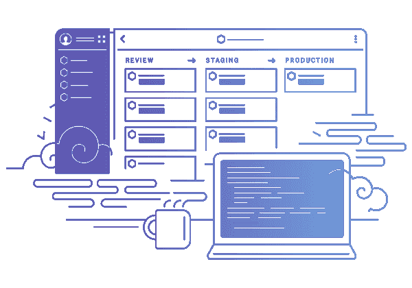

# 为什么我们决定在赫罗库建造训练场

> 原文：<https://medium.com/hackernoon/why-we-decided-to-build-ludus-on-top-of-heroku-1e20254c922f>

## 以及它如何戏剧性地帮助我们在 4 个月内从一无所有到产品搜索的顶端。

我是 [Ludus](https://ludus.one) 的联合创始人兼首席技术官，这意味着我负责所有技术方面的事情，但更一般地说，我负责公司的技术愿景。那不是一件容易的工作。当你看到几乎每周都有新的“革命性的” [JavaScript](https://hackernoon.com/tagged/javascript) 框架出现时，你怎么能预测 10 年后你会使用什么样的技术呢？(好吧，我可能有点夸张，但是你说到点子上了。)

然而，当人们问我如何定义自己时，我并不真的谈论 CTO，而是告诉他们我是一名“产品工程师”。我做技术不是为了[技术](https://hackernoon.com/tagged/technology)。我做技术是因为它帮助我制造伟大的产品。为什么我告诉你这些很重要？因为这正是我们决定在 Heroku 上建造 Ludus 的原因。

Not our job.

当我告诉人们我们在 Heroku 上时，第一反应总是一样的:他们告诉我我疯了，Heroku 非常贵。我同意，如果你与亚马逊网络服务相比，它是昂贵的。但你知道什么更贵吗？不得不雇人在 AWS 上构建和维护您的基础设施。

在我之前的创业公司，在我们真正开始开发产品之前，我们决定雇人在 AWS 上建立我们的基础设施，我们非常关注只使用开源技术，这样我们可以降低成本。那个人做得很好，但仅仅几个月后就因为个人原因离开了初创公司，我们花了一段时间才从这种状态中恢复过来。当时，团队中没有其他人有资格维护系统，所以我们浪费了大量宝贵的时间来确保整个系统不会崩溃。直到两年后，我们才能够雇用一个人来清理我们制造的所有垃圾，但损害已经造成了。

当我开始研究 Ludus 时，我不想重复那次糟糕的经历。因为我是一个人在非常紧张的预算和时间下做 MVP，我没有选择。我不得不选择 PaaS，Heroku 是我的第一选择，因为我喜欢它的强大和简单，过去我已经用它做了一些辅助项目。仅仅一个星期，我们就有了一个坚实的基础设施，这是我整个职业生涯中见过的最好的基础设施。有一个明显的原因:200 多人正在为此而努力。

Relax. Everything is taken care of.

我们目前有 4 个微服务，我们使用 GitHub 进行版本控制。我们为每个微服务都准备了一个存储库，并使用 [Heroku Pipelines](https://devcenter.heroku.com/articles/pipelines) 进行部署。对*开发*分支的推送将部署到我们的试运行环境，对*主*分支的推送将部署到我们的生产环境。我们还进行代码审查(使用 [GitHub pull requests](https://help.github.com/articles/about-pull-requests/) )并使用 [Heroku Review Apps](https://devcenter.heroku.com/articles/github-integration-review-apps) 来检查所建议的变更是否可以推向生产。我们还进行持续集成，并使用 [Heroku CI](https://devcenter.heroku.com/articles/heroku-ci) 来确保所有自动化测试在部署到生产之前通过。

它的伸缩性非常好。我们还没有使用它，但 Heroku 有一种叫做[自动缩放](https://devcenter.heroku.com/articles/scaling)的东西，可以使基础设施适应当前的流量。如果我们明天有机会出现在 TechCrunch 上，它会自动创建更多的服务器实例来满足需求，并确保我们没有停机时间。但即使没有这些，它也坚如磐石。尽管我们在两天内(5 月 10 日& 11 日)获得了超过 40K 的页面浏览量，但在我们发布产品搜索期间，我们的正常运行时间是 100%。

> **这是一个梦想的设定，它帮助我们专注于我们的主要任务:打造人们喜爱的产品。**

你知道吗？甚至没那么贵！此时(2017 年 10 月)，我们支付 500 美元/月左右。随着时间的推移，它可能会上升，但它总是与我们的流量成正比，所以这确实是一个第一世界的问题。在一两年内，如果它变得比我们现在支付的价格高 10 倍，我们可以开始考虑雇佣一些人来将东西转移到 AWS，并为我们节省一些钱。我们已经开始将一个非常小的微服务从 Heroku 转移到了 AWS Lambda，但是我们不打算在不久的将来做得更好。我们是一个产品工程师团队，维护我们的服务器不是我们工作的一部分。

总之，要知道当你开始一个新项目时，最重要的事情是尽可能快、尽可能频繁地把一些东西放在你的潜在用户/客户面前。像 Heroku 这样的东西会给你很大的帮助，并且在开始时不会花费什么，因为在你公司的早期阶段你会得到很差的流量(不要对此太沮丧，这实际上是一种很大的奢侈品)。如果 Heroku 在某个时候变得昂贵，这是一个很大的问题，当它发生时，你可能会有经济能力雇佣一些人来降低成本。但老实说，这希望渺茫。不要一开始就让这类问题困扰你的大脑。专注于你的产品，这是唯一真正重要的事情。