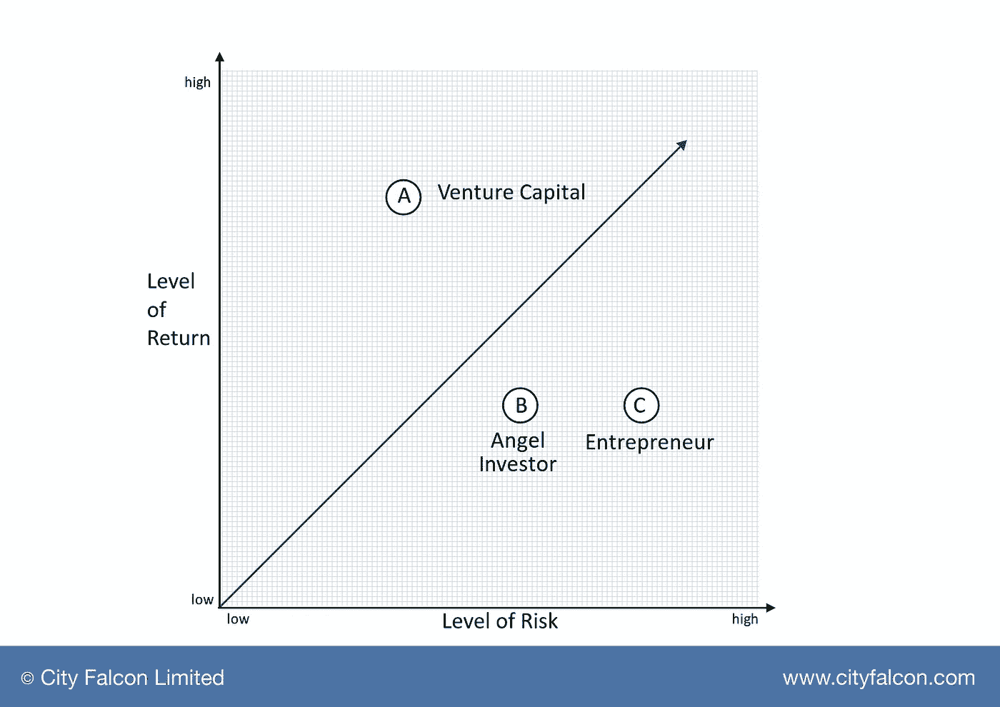

# 为什么我们企业家要对英国和欧洲投资者的风险厌恶负责

> 原文：<https://medium.com/hackernoon/why-we-entrepreneurs-are-responsible-for-the-risk-aversion-of-investors-in-the-uk-and-europe-9c85a91a4b2d>

我身兼两职:金融科技企业家和天使投资人。此外，在过去的 15 年里，我一直在公开市场投资和交易各种类型的证券，并在 bn+公私交易中工作。

在过去的 18 个月里，我们在[**city falcon**](http://hubs.ly/y0Vg8X0)**已经在两轮中筹集了 40 万英镑。在这个过程中，我会见了至少 50 多位投资者，他们来自天使投资人、风险投资人和家族理财室。我们公司赢得了几个奖项，得到了一些正面的报道，所以人们对我们很感兴趣。但即便如此，筹资仍是一场真正的比赛。**

**与我们在硅谷或纽约的朋友相比，有很多人说英国和欧洲的投资者比较保守，这并非毫无根据。但我一直站在两边，所以我知道这不全是胆小的投资者的错。我们企业家正在做几件错事。**

*   ****在英国和欧洲“没有失败的风险”****

**投资者何时真正签署支票投资一家公司，无论是上市公司还是私人公司？大多数时候，他们害怕失去机会。例如，由于生产成本和长期供求动态，石油价格低于 30 美元，每个人都知道那里有价值。但是有多少投资者和交易者在购买石油呢？每个人都想成为反弹的一部分，但他们一直在等待，直到他们看到一些积极的势头。**

*   ****与筹集资金的初创企业数量相比，退出的企业非常少****

**在英国，你不会听到有人投资 10K 一家初创企业，然后以 10 万英镑退出的故事——这在硅谷似乎是常事。人们很容易将此归咎于企业家，但这并不是全部。出现这种情况的关键原因是，我们没有由导师、投资者和在初创企业中工作过的员工组成的初创企业生态系统。在英国，我们缺乏经历过不同成长阶段、有过成功和失败的人的经验和支持。我们这里确实有一些“聪明”的投资者，我们很幸运，但英国的大部分资金都是“傻”钱。**

**目前的情况是，一个理性的投资者会远离初创企业。大多数时候，投资[初创企业](https://hackernoon.com/tagged/startups)主要是为了税收优惠(SEIS、EIS 等)。).**

*   ****忘记退出，一些企业家甚至不定期更新他们的投资者****

**在英国，天使投资者面临的最令人沮丧的事情之一是无法从他们投资的公司获得最新消息。想象一下，这些投资者对投资更多初创企业会感到多么不安。问问你自己，在没有收到任何更新后，有人有多大可能会继续投资。在 [**CityFALCON**](http://hubs.ly/y0Vg8X0) ，我让团队向我提供所有指标，以便我们在每个月结束后的 5 天内发送更新。这非常重要，也没有那么难！**

*   ****它已经成为一个早期的投资者市场****

**媒体有一个流行的误解，认为英国有大量的钱，只是在等着饥饿的企业家来抢走。这使得来自欧洲和亚洲各地的企业家寻求在英国筹集资金。虽然英国有钱，但很多钱不是给你的。英国传统上厌恶风险的投资者，加上来自世界各地的一些最优秀的企业家的涌入，给了投资者更多的选择，也让许多初创企业更难起步。**

*   ****拉客没问题，但向投资者发送垃圾信息来筹集资金就不太好了****

**每隔两三天，我就会收到一封电子邮件，内容类似于“我们正在结束我们的 EIS 回合，预计投资回报率为 x%…”。大部分天使投资都是靠推荐，我不确定有多少创业者是用这种方式获得资金的。这就像你找工作的时候向 200 家公司投简历一样。**

**我们企业家可以从商业发展主管那里学到很多关于建立关系的东西。成功的人不会从我说的第一句话就开始销售，他们首先会与潜在客户建立融洽的关系。**

**推高其价值的不是资产的丰富，而是稀缺。让投资者去追逐机会，而不是我们去追逐。**

*   ****准备好离开****

**一些潜在的投资者会占用你太多的时间。他们会要求大量的文件和信息，却没有任何投资该公司的真正意图。我也为此感到内疚。我们筹集的大部分投资都是在与潜在投资者会面不到三次的情况下完成的。我们需要回到谈判的基础。**

****晚期和“成功的”企业家正在放弃太多东西****

*   ****几家受欢迎的初创企业被低估了****

**以 Crowdcube 这样的公司为例。他们的筹款在 15 分钟内就被认购一空。从纯金融角度来看，他们留下了太多东西。他们本可以以更高的估值筹集资金。Seedrs 和其他已经筹集资金并被超额认购的知名品牌就是这种情况。我希望未来的众筹网站能够开始思考需求和供给的基本原则，并在网站上建立一个图书制作流程。**

*   ****后期投资者希望普通股的优势与债务的劣势保护——真正昂贵的资本****

**进入企业家世界后，对我来说最大的冲击之一是企业家被迫签署的条款清单。在公开市场上，当你购买一家公司的股票时，你可以和其他投资者一样获得该公司的股权。但在初创企业领域，与早期投资者、员工和企业家相比，晚期投资者面临的风险更小，他们要求优先清算、认股权证等。可悲的是，这已经被接受了，大多数人认为这是公平的！不幸的是，我们大多数人将不得不签署这些条款清单，因为它们已经成为标准，但请记住，你给出了太多。**

**下图显示了公开市场中债券和股票的风险回报情况。**

**[阅读更多 ](http://www.financeforfounders.com/why-we-entrepreneurs-are-responsible-for-the-risk-aversion-of-investors-in-the-uk-and-europe)**

************

> **[黑客中午](http://bit.ly/Hackernoon)是黑客如何开始他们的下午。我们是 [@AMI](http://bit.ly/atAMIatAMI) 家庭的一员。我们现在[接受投稿](http://bit.ly/hackernoonsubmission)并乐意[讨论广告&赞助](mailto:partners@amipublications.com)机会。**
> 
> **如果你喜欢这个故事，我们推荐你阅读我们的[最新科技故事](http://bit.ly/hackernoonlatestt)和[趋势科技故事](https://hackernoon.com/trending)。直到下一次，不要把世界的现实想当然！**

****