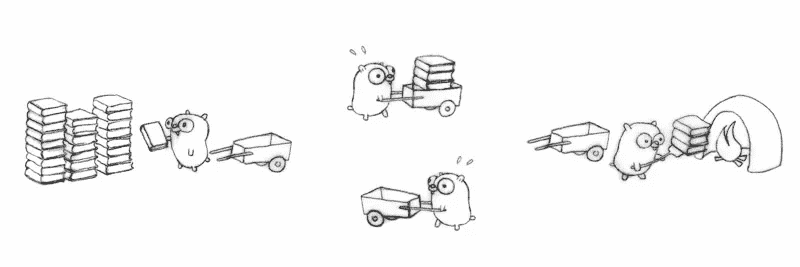

# 为什么我们喜欢并发(你也应该喜欢！)

> 原文：<https://medium.com/hackernoon/why-we-love-concurrency-and-you-should-too-c64c2d08a059>

通常周五晚上是我的休息日，是放松和消耗几毫升田纳西黄金的时候。但是在这个晚上，我们开始讨论如何在不影响性能的情况下处理系统中的许多事务。这是一场有趣的绞尽脑汁的讨论。在我们和我的朋友切邦·丹尼斯达成共识之前，我们的非技术朋友已经睡着了。

经过几次讨论，我们决定给这次讨论起一个名字，我们称之为并发性。

> 并发是指计算任务可以在重叠的时间内执行。与并行不同，在并发中，子任务的执行不一定同时运行。当资源有限时，并发性胜过并行性。

这个定义听起来很明显，但在现实世界中却非常复杂。

## 讨论的起源

近 5 个月来，我一直致力于一个支付聚合平台，这是一个有趣的旅程，我学到了很多东西。我不是一个人做的，而是有 6 个人支持，他们包括渴望学习新事物的初学者和中间开发者。最初，我们从系统分析、设计和建模中解决了所有问题。当我去与卡处理平台进行集成时，情况变得很糟糕。在这一点上，我意识到 PHP 运行一个单独的线程，当线程繁忙时，不允许我处理任何其他事务。

我在向第三方网关发送支付请求时发现了这一点。在处理异步请求时，我意识到系统无法处理任何其他事务。因此，理想情况下，这意味着每当处理 visa/mastercard 支付时，我不能在系统上运行任何其他东西。这是令人沮丧的，理想情况下，这不是我以前经历过的事情。

这促使我寻找更快的解决方案，所以我决定采用微服务架构。我开发了一个 php 服务来专门处理所有的卡支付。因此，主应用程序会收到一个请求，然后向 php 服务调用一个同步 http 请求。这一开始很管用。后来我发现我把问题推到了另一个实例上，实际上并没有提供解决方案。这个过程表现出一种 *fisi 样(鬣狗样)*的趋势，即囤积所有资源，直到用完为止。

这不是我会推荐任何人使用的东西。我一点也不为此自豪。所以我和[切邦·丹尼斯](https://medium.com/u/65866b62f457)分享了我的担忧。

我们最初的讨论是为这个问题找到一个可扩展的解决方案。所以我们决定探索各种替代方案。有人建议使用 PHP，但是因为我以前用过它，所以我知道它的一些问题。首先，它不支持多线程，除非你执行一些黑客攻击。

> 多线程是一种技术，通过这种技术，几个处理器可以在不同的执行阶段使用一组代码。

所以我们最终不得不寻找一种考虑到多线程的语言。首先打动我的是 java。所以我想到用 java 构建一个微服务来运行我们系统的支付处理方面。经过几个小时的研究，我意识到 java 提供了多线程和并发性。但问题是它不能管理操作系统线程来确保资源的有效利用。

## 走吧走吧

几个小时后，客厅里一片寂静。我的朋友仍然在努力寻找 PHP 可以处理这个问题的方法(他是一个 PHP 的死忠),而其他人都睡着了。我偶然发现了一个关于并发性的 Google IO 演示。所以他们在描述他们创造的这种新语言，以帮助他们提高搜索效率等等。

看完演示后，我开始阅读文档。我终于找到了我要找的东西，Golang 可以处理我的并发问题。这是一个令人高兴的时刻，因为我在这场并发性辩论中赢得了灵魂。基于我们对系统的理解，我们将问题分为两种服务。

> 1.通知服务
> 
> 2.支付处理服务。

***通知处理问题***

在支付生态系统中，事情必须是实时的。这意味着，当支付信息进入您的系统时，您有义务通知集成到您的支付网关的系统。我们面临的一个挑战是每个系统处理异步通知的时间长短不一。这意味着我们必须等待请求的响应，从而阻止其他请求被发送到其他系统。

为了解决这个问题，我们开发了一个 go 服务，使用 goroutines 处理我们收到的每个交易细节。

> goroutine 是一个能够与其他函数同时运行的函数

这意味着能够更快处理交易的系统不会被缓慢的系统所延迟。这使得我们能够毫无延迟地处理支付请求，因为我们已经实现了并发。

还有一件非常重要的事情也帮助了我们，那就是 go 渠道。我们重用它们来处理事务响应。

***支付处理服务***

在支付处理服务中，我们面临两个主要挑战。首先，如何处理来自移动网络运营商的移动支付通知。然后如何办理卡支付处理。我们需要一种非阻塞、有效的服务，能够处理任何负载的事务，而不会耗尽分配的资源。我们设计并开发了一个服务，可以将每个传入的事务作为 go 例程进行处理。这意味着来自 MNO 的所有请求都不会经历延迟，因为它们根本不需要等待。同样的技术在信用卡支付中得到了重用。但是这个过程与处理单个推送请求有点不同。在卡支付中有两个步骤，支付授权和支付完成。这意味着我们必须进行异步调用，该调用将返回我们用于第二个请求的数据。我们的假设是支付处理系统可以处理来自我们系统的并发调用。

## 服务发现层

做完所有的工作后，我们在系统中实现了并发。一直困扰我的最后一件事是如何动态地发现这个服务的位置。因为大多数服务链接都是硬编码的。在下一篇文章中，我将讨论我们是如何做到这一点的，因为我们仍在继续努力。任何反馈或建议将不胜感激。

5 个小时后，我们喝了将近 7 杯咖啡，杀死了至少 3 个脑细胞。一切都结束了，该是我们“继续走”的时候了，沉睡的狮子醒来了，我们冲出房子去当地的一个酒吧登记。离**总部**只有几米远。

> [黑客中午](http://bit.ly/Hackernoon)是黑客如何开始他们的下午。我们是 [@AMI](http://bit.ly/atAMIatAMI) 家庭的一员。我们现在[接受投稿](http://bit.ly/hackernoonsubmission)并乐意[讨论广告&赞助](mailto:partners@amipublications.com)机会。
> 
> 如果你喜欢这个故事，我们推荐你阅读我们的[最新科技故事](http://bit.ly/hackernoonlatestt)和[趋势科技故事](https://hackernoon.com/trending)。直到下一次，不要把世界的现实想当然！

