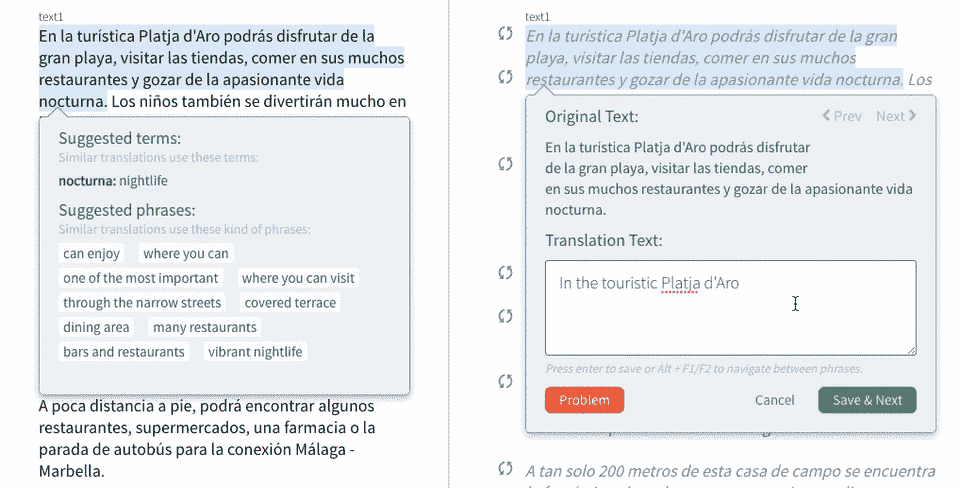
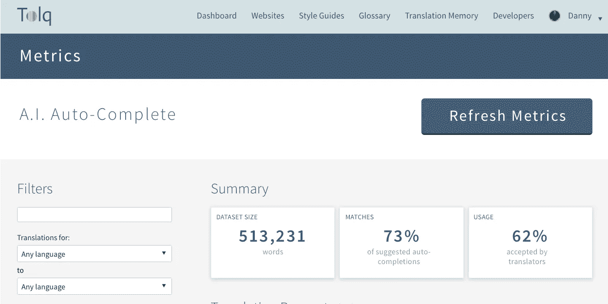

# 为什么我们在实践中而不是在实验室中衡量人工智能翻译的性能

> 原文：<https://medium.com/hackernoon/why-we-measure-performance-of-our-translation-a-i-in-practice-and-not-in-the-lab-647f8fe512e8>

A.I. Powered Auto-Complete

我们看到许多关于将人工智能应用于语言和翻译的新方法的研究报告正在发表。有时，这甚至会导致一场小小的炒作，就像最近谷歌发布了一些语言组合的神经机器翻译改进的研究。

人们很容易忘记在实践中应用这些技术才是真正的意义所在，如果不这样做，研究结果仍然主要是理论性的。由于我们为真正的客户工作，面临着真正的挑战，我们寻找一种更好的方法来衡量成功。

**为什么用真实数据进行测量如此重要？** 人工智能模型的所有成功都受到训练数据之间的关系以及该数据与该模型将被查询和应用的场景之间的相关性的严重影响。这就是为什么自驾特斯拉的 drive 偶尔会掉下悬崖。这个场景还没有出现在模型中。

在我们 Tolq 的环境中，(我们提供人工智能辅助的大量人工翻译服务)，为了能够建立成功的模型，这意味着必须处理广泛的可变输入。

每个客户端可能有:

*   不同类型的内容使用不同的特定语言
*   用作训练数据的更大或更小的翻译记忆库
*   不同的语言对(或不同的方向)
*   不断变化的数据集，翻译不断增加

所有这些因素都会对所应用模型的结果产生重大影响。除此之外，在翻译过程中应用该模型时，还有一些影响较大的变量在起作用:

*   每次要翻译的新内容可能会有很大不同
*   翻译输入可以是任何方向的

对于任何人工智能模型来说，这是一个非常动态和广泛的情况，必须在其中取得成功。

**人工智能绩效 KPI 仪表盘的时间到了！所以我们问自己:在这种情况下，我们如何衡量人工智能的影响？**

*   它需要被持续地测量
*   它需要非常具体，所以对个人客户的水平
*   它需要有一个简单的界面来选择不同场景中的所有不同模型(客户端 TMs、下订单、语言对)
*   它应该专注于一个主要的分数来衡量模型的有效性，为此我们选择了人工智能自动完成匹配

我们决定将人工智能成功指标构建到我们产品的核心中，这样我们就可以随时实时查询任何内容，并在这样的仪表板中查看它:

Tolq A.I. Performance Dashboard

我们对人工智能如何在最重要的地方发挥作用有着直接的洞察力:在实践中，它的复杂性和细微差别。

这些信息与我们的业务核心直接相关，因此我们让团队中的每个人都可以从中学习。

**有兴趣了解更多信息吗？**

我们很乐意获取您现有的翻译记忆库数据并为您进行处理，让您了解我们的人工智能如何帮助您的翻译人员更高效地工作。在 partners@tolq.com 联系我们。

> [黑客中午](http://bit.ly/Hackernoon)是黑客如何开始他们的下午。我们是 [@AMI](http://bit.ly/atAMIatAMI) 家庭的一员。我们现在[接受投稿](http://bit.ly/hackernoonsubmission)，并乐意[讨论广告&赞助](mailto:partners@amipublications.com)机会。
> 
> 如果你喜欢这个故事，我们推荐你阅读我们的[最新科技故事](http://bit.ly/hackernoonlatestt)和[趋势科技故事](https://hackernoon.com/trending)。直到下一次，不要把世界的现实想当然！

