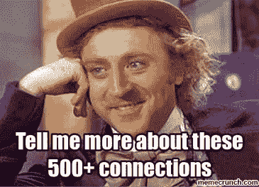
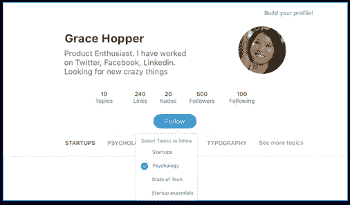
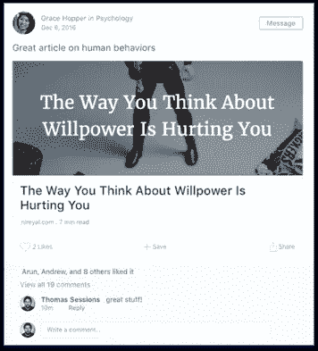
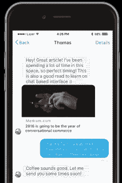

# 为什么我们需要一个新的职业关系网(而不是联系人)

> 原文：<https://medium.com/hackernoon/why-we-need-a-new-professional-network-for-our-relationships-not-contacts-4f0147cdb13>

今天，一个普通的专业人士有 500 多个联系，但是很少有关系。我们很忙；有许多商业伙伴和密友。和任何关系一样，定期沟通对关系的健康至关重要。当我们交流时，关系会变得更牢固，当我们不交流时，关系会变得更脆弱。

# **管理关系很难**

当前的专业网络使你的网络发展变得容易，但对维护网络却帮助甚微。在面对面的会面之后，我们天生就有联系的本能。然而，没有与这些新的联系建立关系，他们很快就被遗忘了。

[像 LinkedIn 这样的工具](https://hackernoon.com/tagged/tools)是针对季节性用例定制的，比如最新的公众资料、求职或寻找潜在客户。你的新闻提要充满了政治、动物、自我推销、智力游戏和/或吸引眼球的迷因。这很快就会变成垃圾邮件，也难怪只有一小部分会员经常使用这类产品。

牢固的关系需要定期沟通，而环境是创造有机对话的良好催化剂。没有上下文，我们的交流往往是基于需求的。交流的间隙越长，关系就越弱。

由于害怕被拒绝，我们也倾向于避免基于需求的对话。害怕你被他们遗忘，或者看起来更像“索取者”而不是“给予者”。缺乏背景，又称不知情，是交易关系的主要原因之一。不知道聊什么，很难开始一段对话。

# **但是关系很重要**

职业发展、学习、成长和支持。

> 我们的使命:让每一位专业人士拥有强大的关系网(而非人脉)

# Nucleus 简介——轻松的关系管理

维持关系很难。保持联系需要提醒和时间承诺来做定期沟通。此外，感知价值是季节性的(求职、介绍、“未知”)，因此很难在这上面投入时间。如果我们降低维持关系的成本，这样就变得不需要动脑筋，每个人都可以获得一个健康的关系网络。

大多数专业人士每天都会阅读新闻、文章、论文，以获取信息和灵感。我们有时甚至会保存自己的收藏夹，偶尔分享到各自的社区。对于大多数专业人士来说，阅读显然是每天或每周的活动。如果我们能让你在任何地方都能轻松分享你最鼓舞人心的阅读，那会怎么样？这样，你分享的链接为你的网络提供了背景，并帮助你与对你重要的人重新建立联系。

> 认识 Nucleus:一个分享你最鼓舞人心的阅读的专业网络

职业关系——核心方式:

## 1.跟着兴趣走，不跟着人走

跟随的概念现在几乎存在于任何基于网络的平台中。然而，跟随人打破了“家庭饲料”的相关性，因为人们有几个兴趣，但任何两个人之间很少有共同的兴趣。

我自己在选举期间也经历过这种情况，当时我关注的大多数人都开始分享政治内容。这使得我的订阅变得无关紧要，我不得不取消对一群人的关注。因此，为了保持订阅源的相关性，我们决定取消以下人物功能，取而代之的是，您可以关注由对您重要的人和事策划的共同兴趣。

你的网络分享了许多对你来说无关紧要的东西。通过关注人们策划的话题来保持你的订阅源的相关性，并从中获得灵感。

## 2.关注您感兴趣的主题的提要

我们相信质量胜于数量。Nucleus 是一个新的专业网络，分享你最鼓舞人心的阅读。因为它关注的是对你来说重要的话题，你可以从网上获得你最喜欢的话题。随着越来越多的人加入我们的使命，我们希望成为您学习、分享和获得灵感的主要来源之一。

使用 Nucleus，您可以发现新闻、主题文章和对您重要的人。找到您的下一本书，了解最新信息，发现精选主题，保持高效。

## 3.通过私人信息与您的网络交流想法

公众评论是好的，但很少有深刻的见解。而且，很少有人写评论，是出于对公众观感、误解甚至网络能见度的担忧。这导致要么像“伟大的阅读，感谢分享”或没有评论的一般反应。问题是，一个行业的人往往有宝贵的见解。所以当他们沉默时，我们失去了很多。

公开分享想法的另一个不利之处是，我们失去了他们本可以产生的对话。谈论想法会引出更多的想法。我们需要一个可以畅所欲言的地方。因此，我们认为，与通过评论公开分享相比，启用私人消息传递可以产生更多真实的讨论。

你的网络共享的链接提供了背景，所以你总是可以开始一个对话，赶上。因此，轻松建立和维持关系的秘诀是:

*根据内容的上下文- >常规对话- >更强的关系*

我们非常兴奋地宣布，我们现在发送测试邀请。每个人都需要一个强大的人际网络，但不是每个人都有。

你值得拥有一个强大的网络，我们希望你加入我们的使命。在[**【https://meetnucleus.com】**](https://meetnucleus.com.)**报名。通过分享或点击下面的小心脏来帮助传播信息。**

-阿伦&安德鲁

> [黑客中午](http://bit.ly/Hackernoon)是黑客如何开始他们的下午。我们是 [@AMI](http://bit.ly/atAMIatAMI) 家庭的一员。我们现在[接受投稿](http://bit.ly/hackernoonsubmission)并乐意[讨论广告&赞助](mailto:partners@amipublications.com)机会。
> 
> 如果你喜欢这个故事，我们推荐你阅读我们的[最新科技故事](http://bit.ly/hackernoonlatestt)和[趋势科技故事](https://hackernoon.com/trending)。直到下一次，不要把世界的现实想当然！

