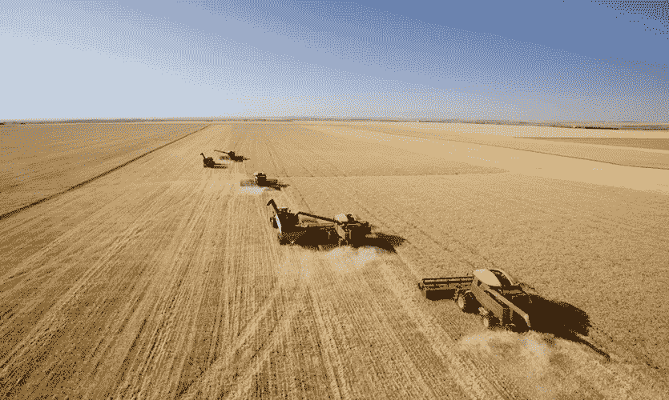

# 我们为什么创办公司

> 原文：<https://medium.com/hackernoon/why-we-start-companies-d546bb3bf9ae>

因为我们在乎。

以上是大多数公司的起源，我们在这个世界上看到一些我们喜欢或不喜欢的东西，以这样或那样的方式感受到一些东西，并决定需要改变。

从根本上说，我们在乎。即使业务是一个抽象的概念(黑客的好说法)，你仍然要付出足够的努力去做一些事情。

这里想到的是说唱天才，他们可能对说唱音乐或一般音乐了解不多，但他们知道歌词搜索占所有谷歌搜索的 2%，每天 3，500，000，000 的 2%是一个很大的数字，可以赚钱。

在乎的问题是，一旦你足够在乎去做些什么，你就需要招募一个有希望志同道合的团队，说服一些富人，你看待世界的方式是未来赚钱的方式，与政府、法规、更多富人、其他人、研究人员和了不起的人打交道，把这一切变成现实。

为了你可能生存下来的回报，甚至不是赚大钱或者我敢说“你有钱”…..活下来就好！也许会看到你的想法变成现实。

创业是艰难的，这是‘我想脸贴着人行道跑马拉松’的另一种说法。但出于某种原因，你大脑中的那种滴答声，那种微弱的电活动让你相信了一些事情，相比之下，放手让你觉得拖脸马拉松是值得的。

无论如何，我想改变我们的生长方式和与食物的关系。

终点线人行道上见，还有 20 亿人不能养活自己。

> [黑客中午](http://bit.ly/Hackernoon)是黑客如何开始他们的下午。我们是 [@AMI](http://bit.ly/atAMIatAMI) 家庭的一员。我们现在[接受投稿](http://bit.ly/hackernoonsubmission)，并乐意[讨论广告&赞助](mailto:partners@amipublications.com)机会。
> 
> 如果你喜欢这个故事，我们推荐你阅读我们的[最新科技故事](http://bit.ly/hackernoonlatestt)和[趋势科技故事](https://hackernoon.com/trending)。直到下一次，不要把世界的现实想当然！

