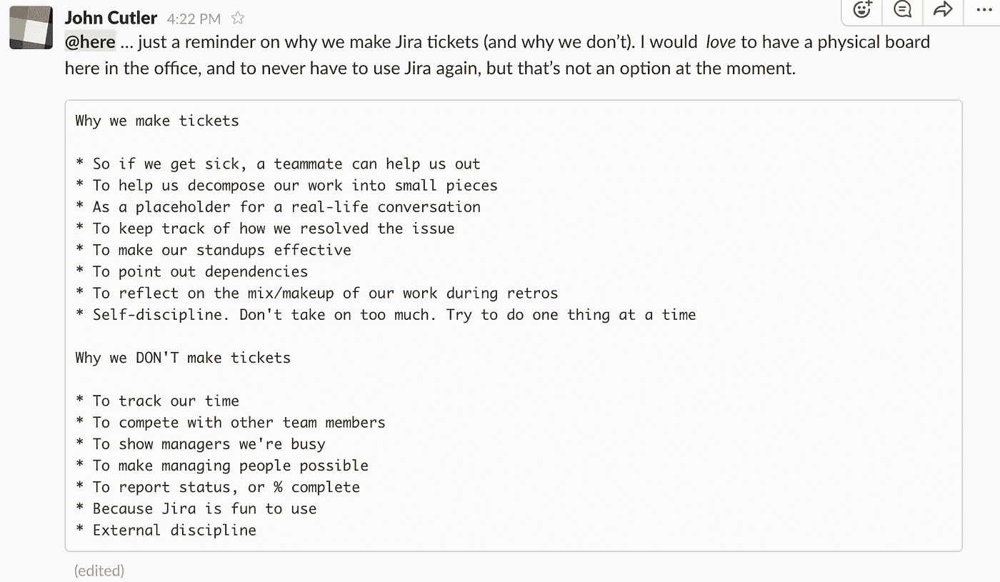

# 我们为什么开罚单

> 原文：<https://medium.com/hackernoon/why-we-write-tickets-689c45b57607>

前几天在 Slack 与我的团队分享…

**我们为什么写票**

*   所以如果我们生病了，队友可以帮助我们
*   帮助我们将工作分解成小块
*   作为现实生活对话的占位符
*   跟踪我们是如何解决问题的
*   让我们的站立更有效
*   指出依赖性
*   在回顾中反思我们工作的组合/构成
*   自律。不要承担太多。试着一次做一件事

**为什么我们不写票**

*   追踪我们的时间
*   与其他团队成员竞争
*   向经理显示我们很忙
*   让管理人成为可能
*   报告状态，或完成百分比
*   因为吉拉使用起来很有趣
*   外部学科

> [黑客中午](http://bit.ly/Hackernoon)是黑客如何开始他们的下午。我们是 [@AMI](http://bit.ly/atAMIatAMI) 家庭的一员。我们现在[接受投稿](http://bit.ly/hackernoonsubmission)并乐意[讨论广告&赞助](mailto:partners@amipublications.com)机会。
> 
> 如果你喜欢这个故事，我们推荐你阅读我们的[最新科技故事](http://bit.ly/hackernoonlatestt)和[趋势科技故事](https://hackernoon.com/trending)。直到下一次，不要把世界的现实想当然！

