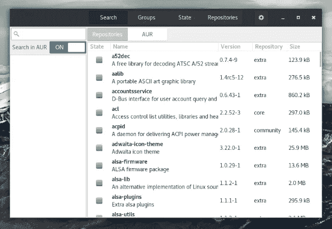
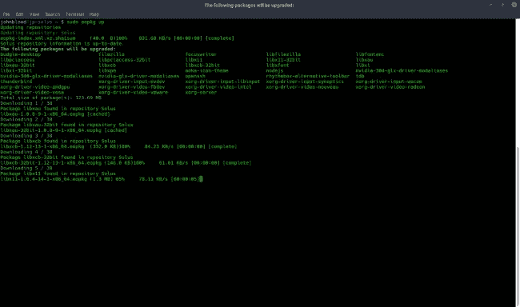

# 为什么 Windows 需要一个包管理器

> 原文：<https://medium.com/hackernoon/why-windows-needs-a-package-manager-3868cffdec24>

Pamac package manager on [Manjaro Linus](https://manjaro.org/)

几天前，我用 Hexo(一个用 Nodejs 构建的静态站点生成器)创建了一个博客。我创建了几个页面，安装了几个插件。当我输入命令来构建站点的本地副本时，我得到了一条很长的错误消息。看起来是某个插件导致了这个问题，所以我在 Github 上提交了一个问题。事实证明，我得到这个错误是因为我的 Nodejs 版本太旧了，就像最新版本后面的两个主要版本一样。

我能够解决这个问题，但它让我思考。这一切都发生在我的 Windows 笔记本电脑上。这在我的 Linux 机器上永远不会发生。为什么不同？因为 Windows 没有包管理器。以下是 Windows 需要软件包管理器的几个原因。

[Solus Project](https://solus-project.com/) package manager

# 什么是包管理器？

对于那些从未使用过 Linux 的人，让我解释一下:软件包管理器是一个系统级的应用程序，它允许你在一个地方更新你当前的程序和安装新的程序。软件包管理器允许您按名称和类别搜索应用程序。有些还列出了其他用户对这些程序的评论。每个操作系统的包管理器由它的创建者维护。

# 更新简化版

在 Windows 中，最大的问题之一是保持你的软件最新。在大多数情况下，您必须下载每个更新并单独安装。比如我要更新 CCleaner，你就得下载最新版本安装。有些东西，像 Flash 或 Java，有它们自己的更新系统，但是你通常仍然需要启动每个更新。

有了包管理器，就没有这个问题了。你所要做的就是运行软件包管理器(从图形用户界面或者终端),所有的更新都将被安装。

有些人可能会指出[微软](https://hackernoon.com/tagged/microsoft)确实在 Windows Update 中包含了一个包管理器。那可能是真的，但是它只更新微软软件。它更新的非微软软件通常是驱动程序。还记得我在帖子开头提到 Nodejs 吗？Windows Update 没有涵盖这一点。

另一方面，当我更新我的 Manjaro 笔记本电脑时，一切都在更新，从 Firefox 和 Steam 这样的完整程序到 Nodejs、Go、Java 和系统驱动程序这样的构建块。

有一些第三方程序会检查更新，但它们只搜索有限数量的程序。我听说过 [Chocolatey](https://chocolatey.org/) ，它标榜自己是 Windows 的软件包管理器。然而，在我[看来](https://hackernoon.com/tagged/opinion)，一个安全敏感的程序应该掌握在操作系统的创造者手中，在这种情况下，微软。

Updating [Solus](https://solus-project.com/) from the terminal

# 减少膨胀

获得一台新电脑的最大问题之一是，它通常会有点臃肿。这通常包括 15 或 30 天的软件试用。这个想法是，你会迷上使用这些程序，并支付完整版本。大多数人都想卸载它们，但是软件制造商让这变得很难。有几个独立的程序只是为了消除新电脑的膨胀。

包管理器将极大地简化膨胀的消除。你所要做的就是打开软件包管理器，选择你不想要的程序，然后点击卸载。

# 软件很容易找到

最后，一个包管理器将使寻找新软件变得容易。发现软件一直是 Windows PCs 的难题。在互联网出现之前，你可以去当地的电脑商店找到适合你的软件。在互联网时代，有如此多的选项可供选择，你可能会不知所措。很多次，我只是在谷歌上搜索我正在寻找的程序类型，希望我能找到满足我需要的东西。

包管理器将大部分软件整合到一个地方。您可以按名称和类别进行搜索。有时他们会列出其他用户的评论，所以你可以看看这个程序是否适合你。

# 批量安装

当你买了一台新电脑时，大多数时候它都没有你日常使用的所有软件，比如 Paint.net VLC 播放器、FileZilla 和 Notepad++。在开始工作之前，您必须为每个应用程序下载一个安装文件并手动安装。根据经验，我知道这是一个非常耗时的提议。

软件包管理器可以解决这个问题，因为您可以一次选择安装多个应用程序。有一款名为 [Ninite](https://ninite.com/) 的第三方应用，可以让你批量安装应用。然而，这是 Windows 应该做的事情，而不必安装第三方程序。

# 它会发生吗？

微软过去曾提到，他们将在未来的 Windows 版本中包含更多类似 Linux 的功能。文章甚至提到了一个包管理器。然而，我认为 Windows 应用商店是他们所能做到的。(app store 有很多和 Windows Update 一样的问题。)

在我看来，这还不够。希望有几个人会读到这篇文章，并意识到 Windows 缺少了什么。

请在下面的评论中告诉我你的想法。你同意 Windows 需要一个软件包管理员吗？

*原载于 2017 年 1 月 11 日*[*tech . johnpaulwohlscheid . work*](https://tech.johnpaulwohlscheid.work/2017/01/11/why-windows-needs-a-package-manager)*。*

 [## 你觉得这个帖子有趣吗？把我最新的帖子直接发到你的邮箱里。

### 输入您的电子邮件以接收我的更新。

powered.by.rabbut.com](https://powered.by.rabbut.com/p/ssHA?c=1) 

> [黑客中午](http://bit.ly/Hackernoon)是黑客如何开始他们的下午。我们是 [@AMI](http://bit.ly/atAMIatAMI) 家庭的一员。我们现在[接受投稿](http://bit.ly/hackernoonsubmission)并乐意[讨论广告&赞助](mailto:partners@amipublications.com)机会。
> 
> 如果你喜欢这个故事，我们推荐你阅读我们的[最新科技故事](http://bit.ly/hackernoonlatestt)和[趋势科技故事](https://hackernoon.com/trending)。直到下一次，不要把世界的现实想当然！

