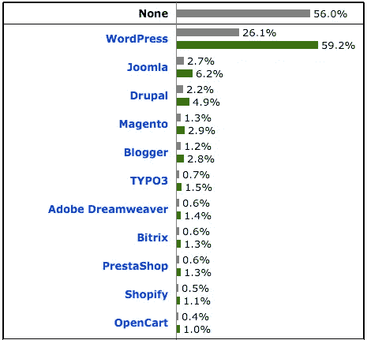

# 为什么 WordPress 可能是小型企业的完美解决方案

> 原文：<https://medium.com/hackernoon/why-wordpress-is-the-perfect-solution-for-your-small-business-335e96acc6a4>

如果你曾经考虑过哪家网站建设商最适合你的小企业，你可能已经陷入了不同报价的海洋中，不知道它们之间有什么不同。

在最初几分钟的兴奋之后，你在列表上看到的各种选项开始让你感到困惑和不安全。是真的，长得都差不多，都答应你人间天堂。你是做什么的？

很简单:看看最新的统计数据和市场份额，帮助你缩小清单。事实上，一旦你看到实际的统计数据，你就很容易做出决定。

## WordPress 作为最常用的内容管理系统

Source: W3Techs.com

根据[最新的 w3tech 统计](http://w3techs.com/technologies/overview/content_management/all)，[， **WordPress**](https://hackernoon.com/tagged/wordpress) 在所有网站中被 **26.1%** 使用，其 CMS 的市场份额为 **59.2%** 。我得说，相当令人印象深刻。WordPress 显然是使用最多的 CMS 平台，虽然它最初是作为一个博客平台开始的，但 WordPress 随后发展成为一个完整的 CMS 平台。现在，它提供了为小型企业创建有效网站的所有必要功能。

WordPress 非常适合小型企业有几个原因，我想指出几个:

*   出色的内容创作，这对您的[集客营销](http://www.avalon.host/blog/growth-hacking-or-inbound-marketing-which-is-better-for-your-online-business/)至关重要
*   数千个专业设计的主题，其中许多都是免费的
*   响应迅速，随时可用于任何尺寸的[智能移动设备](http://www.avalon.host/blog/most-important-web-design-trends-for-2016/)
*   易于设置、管理和使用，您不需要成为互联网专家或程序员
*   搜索引擎友好，这对你的网上成功至关重要
*   WordPress 是开源的，这意味着它是免费的并且在你的控制之下

## 为什么你应该选择 WordPress

对于小企业来说，WordPress 只是提供了最好的解决方案，因为它提供了一个平台，小企业可以根据自己的需求发展。它很容易设置和定期更新，因此创建一个网站，遵循所有最新的设计和搜索引擎优化趋势。说到设计，WordPress 提供了各种不同的设计，在此基础上你可以创建你的网页和博客页面。

有了 WordPress，你可以很容易地将各种不同的媒体加入到你的网站中。pdf、视频、评价、图片——所有这些都可以很容易地与 WordPress 集成在一起，而无需花费太多时间。

WordPress 允许你包含多个用户，如果需要的话，他们可以访问 CMS 并管理你的网站。它还为您提供了额外的选项，例如限制其他用户无法看到您不想让他们看到的信息。

WordPress 很容易从你的电脑、笔记本电脑、平板电脑甚至手机上编辑和管理。使用 Android 和 iOS 应用程序，登录并编辑您需要的内容非常容易。

最后但同样重要的是，WordPress 价格实惠。让我们来看看如何和为什么。

## 哪种类型的 WordPress 适合你？

有两种类型的 WordPress 你可以选择:**一个自托管(wordpress.org)**和**免费(wordpress.com)**。然而，两者都有各自的优点和缺点，在决定使用哪一种之前，您应该将它们考虑在内。

【wordpress.org】自托管易于使用。它让你自定义你选择的主题和修改文件。它使你能够控制自己的数据和使用插件，因为你完全负责你的备份，但它也为你提供了一个通过发布自己的广告赚钱的可能性。它为您提供定制的分析和跟踪选项，这是一个自我反思和改进的神奇工具。

对于自托管的 WordPress，你需要一个合适的虚拟主机——是的，它是 [Avalon](https://www.avalon.host/) ！稍后会有更多的介绍。

**Free(WordPress . com)**不过，最多是 3GB 的免费空间。因此，所有超过 3GB 的空间将被额外收费。这就是我一直推荐自托管 WordPress 的原因。除此之外，免费网站还有其他的问题。例如，你的免费 WordPress 会被你无法移除的广告淹没(除非你付费)。当你想到在你的免费 WordPress 上发布广告时，忘掉它吧！这是不允许的，除非你每个月有 25，000 的浏览量。

此外，插件或自定义主题等功能也不可用，更不用说受限的分析，网站被移除/删除的可能性，以及不可避免的(也很烦人)由 WordPress.com 驱动的*标志，它像影子一样跟着你——让每个人都知道你破产了。*

所以，是的，我推荐从 WordPress 选择并下载你的 WordPress 安装。

不管你需要包括一些小的投资，自托管的 WordPress 可以让你完全控制你的网页，布局，搜索引擎优化，广告收入等等。

## 用 Avalon 选择您的域名，今天就开始！

在你开始创建你的 WordPress 网站之前，**选择一个域名**是第一步。如果你是那些对使用哪个领域有明确想法的人之一，那么你会让这一切变得非常容易。当然，这意味着你已经知道你的域名没有被占用。

现在，您可以使用 Avalon 快速选择您的域名，无需任何文书工作。事实上，您将通过我们的管理 web 界面获得对您的域的完全控制，并且不必再担心了。很快，你将准备好开始你的 WordPress 网页，创建你令人惊叹的商业组合，并且绝对相信你有最好的 24/7 支持和备份。

不要浪费时间，[联系我们，今天就开始*文字发布*](https://www.avalon.host/)。

*本文原载于* [*阿瓦隆博客*](http://www.avalon.host/blog/why-is-wordpress-a-perfect-solution-for-your-small-business/) *。*

> [黑客中午](http://bit.ly/Hackernoon)是黑客如何开始他们的下午。我们是 AMI 家庭的一员。我们现在[接受投稿](http://bit.ly/hackernoonsubmission)并乐意[讨论广告&赞助](mailto:partners@amipublications.com)机会。
> 
> 如果你喜欢这个故事，我们推荐你阅读我们的[最新科技故事](http://bit.ly/hackernoonlatestt)和[趋势科技故事](https://hackernoon.com/trending)。直到下一次，不要把世界的现实想当然！

