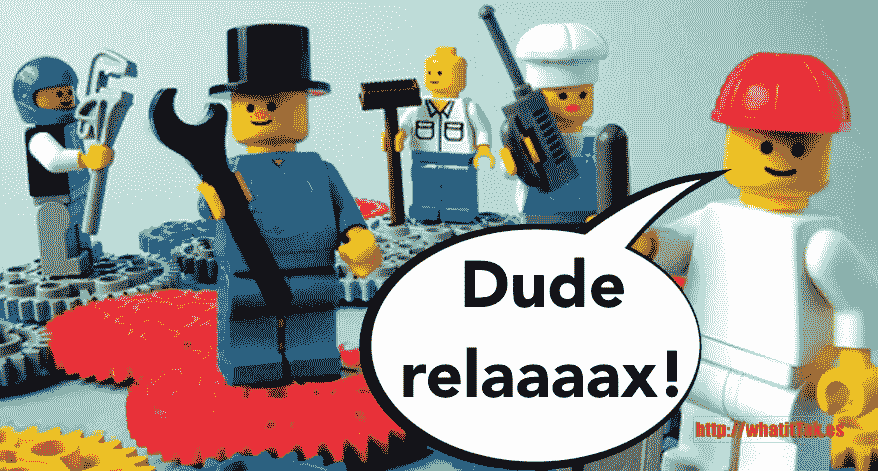
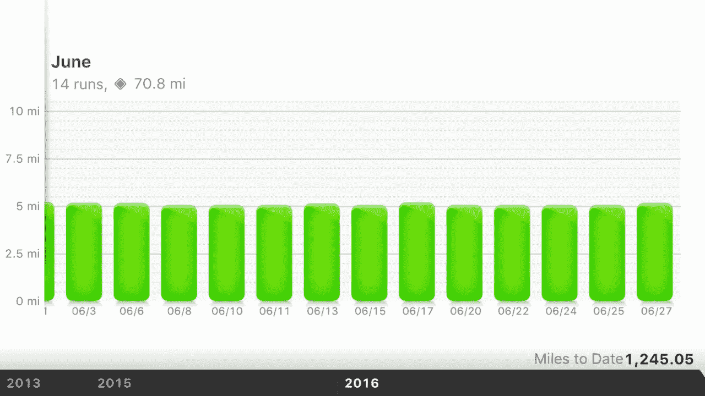
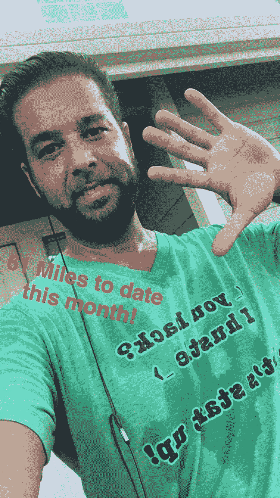

# 为什么“努力工作—尽情玩耍”是关键！

> 原文：<https://medium.com/hackernoon/why-work-hard-play-hard-is-key-3963586217e3>

**进步还是激进？你非常想不失败，所以你夜以继日地工作，没有休息，关心你自己和你的员工。有时候，要达到最佳表现，最好的办法就是停止工作，开始“玩”，这一点很难让人接受。当然，你不想换到另一个极端，在不投入工作的情况下玩得太累。一旦你找到了工作和“充电”之间的平衡，你就可以避免精疲力竭的危险，并且更加享受你的工作。但是如何避免陷入只工作不玩耍的文化陷阱呢？**

*今年 2 月，我指导了一家濒临倒闭的硅谷初创公司，其原因并不是初创公司失败的典型原因。事实上，他们在运营上是正确的:已经筹集了一轮种子资金，在行业内引起了很大的轰动，他们的 MVP 似乎已经达到了产品的市场适应性。然而，从内部来看，他们正在苦苦挣扎。工程师们互相争斗，增长黑客们失去了动力，他们的 KPI 数字下降了！结果，创始人对这种情况越来越恐慌。*

*他们没有继续走这条自我毁灭的道路，而是谦虚地寻求帮助。我们一起研究人员是如何被管理的，看看我们是否能在那里找到问题。映入我眼帘的是每周工作 80 多个小时的员工，人们生病而不是休假，绝对没有任何人请假。员工甚至没有适当的午休时间，只是在办公桌前吃午饭。*

*因此，没有空间留给充电——创造——娱乐！这家初创公司正遭受着典型的倦怠。为了成功，他们拼命工作，几乎要累垮了。听起来耳熟吗？*

*当我检查完所有的数字后，我确信“工作方式”是关键原因——解决这个问题很简单！我提出了一个为期 12 周的计划，其中包括团队建设、自我保健，以及最终定义公司文化。这不仅非常重要而且及时——而且仅仅三个星期后，每个人都再次感到了活力、动力和承诺。我们都非常满意地看到创业公司重回正轨并向前发展。*

**改变你的心态**

作为一家初创公司，休息一下的想法可能会让你感到紧张。你目前的心态可能是没有时间玩耍，任何离开工作的时间都是浪费。然而，在休息的时候，是时候改变你的心态了。想想马拉松。如果为马拉松训练最多的人赢了，那么跑步者将每天训练 23 小时。然而，事实并非如此，即使是赢家也需要休息一下。休息和恢复的想法在体育界得到理解和接受，但在创业界却被忽视了。也是时候接受休息和恢复工作的想法了。

当你在一个紧张的项目上一次工作几个小时，你可能会觉得自己很有效率，但你可能会在离开工作时想知道时间都去了哪里，你怎么可能有这么多事情要做。在你最容易分心的时候休息一下，比如下午 3 点左右，可以让你的大脑重新集中注意力，提高效率。即使是 15 分钟的休息也足以达到这个目的。

当你明白休息是提高生产力的关键时，你需要与你的员工分享这一信息。你的团队也需要理解休息和恢复的重要性，他们需要知道休息充电是可以接受的。

**为什么会产生倦怠？**

在过去的五年里，48%的美国人报告压力增加，如果你问创业公司的人，这个数字可能会更高。随着压力的增加，许多有工作的成年人很难平衡他们的工作和个人生活。许多人觉得他们被困在一份没有回报的工作中。尤其是在初创公司，压力水平很高--高得离谱！

人们陷入高压力循环的另一个标志是把工作带回家，不休息，停止照顾自己，无论是身体上还是精神上。

希望你的团队成员中没有人因为这个原因而筋疲力尽，但很可能他们中的许多人不愿意休息，正朝着筋疲力尽的方向前进。

**倦怠的预警信号**

你如何防止倦怠？一种方法是识别警告信号，这样你就可以在它变得太远之前阻止它。

你的身体和精神健康都会受到倦怠的负面影响。如果你一直感到沮丧，经常生病，背痛，或者正在与肥胖或心脏病作斗争，你应该考虑一下你的工作如何在你的健康中发挥作用。

压力会影响你大脑中执行功能所必需的部分。执行功能会影响你的记忆、情绪、决策和注意力。倦怠会让你犯愚蠢的错误，做出错误的决定，或者情绪爆发。

个人和工作关系都会受到倦怠的影响。你可能会发现自己对同事甚至是你爱的人发火。或者，也许你发现自己变得孤僻，避免与人接触。当你的人际关系开始恶化时，倦怠可能是罪魁祸首。

*   **消极和满意度下降**

如果你通常是一个积极的人，但你开始关注情况的负面影响或发现自己在评判他人，这可能是导致倦怠的原因。通常让你兴奋的项目和互动不再让你兴奋。虽然你觉得自己在工作中投入了很多，但你可能并不觉得自己从中获得了很多。

压力给你带来的负担经常会导致疲惫。即使睡了一夜好觉，你也可能没有精力，你最终会依赖大量的咖啡因来保持白天的清醒。

*   **动力和表现下降**

当你开始创业时，动力会自然而然地产生，你对一切都非常乐观。当倦怠袭来时，你开始失去动力，你开始因为害怕被解雇或错过最后期限而工作。当你的动机开始源于消极的地方，你的表现也会受到影响。如果您注意到性能下降，您应该确定是否是疲劳的原因。

**对抗倦怠的方法**

对抗倦怠最简单的方法之一就是休息一下，脱离你的工作。高度集中的时间应该通过高度休息来平衡，以获得最大的效率。断开连接尤其重要。如果你没有完全脱离电子工作，就好像你从来没有离开过工作。当你在家的时候，设定指定的时间来检查电子邮件和语音邮件，所以这不是一个耗费所有精力的任务。

你应该休息多长时间？不同长度的休息是有益的。

*   从你的电脑前站起来，休息 15 分钟，重新聚焦，激发你的动力和创造力。等到累了就来不及了。在这一点上，你已经错过了峰值生产力的窗口。理想的时间表是每一个半小时休息 15 分钟。
*   如果你度过了一个特别紧张的月份，你可能需要休息几天来平衡。同样，高强度工作后紧接着高强度休息的想法也适用于更长的时间。一旦你的创业成功，你可能会从一个月甚至一年的休假中受益，从你的身心承受的巨大压力和紧张中恢复过来。

也许你的工作量不是太大，但是你太没有条理了，以至于你不能有效地处理你的工作。花点时间整理会让你感觉负担轻了很多。即使这些时间没有集中在你的创业公司的具体任务上，从长远来看也是有益的。

当你感到不知所措、压力大、精疲力竭时，你的自然反应可能是回避他人。然而，当你精疲力尽时，那些最亲近的人可能是对你最好的。花时间和人们在一起可以帮助你从工作和压力中解脱出来，找点乐子。

注意你的身体向你发出的信号是很重要的。你可能会很快将你的头痛、胃痛和关节痛归咎于食物和睡眠。不要忽视压力和焦虑会导致这些疼痛的事实。倦怠会在你的身体中表现出来，所以倾听你的身体在对你说什么，并照顾好它。

**锻炼是关键**

当涉及到你的个人健康时，你有时需要把自己放在第一位。你可能拥有世界上所有的动力来确保你的创业成功，但你需要将一些动力应用于照顾你的身体和锻炼。即使是最成功、最积极的人也很难把锻炼变成他们日常生活的一部分。但是，如果你这样做了，你会得到很多好处。

消耗能量能让你拥有更多的能量，这也许说不通，但在锻炼时确实如此。一项[研究](http://t.umblr.com/redirect?z=http%3A%2F%2Fwww.jasonshen.com%2F2011%2Fhow-working-out-makes-us-better-entrepreneurs%2F&t=YzQ2ZDliNzg1Mzg5MjM4MDM5NjY2NDJiYTA0ZDRhYTBmN2Q2Mjk0Miw0dUhhYkVJYQ%3D%3D)发现，对于久坐的人来说，有规律的低强度运动增加了 20%的能量，减少了 65%的疲劳。即使是在午餐时间进行一次短暂而轻快的散步，也能帮助你精力充沛、更加快乐地回到工作中。

锻炼也有助于你的大脑。当你集中精力跑完额外的一英里或做额外的深蹲练习时，你就能从工作压力中解放出来。这可以让你精力充沛、更有效率地回到工作中。运动改善你的循环，从而更有效地向大脑输送血液和氧气。你的注意力和决策能力都得到了提高，这有助于你避免犯那些会让你感到压力和后悔的错误。

纪律是创业成功的必要条件，锻炼可以教会你纪律。当你坚持一个常规，你在教自己如何专注于一件事。你从定期锻炼中获得的坚持和承诺的习惯将会延续到你的创业中。

如果你推迟锻炼，那会影响到你生活的其他方面。相反，这里有一些开始的提示:

*   写下日常工作
*   保持你理想体型的照片清晰可见
*   创建一个支持你个人和商业目标的个人咒语
*   遵守你的诺言

例如，我每周跑 4 次，前后各 10 分钟。然后另外两天我做 20 分钟的锻炼。在你说你没有时间之前——我是两个男孩的家庭父亲，已婚，有一系列跨职能的责任。我每天早上 5:30 醒来——我就这么做了！这比你桌上的任务更重要——因为它保持了你思想和身体抵抗状态的平衡。不管你现在想出什么理由来解释为什么你不能做某项活动，那都是借口——你在欺骗自己！

**集体休息**

团队合作对于创业公司来说至关重要。新员工需要相互了解，学会如何信任对方。此外，创业是有压力的，团队的所有成员都必须从压力中退一步，放松和恢复精神。这样做会让你创业的各个部分更顺利、更有成效。

团队建设是防止精疲力竭、建立信任和促进公司文化的好方法。许多人认为工作倦怠是辞职的一个原因，所以通过实施团队建设来对抗倦怠，你更有可能留住你的好员工。

一些团队建设的想法:

*   像攀岩或激流泛舟这样的户外活动
*   工作中的游戏日
*   精神日

**外卖**

为一家初创公司运营和工作压力很大，精疲力竭似乎是不可避免的，因为你所做的一切都是为了防止你的初创公司失败。然而，如果你能够从工作中抽身出来，花时间休息，与疲惫作斗争，你就更有可能成功。倾听你的身体，有时把自己放在第一位，这样你就能保持身体和精神健康。

**PS:** 你想推出出色但价格实惠的内容，启动你的销售线索一代？报名参加“[sayit](http://t.umblr.com/redirect?z=https%3A%2F%2Fwhatittakes.typeform.com%2Fto%2FGkXi4i&t=Mjk3NmYyMzUzMmEzYjk0ZTgwMTExODk1YjhkZGZmNWI3MGUxZDgwNixOeUc1Z3NzbA%3D%3D)”——关注科技创业公司。

**(！！)而且，对作家表达虚拟欣赏的最真实方式是分享推文。以防你还没做…我很期待！感谢您阅读/观看这篇文章，敬请关注下周的帖子。**

*最初发布于*[*whatittak . es*](http://whatittak.es/post/146620154595/why-work-hard-play-hard-is-key)*。*

> [黑客中午](http://bit.ly/Hackernoon)是黑客如何开始他们的下午。我们是 [@AMI](http://bit.ly/atAMIatAMI) 家庭的一员。我们现在[接受投稿](http://bit.ly/hackernoonsubmission)，并乐意[讨论广告&赞助](mailto:partners@amipublications.com)机会。
> 
> 如果你喜欢这个故事，我们推荐你阅读我们的[最新科技故事](http://bit.ly/hackernoonlatestt)和[趋势科技故事](https://hackernoon.com/trending)。直到下一次，不要把世界的现实想当然！

