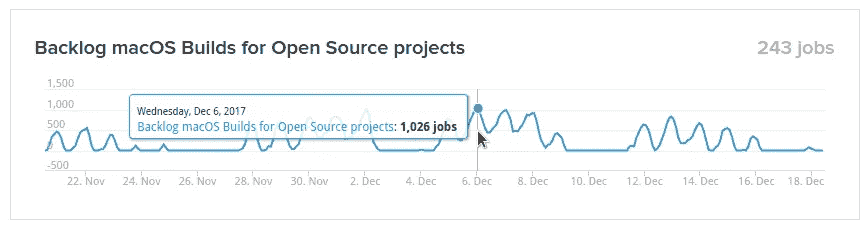
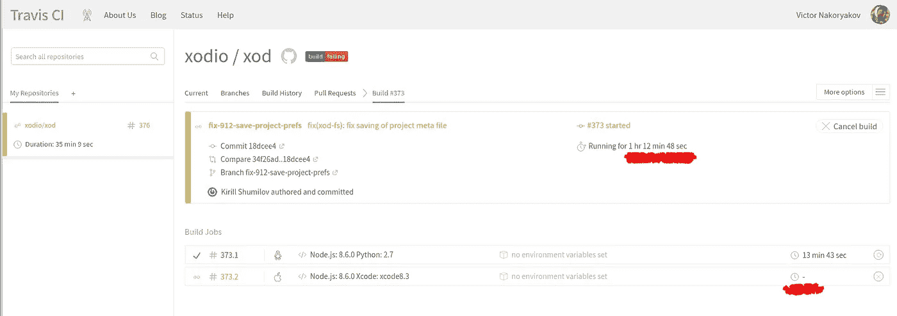
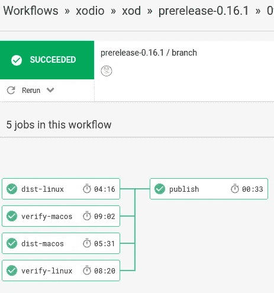
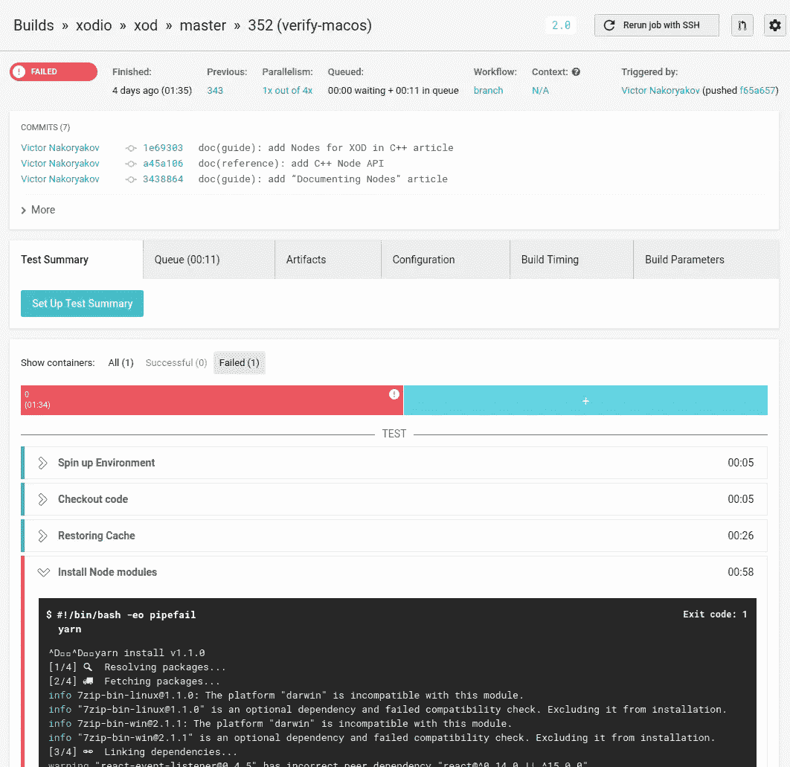

# XOD 为什么从特拉维斯转到圈 CI

> 原文：<https://medium.com/hackernoon/why-xod-switched-from-travis-to-circle-ci-98b6832f2d96>

我们开发了 XOD。这是一个开源的可视化编程 IDE，可用于 Windows、macOS、Linux 和浏览器。从一开始，我们就使用 [Travis CI](https://travis-ci.org/) 在 Linux 和 macOS 上构建、测试和打包发行版。最近我们转到了[圈 CI](https://circleci.com) 。我对这种改变很满意。为什么？请继续阅读。

# 性能问题

在过去的一年半时间里，XOD 在代码方面有了显著的增长。如果说一年前完整的 CI 周期需要 5 分钟左右，那么最近它用机器时间就超过了 25 分钟。这是为了在制品集成。当我们发布一个新版本时，持续时间可以超过 90 分钟。

把 Travis 本身的额外基础设施问题放在这里(下面会有更多)，每天合并 3-4 个拉请求是我们能承受的最大速度。

你可能认为我们有一个太大的项目，应该分成多个回购。嗯，它*是*一个[大 monorepo](https://github.com/xodio/xod) ，但是它并没有阻止开发者在他的机器上在几分钟内完全构建和测试 XOD。

## Mac 供应时间

我们可以暂时接受 25 分钟的构建。并行构建的机会不多了。但有个问题我们无论如何都不能影响特拉维斯。这是 Mac 供应。

这可能需要几个小时。这不是秘密。参见他们的[状态页面](https://www.traviscistatus.com/)上的“开源项目的积压 macOS 构建”。上百(！)的构建堆叠在队列中等待机器。

The plot shows queue length. The groups of five hills are workdays of a week.

更糟糕的是，我不能付钱去买优先池什么的。大约两个月前，他们强迫我们从商业计划转向免费计划，仅仅因为我们的 GitHub 回购是公开的。

公平地说，Travis devs 在过去的几个月里一直在努力解决这个问题。他们对每个项目设置了一些 Mac 限制，等等。但无济于事。我不明白，如果你不想在队列中坐很长时间，他们为什么不能“简单地”将 Mac-cluster 的容量翻倍并拿钱。

## 导火线

正如我说过的，当我们发布时，CI 会构建发行版。[发布过程](https://github.com/xodio/xod/wiki/Releasing-a-New-Version)本身相当复杂，需要几个小时的细致工作。你最不希望看到的是构建失败，因为你知道一切*都应该*编译好，因为你前一天已经排练过了。

最后，我们只是闲逛。我们无法发布 0.16.0，因为对 Travis 的功能测试在没有明显原因的情况下随机失败。每个重建周期需要 20 分钟(外加 30–90 分钟的资源调配时间),并在另一个“随机”点再次失败。

A pretty common scenario. The build has not even started after an hour of wait.

嗯，在我们的套件中有*和*一个古怪的功能测试问题。我们依靠 WebdDriverIO 来运行应用程序和模拟用户操作。它似乎有一个依赖于性能的 bug，这个 bug 不会出现在本地机器和 Circle CI 上。我们将使用 Puppeteer 和 headless Chrome 重写测试套件，但这需要时间，我们希望让事情一直运行到完成。

这档节目让我不得不立即寻找替代品。

# 圈出 CI 作为替代项

选择相当容易。除了 Travis 和 Circle，我没有找到支持 MAC 的 CI SaaS。我给了 Circle CI 一个尝试。

令人惊讶的是，迁移非常容易，不到 24 小时就完成了。我们能够在第二天发布。

切换很简单，不是因为有一些“导入”工具或者配置结构非常相似，不，它们差别很大。因为 Circle CI 最近推出了他们全新的 2.0 平台，有[优秀医生](https://circleci.com/docs/2.0/)。

2.0 的概念如此简单而强大，以至于我能够在不到一天的时间里复制 90%的 CI 流程，包括缓存、并行化、GitHub 集成等。

有几个星期的 CircleCI 经验，我可以比较这两个服务并排。

# 切尔莱奇对特拉维斯奇

## 表演

Linux 常规版本:Travis ~12m，Circle ~9m
Linux 发布版本:Travis ~15m，Circle ~9m(没有因并行化而发生变化)
Linux 供应:在 Travis 和 Circle 上只需几秒钟

macOS 常规版本:Travis ~ 21–25m(不稳定)，Circle ~9m
macOS 发布版本:Travis ~ 24–45m(不稳定)，Circle ~9m
macOS 配置:Travis weekend —几秒钟，Travis workday —从 5m 到几小时，Circle —几秒钟

分支机构建立挂钟时间:特拉维斯-从 30 分钟到几个小时，圈-9m

是的，Circle 在 9 分钟内建立 XOD，总是，不管今天是什么日子，太阳在哪里。如果幸运的话，特拉维斯可以在 3000 万英镑内完成。

The total time is 09:35\. Parallelization helps a lot.

如果您打算在 Mac 上进行构建，这就是您应该知道的全部内容。

获胜者:切尔莱西

## 机器和基础设施

Travis 和 Circle 似乎使用相似的 Linux 机器配置。但是 CircleCI 真正支持 Docker 容器。我可以使用自己的 docker 映像来运行构建。因此，我可以预先安装、配置和调整一切，以节省构建开始时的几分钟时间。在 Travis 上，我不得不一遍又一遍地“升级和安装”。

Mac 由 [Mac Stadium](https://www.macstadium.com/) 为特拉维斯提供。不确定它们的配置，但与 Linux 版本相比，它们执行相同任务的速度要慢 2 倍。不知道 CircleCI 把他们的 MAC 带到哪里去了，但是性能上和 Linux 机器相当。

这两个服务都不提供 Windows 机器。这对任何一方来说都将是 T2 的巨大利益。在这种情况下，它将是市场上唯一一款支持所有桌面操作系统的 CI SaaS。

**冠军**:切尔莱西

## 网络界面

特拉维斯的用户界面看起来很老派。圆在审美上更现代。但是，从可用性的角度来看，特拉维斯更清楚。他们有更少的视觉噪音，更明确的色彩和动画。如果有东西在跑，那它就是在旋转。如果有什么错误，它会在一个基本上是灰度的页面上用鲜艳的红色显示出来。

CircleCI 经常试图将我切换到另一个 GitHub 组织，这个组织非常混乱，看起来我失去了所有的历史。

如果你使用 CircleCI 的现代功能和推荐的工作流程，仪表盘(即起始页)在 circle ci 中毫无意义。重新启动构建的按钮并不总是如你所愿，按钮本身也不总是设置在直观的地方。

Can you spot the button to retry the failed build?… Yep, there is no such one on the build details page. You have to go back to build list and there will be “Restart” below failed builds. But (!) it will not recover your build anyway 😬

另一方面，CircleCI 有桌面通知。那是我第一次接受 Chrome 的“显示桌面通知”。它们对 CI 来说非常方便。

这两个服务都有很多 UI/UX 改进的空间。

获胜者:特拉维斯

## 构建日志

不知道是什么技术问题，但在 Travis 上，日志会不时损坏或根本无法渲染。记录本身被推到一个连续的滚动中，很难找到任务边界。

在 CircleCI 上，我还没有发现任何日志问题。并且输出被清楚地分成带有定时信息的可折叠部分。

**获胜者** : CircleCI

## 配置灵活性

这两种服务都使用您直接存储在 repo 中的 YAML 配置。但是建筑就大不一样了。

特拉维斯定义了一个非常严格的管道。您的项目安装、构建和部署。你可以在这里和那里部署，就这样。“—但是，但是…我们想部署在谷歌云存储上。—不可能，让它成为构建步骤的一部分。”

为了在 Travis 上实现并行，您应该使用为其他目的而存在的矩阵构建特性。在那里，您分配不同的环境变量集，然后执行一个小小的 Bash voodoo 来跳过构建的一些步骤并完成其他步骤。

CircleCI 2.0 有一个简单而强大的工作流概念。它允许您执行作业扇出、扇入、序列，以及与 Git 提交的分支和标记相关的所有操作。超级酷。

这两种服务都缺少一些功能。例如，两者都不能只观察回购的一部分，所以如果我处理文档，我不能跳过冗长的测试。CircleCI 配置往往有很多代码重复，因为我不能在 macOS 和 Linux 之间重用作业步骤的一部分。缓存系统非常简单:在这两种情况下，我都不能缓存编程派生的路径，只能缓存硬编码的目录。

**获胜者** : CircleCI

## 定价和开源支持

Travis 对员工收费，即兼职。花 129 美元/莫忧就能得到两份兼职。就这样，很简单。

圆形稍微复杂一点。它对 Linux 和 macOS 部分分别收费。你可以免费获得一个 Linux 工人，每增加一个工人每月要花费你 50 美元。要使用 macOS，你必须为 2 个工人支付 49 美元/月，但它额外限制了 500 分钟的 CPU 时间，所以如果你有一个更大的项目，准备好为 5 个工人 MAC 和 1800 分钟的 CPU 时间支付 129 美元/月。

XOD 是一个[开源](https://github.com/xodio/xod)项目，两个服务都支持开源运动(我猜他们很好地推销了他们的服务)。OSS 项目从这些服务中获得了什么？

Travis 让你免费在 Linux 和 macOS 上构建。5 名工人 0 美元。如果你是开源的*和*想要为更好的能力付费，你不能。

CircleCI 免费赠送 4 个 Linux workers 和 2 个 worker/500 分钟免费 macOS。只有在与 CCI 团队交谈后才能获得免费的 MAC 电脑。您可以定期购买的其他资源。

**赢家**:平局

对我来说，选择很明显。与 Travis 相比，CircleCI 2.0 似乎是下一代系统。

但是时间在流动，产品在进化。如果你要选择 CI SaaS，先两个都试试。每个都提供 14 天的免费试用。祝两个军种好运。