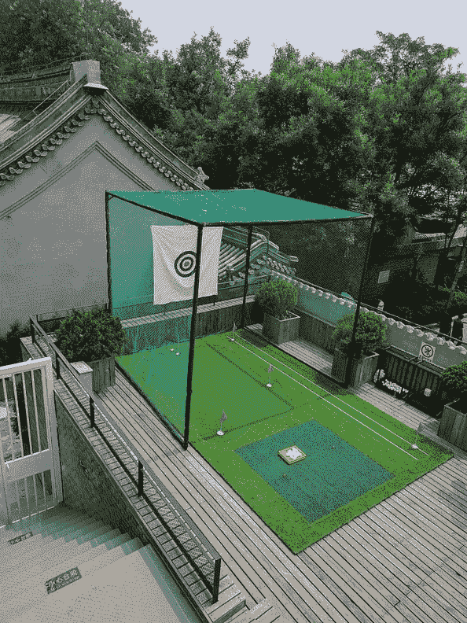
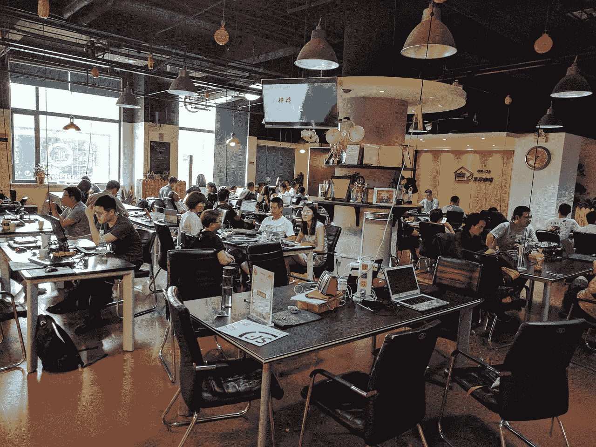
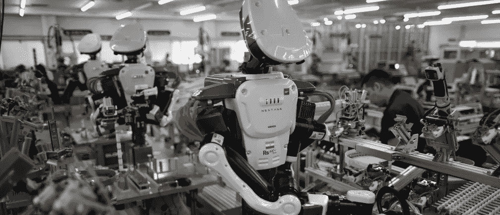
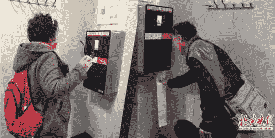
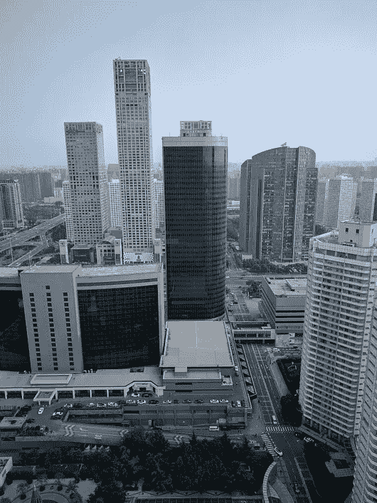

# 为什么你会选择在中国而不是在🇨🇳🇺🇸硅谷创业

> 原文：<https://medium.com/hackernoon/why-you-might-build-your-start-up-in-china-over-silicon-valley-b23ed7d63951>

## 从一位在旧金山湾区生活了 10 年的创始人的角度来看，中国和美国科技生态系统的差异。

位置很重要。来自世界各地的人才聚集在从圣何塞到旧金山 50 英里的土地上是有原因的。(*你可能会有兴趣去看看* [*史蒂夫·布兰克的《硅谷秘史》*](https://steveblank.com/secret-history/) *，一篇关于这个地方是如何形成的精彩演讲。然而，在这十年里，中国及其科技中心——北京和深圳——正在崛起成为硅谷在亚洲的抗衡力量。与众不同，充满机遇。展望未来 20 年，毫无疑问，中国将成为科技的中心。*

就我个人而言，我的下一个重大决定是去哪里进行下一次创业——硅谷还是中国。通过这个镜头，我开始了为期 8 周的中国之旅，在北京、上海、深圳和香港会见了朋友、企业家、首席执行官和投资者。我想从他们的第一手经验中了解在中国做生意——做科技生意——是什么感觉。其中一些是土生土长的中国人；有的是中国海归；其他人是外国人。

这些是我的发现。

It’s not too different. 1) mini-golf on the rooftop of a startup; 2) catered lunch; 3) a startup office park in Shenzhen; 4) a cafe / coworking space in Beijing

*如果你想了解在中国生活的感受，可以看看我之前的帖子:* [科技与文化相遇:在北京生活的第一周](https://hackernoon.com/week-1-of-living-in-beijing-3ae2ab6d0033) *。*

# 中国及其企业正在积极拥抱科技

首先，宏观趋势。

中国企业正在跨行业全面拥抱技术。它发生在各个行业，无论是传统企业还是国有企业，甚至是公司领导层对技术的了解程度。

> 人们普遍认为，采用技术——尤其是人工智能——将“升级”公司。

当然，传统行业和科技行业对技术的理解存在差距，更不用说对人工智能(在中国或多或少被用作大数据的同义词)的真正理解了。无论是通过利用现有的解决方案，如电子商务、社交网络，还是通过创造新的解决方案，这都会带来合作机会。根据我与管理层和投资者的交谈，硅谷技术有着特殊的吸引力。

诚然，许多这些计划中的合作伙伴关系可能是肤浅的，更多的是短期的公关噱头，但一个国家及其企业提升水平的远见和决心以及拥抱技术的意愿是不可低估的。中央政府大力支持，人工智能现在在政府当前的五年计划中发挥着重要作用。

Industrial applications per the Fourth Industrial Revolution, just one area where traditional industry is eager to adopt digital technology to “upgrade”. Source: [World Economic Forum](https://www.weforum.org/agenda/2016/06/leadership-challenges-of-the-fourth-industrial-revolution/)

在短期内，这为有创造力的产品经理提供了充足的机会，用技术解决方案来弥补业务需求。

# 艾是白热的

《纽约时报》在 2015 年 5 月的一篇文章中发布了这一消息:([链接](https://www.nytimes.com/2017/05/27/technology/china-us-ai-artificial-intelligence.html)

> “这是新一代计算机的竞赛，”战略与国际研究中心的高级研究员詹姆斯·刘易斯说。“不同之处在于，中国似乎认为这是一场竞赛，而美国不这么认为。”

我认为这概括了中国对人工智能的态度。如果你认为人工智能、机器学习、深度学习是谷中被过度使用的词汇，试试去北京参加一个商务会议，甚至只是打开电视。的确，与硅谷的技术人员相比，许多人可能几乎(甚至不)理解它是如何工作的，但这并没有削弱它的影响力。中国将人工智能视为第一个可以与硅谷正面竞争的技术领域。

北京人可能在语言上有优势。请这样想:北京的大多数工程师都可以很容易地理解并访问 arxiv 上的英文论文。硅谷有多少工程师能够/愿意/想要接触到北京用中文进行的研究和讨论？2017 年，中国作者关于 AI 的被接受论文比美国作者还多。

Less than glamorous, but real application. Facial recognition used to dispense toilet paper at public restrooms, so people don’t take the whole roll.

# 天赋，天赋，天赋

招聘很难。这几乎是普遍现象。在中国也是如此。

首先，我们来谈谈需求。拿这个数字来说:中国每天有 15000 家公司在*成立*。就想想对人才的需求吧！

然后，我们来谈谈供应。是的，中国有很多人和很多大学毕业生，国内的和从国外学习/经历的海归。但是，技能各不相同。虽然教育系统正在改革，毕业生越来越有能力，但普通毕业生独立工作和创造性工作的能力仍有差距。找到一个*合格的*人选需要时间。

最后，竞争。要想在竞争中击败 BAT(百度、阿里巴巴、腾讯)，初创公司必须提供全套服务:增长机会、股权、*和*更高的薪水。很多人根本不在乎股票期权，更喜欢手握现金。在硅谷，创业工程师会牺牲薪水去加入一家初创公司，相比之下，中国的文化趋向保守。这里有一个比较水平的一瞥([知乎链接](https://www.zhihu.com/question/27108669))。

这些都导致了人才竞争的激烈。一些最优秀的人才是从其他公司挖过来的，而且往往是非常激进的。虽然最好的(或联系最紧密的)创业公司能够建立充满海归和顶尖人才的团队，但其他人就没那么幸运了。

# 创业文化是由现实需求驱动的

要理解创业文化，我们需要更深入地了解当前二三十岁这一代人的动机。

YC 创业学校的第一课( [YouTube 链接](https://www.youtube.com/watch?v=ZoqgAy3h4OM))告诉我们，本质上，“不要为了钱而创业”，因为在早期阶段加入“脸书”会带来更好的财务结果。但这背后的考量在中国是不同的。

我们需要谈谈住房问题。让我们做一些信封背面的数学计算。在旧金山和北京，一套普通“新房”的价格都在 100 万美元左右。

Beijing, where making a living is a real concern. 1) these nice looking buildings are out of most people’s range. 2) rush hour subway. 3) a [condo inside 4th ring](https://bj.lianjia.com/ershoufang/101101947306.html), 2br for US$2M

在一个房价高得惊人的国家，许多年轻人一辈子都买不起房子。让我们做一些简单的数学计算。将这一现实与《聚焦》中展示的阿里巴巴、京东、小米——基本上是所有科技巨头——的白手起家故事相结合，许多企业家决定自己唯一的出路是创办公司。有人可能会说，是 it 经济迫使他们出手的。

这就是科技生态系统所处的文化。

要谈论科技公司的文化，我们必须谈论普通人的文化。一家公司的文化在一定程度上取决于其客户的文化，为了服务 13 亿中国本地客户，一家公司需要欣赏本地文化。用产品术语来说，就是欣赏当地用户的行为，并使你的产品适应这种行为，而不是期望你的用户做出改变，这样他们才能使用你的产品。最初推出时，优步只支持信用卡。在一个只有精英拥有信用卡的现金社会(这是移动支付出现之前的情况)，优步只属于白领和外国人，而滴滴建立了强大的本地基础。

## 客户期望的差异。

西部基础设施发达。毕竟，它被称为“发达”国家是有原因的。中国的不是。这为敏锐的眼睛提供了机会。但是每个人都有一条利用这些机会的共同点——它们根植于当地文化。正如你不能指望一个去美国留学的中国学生会创立下一个脸书一样，你也不能指望一个外国人、外籍人士或最近回国的人会在中国创立下一个颠覆性的公司。至少不是一个人。创始团队需要有本地*背景*。

我见过的一个例子是，以中小企业为目标的 SaaS 公司需要一个本地的线下销售(不是客户成功)团队。什么？！因为当地消费者希望某些服务的指导能够亲自完成。毕竟他们已经习惯了，因为/而且劳动力这么便宜。

# 融合硅谷和中国

越来越多的中国人从美国(尤其是硅谷)回国创办公司。他们找到的公司是硅谷和中国的混合体。

硅谷通常被视为技术专家、理想主义者和纯粹主义者的聚集地。当涉及到硬技术、算法和新兴技术(人工智能、虚拟现实/增强现实、生物技术等)时，它是被接受的。)，硅谷就是要去的地方。硅谷也被视为一个人们追逐“改变世界”的理想主义梦想的地方，在这里人们以正确的方式做事。

另一方面，企业家认为中国是一个真实、踏实、实用的地方。人们关心技术的应用；结果，一些最好的产品经理在中国成长起来。创始人和投资者更关心现金流和让公司盈利，对长期回报缺乏耐心。

## 文化适应需要 18 个月

一个创始人需要尊重在中国经营公司的现实。平均而言，创始人告诉我，他们从美国搬到中国后，需要 1-2 年时间才能完全理解和适应宏观文化。

最好的公司像硅谷公司一样管理产品和工程，比如敏捷、设计、协作、快速失败等等。他们像一家纯血统的中国公司一样运营，知道如何处理政府、当地合作伙伴关系，并根据需要转向灰色区域。

# 运营效率很高

如果有一个词是我反复听到的，用来形容在中国经营科技企业的话，那就是效率。资本效率，时间效率，资源效率。换句话说，这是初创公司的战斗口号:快速行动，斗志昂扬。

## 人工成本更便宜。

无论是熟练劳动力还是非熟练劳动力都是如此。百度一名高级工程师的基本工资是 4 万美元，大约是山景城的四分之一。如果在美国筹资，这意味着同样的资金现在可以给你提供更多的工程师。

一个流行的神话是，本地人才没有美国人才“好”，但想想看:中国是一个有 13 亿人口的国家，一个高度重视教育的国家(这是一种保守的说法)。许多毕业生出国深造，获得学士、硕士或博士学位。T2 有人才，但就像任何地方的人一样，你必须雇佣并管理好他们。

On-the-ground logistics team of bike sharing companies

获得廉价的非熟练劳动力可能会对创业公司的运营产生更大的影响。许多任务在早期可能不需要自动化，而是由人来处理。这使得公司更加敏捷和灵活。它也可能直接影响商业模式。在某种程度上，自行车共享在中国行得通，因为摩拜单车/ofo 可以聘请实地运营团队在每个地铁站组织自行车停放，并在周围穿梭自行车。

## 9–9–6 / 9–9–7

这代表“一周 7 天，每天早上 9 点到晚上 9 点”这是中国大多数早期创业公司的运作方式，无论是创始人还是早期员工。这是可能的，因为年轻、饥饿的一代工人希望在他们的生活中有所作为。

这种昼夜不停的节奏会产生神奇的效果。一家公司行动迅速，要么快速迭代走向成功，要么快速失败。无论哪种方式，都不会浪费时间；在中国的一年感觉像在其他地方的许多年。时间效率。

## 💩或者离开大麻

总的来说，这说明在中国建立一家公司实际上是非常高效的。一个 VC 曾经跟我说过，你一般可以根据刚投资一个月就判断一个公司是不是要做了。

这种情况屡见不鲜。如果一个 Kickstarter 项目在 6 个月内发布，可能会被视为很快，但如果一个硬件项目在 2 个月后才发布，则被视为迟到。每一轮后续融资预计在 6 个月后进行。

(顺便说一句，当有人去年第一次告诉我自行车共享是中国最热门的事情时，我在理智上承认了她，但没有多想。看到它并亲自尝试，让我大吃一惊。去说多少，字面上，跑腿是需要真正了解一个市场。)

# SaaS 仍处于发展初期

中国最大的科技公司都是 B2C 企业、BATJ、游戏公司等。这是有道理的——有巨大的消费者基础和消费需求。然而，奇怪的是，SaaS 没有 B2B 公司，而 B2B 公司构成了硅谷生态系统的很大一部分。

经过多次讨论，我的结论可以归结为:中国还没有养成购买软件的习惯。在美国，人们和企业乐于为软件提供的价值付费，而中国则经历了以盗版猖獗为标志的 20 年科技快速普及。

今天的决策者不习惯为一个没有人情味的纯数字软件付费——SaaS 在 Calendly，Gusto，Pipedrive 的静脉。作为消费者，他们没有养成这种习惯，同样，SaaS 也从未成为商界的一种趋势。一个有趣的类比是游戏。中国是数字游戏的头号市场，但这一切都来自游戏内购买。人们更愿意购买游戏中的东西(服务)，而不是游戏本身(软件)。

然而，这种情况正在改变。这一代年轻人在数字支付的环境中成长，并开始接触订阅模式。例如，QQ、爱奇艺和腾讯视频都有 VIP 会员选项，类似于 Spotify 和网飞。这一代人的消费习惯最终会渗透到工作场所。

越来越多的初创公司开始填补这个领域。小首义的 CRM 产品已经筹集了超过 5000 万美元。在石墨有一个 Google Drive 的复制品。阿里巴巴的丁丁是一个成功的 Slack 克隆。愿意付费的企业市场扩大只是时间问题。

# 结论

最后我要说一件事。这次旅行让我看到了对中国的盲目。它不再是简单地追赶美国；相反，中国和美国在发展方面取得了进展。如果你对中国感兴趣的话，我建议你多看看，多关注，如果可能的话，多去看看。那里是一个令人兴奋的世界。

感谢所有与我交谈过的人，他们慷慨地分享了时间和见解，让我得以深入了解市场。

如果有什么我错过了我们弄错了，请让我在回复中知道。如果你喜欢这个帖子，请出示你的♥:)