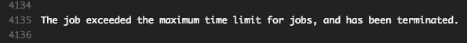
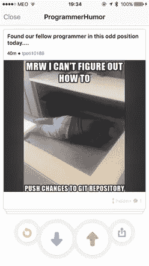
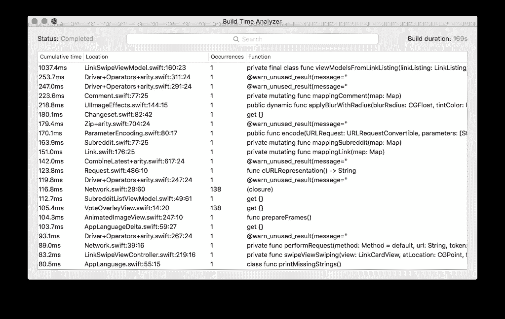

# 为什么您应该关心您的快速编译时间

> 原文：<https://medium.com/hackernoon/why-you-should-care-about-your-swift-compile-time-f69f9054610c>

这是一个关于 Travis-CI T2 50 分钟构建超时 T3 让我关心代码编译时间的故事。

**TL:DR:** 安装[构建时分析器](https://github.com/RobertGummesson/BuildTimeAnalyzer-for-Xcode)，将[这个](https://gist.github.com/ivanbruel/408e5b1fd11fcce83de6e7ffb3de24ea)添加到你的 Podfile 中，[修复](/@RobertGummesson/regarding-swift-build-time-optimizations-fc92cdd91e31#.ial53sjhi)你的代码，[为你的依赖项制作 PRs](https://github.com/BradLarson/GPUImage2/pull/60) ，花更少的时间编译。

# 特拉维斯·CI 的奋斗

Travis CI 与许多其他 CI 平台一样，为开源提供了一个免费层，但并非没有限制。在 Travis 的具体案例中，限制是 [50 分钟的构建时间](https://docs.travis-ci.com/user/customizing-the-build#Build-Timeouts)。

我理解为开源项目提供这样一个伟大工具的服务器成本，但这种限制似乎也存在于[Travis-CI.com](http://travis-ci.com)上(Travis CI 的付费版本)。

尽管这对于测试大型框架来说不成问题，例如[rx swift](https://github.com/ReactiveX/RxSwift)(997 次测试)或[react ive cocoa](https://github.com/ReactiveCocoa/ReactiveCocoa)(1508 次测试)，但是对于测试/部署具有大量依赖项和/或庞大代码库的实际应用来说就不一样了。

# 瑞士作为研究案例

SwipeIt — Reddit with a swipe

在过去的几个月里，我一直在开发 [SwipeIt](https://github.com/ivanbruel/SwipeIt) 作为基准测试的一部分，在 [iOS](https://hackernoon.com/tagged/ios) 开发中开发 [MVVM](https://en.wikipedia.org/wiki/Model%E2%80%93view%E2%80%93viewmodel) 和 [MVC](https://developer.apple.com/library/ios/documentation/General/Conceptual/DevPedia-CocoaCore/MVC.html) (你可以在[另一个媒体故事](/faber-dev/mvvm-benchmark-in-an-mvc-world-part-1-dab952617395)中了解更多)。

*SwipeIt* 是一款 *Tinder* like app，用于[*Reddit*](https://www.reddit.com/)*在这里，你必须投票支持或否决一个链接，才能进入下一个链接。*

*作为参考*，SwipeIt* 在单元测试目标上有大约 10 个依赖项，编译 72 个*。swift* 文件(其中 16 个是 *specs* )复制 20 个 bundle 资源(包括 *JSON* 文件和 *HTML* )。*

*至于实际的应用目标，它有 28 个依赖项，编译 132 个*。swift* 归档并复制 6 个捆绑包资源。*

*Travis 上的[最后一次(未优化)成功测试运行](https://travis-ci.org/ivanbruel/SwipeIt/builds/150973201)耗时 14 分钟，通过了 77 项测试。在这 14 分钟里，只有 **2.4 秒**花在了实际测试上，而其余的时间都花在了构建所需的文件上。*

## *接下来是部署*

*这就是构建时间变得困难的地方。鉴于单元测试在 [*调试*](https://hackernoon.com/tagged/debug) 构建设置上运行，对 *Fabric* 、 *Testflight* 或 *HockeyApp* 的任何部署都应该在*发布*构建设置上运行。这导致共享依赖项和被测试代码的实际构建时间增加了 2 倍。*

**

*Jack Bauer meme, circa 2004*

*正如在 [Travis-CI 的构建历史](https://travis-ci.org/ivanbruel/SwipeIt/builds)中可以看到的，一个*测试*和*部署*策略花费了超过 50 分钟的阈值。*

# *Swift 和构建时间分析器*

*众所周知，Swift 在类型推断、零合并运算符、强制转换、惰性属性和其他一些方面存在编译时问题(更多信息，请查看[这篇精彩的帖子](/@RobertGummesson/regarding-swift-build-time-optimizations-fc92cdd91e31#.ial53sjhi)和[的后续文章](/swift-programming/swift-build-time-optimizations-part-2-37b0a7514cbe#.t4h9ch9dr))。*

*有了[构建时间分析器](https://github.com/RobertGummesson/BuildTimeAnalyzer-for-Xcode)，我们可以很容易地了解哪些部分的代码编译时间最长。*

**

*SwipeIt’s Build Time Analyzer*

*尽管 BTA 确实有助于调试我可能做错的地方，但是大部分编译时间实际上都花在了依赖项上。*

*将上面的代码添加到你的 *Podfile* 将确保你可以*构建时间分析器*也将分析你的 *Cocoapod* 依赖项。*

# *拯救世界一次一个公关*

**

*当时我发现我的大部分编译时间都花在了两个流行的库上， [GPUImage2](https://github.com/BradLarson/GPUImage2) 和 [ObjectMapper](https://github.com/Hearst-DD/ObjectMapper) 。*

*从我的两个拉请求[这里](https://github.com/BradLarson/GPUImage2/pull/60)和[这里](https://github.com/Hearst-DD/ObjectMapper/pull/557)可以看出，通过解决 *Swift* 的编译器问题，可以节省很多时间。*

*虽然在 *ObjectMapper* 上节省 **1 秒**和在 *GPUImage2* 上节省 **9 秒**可能看起来无关紧要，但这些指标是在最新的 Macbook Pro Retina 13 英寸上获得的。不是每个使用这些库的人都有如此强大的笔记本电脑，尤其是在 CI 平台上，这几秒钟可能会变成几分钟。*

*最后，通过优化我的代码、隔离测试目标和调整我的 [*【浪子*](https://github.com/ivanbruel/SwipeIt/blob/master/fastlane/Fastfile) 配置，我让 *SwipeIt* 只花了 7 分钟来测试和 33 分钟来测试*+*在 Travis-CI 上部署*任务[。](https://travis-ci.org/ivanbruel/SwipeIt/builds/158714039)**

**我的干净构建也少了很多:)**

************

> **[黑客中午](http://bit.ly/Hackernoon)是黑客如何开始他们的下午。我们是 [@AMI](http://bit.ly/atAMIatAMI) 家庭的一员。我们现在[接受投稿](http://bit.ly/hackernoonsubmission)，并乐意[讨论广告&赞助](mailto:partners@amipublications.com)机会。**
> 
> **如果你喜欢这个故事，我们推荐你阅读我们的[最新科技故事](http://bit.ly/hackernoonlatestt)和[趋势科技故事](https://hackernoon.com/trending)。直到下一次，不要把世界的现实想当然！**

****