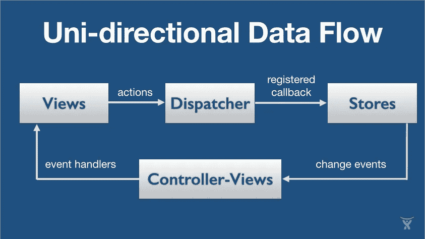
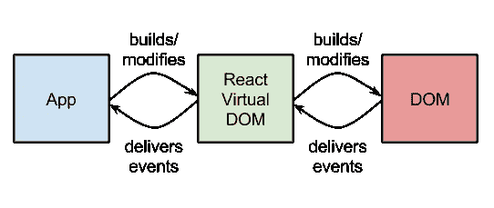
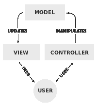
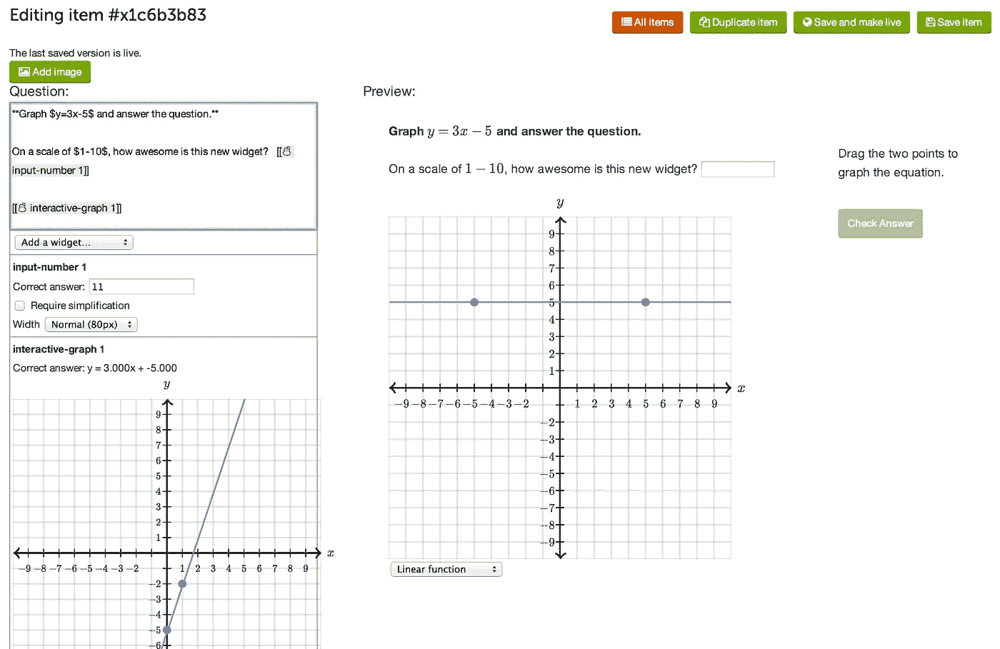

# 为什么您应该将 React 集成到您的网页中

> 原文：<https://medium.com/hackernoon/why-you-should-integrate-react-into-your-webpage-31c586f6631c>

## 那么，这是什么‘反应’呢？

我对此的反应是——

所以基本上 React.js 是一个由脸书和 Instagram 合作创建的 JavaScript 库。它允许开发者创建快速的用户界面。

Source: codementor.io (Not to be confused with the Big Bang Theory logo)

## 让我们讨论一下 React 的一些基本特性。

React.js 的一个独特特性是——它可以在客户端和服务器端执行。

React 可以让你表达你的应用在任何给定时刻应该是什么样子，并且可以在底层数据改变时自动管理所有的 UI 更新。

React 有一个相当小的 API。这使得它使用起来有趣，容易学习，简单易懂。

它将 JavaScript 和 HTML 捆绑到 JSX 中(JSX 是将 XML 语法添加到 JavaScript 中的预处理步骤)，这使得组件易于理解。

事情会变得更加技术性。别担心，坚持住，你会熬过去的。我保证。

## 现在让我们继续讨论 React 的优势—

**SEO** — SEO 是通过从服务器向浏览器发送完整的渲染页面来实现的。React 的设计考虑到了 SEO，使用 Node 在客户端或服务器上呈现。

**单向数据流** —单向数据流是在函数式反应式编程中发现的一种技术。这种方法的主要好处是数据在你的应用程序中单向流动，你可以更好地控制它。

Source: facebook.github.io

**改进的代码重用** — React 是唯一能够为组件提供性能和全面管理的渲染生命周期的产品；结果是极大地改善了开发人员的人机工程学。

ReactJS 是一个管理 DOM(文档对象模型)的优秀框架，尤其是在处理大量数据时。React 的工作原理是用 JavaScript 创建一个虚拟 DOM，作为 DOM 的中间表示。这种表示使得决定在 DOM 中改变哪些元素以及结果可能是什么变得很容易。

Source: [mediatemple.net](http://mediatemple.net/blog/tips/angularjs-vs-react-which-one-to-pick/)

**React 是，著名的，MVC 中只有 V(视图)** —模型-视图-控制器(MVC)是一种在计算机上实现用户界面的软件架构模式。它将给定的软件应用程序分成三个相互连接的部分，以便将信息的内部表示与信息呈现给用户或用户接受信息的方式分开。

你可能会认为这是一个缺点。再想想。这就是它应该做的，它是专门为这个特殊目的而设计的。你不能把它和 Angular.js 这样的网站相比，这显然是它最受关注的竞争对手。

所以你一定在想，所有公司都在他们的网站上整合了 React。别担心，我会掩护你的。

## 让我们看看使用 React 的主要网站

猜猜第一个使用它的公司没有奖励:

**脸书-** React 是由脸书工程师开发的。帖子下面的反馈和下拉通知是在 React 上创建的，因为它们是客户端密集型的 UI。此外，业务管理工具、回看视频编辑器、页面洞察以及大多数(如果不是全部的话)新的 JS 开发都是在 React 上完成的。脸书的软件工程师斯潘塞·阿伦斯先生说

> “很难改变而不在应用程序的其他地方引起一些副作用或错误…当团队在 React 中重建它时，他们发现他们引入新错误的比率已经达到了最低点”

**Instagram-** 它 100%建立在 React 之上，包括公共网站和内部工具。

**可汗学院-** 大部分新开发的都是对上反应。在他的 Quora 帖子中，Ben Alpert 展示了他如何使用 React 来改进界面。他是这么说的-

> 我在 React 中重写的项目(我还在继续改进)是 Khan Academy 问题编辑器，内容创建者可以使用它来输入将呈现给学生的问题和提示:

> 左侧有实际的编辑器，而页面的右侧显示你正在写的问题的实时预览。最初，编辑器将序列化整个问题并将其交给预览器，预览器将问题呈现到页面上。

我想我已经给了你足够的理由来证明 React 不仅仅是一个方便的工具。它被 500 多个网站使用，这个数字不会很快下降。

HelloMeets 即将举办的研讨会-

[**Photoshop 工作坊——8 月 27 日周六|上午 10 点到下午 2 点**](http://www.hellomeets.com/photoshopforbeginners/#design)

[**React 研讨会—8 月 28 日周日|下午 2 点到 7 点**](http://www.hellomeets.com/react-workshop/#beginners)

[**数字营销研讨会—8 月 28 日周日|上午 11 点至下午 5 点**](http://www.hellomeets.com/digitalmarketingstartups/#marketing)

博客作者——[伊希明·辛格](https://www.facebook.com/ishmin.singh?fref=ts)， [HelloMeets](https://medium.com/u/8d8f0c050dc8?source=post_page-----31c586f6631c--------------------------------) 的科技内容作家

> [黑客中午](http://bit.ly/Hackernoon)是黑客如何开始他们的下午。我们是 [@AMI](http://bit.ly/atAMIatAMI) 家庭的一员。我们现在[接受投稿](http://bit.ly/hackernoonsubmission)，并乐意[讨论广告&赞助](mailto:partners@amipublications.com)机会。
> 
> 如果你喜欢这个故事，我们推荐你阅读我们的[最新科技故事](http://bit.ly/hackernoonlatestt)和[趋势科技故事](https://hackernoon.com/trending)。直到下一次，不要把世界的现实想当然！

