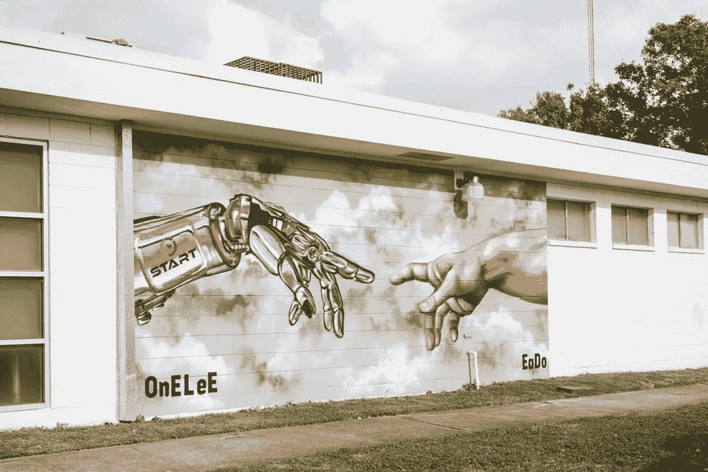
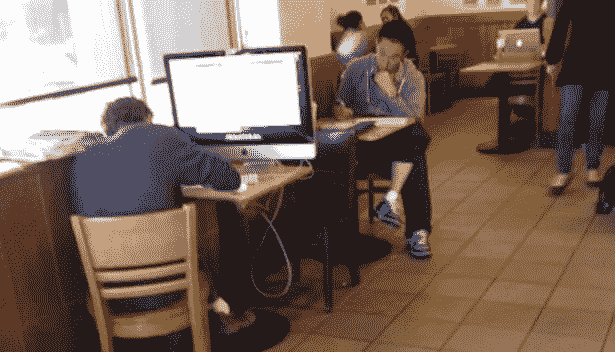
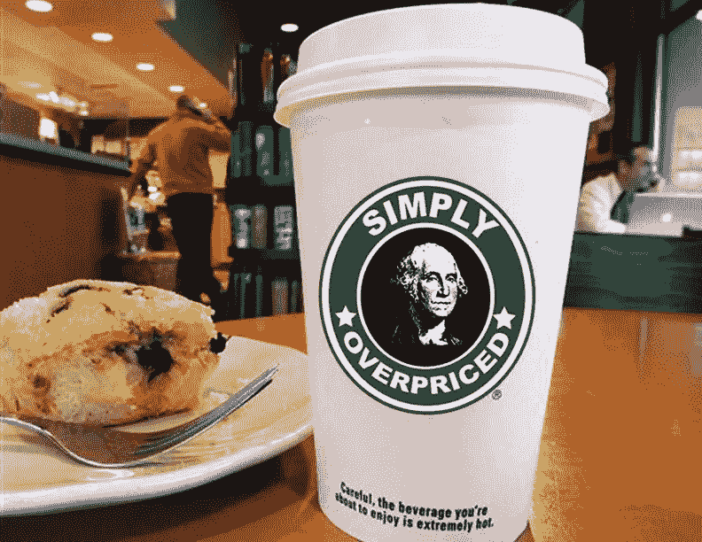

# 为什么你今天应该加入你当地的共同工作空间？

> 原文：<https://medium.com/hackernoon/why-you-should-join-your-local-co-working-space-today-68ce0dff054e>

Start Houston Co-Working space in Houston, TX

几周前，我和我的朋友讨论办公空间，我告诉他，我已经成为当地合作空间的一员有一段时间了。

他看着我，带着困惑的表情说，“为什么你要浪费钱在一个共同工作的空间，当整个城市都有很多像星巴克这样的咖啡店的时候？”理解了他的想法，我确实相信在咖啡店里建立你的自由职业者" [Dev shop](https://hackernoon.com/tagged/dev-shop) "是任何精益开发者/设计师/自由撰稿人应该着手经营他们的生意的方式。但后来我花时间分析了加入我当地的共同工作空间与在星巴克工作的机会成本。

这里是

为了进行比较，我考虑了以下因素:

1.成本——我每月的花费是多少？

2.环境——我周围发生了什么？

3.联系——我要见谁？

**1。** **成本**

让我们扩展一下在星巴克工作 30 天的例子。平均而言，我在一天中会花费以下时间:

-两杯饮料，每杯 3 美元= 6 美元

-一份零食@ $2 = $2

-午餐@ $6 = $6

总计= 14 美元

当外推超过 30 天时= 14 美元/天* 30 天= 420 美元/月

即使我选择一天只喝两杯，价格仍然是= $ 6 * 30 = $ 180/月

现在让我们来看看共同工作空间。现在，共同工作空间已经存在了一段时间，但由于寻找低成本办公空间的初创公司的兴起，它变得越来越受欢迎。

如今，美国联合办公空间的平均成本约为每月 250 美元，这取决于城市的生活成本和他们提供的便利设施。

大多数合作空间都提供以下便利设施:

1-会议室

双手机

3 台打印机

4-办公用品

5-高速互联网

6-淋浴

在 Start Houston，我每月支付 199 美元，包括免费能量饮料、咖啡、小吃、淋浴、打印和会议室。

与去星巴克相比，在 Start Houston 工作不仅省钱，还能给我带来更多。

**2。** **环境**

现在让我们来看一下咖啡厅的环境，并与共同工作空间进行比较。任何去过咖啡店的人都知道，每天的活动都有高潮和低谷。在典型的一天中，我会在以下三个时间看到大量活动:

1.上午(上午 5 点—9 点)

2.午餐高峰(上午 11 点至下午 1 点)

3.下午(下午 5 点—7 点)

也就是说，在这段时间里，我真的听到了顾客从低薪咖啡师那里点单时的喧嚣。

现在，在一个共同工作的空间里，即使不比在咖啡店里更吵，也可能相当吵，而且频率不一致。事实上，可能会有其他开发人员从晚上 10 点工作到凌晨 3 点。

Spaces vs Tabs — Silicon Valley

在大多数咖啡店，下午 5 点以后，噪音会逐渐减弱，直到商店关门。

在休斯敦开始，有高噪音的时刻，但总的来说，它是相当和平的。总的来说，比起共同工作的空间，我更喜欢咖啡店的噪音。

**3。** **人脉**

这可能是咖啡店和合作空间最大的不同点。是关系。

说到咖啡店，他们的主要目的是提供咖啡、茶和食物。它们从来就不是用来经营你的生意的。因此，许多人带着狭隘的目标而来。他们会去喝咖啡，会见他们已经认识的人，或者只是带走他们的咖啡。其他顾客之间很少互动。

在 Start Houston 和我所在的其他合作空间，每个人都希望他人成功。为了确保每个企业都得到他们需要的导师、资金和其他重要资源，有许多合作的努力。此外，每个月底都有一个“推销之夜”，企业家可以向潜在投资者推销他们的想法。

在咖啡店，你可以告诉其他顾客你在做什么，但他们可能会认为你太“爱出风头”。或者提供一个简单的，“这是一个很酷的想法，”但之后就没什么了。

因此，如果你像我一样，在加入一个共同工作空间还是在你当地的咖啡店工作之间犹豫不决，就跳跃一个月吧。我保证你不会后悔的。

如果你喜欢这个帖子，请告诉我。告诉我你在合作空间有什么经历。

如果你喜欢联系，我在以下方面很活跃:

[脸书](http://bit.ly/2cmONDS)

[推特](http://bit.ly/2dkfIFo)

[Instagram](http://bit.ly/2d9G6yd)

[Snapchat](http://bit.ly/2cRqimf)

> [黑客中午](http://bit.ly/Hackernoon)是黑客如何开始他们的下午。我们是 AMI 家庭的一员。我们现在[接受投稿](http://bit.ly/hackernoonsubmission)并乐意[讨论广告&赞助](mailto:partners@amipublications.com)机会。
> 
> 如果你喜欢这个故事，我们推荐你阅读我们的[最新科技故事](http://bit.ly/hackernoonlatestt)和[趋势科技故事](https://hackernoon.com/trending)。直到下一次，不要把世界的现实想当然！

