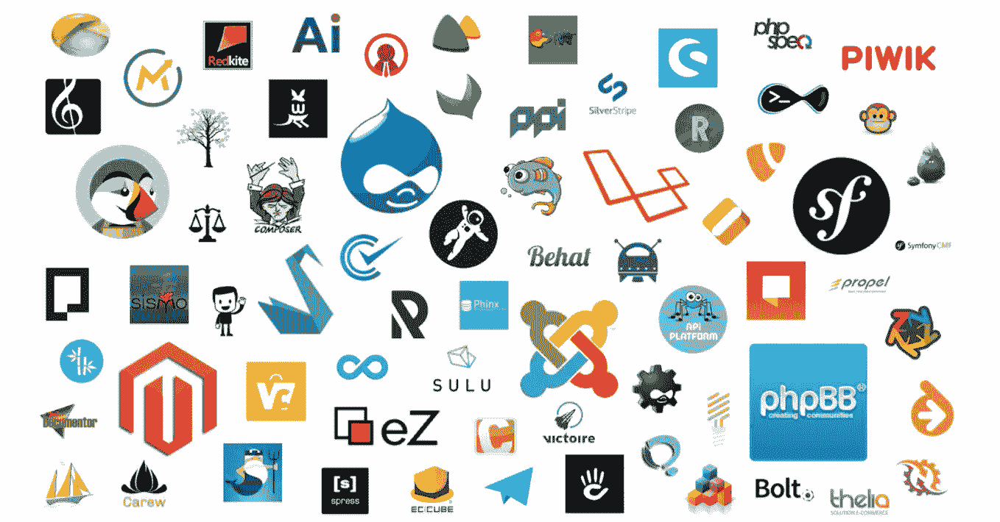

# 2017 年为什么要学 Symfony

> 原文：<https://medium.com/hackernoon/why-you-should-learn-symfony-in-2017-e0cf564f0b21>

了解 Symfony 项目是如何发展的，以及为什么它总是值得参与，但有所不同。

2011 年，当我开始学习计算机科学时，我使用 symfony 1.3 学习 PHP，我在 Symfony 2 的测试版上实现了我的第一个学生项目。

当时，我们正从一个提供后台的完全集成的全栈框架转向一个遵循 Java 社区中的框架:此外，Symfony2 的许多组件都受到了 JEE 的强烈启发。

PHP 5.3 刚刚问世，随之而来的是开始正确设计面向对象的能力。杨奇煜·波特尼尔最终强加了这个先决条件(最初，Symfony2 需要 PHP 5.2.7)，然后使用了 Composer，文档是完整的并且是英文的。

Zend Framework 1 正在失去他的受欢迎程度，当相反我们看到在最成功的法国公司中出现一些“Symfony developer”的工作机会时，没有更多的初创公司在它上面(在法国)启动。几年后，除了 Symfony 之外，没有人能想到用别的东西来制作 PHP 项目。

大型开源项目已经开始移植 Symfony 组件:如果不是第一个，SensioLabs 已经谈论了很多关于 [Drupal8](http://symfony.com/blog/symfony2-meets-drupal-8) 的事情，因为它是市场上最大的 CMS 之一。EzPublish、PHPBB、PrestaShop 和许多其他软件紧随其后，其中一些采用了完整的堆栈框架方法，而另一些则仅集成了一些软件块。

## 充满活力的成熟生态系统

The Symfony ecosystem — image belonging to Symfony News Twitter account

Symfony 生态系统已经丰富了越来越多的专业解决方案，并响应了标准版框架(所谓的“完整版”或“元包”)没有范围的具体业务问题。出现在最著名的:

*   [Laravel](https://laravel.com/) 框架，更容易访问和面向 RAD 的框架；
*   [Oro](https://www.orocrm.com/oro-platform) 平台及整个关联生态系统: [Oro CRM](https://www.orocrm.com/) 、 [Akeneo](https://www.akeneo.com/) 、 [OroCommerce](https://www.orocommerce.com/) 、[马雷洛](https://www.marello.com/)；
*   Sylius 电子商务框架；
*   专门设计 API RESTful [API 平台](https://api-platform.com/)的框架；

所有这些解决方案都非常受欢迎，并且需要真正的 Symfony 技能。

2017 年，Symfony 标准版在生态系统中的地位会如何？杨奇煜·波特尼尔决定在 3.4 版之后不再有标准版。

## 欢迎使用 Symfony Flex！

事实上，Symfony 的创建者计划用一个名为 [Flex](https://github.com/symfony/flex) 的 composer 插件来取代它，这有助于创建 Symfony 应用程序。

开发人员将有责任选择和添加他/她需要的依赖项。该系统根据“配方/模板”原则工作，其中 YAML 文件描述了 Flex 应该做的事情:例如，添加依赖项、配置和注册捆绑包或创建文件夹。

Flex 有两个“食谱”来源:[一个由 SensioLabs 验证的官方来源](https://github.com/symfony/recipes)和一个[社区来源](https://github.com/symfony/recipes-contrib)，在那里每个人都可以添加他们的食谱并提供给每个人。

简单来说，想象一下，你想在 2017 年使用 Flex 实现一个 RESTful API:理想的是使用 API 平台。由于 API 平台可通过 Flex 获得，您只需运行一个命令就能获得一个[可用的完整应用](/@fabpot/symfony-4-a-small-screencast-cf6511823f)。

我不得不承认，这种方法让我非常高兴，它加强了我多年来捍卫的观点:Symfony 项目不关注其框架，而是维护非常高质量和有良好文档记录的软件块。也许我们不得不等待 Symfony 3 的相对成功和像 Akeneo 这样的解决方案的流行，但我相信 Symfony 核心团队现在正朝着正确的方向前进。

如果你正在寻找关于 Flex 的更多信息，目前还没有任何官方文档，但是杨奇煜·普朗西尔已经发表了关于项目的一系列文章，我鼓励你阅读和试验，因为 composer 插件与 Symfony 3.3 兼容，并且可以独立于 Symfony 4 版本使用；)

## 好吧！但是我为什么要在 2017 年学 Symfony 呢？

2017 年，你不一定要学习 Symfony 框架，你必须学习和理解 Symfony 生态系统:

*   Symfony 应用程序如何读取 HTTP 请求并返回响应；
*   Symfony 应用程序如何构建和提供对象(称为“服务”)；
*   Symfony 应用程序如何在整个应用程序生命周期中分派和监听事件，以及如何查看和创建其事件；

熟悉这些概念使你能够很快适应 API 平台、Akeneo、马雷洛、Sylius、Drupal8、Laravel 和 Symfony 标准版框架。

## 组件呢？

我是 Symfony 组件的超级粉丝:它们由一个大型社区维护，有很好的文档记录，并定期发展。

一个特定组件的学习或使用显然取决于项目。下面是我的*最有用的库列表:*

*   *[**控制台**](https://symfony.com/doc/current/components/console.html) 组件:提供了一个完整的带有参数和选项管理的控制台，对于 CLI 模式的 PHP 来说必不可少；*
*   *[**Debug**](https://symfony.com/doc/current/components/debug.html) 和 [**VarDumper**](https://symfony.com/doc/current/components/var_dumper.html) 组件:它们在出错时提供更好的堆栈跟踪，而`dump`的作用是替代`var_dump`；*
*   *[**Finder**](https://symfony.com/doc/current/components/finder.html) 和 [**Filesystem**](https://symfony.com/doc/current/components/filesystem.html) 组件:它们为搜索和操作文件夹和文件提供了一个很好的 API*
*   ***Polyfill- *** 组件:它们允许应用程序使用由于 PHP 版本或缺少 PHP 扩展而不可用的功能；*

*所有这些组件都是“独立”工作的，用于大多数大型 PHP 项目中。*

> *所以继续学习和投资生态系统:Symfony(框架)已经死了，Symfony 项目万岁！*