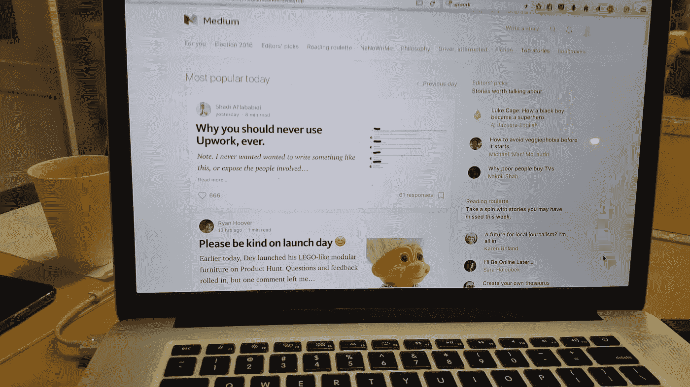

# 为什么永远不要使用 Upwork。

> 原文：<https://medium.com/hackernoon/why-you-should-never-use-upwork-ever-5c62848bdf46>

*注。我从来没有想过要写这样的东西，或者揭露涉案人员。然而，我觉得为了我自己的目的，有必要做一些事情，对于那些想进入自由职业者的世界，特别是使用 Upwork 平台的人来说，也有必要认真考虑一下。*

**自由职业者/顾问希望在网上增加收入？
我们一起上** [**推特**](https://twitter.com/dvassallo) **🖖**

**% %更新%<%>%**

媒体支持让我把所有图片都撤下来。是的，那是在我和 Upwork 谈过之后，然而那是加州时间周一早上，他们非常通情达理。不需要锡纸帽。

我创建了一个复制原件的帖子，你可以在这里看到，其中包括图像。

**(应媒体要求移除图像—此处查看原文******—)****

****(这里说的是网站，Medium 还让我删除了它的所有链接。说的网站其实是我的个人网站)****

**所有相关各方和许多其他人都联系过我。一个完整的后续职位将很快。**

**我甚至不能开始表达我对支持的感激，还有分享的故事。请记住，集体比少数人更强大。声音在互联网上回响。**

****< /%%更新%% >****

**现在，我不打算谈论 Upwork 最近的收费变化，即从自由职业者那里收取 20%的费用。我不想谈论他们收取的额外费用，他们提供的可怜的支持，他们的工作质量差。我不打算谈论他们提供的竞争的不可能性，因为他们被那些生活成本更低的国家的人严重削弱了。我不打算谈论他们的算法的愚蠢，他们的算法专注于从客户那里获得最多的钱，而不是提供最好的服务。**

**没有。你看，我实际上设法从 Upwork 赚钱了，你可以在这里看到我的简介—([http://www . up work . com/o/profiles/users/_ ~ 01 F4 aa 82 c 79 a 722261/](http://www.upwork.com/o/profiles/users/_~01f4aa82c79a722261/))**

**我做得很好，我甚至专门为 Upwork 制作了一个视频来展示我的技能。这成了我的主要收入来源和获得线索的途径之一。你可以看到我的反馈、我参与的项目以及我所有满意的客户。非常非常清楚。**

# **那你为什么还要写这个呢？**

**让我们回到 11 天前，这就是全部。**

**在我不得不写这篇文章的两周前，我被邀请参加一个标准分析的面试，在 GA 建立一个 Saleforce 帐户。非常基本的东西。我告诉客户预计时间和报价，然后他就消失了。这本身并不罕见。大约 10 天后，我得到了标准-**

**嘿，抱歉耽搁了，我需要 XYZ 在很短的时间内完成，等等，等等。任何做过自由职业的人都知道，客户就是这样。通常接下来是“我们也只能付给你大约一半，这是我们预算的任意数字，即使我们知道我们对我们实际上试图让你做的工作一无所知”。**

****(应媒体要求移除图片—查看原文** [**此处**](http://shadandjulia.com/never-use-upwork-ever/) **— )****

****(这里说的是网站，Medium 还让我删除了所有的链接。说的网站其实是我的个人网站)****

**当然，我对一家公司的“销售总监”也有同样的期望。但老实说，这只是一个自由职业者的日常生活，没什么值得大书特书的。**

**在接下来的一周，我将快进到很少接触到没有接触，在那里我试图得到一个基本的要点规格表，以便我可以准确地进入预算。尽管上述客户希望“尽快扭转局面”。**

**客户最终给了我登录信息，唉，还是没有工作。(他们实际上必须通过升级工作给你这份工作)。作为一名经验丰富的自由职业者，我总是持怀疑态度，非常多疑。尤其是当一个未来的客户只有 3.5 星级，却有超过 40 个以前的工作。**

****(应媒体要求移除图像—在此查看原文— )****

****(这里说的是网站，Medium 还让我删除了所有的链接。说的网站其实是我的个人网站)****

**经过 3 周的零星谈话，客户试图让我工作，但实际上并没有给我工作，我自己也厌倦了。我决定不去做这件事。**

**对于我来说，这通常是一个巨大的危险信号，对于正在阅读这篇文章的自由职业者来说也是如此。为了把工作做好，你需要可靠的沟通，一个愿意和你交谈的客户，并在至少 48 小时内帮你找到你需要的东西。如果他们不停地讨价还价以降低你的价格，低估需要完成的工作。如果他们试图用“长期工作”的承诺来验证低价。出去继续生活。**

****注意:客户给了我他们登录 Salesforce 的详细信息，这将在后面的故事中被证明是不可或缺的。****

****(应媒体要求移除图像—在此查看原文— )****

****(这里说的是网站，Medium 还让我删除了所有的链接。说的网站其实是我的个人网站)****

**这些信息确实说明了一切。回过头来看，我可以看到我写的东西是如何具有煽动性的。但你要记住，他实际上已经把我晾在绳子上 17 天了。这对于 Upwork 来说是很不寻常的。我只是想切断它，继续前进。**

**当我收到他的回复时(顺便说一句，我的时间是下午 12 点，他的时间是凌晨 3 点)，我真的很惊讶。我批判性地考虑了我的话。但最终觉得他的威胁是直接针对我的生计和我的名声。对于那些不是自由职业者的人来说，这相当于直接向你的老板投诉。这不是开玩笑，只是因为这是从一个陌生人的互联网上。这对我来说相当于每月 2000 多美元，是我收入的一大部分。**

****(应媒体要求移除图像—此处查看原文— )****

****(这里说的是网站，Medium 还让我删除了它的所有链接。说的网站其实是我的个人网站)****

**最后，我被这个击中了。**

**然后，我收到这个-**

****(应媒体要求移除图片—点击此处查看原文)****

****(这里说的是网站，Medium 还让我删除了所有的链接。说的网站其实是我的个人网站)****

**他还试图危及我的一些长期客户工作，明确地跟踪他在互联网上找到的客户，并写信给他们说我不专业，建议他们不要与我合作。是的，他不怕麻烦，在凌晨 3 点抽出时间，试图破坏我所有的工作关系**

*****(有一张他给我客户写信的截图。他用一种非常有趣的方式使用了“操脸”这个词。我的客户恭敬地要求我把这个撤下来，我当然感激不尽)*****

**以及所述客户通过所述客户的联系形式实际上写着 Shadi 是一个公鸡脸’。说真的，那是真的。**

# ****你想要升级支持？现在就放弃****

**在这种情况下，你会怎么做？我决定保守秘密，联系 Upwork，他们有聊天记录，他们有支持。所以我创建了一张票。**

****(应媒体要求移除图像—在此查看原文— )****

****(这里说的是网站，Medium 还让我删除了所有的链接。说的网站其实是我的个人网站)****

**猜测结局的人没有奖品。**

**第二天早上，我醒来发现 Upwork 主页上有一条信息横幅。**

**你被停职了……所有的金融交易都将被冻结……”。**

**哇，哇。是的，他发现我制造了投诉，决定报复。**

****(应媒体要求移除图像—在此查看原文— )****

****(这里说的是网站，Medium 还让我删除了所有的链接。说的网站其实是我的个人网站)****

**是的，没错。他说我黑进了他们的 salesforce 账户。现在，除了对 HTTP 头如何工作有最基本了解的人的明显局限性之外。尽管 Salesforce 使用双因素。记住，他实际上给了我登录的详细信息。**

**神圣的废话，这是真的发生了吗，我相信这是礼貌和 SEO 友好的方式是我对自己说的。**

**现在，在这个美丽的周日早晨，我醒来发现了这个。**

****(应媒体要求移除图像—此处查看原文— )****

****(这里说的是网站，Medium 还让我删除了它的所有链接。说的网站其实是我的个人网站)****

**是的，没错。**

**重申这意味着什么，特别是对我来说。目前正在处理的 500 多美元资金，以及来自我仍在合作的一个客户的另外 750 美元，将被冻结。还有一个我现在每小时都要见的客户。注意，他们实际上并没有阻止我从客户那里拿钱，只是从他们的平台上取钱。开辟新的就业机会和任何其他与此相关的行动。**

**本质上，我现在的客户仍然可以被收费，Upwork 仍然可以收取他们的佣金，但我没有办法收回这笔钱。更不用说我刚刚失去了很大一部分潜在收入。**

**Upwork 你是认真的吗？哇，”，完美地总结了我的想法。**

# ****给自由职业者的建议，继续前进****

**自由职业不是闹着玩的，也不总是美好的。这些年来，我和客户的关系真的很好，我想说自由职业 90%都很有趣，直到你不得不开口要钱的时候。一个常见的主题是，一个客户连续几周消失，他们在出差，他们正在进行冲刺。是的，我们都听说过。**

**如果你是一名新的自由职业者。不要灰心。我给你的建议是:**

**找到你的社区。无论是 8760 还是任何与你的行业相关的东西。与人交谈，尤其是当你年轻的时候。奉献你的时间，作为回报，你可能不会得到一大笔钱，但你会学到有价值的技能。尤其是远程工作所需的软技能，以及作品集和参考资料。**

**如果你在考虑升级。我强烈建议你不要。不仅仅是因为发生在我身上的事。请记住，500 美元以下的升级需要 20 %, 10000 美元以下的升级需要 10%。+增值税、加工费和外汇汇率。**

**如果你想按每小时 100 美元收费。实际上，你可以直接向客户收取每小时 78 美元的费用，而不需要任何后续工作，而且报酬是一样的。不仅仅是你在省钱，客户也在省钱(现在，客户还要额外支付 1.35%的费用)。这为客户节省了超过 20%的劳动力，并且避免了所有的后续工作官僚主义。带上你的经验和作品集，加入这些在线社区，总会有很多工作要做。**

# ****一封写给 Upwork** 的公开信**

**你就像自由职业的康卡斯特。你的客户支持似乎无视事实。**

**现在，三件事情中的一件可能会导致这种情况的发生。**

1.  **我是一个超级 h3xOr 霸主，我黑进了这个家伙的 Salesforce 并做了坏事(其中，我仍然不知道我应该实际做了什么)。**
2.  **你的支持真是无能。现在我讨厌这个词，但当你处理人们的生计和在你认为合适的时候从人们那里拿钱的能力时，我觉得这很合适。**
3.  **你在国际足联也一样腐败，与你的团队成员有私人关系的客户可以按照他们认为合适的方式行使他们的意志。**

**加入你们快一年了。多亏了你，我完成了 29 个不同的项目。在这 29 个项目中，只有 1 个出现了纠纷，在我支付了 200 美元的费用或其他费用后，纠纷得到了解决(顺便说一下，看看这里反复出现的主题？).**

**一天后，你自动封禁了我的帐户。11 天后，你永久禁止了它。你阻止了所有资金的流出。没有支持的解释，什么都没有。**

**所以请告诉我，一个自由职业者，他已经竭尽全力，比如创造了一个非常尴尬的视频(我实际上雇了一个专业的视频家伙来做这件事)，怎么能这么容易被禁止。其他自由职业者，无论是刚开始还是和我一样的职位，应该如何看待这个问题？**

# ****结论****

**经过深思熟虑后，我认为有必要说出某人的真实身份。**

**(`Names now redacted due to legal stuff`)**

**#UpYoursWork**

**我希望那是令人愉快的。如果是，给它一个❤，这样其他人就可以找到它。**

****自由职业者/顾问希望在网上增加收入？
我们一起上** [**推特**](https://twitter.com/dvassallo) **🖖****

************

> **[黑客中午](http://bit.ly/Hackernoon)是黑客如何开始他们的下午。我们是 [@AMI](http://bit.ly/atAMIatAMI) 家庭的一员。我们现在[接受投稿](http://bit.ly/hackernoonsubmission)，并乐意[讨论广告&赞助](mailto:partners@amipublications.com)机会。**
> 
> **如果你喜欢这个故事，我们推荐你阅读我们的[最新科技故事](http://bit.ly/hackernoonlatestt)和[趋势科技故事](https://hackernoon.com/trending)。直到下一次，不要把世界的现实想当然！**

****