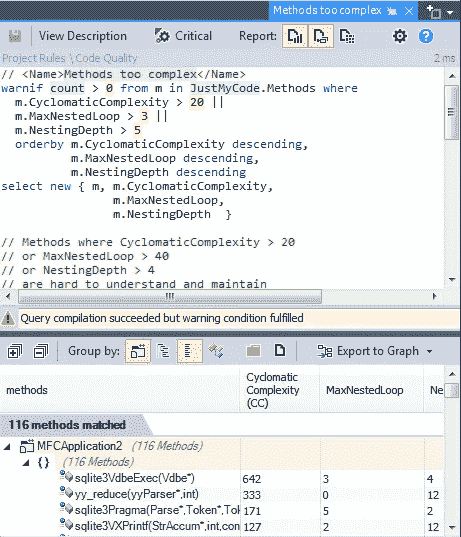

# 为什么您应该真正关心 C/C++静态分析

> 原文：<https://medium.com/hackernoon/why-you-should-really-care-about-c-c-static-analysis-db13f4463b2d>

许多参考资料讨论了使用静态分析工具的好处，以及它们如何帮助您改进代码库。不知何故，它们向你展示了使用它们后你会得到什么。但是你有没有问过自己，如果你不使用它们，你会失去什么？

让我们举一个由于两次释放指针而导致内存崩溃的例子，这将导致随机崩溃。发现这种问题可能需要几个小时甚至几天的时间。在 C/C++中也存在许多类似的危险问题，特别是内存损坏问题。仅仅一个问题就可能花费几美元或几千美元。

一个问题的影响也取决于程序的性质，事实上，一个机器的嵌入式应用程序中的问题与一个绘画应用程序中的崩溃产生的影响不同。有时候，一个问题可能会花费数百万甚至数十亿美元，就像阿丽亚娜 5 号的情况一样，一个 bug 就要花费 70 亿美元。

**如果使用静态分析工具，你会失去什么？**

让我们以 [cppcheck](http://cppcheck.sourceforge.net/) 为例，它主要检测编译器通常检测不到的错误类型。这个工具报告了许多有趣的错误。

你需要不到一分钟来下载它，也许 20 分钟来配置它，分析需要几分钟到几个小时，但在这段时间里你可以自由地做其他任务。在分析之后，您可能有成千上万的潜在问题，在开始时，您可能只关注优先级错误。

最后，对于免费的静态分析工具，你只需要花费 30 分钟就可以得到一个潜在问题的列表，这可能会花费你数千美元。

对于商业工具你失去的不仅仅是时间，你还要付出。因此，你也失去了钱。让我们假设你用 1000 美元购买了一个工具，它帮助你找到了一个开发者需要两三天才能找到的问题。

一个 C/C++开发人员三天的费用可能超过 1000 美元，这当然取决于公司的位置。但如果你考虑到一个问题的隐性成本，你会惊讶于一个简单的问题会给公司带来多少成本。网上有很多关于简单问题的成本的故事。

这里有一些免费的静态分析工具:

[CppCheck](http://cppcheck.sourceforge.net/) (免费):CppCheck 提供了许多检查，下面是一些可用的检查:

*   越界检查
*   检查异常安全性
*   内存泄漏检查
*   使用过时功能时发出警告
*   检查 STL 的无效用法
*   检查未初始化的变量和未使用的函数

[Clang](http://clang.llvm.org/extra/clang-tidy/) (免费):Clang 是一个 C/C++编译器，它的诊断非常有趣，您可能会对报告的相关问题感到惊讶，它可能会关注:

*   不赞成的用法
*   铸造问题
*   初始化问题
*   OpenMP 问题等等。

[Clang-tidy](http://clang.llvm.org/extra/clang-tidy/) (免费):是一个基于 Clang 的 c++“linter”工具。它的目的是提供一个可扩展的框架，用于诊断和修复典型的编程错误，如违反风格、接口误用或可以通过静态分析推断出的错误。 **clang-tidy** 是模块化的，为写新支票提供了一个方便的界面。这里是铿锵整齐的[检查表](http://clang.llvm.org/extra/clang-tidy/checks/list.html)。

还有许多其他的静态分析工具，其中一些很容易测试，其他的你必须联系他们的公司，要一个试用版。

如果你能浪费 30 分钟，使用 cppcheck，你一定不会浪费你的时间。

## 容易出现 Bug 的情况怎么办？

静态分析不仅是关于直接发现错误，而且是关于发现可能减少代码理解和可维护性的容易出现错误的情况。静态分析可以处理代码的许多其他属性:

*   **代码度量**:例如，有太多循环的方法，if，else，switch，case…最终变得不可理解，因此不可维护。通过代码度量圈复杂度来计算这些是评估一个方法何时变得太复杂的好方法。
*   **依赖关系**:如果你的程序的类纠缠在一起，那么代码中任何变化的影响都会变得不可预测。静态分析有助于评估类和组件何时纠缠在一起。
*   **不变性**:被几个线程同时使用的类型应该是不可变的，否则你将不得不用复杂的锁策略来保护状态读/写访问，这将导致不可维护。静态分析可以确保一些类保持不变。
*   **死代码**:死代码是可以安全删除的代码，因为它在运行时不再被调用。不仅*可以*删除，而且*必须*删除，因为这些额外的代码给程序增加了不必要的复杂性。静态分析可以发现程序中的大部分死代码(但不是全部)。
*   API 突破性变化:如果你向你的客户展示一个 API，很容易在没有注意到的情况下移除一个公共成员，从而破坏你客户的代码。静态分析可以比较一个程序的两种状态，并且可以警告这个缺陷。
*   **API 用法**:有些 API 是要小心使用的。例如，持有可处置字段的类本身通常必须是可处置的，除非可处置字段的生存期与类实例的生存期不一致，这听起来像是一个设计问题。

有许多有趣的工具可以检测 C++代码库中的错误。但是对于容易出现错误的情况的检测呢？

如果静态分析工具的创建者可以决定哪些情况被认为是 bug，那么依赖于开发团队选择的易出错情况就不是这样了。例如，一个团队可能认为超过 20 行的方法是复杂的，另一个团队可能将最大值定义为 30。如果一个工具提供了对一些容易出错的情况的检测，那么它也必须提供定制它的可能性。

**代码作为数据是检测易出错情况的更好方法**

静态分析是分析源代码的各种属性并报告这些属性的思想，但从哲学上讲，它也是将代码视为数据的思想。这对于作为应用程序开发人员的我们来说非常奇怪，因为我们非常习惯于将源代码看作指令、过程和算法。但它也非常强大。

在对源文件进行源代码分析之后，我们可以提取它的 AST 并生成一个包含许多关于代码的有趣信息的模型。这样我们就可以使用类似于 SQL 的代码查询语言来查询它。

[CppDepend](http://www.cppdepend.com/) 提供了强大的代码查询语言 CQLinq，像数据库一样查询代码库。开发人员、设计人员和架构师可以定义他们的自定义查询来轻松找到容易出现错误的情况。

有了 CQlinq，我们可以结合来自代码度量、依赖、api 使用和其他模型信息的数据来定义非常高级的查询，以匹配一些容易出现错误的情况。

下面是一个匹配最复杂方法的 CQLinq 查询示例:

**总结**

最好结合很多 C++工具来检测你的 C++代码库中的一些问题，一些工具检测 bug，一些工具检测容易出现 bug 的情况。