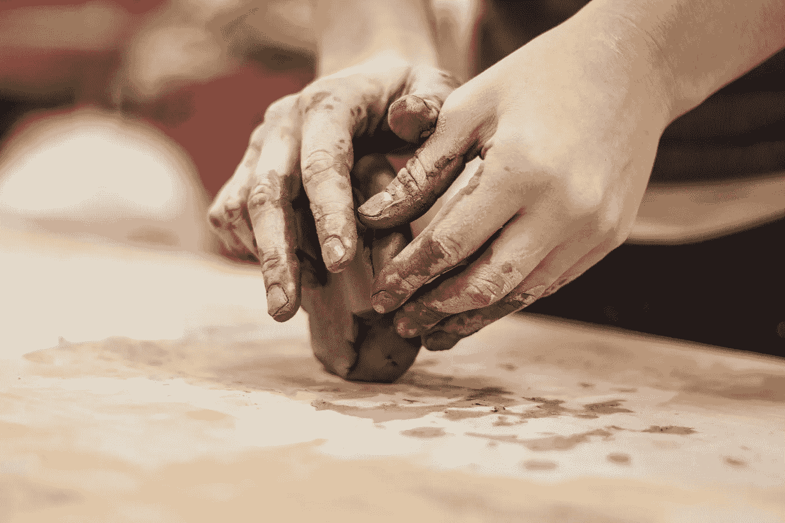
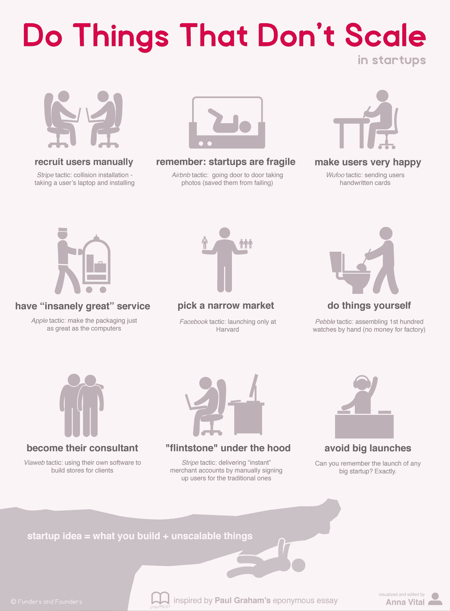

# 为什么您应该停止扩展，转而专注于您的产品

> 原文：<https://medium.com/hackernoon/why-you-should-stop-scaling-and-focus-on-your-product-instead-684008fda13b>

## 过早结垢会扼杀最好的产品

[https://unsplash.com/@alexjones](https://unsplash.com/@alexjones)

当创建一个新的[创业公司](https://hackernoon.com/tagged/startup)，一个产品或一项服务时，一个常见的陷阱是创始人和产品经理第一次开始执行规模太早——甚至在产品准备好之前。澄清一下，通往规模和盈利的道路显然是任何[企业](https://hackernoon.com/tagged/business)的圣杯，但当一个人过早地开始为一个尚未完成的产品追求规模时，这可能会适得其反。相反，在追求规模之前，创始人和项目经理真正应该做的是问自己“*产品准备好迎接黄金时代了吗？*”。

## 过早扩展和产品就绪

过早扩展是误解产品准备状态的直接后果。换句话说，不投入 100%的时间去搞清楚*真正让顾客*开心的是什么，这是一个应该不惜一切代价避免的错误。创始人和产品经理(尤其是第一次创业的人)在扩大规模的活动上花了太多时间，有时是因为谈论规模很酷，但主要是因为他们一直面临压力，要向投资者证明他们可以支配的资源，以显示投资回报率或回家。

甚至在产品真正让客户高兴之前，许多产品经理就开始考虑缩减功能、削减成本和迫使盈利。他们误解了规模、产品与市场的契合度和客户认可等概念。过早扩展的一个非常常见的症状是，项目经理无法具体定义他们的产品处于哪个阶段。换句话说，该产品可能仍处于探索阶段，但诸如确定产品销售渠道、在哪里生产以及发布前活动等扩展活动已经全面展开。

需要说明的是，我并不是说规模活动不重要——事实上，规模对于任何真正赚钱的企业来说都是至关重要的。我想说的是，规模是后来才出现的，首先是对以下问题的回答

> 你有没有一种产品是至少一打你的早期顾客离不开的？如果答案是否定的，就不要浪费时间去考虑规模了。你的产品还没有找到你的第一批顾客，所以把注意力集中在这一点上。

[http://fundersandfounders.com/](http://fundersandfounders.com/)

## 手工制作产品，做不成规模的事情

如果说我从精益创业运动中学到了什么，那就是“*做不可扩展的事情”*哲学。这意味着你应该首先为一个顾客手工制作产品。始终和客户在一起——问他们怎样才能让你的产品让他们完全满意，解决他们所有的问题。我再说一遍，为一个顾客手工制作。迭代。做与规模完全相反的事情。

因此，第一步是了解适合这位顾客的完美产品— *。*顺便说一句，如果您发现适合这位客户的完美产品比您最初试图构建的要简单得多，请不要惊讶。不要把事情复杂化，我跑题了。

接下来，不断验证这些手工制作的迭代是否真的让客户感到*。还是那句话，不要骗自己，不要在任何验证的幻想中。只信任**一个东西**和那个**一个东西就是数据**。你取悦你的顾客了吗？什么事？好吧，去找另一个人，让你的产品取悦他们。没有吗？请问他们为什么，迭代。*

一旦你找到了 10-15 个愿意做任何事情来使用你的产品的传播者(这个数字是基于经验和成功的创始人经常提到的),因为你解决了一个紧迫的需求——然后考虑下一个 100 个客户，然后下一个 1000 个……这时你就开始用技术扩展事物，找到规模经济，找出让你的 90%的客户群满意的 20%的功能，构建相关的收入流机会。

> 除非你接触到足够多的顾客，他们已经确认没有你的产品他们无法生存，否则你还没有准备好扩大规模、期望盈利、削减制造成本等等。首先解决你的产品承诺要解决的问题，然后超越它。

# 考虑一下规模，但是暂时不要做任何事情

当你制造产品来取悦客户时，考虑规模并没有错。实际上，你需要有一个可信的盈利途径，你将如何将产品货币化，预期收益等。但是当你策划这个计划的时候，你可能已经有了商业远景。经常重温它，并忠实于这个计划，如果有什么不合理的地方就修改它。正如某位智者曾经说过的(贝佐斯？)，在愿景上要死板，在细节上要灵活。

所以，首先要做的是。不要马上开始向人们收费，不要试图找出你需要扩展业务的云提供商，也不要雇佣昂贵的顾问来告诉你你的产品有能力但错过的 10 个收入流。不要做以上任何一件事，除非你已经以一种客户愿意支付的方式解决了他们最迫切的需求。如果不是这样，你还没有产品。去找吧。

## 如果你觉得这篇文章有帮助，请点击下面的绿色心脏把它推荐给其他人！如果你有见解或评论，我很乐意听到你的意见。也可以直接在 [twitter](https://twitter.com/ChakrVyuh) 联系我。