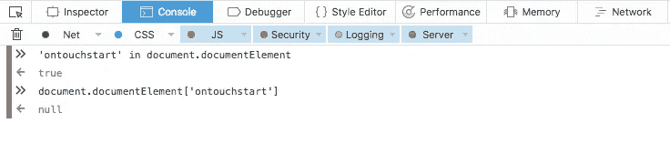

# 为什么不应该在 javascript 中使用“in”

> 原文：<https://medium.com/hackernoon/why-you-shouldnt-use-in-in-javascript-860273a52b85>

# 它是如何工作的

> 如果指定的属性在指定的对象中，`**in**` **操作符**返回`**true**`。来源: [**MDN**](https://developer.mozilla.org/en-US/docs/Web/JavaScript/Reference/Operators/in)

那又怎样？..它检查属性是否存在，而不是它的值。那会出什么问题呢？

# 为什么

我一直反对`**in**`，主要是因为它听起来有点太有前途了。我第一次使用它的时候，我期待着一个更像`**includes**`的行为，只是因为“中的“**这个词非常具有暗示性，告诉你某个东西`**in**` 是否是包含它的其他东西。**

所以不要误解我的意思，它的存在在语言中是必不可少的，但是它听起来如何以及一些开发人员如何使用它才是最重要的

我遇到过很多我不喜欢使用`in`的情况，但我刚刚遇到了另一种情况，浏览器实现有点误导。使用`**in**`使它更加混乱。

firefox console

检查 **Modernizer** 检测触摸设备[的方式**这里**](https://github.com/Modernizr/Modernizr/blob/5eea7e2a213edc9e83a47b6414d0250468d83471/feature-detects/touchevents.js) **，**我们在我们的网站上实现了相同的方法，我正在调试一些鼠标事件不能在 Firefox 上触发。

这里多多少少是检测的关键部分，`**ontouchstart in window**`

> 有趣的是，在 chrome 中它是`**undefined**`，而 Firefox 是`**null.**` **Edit:结果并不有趣，这是 Firefox 的一个错误，在某些特定情况下，它会将这个特定值** `**ontouchstart**` **显示为 null。参赛作品:**[https://github.com/Modernizr/Modernizr/issues/1731](https://github.com/Modernizr/Modernizr/issues/1731)

查看以下内容，并尝试在您的主机上使用它来理解这个想法。

# 我知道…

[**实现**](https://developer.mozilla.org/en-US/docs/Web/JavaScript/Reference/Operators/in) 与规范一致，但从我的角度来看，我只是讨厌可能暗示不同含义的词语！我会避免使用(除非你知道你在做什么)并且不会考虑用它来检查一个属性的存在。

# 编辑和更正:

感谢 [**#2: window.onload** 例如，它在开始时将是未定义的，因为还没有分配处理程序。](https://medium.com/u/4f5d89926f29#1: </strong>我认为最重要的是，我完全错过了它，浏览器供应商以这种方式设计他们的 API，Modernizer 以正确的方式做这件事。这是 Firefox bug 和其他一些浏览器的 bug。</a>

 [黑客中午](http://bit.ly/Hackernoon)是黑客如何开始他们的下午。我们是 AMI 家庭的一员。我们现在[接受投稿](http://bit.ly/hackernoonsubmission)并乐意[讨论广告&赞助](mailto:partners@amipublications.com)机会。
> 
> 如果你喜欢这个故事，我们推荐你阅读我们的[最新科技故事](http://bit.ly/hackernoonlatestt)和[趋势科技故事](https://hackernoon.com/trending)。直到下一次，不要把世界的现实想当然！

