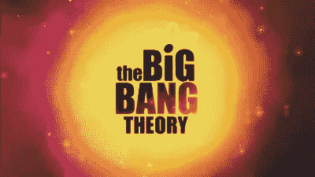
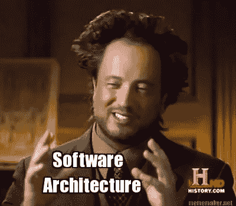
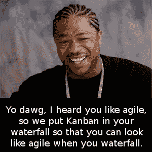

# 为什么你的(大爆炸)多年项目会失败

> 原文：<https://medium.com/hackernoon/why-your-big-bang-multi-year-project-will-fail-988e45c830af>

想象一下，你的任务是生产一种全新的产品。您被要求创建一个项目时间表，并给出了高层次的要求。所有初步估计都表明这是一个为期三年的项目。你将如何着手开发这种产品？为了这篇文章，我们将考虑同一个项目的两种不同的方法。首先，是更传统的大爆炸方法。最后期限定在三年后。我们知道有很多工作需要完成，我们最好的估计告诉我们，这将在三年后完成。其次是更敏捷、迭代的方法。在这里，我们相信我们可以在 3 个月内交付一些最小的功能，并且大约每周推出更新。我们仍然估计需要三年时间来构建最初要求的功能。让我们来看看这些方法在现实生活中是什么样子的。我们将首先为 big bang 三年项目进行演示，然后是迭代项目。

# (宇宙的)创世大爆炸

这是一种方法，在项目开始时，我们知道我们要建造什么，并且我们估计将花费我们三年的时间来建造它。我们将在接下来的三年内完成工作，并最终将整个项目交付给客户。

## 产品方向

三年计划有一个非常基本的假设——我们知道客户在项目开始时想要的一切。当然，我们为即将到来的事情留有余地，但总的来说，我们知道未来 3 年我们要完成的事情。这些是我们已经开始向客户承诺的事情。当应用程序的第一个付费版本发布时，它们就可以使用了。如果竞争迫使我们改变路线或出现新的合规性要求，我们要么迫使团队更努力地完成相同的日期，要么让我们的客户失望。几乎没有惊喜的空间，每一个惊喜都是对发货日期的威胁。随着项目的进行，竞争会带来新的创新。有人不可避免地提到人工智能或大数据或元平台或其他我们确实需要在项目中途做的事情。看到项目开始时的艺术状态不再是热门话题，这些新概念成为范围的一部分。虽然日期不能改变太多，因为它已经被承诺。我们要求团队重新评估并找出如何将所有事情都纳入时间表。

我们可能会为团队设立内部里程碑，但是工程师比我们想象的要聪明得多。他们知道这些内部日期是伪造的。特别是当内部日期没有被满足，而最终日期仍然没有改变的时候。他们很快意识到，内部里程碑只是确保开发人员尽可能快速前进的小型死亡行军。经理们喜欢这些假目标，因为这有助于他们展示进步，并对达到目标感到满意。然而，尽管开发人员不得不在晚上和周末为这些内部目标工作，但是当终点线没有移动时，他们很快就意识到了这一点。我们最初的假设很少受到质疑，也很少从路线图中删除一些东西。即使我们必须进行死亡行军以满足内部日期，最终交付的范围和日期是固定的。

## 优化

因为我们有 3 年的时间来完成所有的事情，所以任何事情都没有真正的优先权。我们先做什么并不重要，因为一切都将同时交付。我们假装有一个优先顺序来给我们的项目一些结构。事实上，项目经理有所有花哨的项目组合管理工具，excel 电子表格，甘特图，显示这些事情应该按顺序完成，也显示他们的工作是合理的。但实际上，这些图表毫无意义。很少有客户对正在构建的内容进行验证。在“完成”之前，没有顾客会使用这种产品。这意味着在任何需要工作流的功能存在之前，您是否使用工作流并不重要。

由于一切都很重要，没有中间交付，多个团队同时开始多个特性。这些特性对于项目来说可能优先级很低，但是既然我们有可用的人员，并且在我们面前有三年的时间，为什么不呢？无论如何，一切都需要在结束前完成。随着预定日期的临近，这通常会导致多个 80%完成的特性。这是我们开始在代码和产品质量上偷工减料的地方。在没有任何真正的优先顺序的情况下同时开始多件事情会让它们都处于危险之中。

我们一开始就认为我们正在做的每件事都是必须要做的，在任何时候我们都不愿意质疑这些假设。只要我们说要完成的所有功能都完成了，哪一个是最有用的并不重要。如果我们花了几个月的时间做一件事情，但是没有人使用它，因为它按时交付了，这也没有关系。我们可能永远也不会意识到没有人在使用它，因为我们的目标是在 3 年内发布这个特性，而不是解决客户的问题。

## (大前期)设计

由于该公司正在进行一项为期三年的项目，因此一切都必须完美。有大量的时间花在前期分析和设计上。甚至在编写任何代码之前，可能要花几个月的时间进行研究。大多数情况下，在我们真正开始编写代码后不久，很多这样的分析就被抛弃了。人们通常会发现，要么是设计站不住脚，要么是我们最初的客户对实际屏幕的验证告诉我们，分析是错误的。专家顾问可能会被请来帮助创造完美的现代建筑。这就是建筑组的闪光点。建筑师们面临着建造完美建筑的压力，这个三年计划将在此基础上执行。建筑师是一种非常危险的动物。他或她通常是一名软件工程师，已经很久没有编写过任何面向客户的软件了。架构师不在团队中工作，而是设计和执行架构愿景。这种类型的项目非常适合建筑师。这是一个尝试新模式和进行绿色领域研究的机会。架构团队可能需要几个月的时间来生产一些东西，而且不会有人问任何问题，因为为了成功，产品架构必须是完美的。

由此产生的架构很难处理，因为它试图解决项目可能面临的所有问题。解决未来的问题几乎总是会减缓现在的速度。体系结构不是随着产品和客户的需求而发展，而是在追求完美的过程中不断前进。我们肯定不知道，这些是否真的是需要解决的问题。我们只是假设客户会需要这些解决方案，这导致了过早的优化。Donald Knuth 说:“过早优化是编程中所有罪恶(或者至少是大部分罪恶)的根源”。开发人员的速度大大减慢，因为架构一直是他们的绊脚石。所有额外的技术需求并没有让开发变得更容易，反而让开发进度慢了下来。几个大学生一周就能完成的功能，需要几十个专业开发人员几个月才能完成。

> 过早的优化是编程中所有罪恶(或者至少是大部分罪恶)的根源。—唐纳德·克努特

## 开发者士气

经理们对缓慢的步伐感到困惑。截止日期和承诺现在岌岌可危。我们需要把开发商拉到一边重新估算，了解风险。我们需要就如何解决问题召开会议并进行调查。开发人员通常会在前几次诚实地回答这些调查。他们表达了对过程、架构、项目管理方式等的不满。由于这直接打击了评估调查的人，结果大多被忽略。可能会对开发人员说几句安抚的话，但是我们真的没有时间在这个项目上进行彻底的改变。我们已经在我们目前的战略上投入了几个月的时间，不管地面上的人们认为它有多糟糕，我们都不能改变它。

然后，开发人员试图通过解决架构问题或影响架构变化来解决这个问题。他们提出让事情进展得更快的建议，并且通常涉及到抛弃许多复杂的架构组件。建议甚至可能包括将技术转换成更适合手头项目的技术。这些建议经过了一些考虑，但通常都被放弃了。它们威胁着建筑师的统治，也威胁着时间线，至少在短期内是这样。不能让开发人员认为他们知道得更多，否则项目会失控。

大多数成功的、有动力的开发人员喜欢看到他们构建的产品被使用。开发人员不仅从解决问题中获得满足感，还通过创造客户价值获得满足感。如果一个开发者需要等待长达三年的时间才能看到产品的问世，那么他的士气必然会下降。争论的另一面是，如果我们的开发人员没有从交付客户价值中获得满足感——我们真的应该让他们加入团队吗？

尽早获得反馈，通常有助于开发人员与用户建立联系，并使软件更好地解决业务问题。这也导致开发人员想要解决业务问题并尽快交付这些解决方案。在为期三年的项目中，我们积极地告诉我们的开发人员不要在意。我们告诉他们低下头，继续使用他们被告知要使用的框架和技术。你所做的工作是否有用并不重要，这是下一个故事或功能的开始。你没看到我们有一个截止日期，我们没有时间停下来核实。我们甚至可以运行一个阿尔法程序，它不会改变我们正在做的事情太多。

## (长期)预测

几乎所有这些问题都源于这样一个事实，即在项目开始时，我们假设我们确切地知道未来 3 年我们想要做什么。我们已经做出了三年后的预测，并开始在这些预测上下赌注。我们做出了需要兑现的承诺。经理们向董事们承诺进步，董事们向 C-Level 承诺产品。C-Level 和销售团队已经向客户销售了具有完整功能集的产品。如果不这样做，会有很多失望。人头会滚动。我们的甘特图告诉我们，事情正在下滑，但我们相信我们可以做到这一点。如果我们增加四个人，人均产量增加 50%，我们肯定能成功。我们提前多年预测，同时我们很难达到我们的内部月度里程碑。团队中的每个人都知道这个项目正走向灾难，但是他们已经被挫败到不想成为坏消息的传递者。毕竟人头会滚。我们试图预测不可能的事情——3 年内我们能完成多少？一旦我们做出了预测，我们就会坚持下去，因为承诺已经做出，现在我们不能收回我们的预测。有趣的是，即使我们构建了我们所说的一切，也不能保证我们真的构建了一个成功的产品，因为它从未在现场测试过。

## 结束项目

这个为期三年的项目因提前终止而花费巨大。结果没有什么可显示的。我们有一大堆未完成的功能，它们不能紧密地协同工作。它不是一个产品在任何时间点之前，非常结束。中途退出项目，似乎只有成本，没有收益。我们不能卖一个半成品，既然我们已经花了这么多钱来建造这个半成品，我们不妨咬紧牙关完成它。我们正生活在沉没成本谬误的中间。这个项目的长度使得我们很有可能不得不做出这个决定。市场力量瞬息万变。假设我们能在这些变化中坚持 3 年，对任何公司的管理层来说都是不负责任的。

让我们看看如果以迭代的方式进行，同一个项目是如何进展的。

# 重复的

在这种情况下，我们假设项目有相同的初始目标——在 3 年内交付一个产品。相反，我们将采取不同的方法。我们的目标是在 3 个月内发布一个更小的功能集。然后，我们将尽可能频繁地交付增量功能(每月、每周或每天，视情况而定)。

## 产品方向

在这种情况下，产品方向从我们能交付给客户的最小功能是什么这个问题开始。这是前 3 个月的方向。一旦有了 MVP，产品方向实际上就变得敏捷了。我们将用户反馈、战略方向和市场力量都考虑在内，以确定下一个最重要的交付内容。它可以是改进现有的功能，增加新的特性，响应不断变化的市场条件，以上任何一项。产品方向出现了。事实上，许多我们开始时认为有价值的事情可能永远不会完成，因为我们会敏捷地按照我们的产品方向生产客户真正想要的东西。我们不会浪费时间构建我们认为客户想要的东西，相反，我们会快速交付并验证我们是否真正构建了正确的东西。如果我们的客户不使用这些功能，我们会适应、学习甚至删除它们。

## 优化

我们的优先级现在是基于实际使用的。我们只在接下来要交付的非常有限的范围内工作。我们非常关注下一个最重要的客户需求。我们实际上是在增量地交付软件，而不是同时交付同等重要的所有东西。这迫使我们从用户的角度来划分优先级。我们没有构建七层深度的工作流，而是等待足够工作流的业务案例变得明显，然后实现客户需要的东西。优先级排序中的假设数量开始减少到仅关于下一件事情的假设，并且我们在交付时尽快验证或否定这些假设。

关于专注的观点值得重复。如果整个团队专注于下一个可交付成果，而不是一个长达 3 年的可交付成果，你可能会用更少的人和更少的时间获得更多的价值。交替优先对话不会打断当前的工作。我们不会在解决业务问题的过程中让团队停下来估计其他事情需要多长时间。当容量可用时，我们会及时进行优先级排序，然后选择下一个最重要的事情。我们不会分散精力，而是专注于下一件要做的事情。

## 设计

分析、设计和架构都是适时发生的。架构师更多地扮演技术领导者的角色，并使团队中的其他开发人员能够更快地取得成果。焦点是交付下一个有价值的软件，而不是构建完美的架构。我们架构师知道我们在假设下一个有价值的东西是什么。这意味着，虽然我们需要能够改变过程的灵活性，但我们也需要在不对客户产生负面影响的情况下删除整个架构的灵活性。这导致了一个既紧急又灵活的架构。它不会阻碍今天的进步，并支持明天的功能扩展。我们担心对未来看得太远，因为我们不知道我们需要建设什么。如果当前优先级不需要，我们就不写。随着时间的推移，我们不断重构、学习和适应，以便尽可能轻松地交付价值。这是建筑师们真正获得他们的技术霸气的地方。不是长期运行的白日梦技术任务，而是真正的价值交付功能。

## 开发者士气

开发人员专注于生产下一个有价值的项目。他们会在三个月内获得 MVP 反馈，而不是三年，以及之后的持续反馈。当优先级-代码-交付-反馈之间的距离最小化时，就存在真正的敏捷性。开发人员不仅得到了反馈，还获得了交付客户价值的成就感。很快，他们开始获得基于解决业务问题的成就感，而不仅仅是交付特性，因为交付特性是每天的事情。

架构师是团队的一部分，因此技术决策被推到团队层面。开发商掌握着自己的命运。他们不受制于一个中央决策机构，这个机构会决定他们能做什么和不能做什么。他们有能力以最好的方式解决他们面前的问题，并且团队中有经验丰富的架构师可以咨询。总之，开发人员可以交付价值并获得反馈，掌控自己的技术命运，并以最好的方式解决他们面前的问题。如果任何开发人员在这些环境中不开心，他们可能需要在一家做三年项目的公司中寻找一份架构师的工作。

## (短期)预测

与计算出我们在三年内能做些什么，然后根据这些预测做出承诺相反，我们走向了一个更可持续的世界。我们开始在稳定的客户价值流下运作，并预测我们在接下来的一周或一个月能做些什么。当然，这使得长期路线图规划变得困难，但这是有充分理由的。长期路线图计划基于一个中心假设——我们知道客户在项目开始时想要的一切。我希望在现代，没有人会相信这是真的。我们在短期内检查和适应的能力将使我们与我们的客户区分开来。当我们做出长期预测，将我们束缚在阻止我们为客户做最有价值的事情的许诺和承诺中时，这种能力就会被严重削弱。我们可以更加灵活，提供最有价值的功能，而不是被束缚在站不住脚的承诺中。

## 结束项目

MVP 交付后，产品始终处于就绪状态。我们总是交付和验证我们认为是下一个最高价值的成果。然而在某些时候，这个产品或项目的下一个最高价值的结果可能不是公司的最高价值的结果。我们可能很早就发现，这个产品并不像我们最初认为的那样有价值。事实上，我们可以提前结束这个项目，而不是在这个产品上投入 3 年时间，这样我们仍然可以获得投资回报。我们没有等待发现我们正在做的工作是否有价值的早期结果。当我们开始一个项目或一个产品的工作时，我们的第一个假设是这是有价值的。我们需要查明事实是否如此。增量和迭代交付帮助我们尽早发现这是否是真的。它还为我们提供了项目的多个退出点。我们可以在任何时候退出，只要我们认为对该产品的任何进一步投资都不如对其他地方的投资有价值。这与三年期项目中的“沉没成本”思维形成对比，在三年期结束时，只有一个简单的退出点。

# 还有…

## 价值主张

还有赚钱这件小事。想象一下，如果在 6 个月内交付六分之一的产品可以帮助您收取六分之一的预计价格。每隔六个月，你可以将价格提高预计价格的六分之一，直到你在三年期限结束时收取与你预期相同的价格。这种计费方案意味着，当你结束项目的第四年时，你已经用迭代方案赚了差不多两倍的钱。当然，这里假设这种计费方案是可行的。可能不会有那么多客户注册早期版本。计费方案可能比这里提出的方案更好，以弥补早期较少的客户注册。除了早期和附加的投资回报，我们实际上很早就发现我们是否在建造人们愿意支付的东西。

## 但是我的项目是“不同的”

这并不是说没有成功的三年项目。我以前参与过多年项目。即使在这些情况下，我们也是在提出的时间表的中途使用一半的功能进行生产，并继续每天发布。我们在确定优先级时考虑了客户的反馈。如果我再做一次这个项目，我会做得稍微不同，并且更早地和真正的客户一起投入生产。早在 10%的功能完成时，那可能就是我们的 MVP 所在的点。不过我们很幸运，传统的架构和项目管理的组织元素在很大程度上没有打扰我们。这很有帮助，但是尽早上市可能会有更大的帮助。长期运行的项目可能会成功，但是我愿意打赌，同样的项目，当迭代地完成，并且更早地投入生产，将会更加准确，并且真正地交付敏捷开发的好处。

据我估计(我没有这方面的确凿证据)，大约 98%的项目可以以这种迭代的方式完成。除非你把一个人送上太空，并且没有办法让用户测试它，这种将 10%的产品推向市场的方法将会受益匪浅。它甚至可以帮助一个成功的项目更加成功。如果你，读这篇文章的人，认为你的项目属于 2%的情况，那么你很有可能错了。最有可能的是，你可以为你的项目定义 MVP，发布它，然后发展它。是的，有理由以另一种方式来做，当然，有人要说服，当然，这是一个硬推销，但我希望我们能同意这是值得一试。

## …但是我们有敏捷团队

是的，在长期运行的项目中有敏捷团队的空间。不幸的是，大多数时候，这只是团队在被认为是正确的方向上跑得很快。这个假设直到很晚才被证实。此外，在传统的组织结构中，有多层管理，传统的 PMO，头重脚轻的架构组织，专家顾问以及开发人员和最终用户之间的零接触，这些团队只不过是交通堵塞中的跑车。是的，它们可以跑得很快，但是它们哪儿也不能去。敏捷的核心租户——检查和适应，并不存在于最重要的层面。我们实际上并没有将产品推向市场，检查结果并改变方向。相反，我们依赖于大量的前期分析和设计。在复杂的系统中，迭代随时都会击败分析。

有趣的是，这些团队注定会在一个一点也不敏捷的系统环境中失败。他们被要求敏捷、快速、高质量地生产产品。同时，他们生活在一个系统的中心，那里的结果和时间表是预先确定的。系统被设置为不验证假设。团队可能是敏捷的，但是传统的系统破坏了这种敏捷。试图使团队“更加”敏捷，并修正他们的过程。这本身就是对公司资源的浪费，因为真正的敏捷性是高层管理所需要的。敏捷管理团队将允许整个系统为早期和频繁的交付而优化。

# 最后

如果你正在进行一个大爆炸式发布的长期项目，还有时间改变。这会有点乱，但在我看来完全值得。你必须弄清楚 MVP 是什么样子的。做出艰难的选择，放弃当前正在开发的特性。也许甚至减少团队的规模，以便专注于 MVP 所需要的东西。好消息是，你已经有了一个开始，并且有可能在某个点上完成一些收尾工作，你实际上可以完成一个 MVP。一旦就位，问题就在于尽快交付价值。是的，如果公司没有安全的文化，这种尝试在政治上是危险的。毕竟，在缺乏安全的情况下，影响变革和做正确的事情往往是个人和政治风险。

没有人希望一个项目失败。在大爆炸项目的情况下，系统是为失败(或“不太成功”)而设置的。个人根据他们被要求做的事情，尽最大努力让事情发生。无论他们是开发人员、架构师、管理人员还是项目经理，他们都在为成功而努力。尽管这个系统是按照他们的方式建立的。对我们来说，转向一种更具迭代性的方法不仅符合公司的最佳利益，也符合员工的最佳利益。

此外，在这篇文章中，3 年零 3 个月只是一个例子。这是特定于上下文的。在您的上下文中，一个长期运行的项目可能需要 6 个月，而 MVP 需要 2 周。不过，在大多数情况下，任何超过一年没有交付的项目都应被视为长期项目。