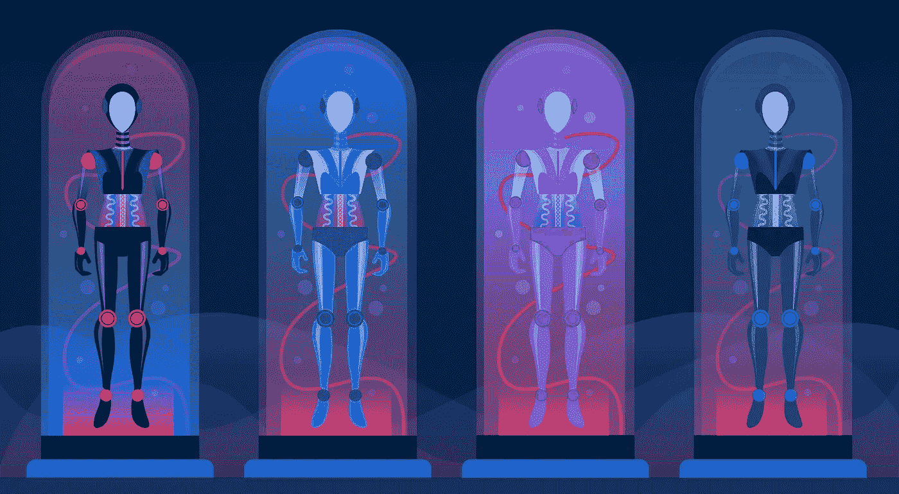
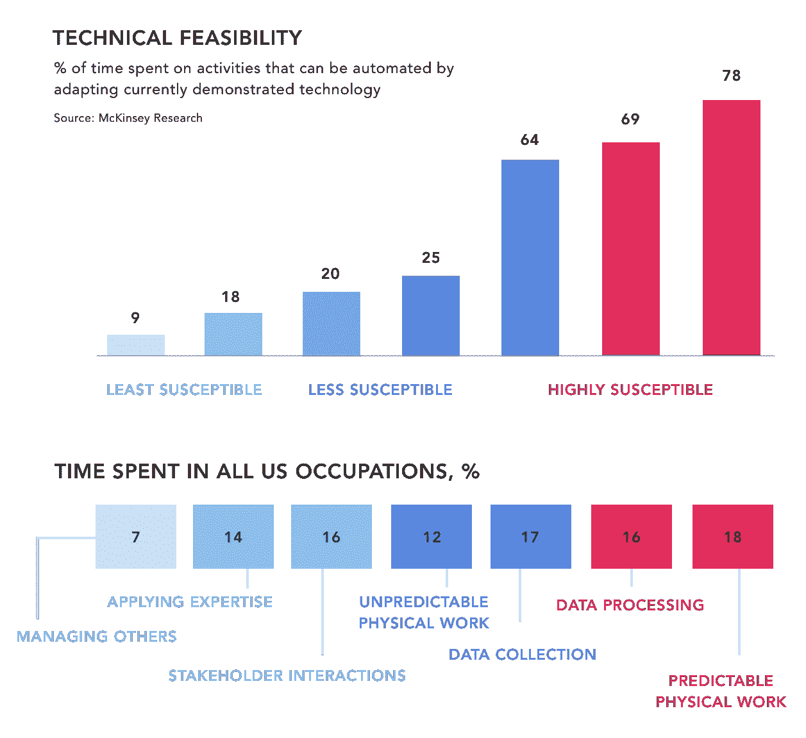
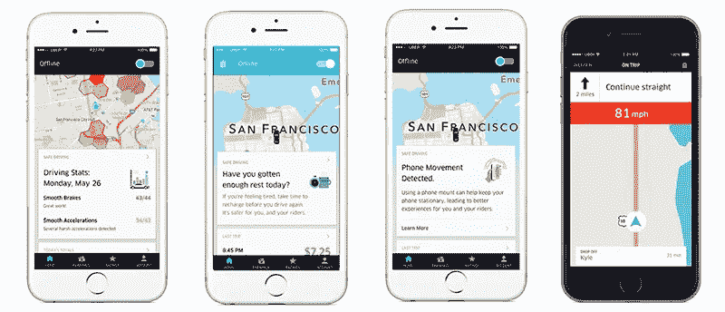
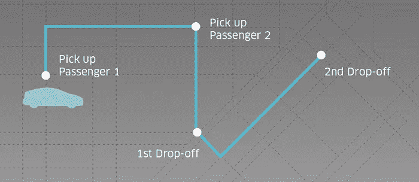
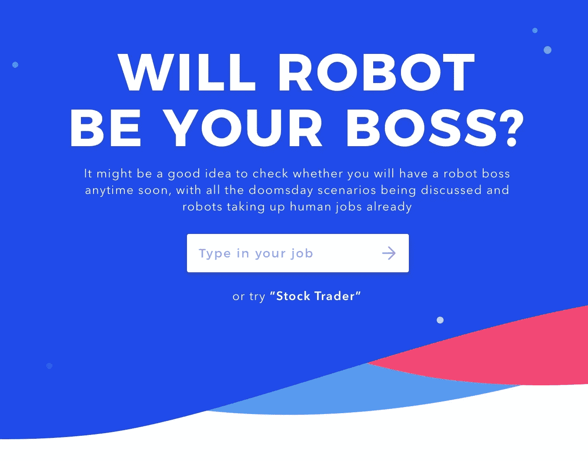

# 为什么你的下一个老板会是机器人

> 原文：<https://medium.com/hackernoon/why-your-next-boss-will-be-a-robot-fbe6098de696>

## 关于你的工作被机器评判的可能性有多大的想法

人工智能[软件](https://hackernoon.com/tagged/software)和机器人在模式识别、预测分析、繁重计算和处理重复性任务方面非常强大。由于这些能力，机器正在许多职业和活动中逐渐取代人类，这使得人们越来越担心自动化对就业市场的影响。

> “目前由人类完成的许多有价值的工作——检查安全视频以检测可疑行为，判断汽车是否要撞上行人，找到并删除辱骂性的在线帖子——可以在不到一秒钟的时间内完成。这些任务自动化的时机已经成熟。然而，它们通常适合更大的上下文或业务流程；弄清楚这些与你其他业务的联系也很重要”——[吴恩达](https://hbr.org/2016/11/what-artificial-intelligence-can-and-cant-do-right-now)说，他最近宣布了他的 1 . 5 亿美元的人工智能风险投资公司

虽然人工智能的力量是无可争议的，但问题是自动化将走多远，它将对员工、组织和业务流程产生什么影响。主要问题是——AI 会成为广大员工的下一个老板吗？

大多数专家认为，在不久的将来，大多数职业将部分或完全自动化。在实践中，这意味着员工要么完全被机器取代，要么开始作为助手、培训师或下属与机器一起工作。人工智能专家做出的一些预测相当激进。

例如,[麦肯锡&公司得出结论](http://www.mckinsey.com/business-functions/digital-mckinsey/our-insights/where-machines-could-replace-humans-and-where-they-cant-yet)目前可用的人工智能技术可以自动化人们今天进行的大约 45%的活动。这家咨询公司还预测，未来几十年，大约 60 种职业将经历至少 30%的自动化。

# **自动化场景**

自动化的范围将取决于技术可行性(员工花费在可自动化活动上的时间百分比)、监管准备和社会接受度、经济效益和自动化成本。

麦肯锡公司认为，管理他人和运用专业知识是最不容易受到自动化影响的活动。更容易受到影响的是涉及利益相关者互动和不可预测的体力工作的任务(例如建筑、林业)。最后，最容易受到自动化影响的是可预测的手工工作、数据收集和数据处理。

直觉上，如果你继续受雇，机器人可以成为你的下一个老板。因此，在自动驾驶或自动交易机等领域，他们将成为自己的老板。例如，在自动驾驶中，卡车车队的移动将通过空中传输系统(OTA)进行同步，该系统可以在紧急情况下立即发送软件更新和安全修复。显然，这种系统的顺利运行不需要人为的干预。

新形式的人机交流，包括人工智能指导的管理，在人工智能和员工融入连贯业务流程的混合公司中更加可行。

这里的第一个场景是承担面向客户的界面角色的机器，这些界面有助于公司运营，如客户支持或业务分析。垂直聊天机器人执行一个特定的任务，将消费者与人类顾问联系起来，这是这种模式的一个典型例子。

许多初创公司雇佣所谓的聊天机器人培训师，他们评估聊天机器人的表现，并在出现问题时进行干预。在这种模型中，人类员工增强并协助人工智能软件利用其自然语言处理(NLG)、分析、图像识别或其他人工智能功能来运行业务流程并做出重要决策。然而，最终占上风的还是人类管理者和员工。

# 那么，机器人什么时候会成为你的老板？

在决策中严重依赖算法解决方案的公司，或者每当机器参与管理员工和评估员工绩效的时候，人工智能最有可能成为机器人。据 Gartner 称，到 2018 年，全球将有 300 万人由机器人监管。

机器人已经在许多数据驱动的公司中执行重要任务。例如，全球最大的对冲基金 Bridgewater Associates 管理着超过 1600 亿美元的资产，它正在构建 PriOS 算法管理系统，该系统控制着所有基本的业务流程和操作。该系统负责许多管理任务，如雇用和解雇员工或排列对立的观点，以解决团队中的争议和分歧。这个人工智能系统背后的基本原理是完全排除情绪和心情对投资决策的任何影响。

 [## 全球最大的对冲基金将用人工智能取代经理

### 世界上最大的对冲基金正在开发一款软件来实现公司日常管理的自动化…

www.theguardian.com](https://www.theguardian.com/technology/2016/dec/22/bridgewater-associates-ai-artificial-intelligence-management) 

人工智能软件在银行和抵押贷款经纪领域也越来越受欢迎，在这些领域，机器决定哪些客户有资格获得贷款。如果没有这样的软件，抵押贷款经纪人将花 90%的时间审查申请。

这种机器可以更高效地完成这项工作，让经纪人有时间向客户提供咨询和建议。然而，人们越来越担心，歧视少数民族的隐藏偏见可能会渗入信用评分软件中使用的 ML 算法。

公司还可以利用复杂的图像识别软件的能力，在人工主管无法正确衡量的情况下，自动评估员工的表现。

例如，机器人可以跟踪优步司机选择的车轮角度，以评估他或她的驾驶技术和风格。同样，在服务行业，ML 算法可以用来评估女主人或服务员的工作表现，方法是跟踪他们在 VIP 客户面前微笑的完整度。

## 算法已经在管理人了

*我们没有太注意这个事实*

人工智能软件负责许多按需移动和交付服务中的重要商业决策、规划和绩效评估，这些服务构成了所谓的 gig 经济。在总部位于伦敦的食品配送公司 Deliveroo，大多数快递员的行动都受到算法管理的严格控制。

如果快递员拒绝订单，严格的算法会对他们进行处罚。Deliveroo 的算法系统仔细监控快递员的表现，计算他/她的平均“接受订单时间”、“旅行时间”和“未分配订单”。如果快递员的表现不符合服务水平协议，他或她可能会在系统中被阻止。

类似的算法程序也在优步使用，这是世界领先的连接乘客和司机的移动服务。在优步，一旦司机登录系统，他或她有 10-20 秒的时间接受行程请求。如果连续错过三次行程请求，驾驶员将被自动注销几分钟。在频繁违反优步算法政策的情况下，驾驶员的账户可能会被停用。

 [## 优步神秘的激增定价算法的秘密，透露

### 大多数使用优步的人都知道，在一个多雨的冬天晚上，他们可能会比在一个阳光明媚的夏天支付更多的费用。优步…

www.fastcompany.com](https://www.fastcompany.com/3052703/the-secrets-of-ubers-mysterious-surge-pricing-algorithm-revealed) 

除了这些算法，优步司机还对优步的动态定价模式提出了抱怨。它会根据优步服务的总体需求自动设定票价。因此，优步司机的收入非常不稳定。优步不公平的价格设定政策导致司机们在 2016 年加入了“为 15 美元而战”的抗议活动，其中[的司机要求为他们的服务](http://fortune.com/2016/11/28/uber-drivers-fight-15-protests-wages-union/)、工会权利和社会福利获得公平的报酬。

正如这些例子所表明的那样，在依赖数据驱动系统、自动化分析和算法决策的企业中，机器有可能成为老板。每当公司把决策的责任转移到 ML 算法上，机器就自动变成老板。

然而，与此同时，机器人老板目前不会影响那些错误决策会产生危险影响的领域。

在卫生保健领域，卫生专业人员的日常活动需要人类的专业知识和与患者的直接接触，这是事实。尽管医疗诊断人工智能可以为医生提供有价值的见解，但最终的决定将由医疗保健专家做出，他们必须验证机器的结论，并确保符合所有的道德规范和政策。

想知道你的职业受算法管理影响的可能性有多大？查看我使用公共工作活动和职业数据以及牛津计算机化研究构建的工具:

