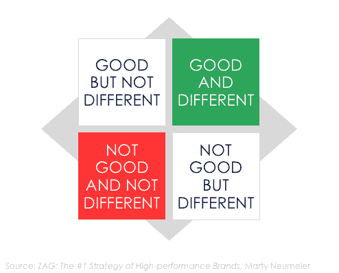

# 为什么你的组织不能创新

> 原文：<https://medium.com/hackernoon/why-your-organization-cannot-innovate-63067376edfd>

> 整个分析思维定势中有一些东西有效地推动了建筑外的创新能力。—弗雷德·格鲁克，麦肯锡&公司董事总经理

高管们对他们组织的创新表现极为不满，但大多数公司似乎讨厌创新。你的呢？

2016 年，麦肯锡报告称，84%的高管认为创新极其重要，但只有 6%的高管对其组织的创新表现感到满意。为什么会脱节？

也许马蒂·纽梅尔有答案。在他的书 *ZAG:高性能品牌的第一战略*中，Neumeier 分享了他的“好/不同”矩阵。有的产品不错；有些不是。有的产品不一样；有些不是。

但真正令人吃惊的是，“不同”通常被视为负面的，至少在内部是如此。

想想几年前对“上网本”的关注。上网本理论上听起来不错。营销人员和销售人员(更不用说投资者了)都在推动电脑厂商制造廉价的、动力不足的笔记本电脑。但是问问任何消费者:上网本既不好也没什么不同。

上网本失败；平板电脑成功了。

“好的和不同的”产品改变了游戏。

而且不仅仅是产品。好/不同的难题适用于产品管理和营销的所有方面。

几年前，一位同事被要求创造一些新的客户成功案例。他的采访进行得如此顺利，他的客户透露了如此多的信息，他决定在报道中只引用客户的话。这些作品非常出色——潜在客户喜欢“客户之声”的方式。唉，销售人员可不这么想。他们讨厌引用重的作品。“新的成功故事与我们以前的不同”是他们唯一的抱怨。

**《好与不同》难卖*内测*。**

也许这就是为什么如此多的组织在创新上失败了。几乎没有人喜欢“与众不同”。几乎每个人都喜欢“好”，除非质量代价太高。

创新可以应用于包装和定价以及产品。但是卖掉它…有问题。在几次内部推销“不同”的想法失败后，大多数产品经理就放弃了。“没什么不同”简单多了。

你的组织对创新开放吗？还是“大同小异”的现状是最好的政治答案？

*斯蒂夫·约翰森是产品管理流程教练、作家、演讲者和顾问。他的方法是基于这样一种信念，即最少的过程和简单的模板会产生一个敏捷的产品营销和管理团队。更在*[*http://www.under10consulting.com*](http://www.under10consulting.com)