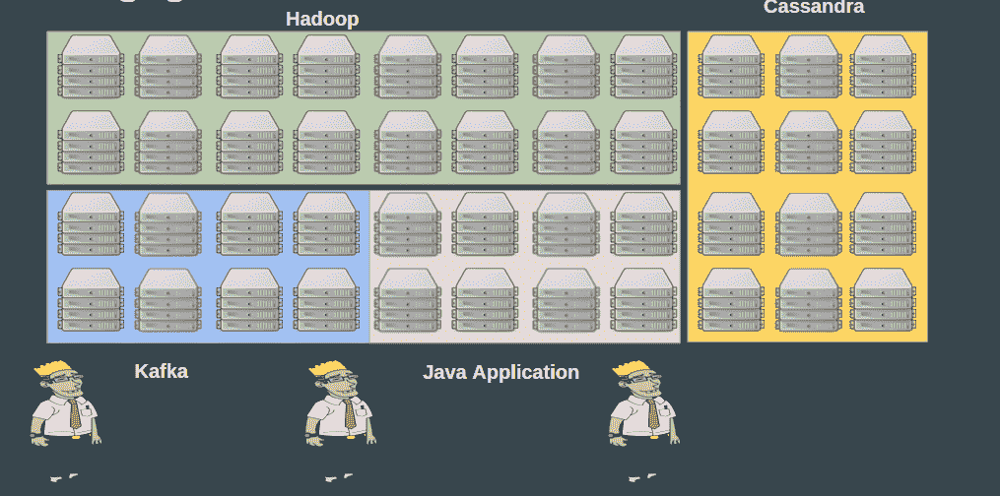
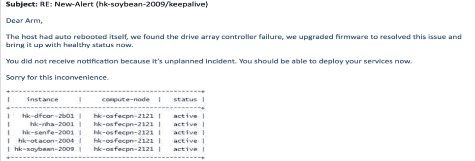
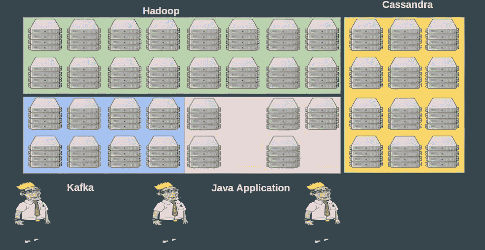
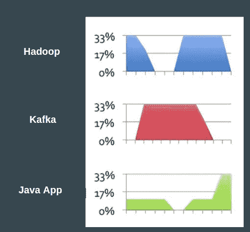
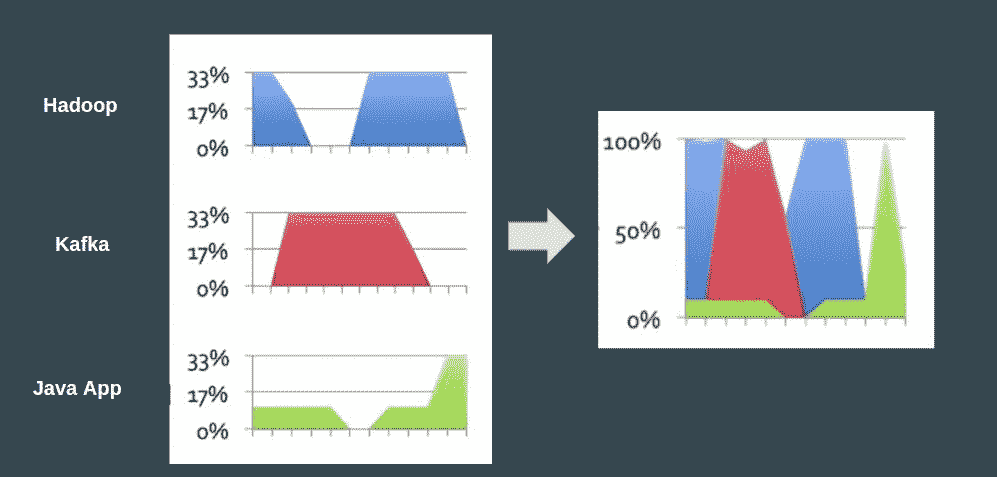
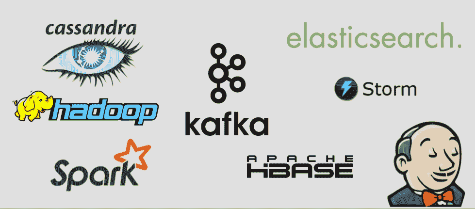
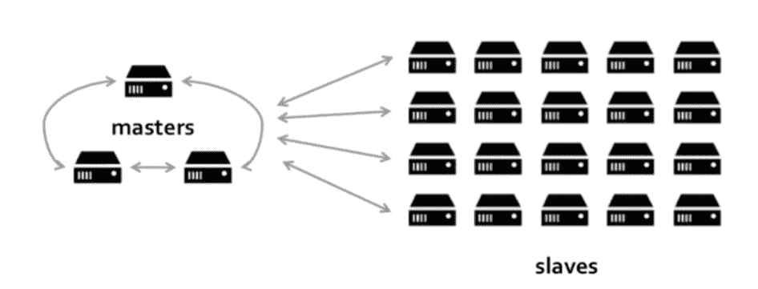
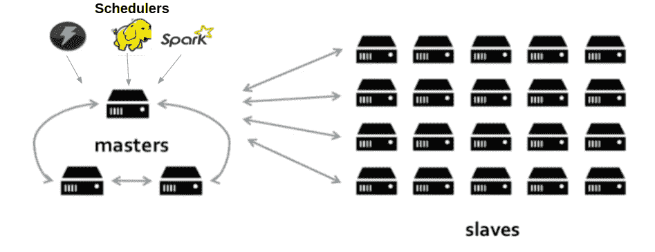
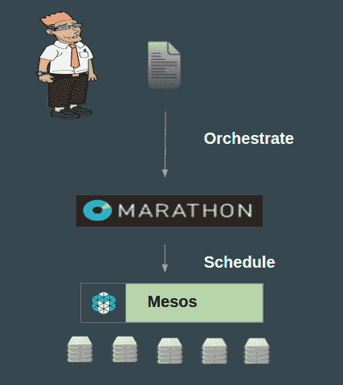
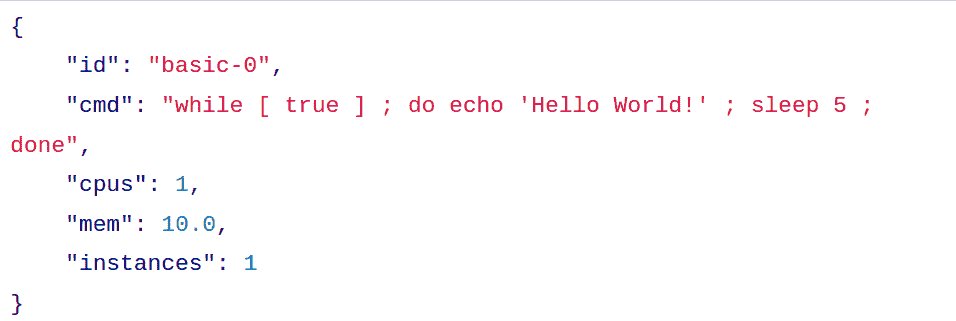

# 为什么您的组织应该开始使用 Apache Mesos

> 原文：<https://medium.com/hackernoon/why-your-organization-should-start-using-apache-mesos-a730d0a82c78>

这是我之前在 Agoda [机器学习](https://hackernoon.com/tagged/machine-learning) meetup 上发表的关于 Mesos 介绍的书面博文。

该职位主要分为以下几个部分:

*   挑战
*   数据中心分区和资源管理
*   为什么选择 Apache Mesos

**挑战**

每个人都在向[微服务](https://hackernoon.com/tagged/microservices)发展，特别是如果你的公司做得很好，那么你现在可能正在使用一堆微服务。微服务是为做一件事而构建的，并且做得很好(就像 unix 命令一样)，而且这些微服务可以很好地捕捉整个组织结构，它们可以独立地构建、测试、部署和回滚，而不会相互中断。但是，如果您不是以分布式系统的方式设计它，那么您的服务可能已经到了不再适合单台机器的地步，因为它需要更多的内存或更多的计算核心来处理“大数据”或并发用户的数量。随着您的组织开始成长，用户和数据每天都会增长。

**数据中心分区和资源管理**

通常，使用托管多种服务的多台计算机的组织对数据中心进行如下分区:

处理失败是这里的一项重要任务。想象一下，连接 Cassandra 机架的最上面的交换机出现故障，这显然意味着没有人查询 Cassandra，这是一次停电。

这是一封真实的电子邮件，我从 infra 的工作人员那里得到的，他们说 OpenStack 托管了一堆机器，它自己重启了，所有在上面运行的服务都停止了。

回到静态分区，故障将如下所示:

这里的另一个挑战是资源利用率。通常，如果您查看资源利用率，您会发现运行 Hadoop、kafka 的机器使用了大约 30–40%的资源，而 Java 应用程序在白天使用了更多的资源，但在晚上它们几乎处于空闲状态。

正如您所看到的，这里的大部分资源都是闲置的，使用类似下面这样的方法显然可以降低成本，更有效地利用资源。

**为什么选择阿帕奇 Mesos？**

使用 Apache Mesos 极大地解决了上面列出的所有挑战。Apache Mesos 是一个现代的通用集群管理器，它最初于 2009 年在加州大学伯克利分校启动，然后在 Twitter 上得到强化，Twitter 上的大多数东西实际上都运行在超过数万个节点的 Mesos 之上。Mesos 还在 Java/c++/Python 等各种编程语言中公开了丰富的 API 集。此外，一些顶级 Apache 项目已经移植到 Mesos 上运行:

像大多数分布式系统一样，Apache Mesos 有一个主从架构

其中调度器/框架与主机交互以调度从机上的任务。

**中间层马拉松作业调度**

这一部分非常简单，你构建你的应用程序，将其容器化，它可以是二进制文件，tgz 甚至是 docker 映像。将包上传到从属机器可以访问的地方(HDFS/S3/HTTP)，描述服务，然后进行调度。为此，您可以使用 Marathon Web UI、REST 端点或 CLI。

这里有一个 JSON 的例子:

还有更多要写的，你可以从这里找到演讲幻灯片[。](https://docs.google.com/presentation/d/1GGQFFOsidQsRGK-IlQ3X7GpGsqAdLwqxjfz4QARFG1s/edit?usp=sharing)

> [黑客中午](http://bit.ly/Hackernoon)是黑客如何开始他们的下午。我们是 [@AMI](http://bit.ly/atAMIatAMI) 家庭的一员。我们现在[接受投稿](http://bit.ly/hackernoonsubmission)并乐意[讨论广告&赞助](mailto:partners@amipublications.com)机会。
> 
> 如果你喜欢这个故事，我们推荐你阅读我们的[最新科技故事](http://bit.ly/hackernoonlatestt)和[趋势科技故事](https://hackernoon.com/trending)。直到下一次，不要把世界的现实想当然！

