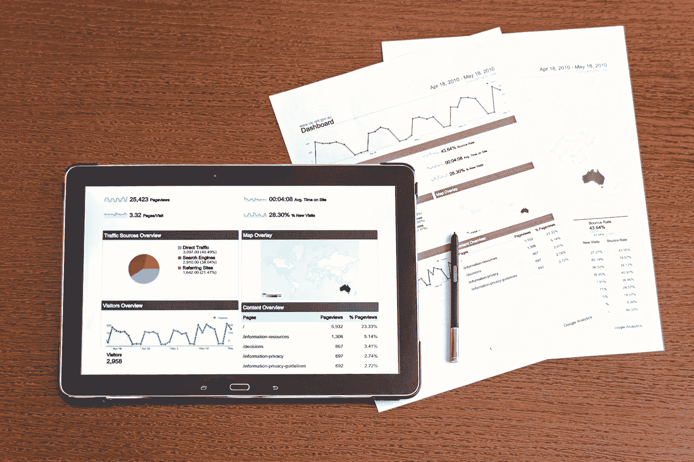
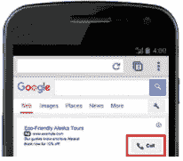

# 为什么您的跟踪数据不准确(以及如何解决)

> 原文：<https://medium.com/hackernoon/why-your-tracking-data-is-inaccurate-and-how-to-fix-it-57c856b64f32>

如果你一直在努力使用谷歌分析和 Adwords 报告来跟踪你的广告和网站的表现，以帮助优化出价和增加转化率，这对你有好处！

然而你可能会在你的数据中看到相当多的差异。除了沮丧和困惑，它也让你怀疑你是否做了正确的跟踪。有许多因素会影响这些报告的一致性和准确性，而且并非所有这些因素都在我们的控制之下。

但是，如果您了解一些事情，并更好地理解这些报告的含义，您将能够更清楚地了解您的数据。

因此，让我们来看看是什么阻碍了您准确跟踪数据，以及您可以立即采取哪些措施来提高报告的准确性和相关性:

# 1.缺乏跟踪

如果你不追踪数据，数据就不会追踪到你。

为了确保你有正确的数据，你需要做的第一件事是建立准确的跟踪。方法如下:

## 用联系表单替换电子邮件地址

当访问者通过您网站上列出的电子邮件地址联系您时，您将无法跟踪这种互动。

要跟踪来自您网站的所有联系人，请将所有直接电子邮件(即列出电子邮件地址)替换为联系人表格。这将允许您为操作赋值。

在你的网站的联系页面上有一个表格作为主要的 CTA 是一个很好的开始。您还需要审核您的网站，以确保其他位置列出的所有电子邮件地址都被替换为可跟踪的表格，或链接到表格页面的 CTA。

## 使用网站呼叫跟踪

众所周知，通过电话进行的转化很难追踪，因为它们不会发生在网上。

有第三方呼叫跟踪服务，但收集的信息不够精细，无法提供关键字级别的见解。更不用说，由于时间限制，很难获得可用的数据，因为这些跟踪公司每 12-24 小时轮换一次电话号码。

当然，你可以直接问打电话的人他们是怎么听说你的公司的，但是手动追踪容易出错。更不用说，你手下的某个人必须手动将信息输入数据库以备将来参考。

谢天谢地，谷歌来救我们了——至少对 AdWords 用户来说是这样。它的[网站呼叫跟踪](https://support.google.com/adwords/answer/6095883?hl=en)功能可以动态替换来自 AdWords 广告流量的网站电话号码。

尽管它没有报告来自其他来源的电话，但对于 AdWords 的重度用户来说，它是一个有价值的工具。另外，电话号码的有效期是 6 个月。因此，你可以在更长的时间内跟踪转化率，并获得更准确的转化率。

## 设置 AdWords 呼叫跟踪

谷歌还为广告商提供了一个名为[电话分机](https://support.google.com/adwords/answer/2453991?hl=en)的选项，让他们在广告中加入电话号码。然后，客户可以直接从智能手机上点击并拨打电话。

有了这个功能，你就可以通过看到有多少人通过这个号码与你联系来跟踪广告的效果。这是你的广告表现如何的一个很好的指标。

该功能特别适合于“应急”行业的服务提供商，例如锁匠、水管工、DUI 律师等。但是，如果你需要客户在联系之前访问你的网站，这可能没有帮助。

## 使用谷歌分析跟踪电子商务事件

许多广告商没有正确跟踪他们的电子商务活动，以将销售数据与[网站使用数据](https://blog.kissmetrics.com/the-8-most-important-conversion-metrics-you-should-be-tracking/)相关联，如会话、跳出率、流量来源和登陆页面。

为了跟踪导致转化的所有事件，[审计并设置谷歌分析](https://www.smartinsights.com/guides/google-analytics-setup-guide/)，并确保你使用正确的脚本来获取对你有用的确切信息。

许多开源或托管购物车提供商已经将简化的电子商务跟踪集成到他们的软件中。对于某些人来说，这可能已经足够了，但是如果您需要更详细的信息，您可能需要编写自己的脚本。

# 2.差异

好消息是，你已经建立了追踪系统，并且正在获取数据。

坏消息是，这些数字没有增加，你在拔头发。

以下是这些差异背后的一些原因，以及您可以采取的措施:

## 分析会话和 AdWords 点击不匹配

你可能期望 AdWords 的*点击量和 Google Analytics 的*会话量*相匹配，但事实并非如此。*

这两个指标实际上跟踪的东西略有不同。

长话短说，当有人点击一个广告时，一个*点击*就会被记录下来。然而，在记录*会话*之前，还需要[一些检查点和要求](https://support.google.com/analytics/answer/4588315?hl=en)。

另外，请记住，*点击*是一次性事件，而*会话*会在访问期间发生。例如，如果一个访问者点击了一次广告，没有等待页面完全加载就再次点击，那么*点击*和*会话*之间就会有差异。

## 收入和总转换价值之间的差异

当然，当你的谷歌分析(Google Analytics)数据中的*收入*与 AdWords 中的*总转换价值*不匹配时，这是相当令人不安的。

别担心，这只是因为它们的计算方式不同。虽然 GA 中的*收入*始终是收入，*总转换值*可以是收入(如果数据来自 GA)，也可以是指定值，这对于每种类型的转换都是相同的。

如果您希望这两个指标相匹配，只需在 AdWords 中设置[自动标记功能，即可在 AdWords 中显示您的 GA 收入数据。](https://support.google.com/adwords/answer/3095550?hl=en)

你使用的确切方法并不重要，重要的是你正在测量你的*总转换值*。这是所有关键词、广告和活动的关键指标，有助于优化您的竞价策略。

## 由于 SSL 加密开关导致跟踪不准确

许多托管网站都添加了 SSL 证书，以防止网络攻击。如果当网站从 HTTP 协议迁移到 HTTPS 协议时，Google Analytics 中的设置没有更新，将会出现数据差异。

要更新您的设置，请登录您的 Google Analytics 仪表板，然后转到**管理>属性设置**。在那里，您可以在**默认 URL** 下更改协议。

当广告商忘记更新广告的目标 URL 以指向新的 HTTPS 协议时，由这种协议迁移引起的不准确跟踪也会发生。

即使服务器端重定向会将访问者发送到正确的页面，信息也会在重定向过程中丢失，并导致各种差异，例如流量被归属于错误的源。

# 3.有限视野

默认情况下，大多数报告平台被设置为显示有限的数据集，因此您通常看到的是整个可用报告的局部视图。

为了确保获得正确的分析和优化数据，请记住以下几点:

## 属性

转换通常发生在多次访问你的网站之后。AdWords 的归因模型可以帮助你了解你的营销漏斗中各种关键词对转化率的影响。

这些归因模型包括第一次点击、最后一次点击、线性、时间衰减和基于位置。他们对在购买路径的不同点获得“点击”的关键词赋予不同的权重。

与此同时，跨设备归因使您能够深入了解客户在接近转换事件时如何以不同方式使用技术。

将不同的模型应用于您的数据可能会产生不同的解释，因此，如果您想要“比较苹果与苹果”，请确保应用相同的归因模型

## 多通道漏斗

如果你更深入地挖掘你的分析，看看[多渠道渠道](http://online-behavior.com/analytics/multi-channel-funnels)归因(MCFs)，你会意识到它不同于标准的谷歌分析报告。具体来说，它以不同的方式解释和报告直接流量。

差异的原因是 mcf 在报告直接流量时不考虑活动 cookies。因此，与其他 GA 报告中的相应流量源相比，它们通常具有更大的直接流量“上次互动”转化值。

同样，没有一个“正确的”报告可以使用。只要确保你每个月都在分析相同类型的报告，这样你就可以“比较不同的苹果”

# GA 不是水晶球，但是…

影响报告一致性的因素很多，很少有 100%准确的。但是，您可以实现适当的跟踪，协调差异，并与您逐月分析的报告类型保持一致。然后你就能更好地了解你的流量和访问者的行为，提高你的销售和转化率。

*原载于*【www.smartinsights.com】

***关于作者***

*[谢恩·巴克](https://shanebarker.com)是[内容解决方案](https://contentsolutions.io/)和 [Gifographics](http://gifographics.co/) 的创始人兼首席执行官。你可以在[推特](https://twitter.com/shane_barker)、[脸书](https://www.facebook.com/ShaneBarkerConsultant/)、[领英](https://www.linkedin.com/in/shanebarker/)、 [Instagram](https://www.instagram.com/shanebarker/) 上和他联系。*