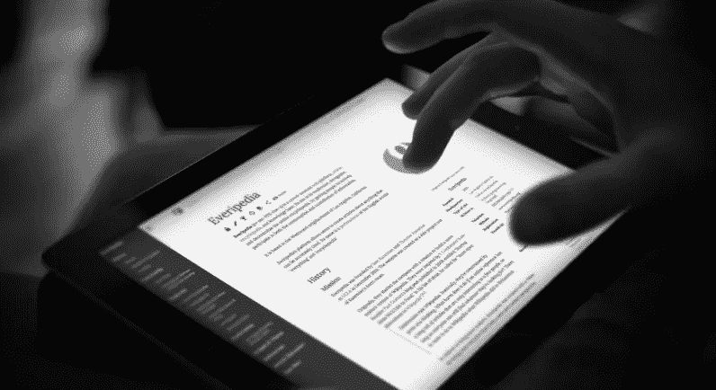

# 维基百科联合创始人将百科全书放在区块链上

> 原文：<https://medium.com/hackernoon/wikipedia-cofounder-to-put-the-encyclopedia-on-the-blockchain-b56d21901039>

Credit: Everipedia

Everipedia 今天宣布，维基百科联合创始人拉里·桑格博士将加入该公司，准备将其在线百科全书带到区块链。

区块链最广为人知的是作为运行[比特币](https://thenextweb.com/topic/bitcoin/)、以太坊和其他加密货币的技术，但它的应用远不止让[文克莱沃斯双胞胎变得富有](https://thenextweb.com/hardfork/2017/12/05/winklevoss-twins-turn-zuckerbergs-money-into-bitcoin-billions/)。比约克用它来激励她的专辑，其他人用它将丹尼斯·罗德曼作为和平大使派往世界各地。

相比之下，我们更容易理解分散的百科全书。世界需要知识，而现在像维基百科和 Everipedia 这样的信息集中地，在中国和俄罗斯等地受到审查。

Everipedia 联合创始人兼首席执行官西奥多·福瑟利乌斯告诉 TNW:

> *我们一开始相信，我们可以建立比维基百科更大更好的东西，通过分散化和令牌化 Everipedia，我们将能够在我们已经建立的用户基础之外分享知识。*

随着大量公司推出 ico(似乎每样东西都有一个)，或者以其他方式利用区块链赚钱，很容易将这种想法视为另一种掠夺——但我们不是在谈论一个向任何人承诺财富的系统。

Everipedia 的代币将反映其当前名为“IQ”的奖励系统，该系统奖励用户创建和更新文章的点数。使用代币提供了一种奖励或激励参与者的方式，并确保每个使用平台的人都是平台的“股东”。

这些令牌也称为“IQ”，将用于提供访问、制定修订版和为系统供电。例如，如果用户不喜欢某个更新，他们可以花费代币来挑战它。如果社区同意反对者，将进行编辑，挑战者的令牌将被返回。

区块链的 Everipedia 代表了维基世界一个有趣的新变化。百科全书爱好者(实际上有数百万人)将有一个全新的机会与那些不能编辑在线文章的地方的人们联系。例如，维基百科在土耳其被完全禁止。

根据 Forselius 的说法，区块链代表了这种审查制度的终结:

> *从技术上讲，审查这些网站变得不可能。一旦我们启动，人们将能够访问 Everpedia 的文章——和维基百科的文章——这些国家对此绝对无能为力。*

Everipedia 是世界上最大的在线英语百科全书，部分原因是它来源于维基百科上的所有文章(根据桑格博士的说法，维基百科的文章来源于大英百科全书)。让全世界都能接触到*所有这些知识，对于那些出于政治或宗教原因禁止或屏蔽信息的国家的研究人员、学者和感兴趣的公民来说，可能会改变一些事情。*

如果知识就是力量，那么对于数十亿人来说，Everipedia 将成为“类固醇上的维基百科”。它打算推出的令牌系统可能会激励数百万人参与集体努力，以超越目前布列塔尼卡百科全书和维基百科的工作。

桑格博士认为区块链是最好的方法。他告诉 TNW:

> 一个新项目能与维基百科并驾齐驱的唯一途径是它能让全世界参与进来，并且是分散的。有可能不只是 500 万篇文章，而是 1 亿篇……不仅仅是那种可以在维基百科上找到的文章，而是传统上只能在图书馆找到的专业百科全书中的文章。

通过新系统，Everipedia 希望将信息放入一个点对点的网络中，这将消除托管费用，从而减轻用广告或捐款支持其内容的需要。

*本故事由* [*特里斯坦·格林*](https://thenextweb.com/author/tristangreen/) *撰写，最初发表于* [*The Next Web。*](https://thenextweb.com/hardfork/2017/12/06/wikipedia-co-founder-joins-everipedia-to-create-an-encyclopedia-on-the-blockchain/)

*要阅读黑客正午的每周趋势 TNW 故事，请访问【Hackernoon.com/tnw】**。***