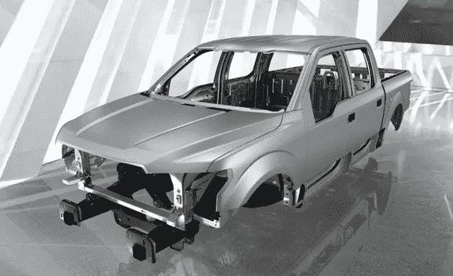

# 铝会成为汽车行业绿色倡议的先锋吗？

> 原文：<https://medium.com/hackernoon/will-aluminum-be-at-the-forefront-of-the-green-initiative-within-the-automotive-industry-e9d5efc8924b>

当大多数人想到铝时，他们可能会想到当他们每周将轻质易拉罐扔进回收站时得到的镍币。然而，甚至没有多少人会停下来考虑铝在汽车制造中的应用，或者正如我们所知，铝是汽车工业的未来。

尽管对于任何曾经徒手压碎罐子的人来说，这看起来很奇怪，但许多科学家和汽车行业的巨头认为，这种轻质材料可能是更轻的汽车和更轻的碳足迹的关键。有鉴于此，很明显[铝正在改变汽车游戏](http://www.cmsna.com/blog/how-aluminum-is-changing-the-automotive-game/)，现在是我们关注的时候了。事实上，根据[最近的一项研究](https://www.greenbiz.com/blog/2011/09/20/steel-industry-aluminum-our-green-auto-bodies-can-match-yours)，据估计，到 2025 年，汽车将由大约 550 磅的铝组成，这将不可避免地减少车辆重量至少 10%。

然而，尽管仅在减轻重量方面就有明显的好处，但绿色商业行业的许多知名人士更感兴趣的是，在汽车制造中使用铝对我们的世界和环境意味着什么。众所周知，汽车是 T4 的主要污染源。因此，当汽车工业推进铝在制造业中的应用时，我们必须问自己的主要问题很简单:“为什么是铝？”以及“与过去用于制造的材料相比，这将如何影响我们的环境？”毕竟，在一个以进步和发展为荣的社会中，也许从汽车工业的碳足迹中“减轻一些重量”可以帮助我们从当前的环境危机中“后退一步”,进入今天绿色技术的未来。

# **为什么是铝？**

现在，你可能仍然会问自己为什么铝是最佳的，它到底能为汽车效率和我们的环境做些什么。铝有助于我们的环境的主要方式是通过燃料经济性，可加工性，耐腐蚀性，以及易于回收。

由于重量轻，铝可以减轻车辆的重量，从而提高燃油经济性。这不仅对车主有效，最终每年可以节省数百美元的汽油费，而且对我们的环境也有好处，因为这些车辆每年需要的汽油比以往任何时候都少，产生的二氧化碳排放量也更少。

至于铝的可加工性，这种金属的延展性很强，这意味着它可以很容易地加工成任何形状或形式，这使得它很容易在当前市场上制造任何汽车。这意味着现代制造商将最终有机会在不久的将来将铝用于任何和所有汽车、卡车和各种其他车辆。然而，最有希望的是现在更加高效的[电动汽车](http://alumag.com/what-we-do/market-research/aluminium-applications-in-electric-vehicles-and-charging-infrastructure-2-2/)。事实上，通过铝空气电池的发明，铝在电动汽车中的应用最近取得了突破。当[铝空气电池](http://www.aluminum.org/go-further-aluminum)被测试时，这种创新设备被证明可以让电动汽车在无汽油的情况下行驶 1000 英里。这意味着，不仅燃气动力汽车效率更高，足迹更轻，而且环保汽车也将成为更可行的选择。

当涉及到钢制车身时，通常会比铝制车身更容易生锈和腐蚀。这是因为钢对湿气和空气相当敏感，而铝具有一定的耐腐蚀性——即使没有额外的表面处理。这最终意味着铝制汽车也将持续更长时间，从而导致更少的汽车车身在垃圾场腐烂，更少的金属污染我们的土壤。

最后，最有希望的一点是铝易于回收。由于铝的延展性，它很容易再次回收，这意味着这些汽车可以很容易地在寿命结束时被取出，并转化为立方体，然后可以送回制造商，再次制造汽车。反过来，这可能意味着，随着时间的推移，我们可能拥有永远不会增加我们土壤中金属污染的汽车，因为它们从一开始就不会停在垃圾场。

最后，铝在汽车工业中的可能性是无限的，在我们的日常生活中利用这种惊人的环保材料的能力是朝着更小的碳足迹和更具成本效益的行业的正确方向迈出的一大步。