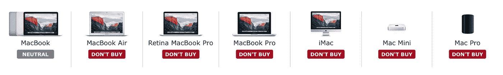

# 苹果会远离英特尔吗？

> 原文：<https://medium.com/hackernoon/will-apple-move-away-from-intel-210b40a241aa>

有一个吸引人的想法已经在互联网上流传了一段时间:苹果可以从英特尔 x86 处理器过渡到苹果自己设计的基于 ARM 的 CPU。

我认为这一时刻终于到来了。

在某种程度上，这种转变听起来像是颠覆性创新的经典故事。新兴的[技术](https://hackernoon.com/tagged/technology)不适合在现有市场中使用，因为它的特性比现有技术差。然而，这项新技术可能会引入一些功能，使其适合二级市场。在这个二级市场中，该技术得到了进一步发展，并且由于其新颖性，通常存在实质性改进的空间。随着新技术的成熟，它也适用于初级市场。此外，改进的特性无疑使其成为二级市场的最佳选择。最终，这些优势的结合将导致新技术彻底取代当前的主流市场。

需要举例吗？很有可能你手里就有一个。如果你在笔记本电脑上阅读这篇文章，请考虑它的技术最初是为移动计算领域设计的。直到后来，笔记本电脑才成为最常见的计算方式。否则，如果你在智能手机或平板电脑上阅读这篇文章，考虑一下移动设备是如何取代电脑的。

# A 系列 SoC

与 iPad 一起，苹果推出了“A”系列 SoC(片上系统)系列，其中包括一个基于 ARM 的 CPU，为其移动设备提供动力。“A”系列 CPU 针对移动设备进行了优化，并在计算性能方面进行了权衡，以支持能效、更小的尺寸和无风扇的架构(风扇噪音大，是故障点，因为它们是现代计算设备的最后一个移动部件之一)。

令我吃惊的是，苹果一直在努力提高其 CPU 的计算性能。最近，A 系列芯片的性能开始对消费计算足够好:iPhone 7 A10 芯片比目前在售的一些 Macbooks 更快。

iPhone 7 也比 iPad Pro 快。这很有趣，因为 iPad Pro 采用了 A9X 芯片，该芯片来自 iPhone 6s 中的 A9，功能大约强 25%，因为它比 iPad Pro 有更多的空间。因此，可以想象 iPhone 7 中的 A10 CPU 可以以类似但更突出的方式为笔记本电脑和台式机进行优化，A9 经过改进后为 iPad Pro 创建了 A9X。

这将转化为对普通消费者来说性能足够好的 CPU，普通消费者使用计算机主要是为了浏览互联网和运行办公应用程序，因此可以享受为移动设备开发的好处。

# 为什么我认为现在是时候了？

“A”系列 CPU 看起来已经准备好了，MAC 已经很久没有更新了。如果你对正在发生的事情有任何疑问，只要看看 MacRumors 的买家指南就知道了。

# 给客户带来的优势

对客户的优势如下:

*   更长的电池寿命
*   更薄的电脑
*   没有粉丝
*   完全无声的系统
*   更酷的笔记本电脑

除了我已经说过的，还有一个耐人寻味的想法:iPad Pro 对 macOS 的支持。这将使苹果能够像微软的 Surface Pro 一样生产平板电脑。我很确定苹果公司会考虑这个选项，除非他们能找到一个能让他们把他们的解决方案推销成完全更好的方法。我认为苹果有这样做的空间。一台 13 英寸的 iPad Pro 基本上就是一台没有键盘和触控板的 Macbook Air。微软的提议很好地实现了这个想法，但它还不是完美无缺的。具体来说，我指的是键盘附件设计，这很好，但仍然有点笨重，以及对基于触摸和光标的界面共存的处理不太优雅，这是 Windows 的特点。

我认为这是苹果的未来。我不认为 10 年后 iOS 和 macOS 会成为两个独立的操作系统。

# **支持苹果**

*   独特的竞争优势。拥有定制处理器将有助于 Mac 在个人电脑类别中进一步脱颖而出。对于竞争对手来说，这将是一个非常大的障碍，因为开发定制处理器需要巨大的尺寸。
*   MAC 可以利用的巨大规模经济。超过 10 亿部 iPhones 已经出货。
*   计算架构的统一。标准化将允许极大地集中目前用于在 macOS 和 iOS 中开发并行功能的精力。
*   完全控制技术。苹果一直致力于完全控制自己的技术。这种控制允许引入竞争者难以复制的特征。例如，苹果在 iPhone7 上推出了苹果 A10 融合处理器。该处理器有 4 个内核:两个保证高性能，两个节能。苹果只对需要计算能力的指令使用高性能内核。这大大增加了 iPhone 的电池寿命。苹果可以决定何时使用高性能内核，因为它们控制着操作系统和用于编译应用程序的工具。为了从这个特性中获得最大收益，需要对架构的不同部分进行调整。目前在这个位置上没有其他竞争者。
*   改变架构是可行的，苹果已经成功完成了类似的迁移:2005 年，苹果从 IBM PowerPC 架构切换到英特尔的 x86 架构。

# **对苹果不利的一面**

*   应用程序需要移植到新的架构中。然而，大多数应用程序已经移植到 iOS，因此针对英特尔平台优化的大部分代码已经过调整，可以利用 A 系列处理器的特性。此外，可以实现一个转换层，它允许代码在不同的平台上运行，但性能会受到影响。苹果已经用他们在 2015 年推出的一种名为 bitcode 的技术做了很多相关工作。
*   消费者想要更多的动力。从苹果的角度来看，消费者细分市场的优势不仅仅是抵消了专业消费者细分市场的不满，后者如今在公司客户群中所占的比例非常小。该公司已经证明，在过去接受这种与其他选择的交换是很舒服的。

为了减轻这些缺点，苹果也可以选择将其 CPU 与英特尔处理器一起发运。这只能在 prosumer Macs 上实现。

# **结论**

10 月 27 日，我们可能会发现我是否正确。

如果我的预测被证明是不真实的，我希望有一个类似的创新会被引入到这个事件中。否则我很难找到 MAC 这么长时间不更新的理由。实际上，如果 10 月 27 日的活动不是关于 Mac 而是关于 Apple Watch 的话，那将会非常有趣。

如果我的预测以这样或那样的方式被证明是真的，这个策略将成为全球[商学院](https://hackernoon.com/tagged/business)最有趣的创新策略案例之一。这将意味着苹果正在与管理中所谓的创新者困境合作。

> [黑客中午](http://bit.ly/Hackernoon)是黑客如何开始他们的下午。我们是 [@AMI](http://bit.ly/atAMIatAMI) 家庭的一员。我们现在[接受投稿](http://bit.ly/hackernoonsubmission)并乐意[讨论广告&赞助](mailto:partners@amipublications.com)机会。
> 
> 如果你喜欢这个故事，我们推荐你阅读我们的[最新科技故事](http://bit.ly/hackernoonlatestt)和[趋势科技故事](https://hackernoon.com/trending)。直到下一次，不要把世界的现实想当然！

