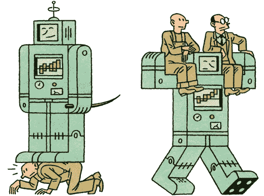
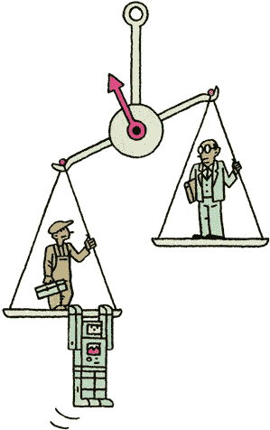
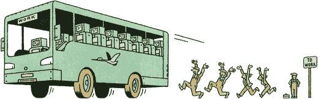

# 我们未来的工作会成功吗？

> 原文：<https://medium.com/hackernoon/will-our-future-of-work-work-df254154948f>

35 年前的这个月，**预见了投资组合工作者的崛起。这种越来越受欢迎的生活方式选择受到许多人的青睐，催生了一个蓬勃发展的创意阶层。在跑步机上站立的工作站、可选办公室的新贵和过多的共同工作空间的体现下，灵活性现在已经成为常态。**

**2020 年我们的工作场所会是什么样子？现在是这样，将来会越来越是这样——工作与其说是占据一个物理位置，不如说是关注一种实践。我们工作行为的转变有多种形式:无论是用强大的 WI-FI 连接远程工作的时髦技术****甚至更浓的咖啡，还是通过年度休假****或使用不断扩大的*[**强大技术**](https://slack.com/) 来实现和促进合作的方法。***********

*****这种转变不仅限于技术或软件公司——发展跨越所有行业。一份最近的报告称，超过 60%的各行各业的高级专业人士认为他们的工作正在向一种体验而不是物质场所转移。近 80%的人表示，由移动技术推动的随时随地工作趋势有望兴起。在这个新世界里，重要的不是你在哪里，而是你在做什么，这对你的职业和个人生活都会有很多影响。*****

**********

# *****重塑经济*****

*****许多拥有过时的操作系统和一致的企业工作文化的大型组织正在迎头赶上——拼命试图转型并保持相关性。与此形成鲜明对比的是，如今正在发生的企业家革命所特有的灵活网络。仅在英国就出现了微型企业**的爆炸式增长，从 1980 年的 70 万增加到今天的 510 万。小企业的焦点终于来了——根据欧盟委员会的数据，英国经济的几乎一半可以归功于中小企业。*******

*******新一批企业家，或称 [**世代流动**](http://www.fastcompany.com/section/generation-flux) ，不是根据他们的实际年龄，而是根据他们适应的意愿和能力来定义的。特立独行不再是游戏的名称，而是属于一个独特的群体，他们最有能力在当今高速变化的世界中茁壮成长。*******

*****无论是大银行、移动运营商还是大型品牌，企业加速器的出现和流行表明了弥合初创公司和大公司之间鸿沟的愿望。最简单的形式是，这些项目旨在培养创新思维和实践，从而产生新的有价值的产品和服务。这些试图改变企业现状的努力，是因为试图将风险活动保留在副业而被削弱，还是因为创造了一个行业中任何人都感到欢迎参与其发展的环境而得到加强，目前还没有定论。*****

*****如果是后者，那么新的和进步的运作方式可能会蓬勃发展，成为一个组织的核心，并实际上有助于民主化创新。*****

# *****复兴我们的空间*****

**********

*****新经济的主人 WeWork 的亚当·诺伊曼和米格尔·麦凯尔维(2014 年 11 月，福布斯)——已经调制出最佳创意和协作工作空间的魔酱。不到两年前，它只有 9 个营业点，现在已经有 60 个，这使 WeWork 成为美国新空间增长最快的承租人。*****

*****这不是一个孤立的现象。如今，近 6000 家共享办公室遍布全球，而五年前只有 300 家。创业老手加里·门德尔很好地抓住了当前的情绪:*****

# *****“旧的办公空间模式已经过时了。”*****

*****像 WeWork 这样的办公空间迎合创意、技术和专业人士，而其他的办公空间则更多地被归类，为特定人群量身定制。这涵盖了谱-**[**艺人**](http://camdencollective.co.uk/journal/)[**女性**](http://herahub.com/) 等等。还有一些是以效用为前提的( [**虚拟空间**](/@thomasbeta/when-will-virtual-co-working-take-off-679830e3621)[**按小时**](http://www.theguildhub.co.uk/en) 或者通过 [**外挂**](https://signup.wework.com/) )。*******

*****也有证据表明，在成熟的组织中，工作空间的性质正在发生变化。康奈尔大学人体工程学实验室的新研究发现，对 [**人体工程学特性**](http://thesocialfabric.com/2012/03/innovation-spaces/) 的小额投资可以使公司的生产率平均提高 12%。其他专家解释说，办公室的温度、照明甚至墙上的艺术品都有助于提高工作效率和幸福感。不过，办公室室内设计公司 Morgan Lovell 的高级助理萨姆·萨尼(Sam Sahni)提醒道:*****

# *****“尽管目的几乎总是为了让工作场所对最终用户有吸引力，但对一个组织来说‘酷’的工作场所对另一个组织来说可能是‘噱头’。”*****

# *****回收我们的时间*****

*****领先的思想家和媒体理论家道格拉斯·拉什科夫总结了我们目前与时间的关系，他写道:*****

# *****“我们可能不再知道我们要去哪里，但我们会更快地到达那里。是的，我们可能正处于某种巨大的生存危机之中，但我们只是太忙而没有注意到。”*****

**********

*****随着标准的朝九晚五办公时间成为过去，随之而来的工作文化也成为过去。这既带来了大量的挑战，也带来了激动人心的新机遇。在一个例子中，我们面临着失去社会关系、办公室玩笑、免费咖啡、在工作站辛苦工作几个小时用猫视频自娱自乐的危险。在另一种情况下，我们遇到了工作和休闲之间的模糊，这是由于移动技术带来的不间断生活方式的超高生产力。*****

*****忙碌是一种新的时尚。正如作家阿里·梅斯(Ali Mese)雄辩地总结的那样，企业家必然拥有完全不同的职业道德:*****

# *****“企业家愿意每周工作 80 小时，以避免每周工作 40 小时。”*****

*****显而易见的是，自从时钟被用来协调劳动，实际上是用来储存时间以来，我们已经接受了时间就是金钱的观念。我们的小时数、天数和工作周数是根据盈利能力量化的，因此与价值相关。《经济学家》 最近在 [**发表的一篇文章抓住了与城市居民相关的另一个层面:**](http://www.economist.com/news/christmas-specials/21636612-time-poverty-problem-partly-perception-and-partly-distribution-why?fsrc=scn/fb/te/pe/ed/whyiseveryonesobusy)*****

# *****“较大、富裕的城市工资较高，生活成本飙升，进一步提高了人们时间的价值。纽约人比内罗毕居民更节省时间，也更苦恼。伦敦的行人比利马的行人更快。”*****

*****当我们看到我们的工作实践向未来发展时，我们面临着一个关于我们盛气凌人行为的决定性岔路口。在一条道路上，我们让技术支配我们的工作生活，以及忙碌是有益的互补感觉。另一方面，我们对当下的体验领先于时钟，以及始终保持联系的能力。在这里，我们真正参与并享受工作和娱乐。*****

# *****更好的方法*****

*****进入新的目标驱动型经济。价值导向型组织将目标置于利润之上(想想巴塔哥尼亚)和长期愿景(想想思科)。未来企业的 [**设计**](http://www.amazon.co.uk/dp/0957495838?tag=branvall-21) 将聚焦 5 P:目的、人、产品、利润和流程。这些拥有不断发展的商业模式的前瞻性组织比以往任何时候都更加了解不断变革的必要性。Gartner 的 Mark McDonald 说得好:*****

# ******“变化的本质正在改变，因为信息的流动和控制已经变得动荡不安，不再是自上而下的流动，而是随时向各个方向流动。这意味着管理和领导变革的能力不再基于信息传递、沟通和传统的赞助。相反，它基于通知、注册和适应的流程，这些流程对高管和领导者来说更具破坏性，也更难管理。”******

*****改变允许更多怀疑和询问的既定商业惯例需要我们的政策和方法的转变。为他们提供动力的老企业不再适合这个崇尚速度和协作的市场。健康企业的未来以及由此产生的工作环境需要的是对既定文化*捂屁股*的挑战:*****

# *****“工业经济就是知道答案和表达自信。如果你做了功课，你应该*知道*。如果你有没有答案的问题，这意味着你做得不好，不会得到奖励。”—《精益创业》的作者埃里克·赖斯*****

*****根据 Vygeny Kaganer、Javier Zamora 和 Sandra 斯蒂伯在 [**罗特曼管理**](https://www.rotman.utoronto.ca/Connect/Rotman%20MAG.aspx) 中的观点——商业模式的设计、部署和管理在今天比商业史上的任何时候都更加重要。他们解释说，一个组织的*数字密度*是通过让员工发挥自由、创造力和主动性的能力来衡量的:*****

# ******“数字革命(迫使许多公司)进入了陌生的领域。一家已经弄清楚数字密度和目的这些基本问题的公司，在处理令人不安的新问题时处于更有利的位置，比如“我们现在从事什么行业？”******

# *****提醒一句*****

**********

*****随着数字个人助理(Siri)的兴起，以及外包我们的工作和个人事务的流行——为了吸引更多的生产力，我们可能会失去一部分人性。连接和感觉是不同的。*****

*****雇主和雇员之间的心理契约正受到威胁，因为基于忠诚的契约及其提供的保障被不太正式的契约和对某个组织的潜在承诺所取代。对一些人来说，收入水平的不确定性将是等同的，而更注重交易的人将欢迎伴随新模式而来的奖金、股票期权和弹性工作制。*****

*****随着更多高技能——高度专业化——组合工人处于就业金字塔的顶端，一个分布不均的经济也可能出现。这意味着中层员工的机会受到限制，他们只能从事技能要求较低的工作，无法充分发挥自己的潜力。至于人工智能的兴起和由智能算法驱动的数字未来——与人类选择相反——我们可能会完全失去对一些高能力工作的需求。*****

*****可以肯定的是，X 一代和现在的 Y 一代将继续捍卫我们职业生活中的三大支柱。根据这方面的权威丹尼尔·平克的说法，这些是 1)目的；2)自主性和；3)精通。当我们的目标是在我们所做的工作中整合这些特征时，我们也会找到具有持久意义的工作。*****

******在 2016 年 10 月 6 日加入 Social Fabric，与来自 UsTwo、Second Home、Barclays 等公司的领导者就工作的未来展开一场公开的亲密辩论。进一步的信息和预订* [***这里***](https://www.eventbrite.co.uk/e/future-of-work-series-6-tickets-26438227450) *。******

******如果你喜欢，请点击* **💚** *以下
原文发表于*[*creator.wework.com*](https://creator.wework.com/how-to-guides/will-future-work-work/)*****

******************************

> *****[黑客中午](http://bit.ly/Hackernoon)是黑客如何开始他们的下午。我们是这个家庭的一员。我们现在[接受投稿](http://bit.ly/hackernoonsubmission)并乐意[讨论广告&赞助](mailto:partners@amipublications.com)机会。*****
> 
> *****如果你喜欢这个故事，我们推荐你阅读我们的[最新科技故事](http://bit.ly/hackernoonlatestt)和[趋势科技故事](https://hackernoon.com/trending)。直到下一次，不要把世界的现实想当然！*****

**********