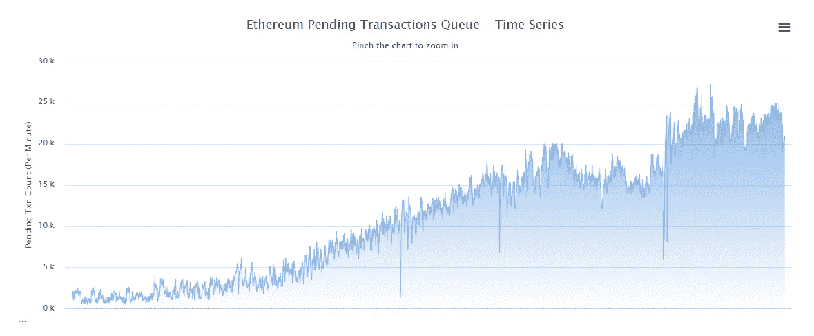
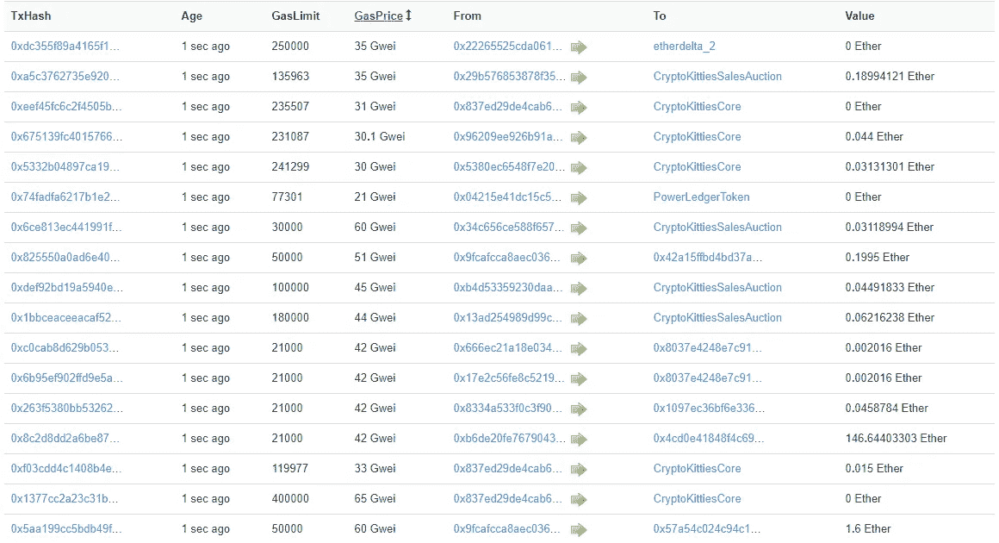

# 小猫问题会解决吗？

> 原文：<https://medium.com/hackernoon/will-the-kitten-problem-be-solved-c1c5714f79a0>

以太坊网络完全超负荷了。目前有 24K 个未决事务。Lord mancer II ICO([http://Lord mancer 2 . io](http://lordmancer2.io))智能合约连续几天无法收到部分付款。 [Etherescan.io](https://etherscan.io/address/0x47b8b6256f49cba6c8bd37361cac8b0fe324d605) 显示交易等待 30-40 分钟，然后消失，然后再次出现。这已经持续了几天了。一塌糊涂。

**发生了什么？**

如下图所示，未决交易的数量在最近几天急剧增加。

原因是什么？小猫们！！！只需查看待处理事务的列表:

以太坊上运行的一个游戏可以彻底摧毁区块链网络。只有矿工会赢。每个人都试图提高汽油价格。5 天前，您可以发送一个 0.1 Gwei 天然气价格的交易，并成功处理，现在价格应该至少为 40 Gwei。明天最低 60 Gwei 吗？比特币区块链的交易成本会是 3 美元吗？

我希望 Vitalik 有一个如何改善网络的可靠计划。否则，集中式平台将统治世界很多年。

你怎么想呢?这个问题怎么解决？分享一下你的看法！