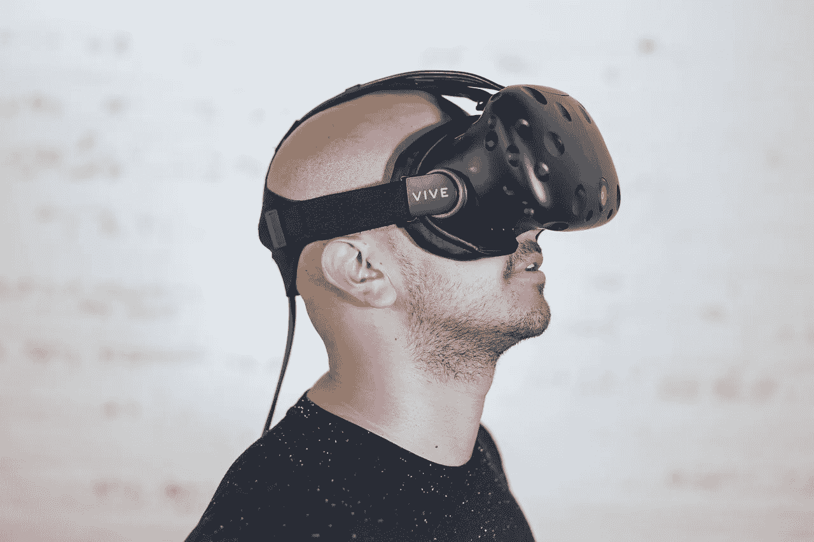
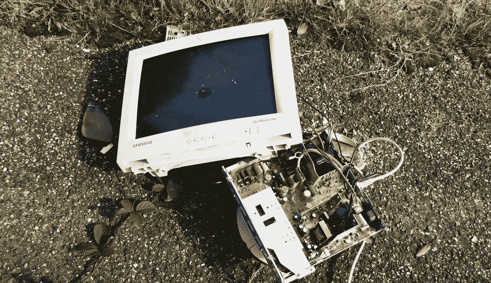

# VR 会和电脑较量吗？

> 原文：<https://medium.com/hackernoon/will-vr-take-on-the-computer-4a8723ce55d1>

尽管虚拟现实持续强劲增长，但讨论虚拟现实是否会成功的文章仍然很常见。这种脱节来自两个方面:它没有像福音传道者预测的那样快速发展，以及(也许更重要的是)它没有朝着福音传道者预测的*方向发展。*

当普通大众想到虚拟现实时，一件事浮现在脑海中:娱乐。这可能是视频游戏的形式，也可能是电影的形式，或者是我们尚未完全破解的两种体验的混合。的确，娱乐仍然占据着 VR 销售的大部分。但是它还没有在这个行业占据主导地位，原因没有人能完全确定。可能是成本，可能是体验质量的不一致(没有人想在玩《生化危机》时呕吐，除非是因为他们只是被*吓到了*，或者可能只是因为人们对他们现在拥有的东西相当满意，他们认为不值得为 VR 目前能提供的东西升级。

不管什么原因，我们没有花太多时间讨论的是虚拟现实在*其他*行业的表现。以医疗保健为例，虚拟现实和增强现实正被广泛应用于各个领域，从帮助外科医生实现可视化到为高危患者治疗疼痛。在培训项目中，虚拟现实正在世界各地教授电梯技术人员，给医学学生提供不需要昂贵尸体的经验，并帮助炸弹技术人员学习禁用危险武器。

所以最大的问题是:我们真的知道 VR 擅长什么吗？

微软的亚历克斯·基普曼认为虚拟现实的杀手级应用将是通信。Hammer & Tusk 过去曾说过，虚拟现实将呈现在计算机上，消除我们对任何屏幕的需求。但是，当个人电脑在 20 世纪 80 年代问世时，谁能预料到我们很快就会把它们放在口袋里到处走，而它们最有可能破坏的硬件是照相机呢？

空间计算颠覆计算机的证据基于几个简单的因素。首先:屏幕不舒服。我们都知道这一点。它们会伤害你的眼睛，当你不得不坐在它们前面时会伤害你的背部，如果显示器不合适，它们会导致颈部劳损，而且它们又笨重又麻烦。任何让电脑更舒适的东西都会立即受到消费者的欢迎，并且很有可能将传统计算从地图上抹去。当然，问题是，空间计算机目前在舒适度方面差不多相同。的确，这对你的眼睛来说更容易，但当你不得不跳回现实世界时，会导致头痛和奇怪的调整。它有助于你的背部和姿势，但它有时会给你的头部增加痛苦的重量，这可能会造成颈部和背部肌肉的劳损。打字造成的重复性压力伤害已经不复存在了…除了我们还没有完全弄清楚目前市场上的任何 XR 产品的无键盘打字。“如果”打开了许多扇门，但也仅仅如此。一种可能性。

另一个导致人们认为电脑会陷入混乱的因素是，我不喜欢这么说:酷因素。想想你在过去 20 年里看过的科幻片。其中有多少采用了无触摸界面和全息投影？是全部吗？除非你在描绘一个反乌托邦的未来，否则这很可能就是你所看到的。从《星球大战》到《少数派报告》，空间计算总让人觉得是技术进步的必然结果。我们总是想达到一个我们的技术是看不见的和无所不在的地步。

那么，在虚拟现实兴起的几年后，我们感觉如何呢？虚拟现实似乎仍有可能取代计算机，但它是否会以我们预期的方式获胜似乎不太确定。更有可能的是，虚拟现实将找到一个我们从未预测过的利基市场。从那时起，它将变得更加强大和受欢迎，因此随着技术的成熟，它将能够更好地对我们所知的计算发起正面攻击。

*由鹪鹩手打为* [*锤子&獠牙*](http://www.hammerandtusk.com/newsletter/page/1) *。注册我们每周的 VR/AR 时事通讯。*