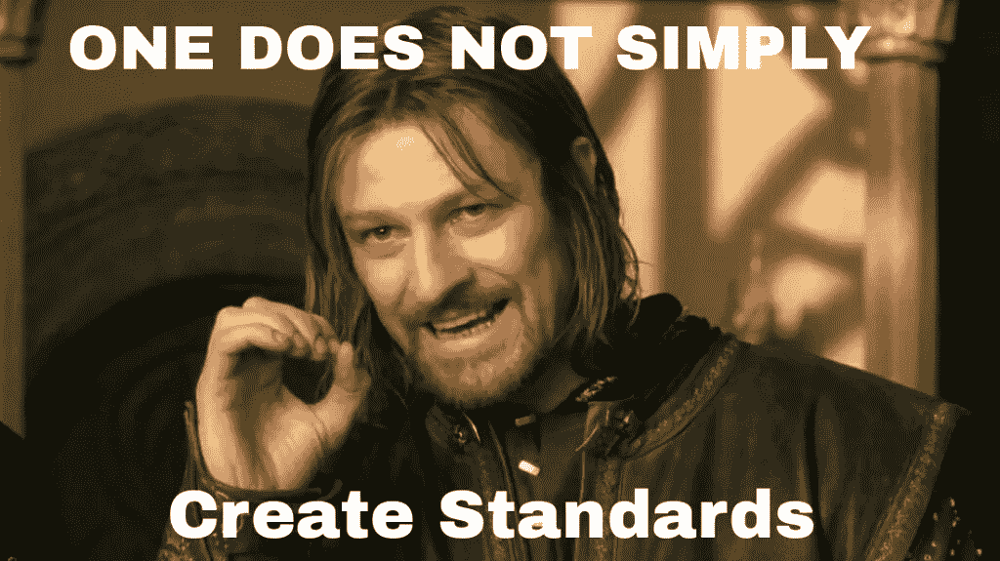

# 变革之风:医疗保健的发展

> 原文：<https://medium.com/hackernoon/winds-of-change-an-healthcare-evolution-bd506730013f>

You can be the change healthcare needs

由于有无数的机会，我决定在[医疗保健](https://hackernoon.com/tagged/healthcare)开始我的[编程](https://hackernoon.com/tagged/programming)生涯。每天都有大量的数据被处理，通过分析还可以检索到更多的数据。已经有一些非常有趣的合作关系，比如 DeepMind(被谷歌收购)和 Moorfields 眼科医院之间的合作。

尽管这些例子展示了更光明的未来，但还有很长的路要走。

# 标准，我们需要标准

Yap, standards

看看网上。它保存了大量的信息，有多种方式来创建、查看和与之交互。但是在所有这些混乱中有某种秩序。

W3C(万维网联盟)为浏览器提供了一些共同的基础，JSON 在 API 之间共享信息方面很棒(除了一些[例外](http://seriot.ch/parsing_json.php)), CSS 被广泛用于设计网站风格。

好的，关于如何构建 web 有如此多的实现和想法，以至于像 Javascript 疲劳[这样的事情会发生](/@ericclemmons/javascript-fatigue-48d4011b6fc4#.o64hwia9k)。

但是，尽管如此，网络还是在向前发展。

如果每家公司都重新发明软件和硬件，我们将永远无法进步。

最终，要么行业达成指导方针，要么国家将不得不规范他们的战略，以解决医疗保健数字化的问题。

# 由信息技术推动的预防医学

我的第一个项目是构建一个简单的仪表板，从服务器获取数据，并以更直观的方式呈现给医生和护士。

这就是我们的现状。

现在，我们呈现从监视器、实验室、预约收集的信息，并将其从纸张或 excel 数据表转移到计算机。

毫无疑问，这是至关重要的一步，但进展非常缓慢。这样做是因为没有更多的激励。

但是，如果我们运用我们的知识，预防有害健康的事件，这种情况是可以改变的。

作为人类，我们需要里程碑。越大越有挑战性越好。如果你能拯救数百万人的生命，同时拯救数十亿人，我会说这是一个巨大的机会。

 [## 美国的医疗保健

### 这个国家医疗保健人性化的一面。

healthcareinamerica.us](https://healthcareinamerica.us) 

# 最后…

医疗保健行业有很多事情要做。毫无疑问。

我可以谈谈说服硅谷顶尖人才在这里投资的必要性，但我们可以自己动手尝试一下。数据摆在那里。我们只需要专注于一条路，有一个共同的目标。

如果最后我们多救了一个人，谁会输？

Song for the end of your day ;-)

> [黑客中午](http://bit.ly/Hackernoon)是黑客如何开始他们的下午。我们是 [@AMI](http://bit.ly/atAMIatAMI) 家庭的一员。我们现在[接受投稿](http://bit.ly/hackernoonsubmission)，并乐意[讨论广告&赞助](mailto:partners@amipublications.com)机会。
> 
> 如果你喜欢这个故事，我们推荐你阅读我们的[最新科技故事](http://bit.ly/hackernoonlatestt)和[趋势科技故事](https://hackernoon.com/trending)。直到下一次，不要把世界的现实想当然！

